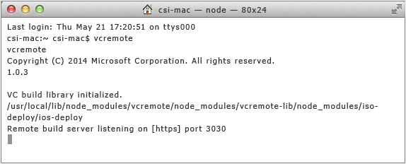
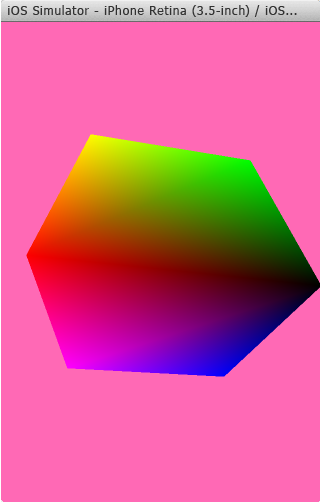
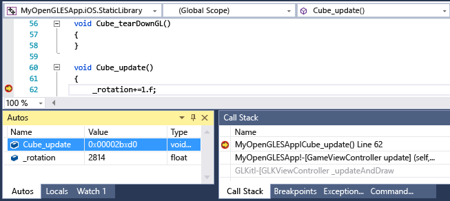
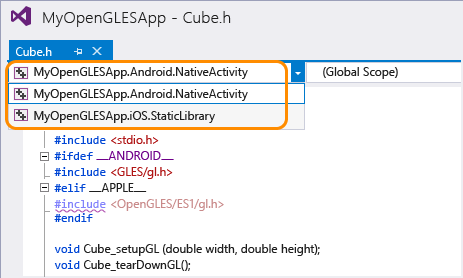

# Erstellen einer OpenGL ES-Anwendung für Android und iOS
Bei Installation der Option "Visual C++ für plattformübergreifende Mobile-Entwicklung" können Sie Visual Studio-Projektmappen und -Projekte für iOS-Apps und Android-Apps erstellen, die gemeinsamen Code nutzen. Dieses Thema führt Sie durch eine Projektmappenvorlage, durch die eine einfache iOS-App und eine Android Native Activity-App erstellt wird. Die Apps verwenden gemeinsamen C++-Code, der OpenGL ES verwendet, um denselben animierten rotierenden Cube auf jeder Plattform anzuzeigen. OpenGL ES (OpenGL for Embedded Systems oder GLES) ist eine 2D- und 3D-Grafik-API, die auf zahlreichen mobilen Geräten unterstützt wird.  
  
 [Anforderungen](#req)   
 [Erstellen eines neuen OpenGLES-Anwendungsprojekts](#Create)   
 [Erstellen und Ausführen der Android-App](#BuildAndroid)   
 [Erstellen und Ausführen der iOS-App](#BuildIOS)   
 [Anpassen der Apps](#Customize)  
  
##   Anforderungen  
 Bevor Sie eine OpenGL ES-App für iOS und Android erstellen, müssen Sie sicherstellen, dass Sie alle Systemanforderungen erfüllt haben. Sie müssen die Option "Visual C++ für plattformübergreifende Mobile-Entwicklung" in Visual Studio 2015 installieren. Stellen Sie sicher, dass die erforderlichen Drittanbietertools und -SDKs in der Installation enthalten sind und dass der Visual Studio-Emulator für Android installiert ist. Weitere Informationen und ausführliche Anweisungen finden Sie unter [Install Visual C++ for Cross-Platform Mobile Development](../cross-platform/install-visual-cpp-for-cross-platform-mobile-development.md). Zum Entwickeln und Testen der iOS-App benötigen Sie einen Mac-Computer, der gemäß der Installationsanleitung eingerichtet wurde. Weitere Informationen zum Einrichten der iOS-Entwicklung finden Sie unter [Install And Configure Tools to Build using iOS](../cross-platform/install-and-configure-tools-to-build-using-ios.md)  
  
##   Erstellen eines neuen OpenGLES-Anwendungsprojekts  
 In diesem Lernprogramm erstellen Sie zunächst ein neues OpenGL ES-Anwendungsprojekt. Anschließend erstellen und führen Sie die Standard-App im Visual Studio-Emulator für Android aus. Als Nächstes erstellen Sie die App für iOS und führen sie im iOS-Simulator aus.  
  
#### So erstellen Sie ein neues Projekt  
  
1.  Öffnen Sie Visual Studio. Wählen Sie in der Menüleiste **Datei**, **Neu**, **Projekt**aus.  
  
2.  Wählen Sie im Dialogfeld **Neues Projekt** unter **Vorlagen**die Option **Visual C++**, **Plattformübergreifend**und dann die Vorlage **OpenGLES-Anwendung (Android, iOS)** aus.  
  
3.  Geben Sie der App einen Namen wie `MyOpenGLESApp`, und wählen Sie dann **OK**.  
  
       
  
     Visual Studio erstellt die neue Projektmappe und öffnet den Projektmappen-Explorer.  
  
       
  
 Die neue OpenGL ES-Anwendungsprojektmappe umfasst drei Bibliotheksprojekte und zwei Anwendungsprojekte. Der Bibliotheksordner enthält ein Projekt mit freigegebenem Code und zwei plattformspezifischen Projekte, die auf den gemeinsam verwendeten Code verweisen:  
  
-   **MyOpenGLESApp.Android.NativeActivity** enthält die Verweise und den Verbindungscode, damit Ihre App mit systemeigener Aktivität für Android implementiert werden kann. Die Implementierung der Einstiegspunkte aus dem Verbindungscode befindet sich in der Datei "main.cpp", die den gemeinsam verwendeten Code in MyOpenGLESApp.Shared enthält. Vorkompilierte Header befinden sich in "pch.h". Ihr Native Activity-App-Projekt wird in eine freigegebene Bibliotheksdatei (".so") kompiliert, die durch das MyOpenGLESApp.Android.Packaging-Projekt ausgewählt wird.  
  
-   **MyOpenGLESApp.iOS.StaticLibrary** erstellt eine statische iOS-Bibliotheksdatei (".a"), die den freigegebenen Code in "MyOpenGLESApp.Shared" enthält. Sie ist mit der App verknüpft, die vom MyOpenGLESApp.iOS.Application-Projekt erstellt wird.  
  
-   **MyOpenGLESApp.Shared** enthält den freigegebenen Code, der plattformübergreifend verwendet werden kann. Die App verwendet Präprozessormakros für die bedingte Kompilierung von plattformspezifischem Code. Der freigegebene Code wird per Projektverweis sowohl in MyOpenGLESApp.Android.NativeActivity als auch in MyOpenGLESApp.iOS.StaticLibrary ausgewählt.  
  
 Die Projektmappe enthält zwei Projekte zum Erstellen der Apps für die Android- und iOS-Plattform:  
  
-   **MyOpenGLESApp.Android.Packaging** erstellt die APK-Datei für die Bereitstellung auf einem Android-Gerät oder -Emulator. Dieses enthält die Ressourcen und die Datei "AndroidManifest.xml", wo Sie Manifesteigenschaften festlegen. Es enthält zudem die Datei "build.xml", die den Ant-Buildprozess steuert. Es ist standardmäßig als Startprojekt festgelegt, sodass es bereitgestellt und direkt in Visual Studio ausgeführt werden kann.  
  
-   **MyOpenGLESApp.iOS.Application** enthält die Ressourcen und Objective-C-Verbindungscode zum Erstellen einer iOS-App, die mit dem Code der statischen C++-Bibliothek in MyOpenGLESApp.iOS.StaticLibrary verknüpft ist. Dieses Projekt erstellt ein Buildpaket, das von Visual Studio und dem Remote-Agent auf Ihren Mac übertragen wird. Beim Erstellen dieses Projekts sendet Visual Studio die Dateien und Befehle zum Erstellen und Bereitstellen der App auf dem Mac.  
  
##   Erstellen und Ausführen der Android-App  
 Durch die von der Vorlage erstellte Projektmappe wird die Android-App als Standardprojekt festgelegt.  Sie können die App erstellen und ausführen, um die Installation und Einrichtung zu überprüfen. Führen Sie die App in einem ersten Test unter einem der Geräteprofile aus, die vom Visual Studio-Emulator für Android installiert werden. Wenn Sie Ihre App auf einem anderen Ziel testen möchten, können Sie den Zielemulator laden oder das Gerät mit Ihrem Computer verbinden.  
  
#### So erstellen und führen Sie die Android Native Activity-App aus  
  
1.  Falls die Plattform noch nicht ausgewählt ist, wählen Sie **x86** aus der Dropdownliste **Projektmappenplattformen** aus.  
  
       
  
     Verwenden Sie x86, wenn der Android-Emulator für Windows als Ziel verwendet wird. Bei der Ausrichtung auf ein Gerät wählen sie die Projektmappenplattform je nach Geräteprozessor aus. Wenn die Liste **Projektmappenplattformen** nicht angezeigt wird, wählen Sie **Projektmappenplattformen** aus der Liste **Schaltflächen hinzufügen/entfernen** aus, und wählen Sie dann Ihre Plattform aus.  
  
2.  Öffnen Sie im **Projektmappen-Explorer**das Kontextmenü für das Projekt "MyOpenGLESApp.Android.Packaging", und wählen Sie dann **Erstellen**aus.  
  
       
  
     Das Ausgabefenster zeigt die Ausgabe des Buildprozesses für die freigegebene Android-Bibliothek und die Android-App an.  
  
       
  
3.  Wählen Sie eines der VS-Emulator Android Phone (x86)-Profile als Bereitstellungsziel aus.  
  
       
  
     Wenn Sie andere Emulatoren installiert oder mit einem Android-Gerät verbunden haben, können Sie sie aus der Bereitstellungsziel-Dropdownliste auswählen. Damit die App ausgeführt werden kann, muss die integrierte Projektmappenplattform mit der Plattform des Zielgeräts übereinstimmen.  
  
4.  Drücken Sie F5, um mit dem Debuggen zu beginnen, oder UMSCHALT+F5, um ohne Debuggen zu beginnen.  
  
     Visual Studio startet den Emulator, wobei das Laden und Bereitstellen Ihres Codes mehrere Sekunden in Anspruch nimmt. Im Folgenden wird veranschaulicht, wie die App im Visual Studio-Emulator für Android angezeigt wird.  
  
       
  
     Nachdem Ihre App gestartet wurde, können Sie Haltepunkte festlegen und den Debugger verwenden, um den Code schrittweise zu durchlaufen, lokale Variablen zu prüfen und Werte anzuzeigen.  
  
5.  Drücken Sie UMSCHALTTASTE+F5, um das Debuggen zu beenden.  
  
     Der Emulator ist ein separater Prozess, der weiterhin ausgeführt wird. Sie können Ihren Code mehrfach auf demselben Emulator bearbeiten, kompilieren und bereitstellen. Die App wird in der App-Sammlung für den Emulator angezeigt und kann direkt von dort aus gestartet werden.  
  
 Die generierten Android Native Activity-App- und Bibliotheksprojekte legen den freigegebenen C++-Code in einer dynamischen Bibliothek ab, die "Verbindungscode" für den Anschluss an die Android-Plattform umfasst. Dies bedeutet, dass sich der größte Teil des App-Codes in der Bibliothek und Manifest, Ressourcen und Buildanweisungen im Paketprojekt befinden. Der freigegebene Code wird von "main.cpp" im NativeActivity-Projekt aufgerufen. Weitere Informationen über das Programmieren einer Android Native Activity-App finden Sie im Android Developer NDK auf der Seite [Konzepte](https://developer.android.com/ndk/guides/concepts.html) .  
  
 Visual Studio erstellt Android Native Activity-Projekte mithilfe des Android-NDKs, das Clang als Plattformtoolset verwendet. Visual Studio ordnet die Eigenschaften des NativeActivity-Projekts den Befehlszeilenschaltern und -optionen zu, die zum Kompilieren, Verknüpfen und Debuggen auf der Zielplattform verwendet werden. Um weitere Informationen zu erhalten, öffnen Sie das Dialogfeld **Eigenschaftenseiten** des MyOpenGLESApp.Android.NativeActivity-Projekts. Weitere Informationen zu den Befehlszeilenschaltern finden Sie im [Clang Compiler-Benutzerhandbuch](http://clang.llvm.org/docs/UsersManual.html).  
  
##   Erstellen und Ausführen der iOS-App  
 Das iOS-App-Projekt wird in Visual Studio erstellt und bearbeitet, aufgrund von Lizenzeinschränkungen muss es jedoch auf einem Mac erstellt und von dort aus bereitgestellt werden. Visual Studio kommuniziert mit einem Remote-Agent, der auf dem Mac ausgeführt wird, um Projektdateien zu übertragen und Build-, Bereitstellungs- und Debugbefehle auszuführen. Sie müssen Ihren Mac für die Kommunikation einrichten und konfigurieren, bevor Sie die iOS-App erstellen können. Ausführliche Anweisungen finden Sie unter [Install And Configure Tools to Build using iOS](../cross-platform/install-and-configure-tools-to-build-using-ios.md). Sobald der Remote-Agent ausgeführt wird und Visual Studio dem Mac zugeordnet ist, können Sie die iOS-App erstellen und ausführen, um die Installation und Einrichtung zu überprüfen.  
  
#### So erstellen und führen Sie die iOS-App aus  
  
1.  Stellen Sie sicher, dass der Remote-Agent auf Ihrem Mac ausgeführt wird und dass Visual Studio dem Remote-Agent zugeordnet ist. Wenn Sie den Remote-Agent starten möchten, öffnen Sie ein Terminal-App-Fenster, und geben Sie `vcremote`. Weitere Informationen finden Sie unter [Konfigurieren des Remote-Agents in Visual Studio](../cross-platform/install-and-configure-tools-to-build-using-ios.md#ConfigureVS).  
  
       
  
2.  Falls die Plattform noch nicht ausgewählt ist, wählen Sie **x86** aus der Dropdownliste **Projektmappenplattformen** aus.  
  
       
  
     Wählen Sie "x86" aus, wenn Sie den iOS-Simulator als Ziel verwenden möchten. Bei der Ausrichtung auf ein iOS-Gerät wählen Sie die Projektmappenplattform je nach Geräteprozessor (normalerweise ein ARM-Prozessor) aus. Wenn die Liste **Projektmappenplattformen** nicht angezeigt wird, wählen Sie **Projektmappenplattformen** aus der Liste **Schaltflächen hinzufügen/entfernen** aus, und wählen Sie dann Ihre Plattform aus.  
  
3.  Öffnen Sie im Projektmappen-Explorer das Kontextmenü des MyOpenGLESApp.iOS.Application-Projekts, und wählen Sie dann **Erstellen**aus.  
  
       
  
     Das Ausgabefenster zeigt die Ausgabe des Buildprozesses für die statische iOS-Bibliothek und die iOS-App an. Auf dem Mac zeigt das Terminal-Fenster, in dem der Remote-Agent ausgeführt wird, die Befehls- und Dateiübertragungsaktivitäten an.  
  
     Auf dem Mac-Computer werden Sie möglicherweise aufgefordert, eine Anforderung zur Codesignierung zu akzeptieren. Wählen Sie "Zulassen" aus, um den Vorgang fortzusetzen.  
  
4.  Wählen Sie auf der Symbolleiste **iOS-Simulator** aus, um die App im iOS-Simulator auf dem Mac auszuführen. Es kann einen Moment dauern, bis der Simulator gestartet wird. Möglicherweise müssen Sie den Simulator auf dem Mac in den Vordergrund verschieben, um die Ausgabe zu sehen.  
  
       
  
     Nachdem Ihre App gestartet wurde, können Sie Haltepunkte festlegen und den Visual Studio-Debugger verwenden, um lokale Variablen zu prüfen, die Aufrufliste anzuzeigen und Werte zu überwachen.  
  
       
  
5.  Drücken Sie UMSCHALTTASTE+F5, um das Debuggen zu beenden.  
  
     Der iOS-Simulator ist ein separater Prozess, der weiterhin auf dem Mac ausgeführt wird. Sie können Ihren Code mehrfach auf derselben iOS-Simulatorinstanz bearbeiten, kompilieren und bereitstellen. Sie können Code nach der Bereitstellung auch direkt im Simulator ausführen.  
  
 Der C++-Code wird von den generierten iOS-App- und -Bibliotheksprojekten in einer statischen Bibliothek abgelegt, die nur den freigegebenen Code implementiert. Der Hauptteil des Anwendungscodes befindet sich im Anwendungsprojekt. Die Aufrufe des freigegebenen Bibliothekscodes in diesem Vorlagenprojekt werden in der Datei "GameViewController.m" ausgeführt. Zur Erstellung der iOS-App verwendet Visual Studio das Xcode-Plattformtoolset, das die Kommunikation mit einem Remoteclient erfordert, der auf einem Mac ausgeführt wird.  
  
 Visual Studio überträgt die Projektdateien und sendet Befehle an den Remoteclient, um die App mithilfe von Xcode zu erstellen. Der Remoteclient sendet Buildstatusinformationen zurück an Visual Studio. Nachdem die App erfolgreich erstellt wurde, können Sie Visual Studio verwenden, um Befehle zum Ausführen und Debuggen der App zu senden. Der Debugger in Visual Studio steuert die App, die in dem iOS-Simulator ausgeführt wird, der auf dem Mac oder einem angeschlossenen iOS-Gerät ausgeführt wird. Visual Studio ordnet die Eigenschaften des StaticLibrary-Projekts den Befehlszeilenschaltern und -optionen zu, die zum Erstellen, Verknüpfen und Debuggen auf der iOS-Zielplattform verwendet werden. Um ausführliche Informationen zur Compiler-Befehlszeilenoption zu erhalten, öffnen Sie das Dialogfeld **Eigenschaftenseiten** für das MyOpenGLESApp.iOS.StaticLibrary-Projekt.  
  
##   Anpassen der Apps  
 Sie können den freigegebenen C++-Code bearbeiten, um allgemeine Funktionen hinzuzufügen oder zu ändern. Sie müssen die Aufrufe von freigegebenem Code so ändern, dass sie im MyOpenGLESApp.Android.NativeActivity-Projekt und im MyOpenGLESApp.iOS.Application-Projekt übereinstimmen. Sie können Präprozessormakros verwenden, um plattformspezifische Abschnitte im gemeinsamen Code anzugeben. Der Präprozessormakro `__ANDROID__` ist bei der Erstellung für Android vordefiniert. Der Präprozessormakro `__APPLE__` ist bei der Erstellung für iOS vordefiniert.  
  
 Um IntelliSense für eine bestimmte Projektplattform anzuzeigen, wählen Sie das Projekt aus den Dropdownlistenelementen zum Wechseln des Kontexts in der Navigationsleiste oben im Editor-Fenster aus.  
  
   
  
 IntelliSense-Probleme im aktuellen Projekt sind durch eine rote Wellenlinie gekennzeichnet. Probleme in anderen Projekten sind durch eine violette Wellenlinie gekennzeichnet. Standardmäßig unterstützt Visual Studio keine farbliche Kennzeichnung von Code bzw. kein IntelliSense für Java- oder Objective-C-Dateien. Sie können jedoch weiterhin die Quelldateien und die Ressourcen ändern, um den Anwendungsnamen, das Symbol und weitere Implementierungsdetails festzulegen.