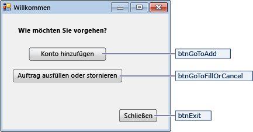
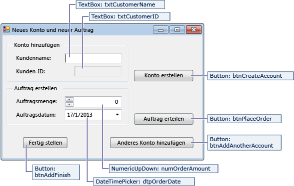
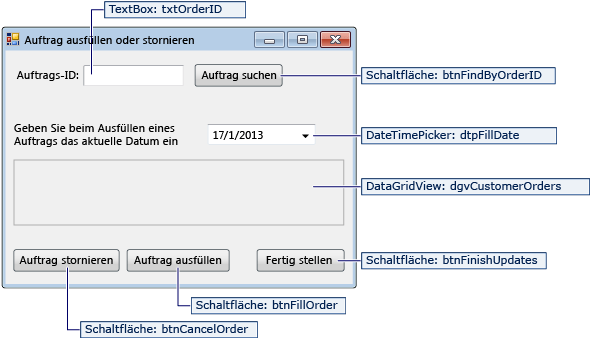

# <a name="create-a-simple-data-application-by-using-adonet"></a>Erstellen einer einfachen datenanwendung mit ADO.NET

Wenn Sie eine Anwendung, die Daten in einer Datenbank bearbeitet erstellen, führen Sie grundlegende Aufgaben wie z. B. das Definieren von Verbindungszeichenfolgen, Einfügen von Daten und Ausführen von gespeicherten Prozeduren. Anhand der in diesem Thema können Sie mit einer Datenbank aus einer einfachen Windows Forms-Anwendung "Formulare über Daten" Interaktion mithilfe von Visual c# oder Visual Basic und ADO.NET ermitteln.  Alle .NET datentechnologien – einschließlich Datasets, die LINQ to SQL und Entity Framework – letztlich Schritte, die in diesem Artikel angezeigten sehr ähnlich sind.

 Dieser Artikel veranschaulicht eine einfache Möglichkeit zum Abrufen von Daten aus einer Datenbank in eine sehr schnelle Art und Weise. Wenn Ihre Anwendung muss Daten auf nicht triviale Weise ändern und die Datenbank zu aktualisieren, sollten Sie sich Entity Framework und Binden von Daten an Steuerelemente der Benutzeroberfläche auf Änderungen in den zugrunde liegenden Daten automatisch synchronisiert.

> [!IMPORTANT]
> Um den Code einfach zu halten, ist es nicht produktionsbereite Ausnahmebehandlung enthalten.

## <a name="prerequisites"></a>Voraussetzungen

Zum Erstellen der Anwendung benötigen Sie:

-   Visual Studio.

-   SQL Server Express LocalDB. Wenn Sie nicht über SQL Server Express LocalDB verfügen, Sie können die Installation über die [Downloadseite für SQL Server Express](https://www.microsoft.com/sql-server/sql-server-editions-express).

In diesem Thema wird davon ausgegangen, dass Sie mit der grundlegenden Funktionalität der Visual Studio IDE vertraut sind bereits und können eine Windows Forms-Anwendung erstellen, fügen Sie Formen für das Projekt, Schaltflächen und andere Steuerelemente in Formulare einfügen festgelegten Eigenschaften der Steuerelemente und einfache Ereignisse programmieren. Wenn Sie nicht mit diesen Aufgaben vertraut sind, wird empfohlen, die Sie Ausführen den [erste Schritte mit Visual c# und Visual Basic](../ide/getting-started-with-visual-csharp-and-visual-basic.md) Thema, bevor Sie in dieser exemplarischen Vorgehensweise beginnen.

## <a name="set-up-the-sample-database"></a>Die Beispieldatenbank einrichten

Erstellen Sie die Beispieldatenbank, indem Sie die folgenden Schritte:

1. Öffnen Sie in Visual Studio die **Server-Explorer** Fenster.

2. Mit der rechten Maustaste auf **Datenverbindungen** , und wählen Sie ** neue SQL Server-Datenbank erstellen... ".

3. In der **Servernamen** Text geben **(Localdb) \mssqllocaldb**.

4. In der **neuer Datenbankname** Text geben **Sales**, wählen Sie dann **OK**.

     Die leere **Sales** Datenbank erstellt und die Daten-Verbindungsknotens im Server-Explorer hinzugefügt wird.

5. Mit der rechten Maustaste auf die **Sales** Datenverbindung, und wählen **neue Abfrage**.

     Ein Abfrage-Editorfenster wird geöffnet.

6. Kopieren der [Sales Transact-SQL-Skript](https://github.com/MicrosoftDocs/visualstudio-docs/raw/master/docs/data-tools/samples/sales.sql) in die Zwischenablage.

7. Fügen Sie das T-SQL-Skript im Abfrage-Editor, und wählen Sie dann die **Execute** Schaltfläche.

     Nach kurzer Zeit die Abfrage die Ausführung abgeschlossen ist, und die Datenbankobjekte erstellt werden. Die Datenbank enthält zwei Tabellen: Kunden und Bestellungen. Diese Tabellen enthalten Anfangs keine Daten, aber Sie können Daten hinzufügen, wenn Sie die Anwendung ausführen, die Sie erstellen müssen. Die Datenbank enthält auch vier einfache gespeicherte Prozeduren.

## <a name="create-the-forms-and-add-controls"></a>Die Formulare erstellen und Steuerelemente hinzufügen

1.  Erstellen Sie ein Projekt für eine Windows Forms-Anwendung, und nennen Sie es SimpleDataApp.

     Visual Studio erstellt das Projekt und mehrere Dateien, einschließlich eines leeren Windows-Formulars namens "Form1".

2.  Fügen Sie zwei Windows Forms zum Projekt hinzu, sodass es drei Formulare enthält, und geben sie die folgenden Namen:

    -   Navigation

    -   NewCustomer

    -   FillOrCancel

3.  Fügen Sie für jedes Formular die Textfelder, Schaltflächen und anderen Steuerelementen hinzu, die in der folgenden Abbildung dargestellt werden. Legen Sie für jedes Steuerelement die Eigenschaften fest, die in den Tabellen beschrieben werden.

    > [!NOTE]
    >  Das Gruppenfeld und die Bezeichnungsfelder sorgen für Klarheit, werden im Code jedoch nicht verwendet.

 **Navigationsformular**

 

|Steuerelemente für das Navigationsformular|Eigenschaften|
|--------------------------------------|----------------|
|Schaltfläche|Name = btnGoToAdd|
|Schaltfläche|Name = btnGoToFillOrCancel|
|Schaltfläche|Name = btnExit|

 **NewCustomer-Formular**

 

|Steuerelemente für das NewCustomer-Formular|Eigenschaften|
|---------------------------------------|----------------|
|TextBox|Name = txtCustomerName|
|TextBox|Name = txtCustomerID<br /><br /> Readonly = True|
|Schaltfläche|Name = btnCreateAccount|
|NumericUpdown|DecimalPlaces = 0<br /><br /> Maximum = 5000<br /><br /> Name = numOrderAmount|
|DateTimePicker|Format = Short<br /><br /> Name = dtpOrderDate|
|Schaltfläche|Name = btnPlaceOrder|
|Schaltfläche|Name = btnAddAnotherAccount|
|Schaltfläche|Name = btnAddFinish|

 **FillOrCancel-Formular**

 

|Steuerelemente für das FillOrCancel-Formular|Eigenschaften|
|----------------------------------------|----------------|
|TextBox|Name = txtOrderID|
|Schaltfläche|Name = btnFindByOrderID|
|DateTimePicker|Format = Short<br /><br /> Name = dtpFillDate|
|DataGridView|Name = dgvCustomerOrders<br /><br /> Readonly = True<br /><br /> RowHeadersVisible = False|
|Schaltfläche|Name = btnCancelOrder|
|Schaltfläche|Name = btnFillOrder|
|Schaltfläche|Name = btnFinishUpdates|

## <a name="store-the-connection-string"></a>Die Verbindungszeichenfolge speichern
 Wenn die Anwendung versucht, eine Verbindung zur Datenbank zu öffnen, muss die Anwendung Zugriff auf die Verbindungszeichenfolge haben. Um zu vermeiden, die Zeichenfolge auf jedem Formular manuell eingegeben, speichern Sie die Zeichenfolge in der Datei "App.config" in Ihrem Projekt, und erstellen Sie eine Methode, die die Zeichenfolge zurückgibt, wenn die Methode über ein beliebiges Formular in Ihrer Anwendung aufgerufen wird.

 Sie können die Verbindungszeichenfolge finden, indem Sie mit der rechten Maustaste auf die **Sales** Datenverbindung in **Server-Explorer** auswählen und **Eigenschaften**. Suchen Sie die **"ConnectionString"** Eigenschaft dann mit STRG + A, STRG + C, um auszuwählen, und kopieren Sie die Zeichenfolge in die Zwischenablage.

1.  Wenn Sie C#-in verwenden **Projektmappen-Explorer**, erweitern Sie die **Eigenschaften** Knoten unter dem Projekt, und öffnen Sie dann die **Settings.settings** Datei.
    Wenn Sie in Visual Basic verwenden **Projektmappen-Explorer**, klicken Sie auf **alle Dateien anzeigen**, erweitern Sie die **Mein Projekt** Knoten, und öffnen Sie dann die **Settings.settings** Datei.

2.  In der **Namen** Spalte Geben Sie `connString`.

3.  In der **Typ** Liste **(Verbindungszeichenfolge)**.

4.  In der **Bereich** Liste **Anwendung**.

5.  In der **Wert** Spalte Geben Sie Ihre Verbindungszeichenfolge (ohne außerhalb Anführungszeichen), und klicken Sie dann die Änderungen zu speichern.

> [!NOTE]
> In einer realen Anwendung sollten Sie sicher, wie beschrieben in der Verbindungszeichenfolge speichern [Verbindungszeichenfolgen und Konfigurationsdateien](/dotnet/framework/data/adonet/connection-strings-and-configuration-files).

##  <a name="write-the-code-for-the-forms"></a>Den Code für die Formulare schreiben

Dieser Abschnitt enthält eine kurze Übersicht über jedes Formular Wirkungsweise. Darüber hinaus den Code, der die zugrunde liegende Logik definiert, wenn eine Formular auf die Schaltfläche geklickt wird.

### <a name="navigation-form"></a>Navigationsformular

Das Navigationsformular wird geöffnet, wenn Sie die Anwendung ausführen. Die **Hinzufügen eines Kontos** Schaltfläche öffnet das NewCustomer-Formular. Die **ausfüllen oder Abbrechen** Schaltfläche öffnet das FillOrCancel-Formular. Die **beenden** Schaltfläche wird die Anwendung geschlossen.

#### <a name="make-the-navigation-form-the-startup-form"></a>Das Navigationsformular als Startformular festlegen

Wenn Sie C#-in verwenden **Projektmappen-Explorer**, öffnen Sie "Program.cs", und ändern Sie dann die `Application.Run` Zeile: `Application.Run(new Navigation());`

Wenn Sie in Visual Basic verwenden **Projektmappen-Explorer**öffnen die **Eigenschaften** wählen die **Anwendung** Registerkarte, und wählen Sie dann  **"Simpledataapp.Navigation"** in der **Startformular** Liste.

#### <a name="create-auto-generated-event-handlers"></a>Automatisch generierte Ereignishandler erstellen

Doppelklicken Sie auf die drei Schaltflächen in das Navigationsformular leere Ereignishandlermethoden erstellen. Durch Doppelklicken auf die Schaltflächen fügt automatisch generiertem Code auch in der Designer-Codedatei, die auf eine Schaltfläche, um ein Ereignis auszulösen ermöglicht.

#### <a name="add-code-for-the-navigation-form-logic"></a>Fügen Sie Code für die Navigation Formularlogik hinzu

In der Codepage für das Navigationsformular klicken Sie auf Abschluss der Methodentexte für die Schaltfläche mit den drei Ereignishandler wie im folgenden Code gezeigt.

[!code-csharp[Navigation#1](../data-tools/codesnippet/CSharp/SimpleDataApp/Navigation.cs#1)]
[!code-vb[Navigation#1](../data-tools/codesnippet/VisualBasic/SimpleDataApp/Navigation.vb#1)]

### <a name="newcustomer-form"></a>NewCustomer-Formular

Wenn Sie einen Kundennamen eingeben, und wählen Sie dann die **Konto erstellen** Schaltfläche das NewCustomer-Formular erstellt, ein Kundenkonto, und SQL Server gibt einen Identitätswert als neue Kunden-ID zurück. Sie können einen Auftrag für das neue Konto dann platzieren, indem Sie einer Menge und ein Bestelldatum angeben und Auswählen der **Bestellung aufgeben** Schaltfläche.

#### <a name="create-auto-generated-event-handlers"></a>Automatisch generierte Ereignishandler erstellen

Erstellen Sie einen leeren Click-Ereignishandler für jede Schaltfläche auf das NewCustomer-Formular durch Doppelklicken auf jedem der vier Schaltflächen. Durch Doppelklicken auf die Schaltflächen fügt automatisch generiertem Code auch in der Designer-Codedatei, die auf eine Schaltfläche, um ein Ereignis auszulösen ermöglicht.

#### <a name="add-code-for-the-newcustomer-form-logic"></a>Fügen Sie Code für die Logik der NewCustomer-Formular hinzu

Gehen Sie folgendermaßen vor, um die Logik der NewCustomer-Formular abzuschließen.

1. Schalten Sie die `System.Data.SqlClient` Namespace einbinden, damit Sie auf vollständig nicht qualifizierte Namen seiner Member.

     ```csharp
     using System.Data.SqlClient;
     ```
     ```vb
     Imports System.Data.SqlClient
     ```

2. Fügen Sie einige Variablen und die Hilfsmethoden der Klasse, wie im folgenden Code gezeigt.

     [!code-csharp[NewCustomer#1](../data-tools/codesnippet/CSharp/SimpleDataApp/NewCustomer.cs#1)]
     [!code-vb[NewCustomer#1](../data-tools/codesnippet/VisualBasic/SimpleDataApp/NewCustomer.vb#1)]

3. Vollständige klicken Sie auf die Methodentexte für die Schaltfläche mit den vier Ereignishandler wie im folgenden Code gezeigt.

     [!code-csharp[NewCustomer#2](../data-tools/codesnippet/CSharp/SimpleDataApp/NewCustomer.cs#2)]
     [!code-vb[NewCustomer#2](../data-tools/codesnippet/VisualBasic/SimpleDataApp/NewCustomer.vb#2)]

### <a name="fillorcancel-form"></a>FillOrCancel-Formular

Das FillOrCancel-Formular führt eine Abfrage aus, um einen Auftrag zurückzugeben, wenn Sie eine Auftrags-ID eingeben, und klicken Sie dann auf die **Auftrag suchen** Schaltfläche. Die zurückgegebene Zeile wird in einem schreibgeschützten Datenraster angezeigt. Sie können den Auftrag als abgebrochen (X) kennzeichnen, bei Auswahl der **Auftrag Abbrechen** Schaltfläche, oder Sie können die Reihenfolge als markieren gefüllte (F) bei Auswahl der **Auftrag ausfüllen** Schaltfläche. Bei Auswahl der **Auftrag suchen** Schaltfläche erneut, die aktualisierte Zeile angezeigt.

#### <a name="create-auto-generated-event-handlers"></a>Automatisch generierte Ereignishandler erstellen

Erstellen Sie leere Ereignishandler für die vier Schaltflächen für das FillOrCancel-Formular durch Doppelklicken auf die Schaltflächen klicken. Durch Doppelklicken auf die Schaltflächen fügt automatisch generiertem Code auch in der Designer-Codedatei, die auf eine Schaltfläche, um ein Ereignis auszulösen ermöglicht.

#### <a name="add-code-for-the-fillorcancel-form-logic"></a>Fügen Sie Code für die Logik der FillOrCancel-Formular hinzu

Gehen Sie folgendermaßen vor, um die Logik der FillOrCancel-Formular abzuschließen.

1. Schalten Sie die folgenden beiden Namespaces in den Bereich, damit Sie nicht die Namen der Elemente vollständig zu qualifizieren.

     ```csharp
     using System.Data.SqlClient;
     using System.Text.RegularExpressions;
     ```
     ```vb
     Imports System.Data.SqlClient
     Imports System.Text.RegularExpressions
     ```

2. Fügen Sie eine Variable und die Hilfsmethoden-Methode der Klasse an, wie im folgenden Code gezeigt.

     [!code-csharp[FillOrCancel#1](../data-tools/codesnippet/CSharp/SimpleDataApp/FillOrCancel.cs#1)]
     [!code-vb[FillOrCancel#1](../data-tools/codesnippet/VisualBasic/SimpleDataApp/FillOrCancel.vb#1)]

3. Vollständige klicken Sie auf die Methodentexte für die Schaltfläche mit den vier Ereignishandler wie im folgenden Code gezeigt.

     [!code-csharp[FillOrCancel#2](../data-tools/codesnippet/CSharp/SimpleDataApp/FillOrCancel.cs#2)]
     [!code-vb[FillOrCancel#2](../data-tools/codesnippet/VisualBasic/SimpleDataApp/FillOrCancel.vb#2)]

## <a name="test-your-application"></a>Die Anwendung testen

Wählen Sie die **F5** Schlüssel erstellen und Testen Ihre Anwendung aus, nachdem Sie die einzelnen Click-Ereignishandler code und dann nach dem Schreiben von Code fertig zu stellen.

## <a name="see-also"></a>Siehe auch

- [Visual Studio-Datentools für .NET](../data-tools/visual-studio-data-tools-for-dotnet.md)
