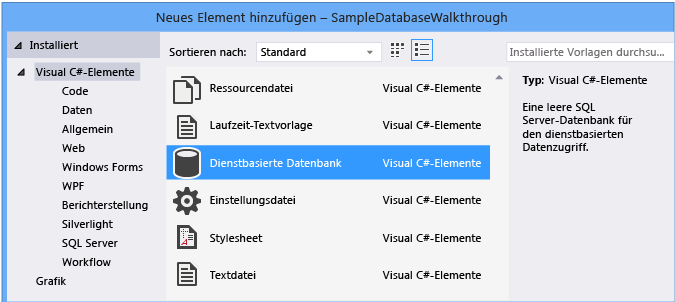
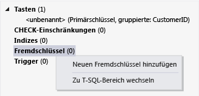

# <a name="create-a-database-and-add-tables-in-visual-studio"></a>Eine Datenbank erstellen und Hinzufügen von Tabellen in Visual Studio

Sie können Visual Studio zum Erstellen und Aktualisieren einer lokalen Datenbankdatei in SQL Server Express LocalDB verwenden. Sie können auch eine Datenbank erstellen, durch Ausführen von Transact-SQL-Anweisungen in der **Objekt-Explorer von SQL Server** Toolfenster in Visual Studio. In diesem Thema erstellen wir eine *mdf* -Datei und fügen Sie Tabellen und Schlüsseln mit der Tabellen-Designer.

## <a name="prerequisites"></a>Erforderliche Komponenten

Um diese exemplarische Vorgehensweise abzuschließen, benötigen Sie die optionale **datenspeicherung und-Verarbeitung** arbeitsauslastung in Visual Studio installiert. Öffnen Sie sie zur Installation **Visual Studio-Installer** , und wählen Sie die **Workloads** Registerkarte. Klicken Sie unter **Web und Cloud**, wählen Sie **datenspeicherung und-Verarbeitung**. Wählen Sie die **ändern** , um die arbeitsauslastung in Visual Studio hinzuzufügen.

## <a name="create-a-project-and-a-local-database-file"></a>Erstellen eines Projekts und einer lokalen Datenbankdatei

1.  Erstellen Sie ein Windows Forms-Projekt mit dem Namen **SampleDatabaseWalkthrough**.

2.  Wählen Sie auf der Menüleiste **Projekt** > **neues Element hinzufügen**.

3.  In der Liste der Vorlagen einen Bildlauf nach unten, und wählen Sie **Dienstbasierte Datenbank**.

     

4.  Nennen Sie die Datenbank **"SampleDatabase"**, und wählen Sie dann die **hinzufügen** Schaltfläche.

### <a name="to-add-a-data-source"></a>So fügen Sie eine Datenquelle hinzu

5.  Wenn die **Datenquellen** Fenster nicht geöffnet ist, öffnen Sie es durch Auswählen der **UMSCHALT**+**Alt**+**D** Schlüssel oder die Menüleiste **Ansicht** > **Other Windows** > **Datenquellen**.

6.  In der **Datenquellen** wählen Sie im Fenster der **neue Datenquelle hinzufügen** Link.

    Die **Assistenten zur Datenquellenkonfiguration** wird geöffnet.

7. Auf der **wählen Sie einen Datenquellentyp** Seite **Datenbank** und wählen Sie dann **Weiter**.

8. Auf der **Auswählen eines Datenbankmodells** Seite **Weiter** auf den Standardwert (Dataset) zu übernehmen.

9. Auf der **wählen Sie Ihre Datenverbindung** Seite die **SampleDatabase.mdf** -Datei in der Dropdown Liste, und wählen Sie dann **Weiter**.

10. Auf der **Verbindungszeichenfolge in der Anwendungskonfigurationsdatei speichern** Seite **Weiter**.

11. Eine der **Datenbankobjekte auswählen** Seite sehen, da Sie eine Nachricht die Datenbank keine Objekte enthalten. Klicken Sie auf **Fertig stellen**.

### <a name="to-view-properties-of-the-data-connection"></a>Um die Eigenschaften der Datenverbindung anzuzeigen

Sehen Sie die Verbindungszeichenfolge für die *SampleDatabase.mdf* Datei durch Öffnen des Eigenschaftenfensters der Datenverbindung:

-   Wählen Sie in Visual Studio **Ansicht** > **Objekt-Explorer von SQL Server** , wenn diese nicht bereits geöffnet ist. Öffnen Sie das Eigenschaftenfenster durch Erweitern der **Datenverbindungen** Knoten, öffnen das Kontextmenü für *SampleDatabase.mdf*, und wählen Sie dann **Eigenschaften**.

-   Alternativ können Sie auswählen **Ansicht** > **Server-Explorer**, sofern diese nicht bereits geöffnet ist. Öffnen Sie das Eigenschaftenfenster durch Erweitern der **Datenverbindungen** Knoten. Öffnen Sie das Kontextmenü für *SampleDatabase.mdf*, und wählen Sie dann **Eigenschaften**.

## <a name="create-tables-and-keys-by-using-table-designer"></a>Erstellen von Tabellen und Schlüsseln mit Tabellen-Designer

In diesem Abschnitt erstellen Sie zwei Tabellen, einen Primärschlüssel in jeder Tabelle und einige Zeilen der Beispieldaten. Sie erstellen auch einen foreign Key, um anzugeben, wie Datensätze in einer Tabelle mit Datensätzen in einer anderen Tabelle entsprechen.

### <a name="to-create-the-customers-table"></a>So erstellen Sie die Tabelle Customers

1.  In **Server-Explorer** oder **Objekt-Explorer von SQL Server**, erweitern Sie die **Datenverbindungen** Knoten, und erweitern Sie dann die **SampleDatabase.mdf**Knoten.

2.  Öffnen Sie das Kontextmenü für **Tabellen**, und wählen Sie dann **neue Tabelle hinzufügen**.

     Die **Tabellen-Designer** wird geöffnet und zeigt ein Raster mit einer standardmäßigen Zeile an, die eine einzelne Spalte in der Tabelle darstellt, die Sie erstellen. Durch Hinzufügen von Zeilen zum Raster fügen Sie zusätzliche Spalten in der Tabelle hinzu.

3.  Im Raster fügen Sie eine Zeile für jeden der folgenden Einträge hinzu:

    |Spaltenname|Datentyp|NULL zulassen|
    |-----------------|---------------|-----------------|
    |`CustomerID`|`nchar(5)`|False (gelöscht)|
    |`CompanyName`|`nvarchar(50)`|False (gelöscht)|
    |`ContactName`|`nvarchar (50)`|True (ausgewählt)|
    |`Phone`|`nvarchar (24)`|True (ausgewählt)|

4.  Öffnen Sie das Kontextmenü für die `CustomerID` Zeile, und wählen Sie dann **Primärschlüssel festlegen**.

5.  Öffnen Sie das Kontextmenü für die Standardzeile, und wählen Sie dann **löschen**.

6.  Benennen Sie die Tabelle "Customers", indem Sie die erste Zeile im Skriptbereich entsprechend dem folgenden Beispiel aktualisieren:

    ```sql
    CREATE TABLE [dbo].[Customers]
    ```

    Folgendes sollte angezeigt werden:

    

7.  In der oberen linken Ecke des der **Tabellen-Designer**, wählen die **Update** Schaltfläche.

8.  In der **Vorschau der Datenbankupdates** wählen Sie im Dialogfeld die **Update Database** Schaltfläche.

    Ihre Änderungen werden in der lokalen Datenbankdatei gespeichert.

### <a name="to-create-the-orders-table"></a>So erstellen Sie die Tabelle Orders

1.  Fügen Sie eine weitere Tabelle hinzu, und fügen Sie dann in der folgenden Tabelle eine Zeile für jeden Eintrag hinzu:

    |Spaltenname|Datentyp|NULL zulassen|
    |-----------------|---------------|-----------------|
    |`OrderID`|`int`|False (gelöscht)|
    |`CustomerID`|`nchar(5)`|False (gelöscht)|
    |`OrderDate`|`datetime`|True (ausgewählt)|
    |`OrderQuantity`|`int`|True (ausgewählt)|

2.  Legen Sie **"OrderID"** als Primärschlüssel aus, und löschen Sie dann die Standardzeile.

3.  Benennen Sie die Tabelle "Orders", indem Sie die erste Zeile im Skriptbereich entsprechend dem folgenden Beispiel aktualisieren:

    ```sql
    CREATE TABLE [dbo].[Orders]
    ```

4.  In der oberen linken Ecke des der **Tabellen-Designer**, wählen die **Update** Schaltfläche.

5.  In der **Vorschau der Datenbankupdates** wählen Sie im Dialogfeld die **Update Database** Schaltfläche.

    Ihre Änderungen werden in der lokalen Datenbankdatei gespeichert.

### <a name="to-create-a-foreign-key"></a>So erstellen Sie einen Fremdschlüssel

1.  Klicken Sie im Kontextbereich auf der rechten Seite des Rasters öffnen Sie das Kontextmenü für **Fremdschlüssel**, und wählen Sie dann **neuen Fremdschlüssel hinzufügen**, wie in die folgende Abbildung dargestellt.

     

2.  Ersetzen Sie in das Textfeld, das angezeigt wird, **ToTable** mit **Kunden**.

3.  Aktualisieren Sie die letzte Zeile entsprechend der im folgende Beispiel in T-SQL-Bereich:

    ```sql
    CONSTRAINT [FK_Orders_Customers] FOREIGN KEY ([CustomerID]) REFERENCES [Customers]([CustomerID])
    ```

4.  In der oberen linken Ecke des der **Tabellen-Designer**, wählen die **Update** Schaltfläche.

5.  In der **Vorschau der Datenbankupdates** wählen Sie im Dialogfeld die **Update Database** Schaltfläche.

    Ihre Änderungen werden in der lokalen Datenbankdatei gespeichert.

## <a name="populate-the-tables-with-data"></a>Füllen Sie die Tabellen mit Daten

1.  In **Server-Explorer** oder **Objekt-Explorer von SQL Server**, erweitern Sie den Knoten für die Beispieldatenbank.

2.  Öffnen Sie das Kontextmenü für die **Tabellen** Knoten **aktualisieren**, und erweitern Sie dann die **Tabellen** Knoten.

3.  Öffnen Sie das Kontextmenü für die Customers-Tabelle, und wählen Sie dann **Tabellendaten anzeigen**.

4.  Fügen Sie beliebige Daten, die Sie für einige Kunden möchten hinzu.

    Sie können fünf beliebige Zeichen für die Kunden-IDs angeben, wählen Sie aber mindestens eine aus, an die Sie sich noch erinnern können, um sie später in dieser Prozedur zu verwenden.

5.  Öffnen Sie das Kontextmenü für die Orders-Tabelle, und wählen Sie dann **Tabellendaten anzeigen**.

6.  Hinzufügen von Daten für einige Aufträge.

    > [!IMPORTANT]
    > Stellen Sie sicher, dass alle Bestellnummern und-Mengen ganze Zahlen sind und jede Kunden-ID mit einem Wert, die Sie angegeben haben übereinstimmt, in der **"CustomerID"** Spalte der Customers-Tabelle.

7.  Wählen Sie auf der Menüleiste **Datei** > **Alles speichern**.

## <a name="see-also"></a>Siehe auch

- [Zugreifen auf Daten in Visual Studio](accessing-data-in-visual-studio.md)