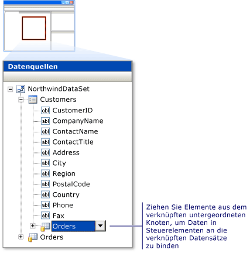

# Zeigen Sie verknüpfter Daten in WPF-Anwendungen an
In einigen Anwendungen empfiehlt es sich zum Arbeiten mit Daten, die stammen aus mehreren Tabellen oder Entitäten, die eine Parent-Child-Beziehung miteinander verbunden sind. Möglicherweise möchten z. B. ein Raster angezeigt werden, die Kunden aus einem `Customers` Tabelle. Wenn der Benutzer einen bestimmten Kunden auswählt, handelt es sich bei einem anderen Raster zeigt die Aufträge dieses Kunden aus einer verknüpften `Orders` Tabelle.

Erstellen von datengebundenen Steuerelementen, die verknüpfte Daten anzeigen, indem das Ziehen von Elementen aus der **Datenquellen** in den WPF-Designer.

## So erstellen Sie Steuerelemente, die verknüpfte Datensätze anzeigen

1. Auf der **Daten** Menü klicken Sie auf **Datenquellen anzeigen** So öffnen die **Datenquellen** Fenster.

2. Klicken Sie auf **neue Datenquelle hinzufügen**, und führen Sie die **Datenquellenkonfiguration** Assistenten.

3. Öffnen Sie die WPF-Designer, und stellen Sie sicher, dass der Designer einen Container enthält, ein gültiges Ablageziel für die Elemente in der **Datenquellen** Fenster.

     Weitere Informationen zu gültigen Ablagezielen, finden Sie unter [Binden von WPF-Steuerelementen an Daten in Visual Studio](../data-tools/bind-wpf-controls-to-data-in-visual-studio.md).

4. In der **Datenquellen** Fenster, erweitern Sie den Knoten, die für die übergeordnete Tabelle oder ein Objekt in der Beziehung. Die übergeordnete Tabelle oder das Objekt ist auf der Seite "one" einer 1: n-Beziehung.

5. Ziehen Sie den übergeordneten Knoten (oder einzelne Elemente im übergeordneten Knoten) aus dem **Datenquellen** auf ein gültiges Ablageziel im Designer.

     Visual Studio generiert XAML, das neue datengebundene Steuerelemente für jedes Element erstellt, die Sie ziehen. Der XAML-Code wird auch ein neues <xref:System.Windows.Data.CollectionViewSource> für die übergeordnete Tabelle oder das Objekt, das die Ressourcen des Ablageziels. Für einige Datenquellen generiert Visual Studio auch Code aus, um die Daten in die übergeordnete Tabelle oder das Objekt zu laden. Weitere Informationen finden Sie unter [Binden von WPF-Steuerelementen an Daten in Visual Studio](../data-tools/bind-wpf-controls-to-data-in-visual-studio.md).

6. In der **Datenquellen** Fenster, suchen Sie die zugehörige untergeordnete Tabelle oder das Objekt. Verknüpfte untergeordnete Tabellen und Objekte werden als erweiterbare Knoten am unteren Rand des übergeordneten Knotens Liste der Daten.

7. Ziehen Sie den untergeordneten Knoten (oder einzelne Elemente im untergeordneten Knoten) aus dem **Datenquellen** auf ein gültiges Ablageziel im Designer.

     Visual Studio generiert XAML, das neue datengebundene Steuerelemente für jedes der Elemente erstellt, die Sie ziehen. Der XAML-Code wird auch ein neues <xref:System.Windows.Data.CollectionViewSource> für die untergeordnete Tabelle oder das Objekt, das die Ressourcen des Ablageziels. Diese neue <xref:System.Windows.Data.CollectionViewSource> gebunden ist, für die Eigenschaft der übergeordneten Tabelle oder des Objekts, das Sie gerade in den Designer gezogen haben. Für einige Datenquellen generiert Visual Studio auch Code aus, um die Daten in die untergeordnete Tabelle oder das Objekt zu laden.

     Die folgende Abbildung veranschaulicht den zugehörigen **Aufträge** Tabelle mit den **Kunden** Tabelle in einem Dataset in die **Datenquellen** Fenster.

     

## Siehe auch

- [Binden von WPF-Steuerelementen an Daten in Visual Studio](../data-tools/bind-wpf-controls-to-data-in-visual-studio.md)
- [Erstellen von Nachschlagetabellen in WPF-Anwendungen](../data-tools/create-lookup-tables-in-wpf-applications.md)