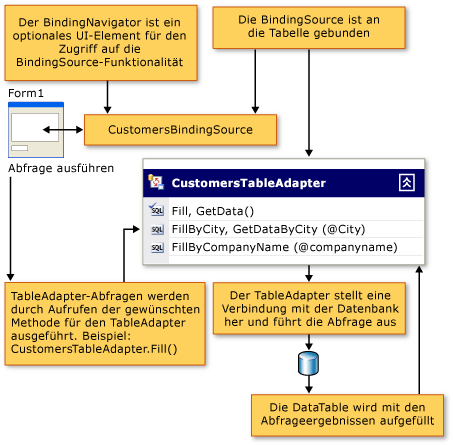
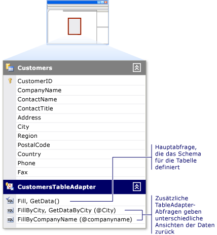

# Füllen Sie Datasets, indem Sie mithilfe von TableAdapters
Ein TableAdapter füllt ein Dataset mit Daten aus der Datenbank, basierend auf eine oder mehrere Abfragen oder gespeicherte Prozeduren, die Sie angeben. TableAdapters können auch ausführen, fügt, Aktualisierungen und löschungen in der Datenbank, um Änderungen persistent zu speichern, die Sie auf das Dataset vornehmen. Sie können auch globale Befehle ausgeben, die nicht mit einer bestimmten Tabelle verbunden sind.  
  
> [!NOTE]
>  TableAdapters werden vom Visual Studio-Designer generiert. Wenn Sie Datasets programmgesteuert erstellen, verwenden Sie "DataAdapter", ist eine .NET Framework-Klasse.  
  
 Ausführliche Informationen zu den TableAdapter-Vorgänge überspringen Sie direkt auf einen der folgenden Themen:  
  
|Thema|Beschreibung|  
|-----------|-----------------|  
|[Erstellen und Konfigurieren eines TableAdapters](../data-tools/create-and-configure-tableadapters.md)|So verwenden Sie die Designer zum Erstellen und Konfigurieren von TableAdapters|  
|[Erstellen von parametrisierten TableAdapter-Abfragen](../data-tools/create-parameterized-tableadapter-queries.md)|Benutzer geben Sie Argumente für TableAdapter-Prozeduren oder Abfragen aktivieren|  
|[Direktes Zugreifen auf die Datenbank mit einem TableAdapter](../data-tools/directly-access-the-database-with-a-tableadapter.md)|Gewusst wie: Verwenden von Dbdirect-Methoden eines TableAdapters|  
|[Deaktivieren von Einschränkungen beim Auffüllen von Datasets](../data-tools/turn-off-constraints-while-filling-a-dataset.md)|Arbeiten Sie mit der foreign Key-Einschränkungen beim Aktualisieren von Daten|  
|[Gewusst wie: Erweitern der Funktionalität eines TableAdapter](../data-tools/fill-datasets-by-using-tableadapters.md)|Zum Hinzufügen von benutzerdefinierten Codes zu TableAdapters|  
|[Laden von Daten in ein Dataset](../data-tools/read-xml-data-into-a-dataset.md)|Arbeiten mit XML|  
  
  
  
## Übersicht über TableAdapters  
 TableAdapters werden vom Designer generierte Komponenten, die Herstellen einer Verbindung mit einer Datenbank, ausgeführte Abfragen oder gespeicherte Prozeduren und deren DataTable mit den zurückgegebenen Daten zu füllen. TableAdapters zusätzlich die aktualisierte Daten aus der Anwendung wieder in die Datenbank gesendet. Sie können beliebig viele Abfragen, die Sie für einen TableAdapter möchten, solange sie Daten, die entsprechen dem Schema der Tabelle zurückgeben, die der TableAdapter zugeordnet ist, ausführen. Das folgende Diagramm zeigt, wie TableAdapters mit Datenbanken und anderen Objekten im Arbeitsspeicher zu interagieren:  
  
   
  
 Während TableAdapters mit vorgesehen sind die **Dataset-Designer**, die TableAdapter-Klassen werden nicht als geschachtelte Klassen von generiert <xref:System.Data.DataSet>. Sie befinden sich separaten Namespaces, die für jedes Dataset spezifisch sind. Angenommen, Sie haben ein Dataset namens `NorthwindDataSet`, die TableAdapters, die zugeordnet sind <xref:System.Data.DataTable>s in der `NorthwindDataSet` wird in der `NorthwindDataSetTableAdapters` Namespace. Um programmgesteuert auf einen speziellen TableAdapter zuzugreifen, müssen Sie eine neue Instanz des TableAdapter deklarieren. Zum Beispiel:  
  
 [!code-csharp[VbRaddataTableAdapters#7](../data-tools/codesnippet/CSharp/fill-datasets-by-using-tableadapters_1.cs)]
 [!code-vb[VbRaddataTableAdapters#7](../data-tools/codesnippet/VisualBasic/fill-datasets-by-using-tableadapters_1.vb)]  
  
## Zugeordnetes DataTable-schema  
 Wenn Sie einen TableAdapter erstellen, verwenden Sie die ursprüngliche Abfrage oder gespeicherte Prozedur zum Definieren des Schemas des TableAdapter zugeordnete <xref:System.Data.DataTable>. Sie führen diese anfängliche Abfrage oder die gespeicherte Prozedur des TableAdapter aufrufen `Fill` Methode (dem zugeordneten TableAdapter füllt <xref:System.Data.DataTable>). Die an der Hauptabfrage des TableAdapter vorgenommenen Änderungen werden im Schema der zugeordneten Datentabelle wiedergegeben. Beispielsweise entfernt Entfernen einer Spalte aus der Hauptabfrage auch die Spalte aus der zugeordneten Datentabelle. Wenn etwaigen zusätzlichen Abfragen für den TableAdapter SQL-Anweisungen, die Spalten zurückgeben, die nicht in der Hauptabfrage enthalten sind verwenden, versucht der Designer die Spaltenänderungen zwischen der Hauptabfrage und die zusätzlichen Abfragen zu synchronisieren. 
  
## Aktualisierungsbefehle für TableAdapter  
 Die Aktualisierungsfunktionalität eines TableAdapter hängt der Umfang der Informationen in der Hauptabfrage des TableAdapter-Assistenten verfügbar ist. Beispielsweise sind TableAdapters, die so konfiguriert sind, dass sie Werte aus mehreren Tabellen (JOINs), Skalarwerte, Ansichten oder die Ergebnisse von Aggregatfunktionen abrufen, bei der Erstellung anfänglich nicht in der Lage, Aktualisierungen an die zugrunde liegende Datenbank zurückzusenden. Allerdings können Sie konfigurieren, die INSERT-, Update- und DELETE-Befehle manuell in die **Eigenschaften** Fenster.  
  
## TableAdapter-Abfragen  
   
  
 TableAdapters können mehrere Abfragen, um ihre zugeordneten Datentabellen aufzufüllen enthalten. Sie können so viele Abfragen für einen TableAdapter definieren, wie für die Anwendung erforderlich sind, solange jede Abfrage Daten zurückgibt, die demselben Schema entsprechen wie die zugeordnete Datentabelle. Diese Funktion ermöglicht es einen TableAdapter unterschiedliche Ergebnisse basierend auf unterschiedlichen Kriterien zu laden.  
  
 Wenn Ihre Anwendung eine Tabelle mit Kundennamen enthält, können Sie z. B. eine Abfrage, die füllt die Tabelle mit jeder Kundenname, der mit einem bestimmten Buchstaben beginnt und ein anderes erstellen, die die Tabelle mit allen Kunden aufgefüllt, die im gleichen Zustand befinden. Zum Auffüllen einer `Customers` Tabelle mit Kunden in einem bestimmten Status befinden, erstellen Sie eine `FillByState` Abfrage, die einen Parameter für den Statuswert wie folgt verwendet: `SELECT * FROM Customers WHERE State = @State`. Führen Sie die Abfrage durch Aufrufen der `FillByState` -Methode und übergeben den Parameterwert folgendermaßen: `CustomerTableAdapter.FillByState("WA")`.  
  
 Zusätzlich zum Hinzufügen von Abfragen, die das gleiche Schema wie die Datentabelle des TableAdapter Daten zurückgeben, können Sie Abfragen hinzufügen, die (einzelne) Skalarwerte zurückgeben. Angenommen, eine Abfrage, die Anzahl der Kunden zurückgibt (`SELECT Count(*) From Customers`) gilt für eine `CustomersTableAdapter,` , obwohl die Daten, die zurückgegeben wird, werden das Schema der Tabelle entsprechen nicht.  
  
## ClearBeforeFill-Eigenschaft  
 Standardmäßig müssen Sie jedes Mal, wenn Sie eine Abfrage zum Auffüllen TableAdapters-Datentabelle ausführen, die vorhandenen Daten deaktiviert ist und nur die Ergebnisse der Abfrage in die Tabelle geladen werden. Festlegen des TableAdapter `ClearBeforeFill` Eigenschaft `false` ggf. hinzufügen oder die gespeicherten Daten zusammenführen, die an die vorhandenen Daten in einer Datentabelle aus einer Abfrage zurückgegeben wird. Unabhängig davon, ob Sie die Daten löschen müssen Sie Aktualisierungen explizit wieder in der Datenbank zu senden, wenn Sie sie beibehalten möchten. Vergessen Sie also nicht zum Speichern von Änderungen an den Daten in der Tabelle vor dem Ausführen einer anderen Abfrage, die die Tabelle füllt. Weitere Informationen finden Sie unter [Aktualisieren von Daten mit einem TableAdapter](../data-tools/update-data-by-using-a-tableadapter.md).  
  
## TableAdapter-Vererbung  
 TableAdapters, die die Funktionalität von Standarddatenadaptern erweitert, indem ein konfiguriertes kapseln <xref:System.Data.Common.DataAdapter> Klasse. Standardmäßig erbt der TableAdapter von der <xref:System.ComponentModel.Component> Klasse und kann nicht umgewandelt werden, um die <xref:System.Data.Common.DataAdapter> Klasse. Umwandlung eines TableAdapter in der <xref:System.Data.Common.DataAdapter> Klasse führt zu einer <xref:System.InvalidCastException> Fehler. Um die Basisklasse eines TableAdapter zu ändern, können Sie angeben, eine Klasse, die abgeleitet <xref:System.ComponentModel.Component> in der **Basisklasse** -Eigenschaft des TableAdapter in die **Dataset-Designer**.  
  
## TableAdapter-Methoden und Eigenschaften  
 Die TableAdapter-Klasse ist nicht Teil der [!INCLUDE[dnprdnshort](../code-quality/includes/dnprdnshort_md.md)]. Dies bedeutet, dass Sie nicht sie in der Dokumentation zu suchen oder die **Objektkatalog**. Sie wird zur Entwurfszeit erstellt, wenn Sie einen der zuvor erwähnten Assistenten verwenden. Der Name, der einem TableAdapter zugewiesen ist, bei der Erstellung basiert auf den Namen der Tabelle, mit dem Sie arbeiten. Beispielsweise wird beim Erstellen eines TableAdapters basierend auf einer Tabelle in einer Datenbank mit dem Namen `Orders`, den Namen des TableAdapters `OrdersTableAdapter`. Der Klassenname des TableAdapter kann geändert werden, mithilfe der **Namen** Eigenschaft in der **Dataset-Designer**.  
  
 Es folgen die häufig verwendete Methoden und-Eigenschaften vorgestellt:  
  
|Member|Beschreibung|  
|------------|-----------------|  
|`TableAdapter.Fill`|Füllt die dem TableAdapter zugeordnete Datentabelle mit den Ergebnissen des SELECT-Befehls für den TableAdapter auf.|  
|`TableAdapter.Update`|Sendet Änderungen wieder in der Datenbank, und gibt eine ganze Zahl, die die Anzahl der vom Update betroffenen Zeilen angibt. Weitere Informationen finden Sie unter [Aktualisieren von Daten mit einem TableAdapter](../data-tools/update-data-by-using-a-tableadapter.md).|  
|`TableAdapter.GetData`|Gibt eine neue <xref:System.Data.DataTable> , die mit Daten gefüllt wird.|  
|`TableAdapter.Insert`|Erstellt eine neue Zeile in der Datentabelle. Weitere Informationen finden Sie unter [Einfügen neuer Datensätze in einer Datenbank](../data-tools/insert-new-records-into-a-database.md).|  
|`TableAdapter.ClearBeforeFill`|Bestimmt, ob eine Datentabelle geleert wird, bevor Sie eine der `Fill`-Methoden aufrufen.|  
  
## TableAdapter-Update-Methode  
 TableAdapters verwenden zum Lesen und Schreiben in Datenbanken Datenbefehle. Des TableAdapter anfängliche `Fill` -(Haupt-)Abfrage dient als Grundlage zum Erstellen des Schemas der zugeordneten Datentabelle als auch die `InsertCommand`, `UpdateCommand`, und `DeleteCommand` Befehle, die zugeordnet sind die `TableAdapter.Update` Methode. Eines TableAdapter aufrufen `Update` Methode führt die Anweisungen, die erstellt wurden, wenn der TableAdapter ursprünglich konfiguriert, nicht eine der zusätzlichen Abfragen, die mit hinzugefügt wurde die **Konfigurations-Assistenten für TableAdapter Abfragen**.  
  
 Wenn Sie einen TableAdapter verwenden, führt er effektiv dieselben Operationen mit den Befehlen aus, die Sie normalerweise ausführen würden. Beispielsweise wird beim Aufruf des Adapters `Fill` -Methode, der Adapter wird den Datenbefehl im seine `SelectCommand` Eigenschaft und verwendet einen Datenreader (z. B. <xref:System.Data.SqlClient.SqlDataReader>) um das Resultset in die Datentabelle zu laden. Auf ähnliche Weise werden beim Aufruf des Adapters `Update` -Methode, wird der entsprechenden Befehl ausgeführt (in der `UpdateCommand`, `InsertCommand`, und `DeleteCommand` Eigenschaften) für jeden geänderten Datensatz in der Datentabelle.  
  
> [!NOTE]
>  Wenn die Hauptabfrage genügend Informationen enthält, werden beim Generieren des TableAdapter standardmäßig die Befehle `InsertCommand`, `UpdateCommand` und `DeleteCommand` erstellt. Wenn Hauptabfrage des TableAdapter auf mehr als eine einzelne Tabelle SELECT-Anweisung ist, kann der Designer kann nicht zum generieren `InsertCommand`, `UpdateCommand`, und `DeleteCommand`. Wenn diese Befehle nicht generiert werden, erhalten Sie möglicherweise eine Fehlermeldung beim Ausführen der `TableAdapter.Update` Methode.  
  
## TableAdapter GenerateDbDirectMethods  
 Zusätzlich zu `InsertCommand`, `UpdateCommand`, und `DeleteCommand`, TableAdapter-Erstellung Methoden, die direkt gegen die Datenbank ausgeführt werden können. Diese Methoden (`TableAdapter.Insert`, `TableAdapter.Update` und `TableAdapter.Delete`) können direkt aufgerufen werden, um Daten in der Datenbank zu bearbeiten. Dies bedeutet, Sie können diese einzelnen Methoden aufrufen, aus dem Code statt `TableAdapter.Update` behandelt, die einfügungen, Updates und Löschvorgänge, die ausstehend sind für die zugeordnete Datentabelle.  
  
 Wenn Sie diese Methoden direkten erstellen möchten, legen Sie des TableAdapters **GenerateDbDirectMethods** Eigenschaft `false` (in der **Eigenschaften** Fenster). Zusätzliche Abfragen, die dem TableAdapter hinzugefügt werden, sind eigenständige Abfragen – sie können diese Methoden nicht generieren.  
  
## TableAdapter-Unterstützung für Typen mit Nullwert  
 TableAdapters unterstützen die Typen mit Nullwert `Nullable(Of T)` und `T?`. Weitere Informationen zu Nullable-Typen in Visual Basic finden Sie unter [Auf NULL festlegbare Werttypen](/dotnet/visual-basic/programming-guide/language-features/data-types/nullable-value-types). Weitere Informationen über Typen, die in c# finden Sie unter [mithilfe von auf NULL festlegbaren Typen](/dotnet/csharp/programming-guide/nullable-types/using-nullable-types).  
  
  
  
## TableAdapterManager-Verweis  
 Standardmäßig eine `TableAdapterManager` Klasse wird generiert, wenn Sie ein Dataset erstellen, die verknüpfte Tabellen enthält. Um zu verhindern, dass die Klasse generiert wird, ändern Sie den Wert von der `Hierarchical Update` Eigenschaft des Datasets auf "false". Wenn Sie eine Tabelle, die eine auf die Entwurfsoberfläche der Windows Forms oder WPF-Seite ziehen Beziehung, deklariert Visual Studio eine Membervariable der Klasse. Wenn Sie Databinding nicht verwenden, müssen Sie manuell die Variable zu deklarieren.  
  
 Die `TableAdapterManager` Klasse ist nicht Teil der [!INCLUDE[dnprdnshort](../code-quality/includes/dnprdnshort_md.md)]. Aus diesem Grund können keine Sie es in der Dokumentation nachschlagen. Sie wird zur Entwurfszeit im Rahmen des Erstellungsprozesses des Datasets erstellt.  
  
 Im folgenden werden die häufig verwendeten Methoden und Eigenschaften von der `TableAdapterManager` Klasse:  
  
|Member|Beschreibung|  
|------------|-----------------|  
|`UpdateAll`-Methode|Speichert alle Daten aus allen Tabellen.|  
|`BackUpDataSetBeforeUpdate`-Eigenschaft|Bestimmt, ob erstellen Sie eine Sicherungskopie des Datasets vor dem Ausführen der `TableAdapterManager.UpdateAll` Methode. Boolescher Wert.|  
|*TableName* `TableAdapter` Eigenschaft|Stellt eine `TableAdapter`. Die generierte `TableAdapterManager` enthält eine Eigenschaft für jede `TableAdapter` verwaltet. Beispielsweise wird ein Dataset mit einer Customers und Orders-Tabelle generiert, mit einem `TableAdapterManager` enthält `CustomersTableAdapter` und `OrdersTableAdapter` Eigenschaften.|  
|`UpdateOrder`-Eigenschaft|Steuert die Reihenfolge von den einzelnen INSERT-, Update- und Delete-Befehle. Legen Sie diese Einstellung auf einen der Werte in der `TableAdapterManager.UpdateOrderOption` Enumeration.   Wird standardmäßig die `UpdateOrder` festgelegt ist, um **InsertUpdateDelete**. Das bedeutet, die eingefügt, aktualisiert und löscht dann werden für alle Tabellen im Dataset ausgeführt.|

## Sicherheit  
Bei Verwendung von Datenbefehlen mit CommandType-Eigenschaft auf festgelegt <xref:System.Data.CommandType.Text>, sorgfältig prüfen von Informationen, die vor der Übergabe an die Datenbank von einem Client gesendet wird. Böswillige Benutzer könnten versuchen, veränderte oder zusätzliche SQL-Anweisungen zu senden (einzufügen), um unautorisierten Zugriff zu erhalten oder die Datenbank zu beschädigen. Bevor Sie Benutzereingaben an eine Datenbank übertragen, immer Stellen Sie sicher, dass die Informationen gültig sind. Eine bewährte Methode wird immer parametrisierte Abfragen oder gespeicherte Prozeduren möglichst verwenden.  
  
## Siehe auch
[Datasettools](../data-tools/dataset-tools-in-visual-studio.md)