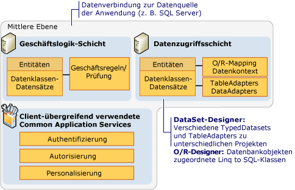

# &#220;bersicht &#252;ber N-Tier-Datenanwendungen
*N\-Tier*\-Datenanwendungen sind Datenanwendungen, die in mehrere *Ebenen* aufgeteilt sind.  Sie werden auch "verteilte Anwendungen" oder "Anwendungen mit mehreren Ebenen" genannt, da die Verarbeitung auf voneinander unabhängige, auf Client und Server verteilte Ebenen aufgeteilt wird.  Beim Entwickeln einer Anwendung, die auf Daten zugreift, sollten die verschiedenen Ebenen, aus denen die Anwendung besteht, klar getrennt sein.  
  
 Eine typische N\-Tier\-Anwendung besteht aus einer Präsentationsebene, einer mittleren Ebene und einer Datenebene.  Die einfachste Möglichkeit zum Trennen der verschiedenen Ebenen einer N\-Tier\-Anwendung besteht im Erstellen separater Projekte für jede Ebene, die in der Anwendung enthalten sein soll.  Beispielsweise könnte die Präsentationsebene eine Windows Forms\-Anwendung sein, während die Datenzugriffslogik eine in der mittleren Ebene angesiedelte Klassenbibliothek ist.  Weiterhin könnte die Präsentationslogik in der mittleren Ebene über einen Dienst mit der Datenzugriffsebene kommunizieren.  Die Aufteilung der Anwendungskomponenten in verschiedene Ebenen erhöht die Verwaltbarkeit und die Skalierbarkeit der Anwendung.   Auf diese Weise wird das Einarbeiten neuer, eine einzelne Ebene betreffender Technologien vereinfacht, ein erneutes Entwerfen der Anwendung ist nicht notwendig.  Außerdem werden vertrauliche Informationen von N\-Tier\-Anwendungen in der Regel in der mittleren Ebene gespeichert, die von der Präsentationsebene getrennt ist.  
  
 Visual Studio enthält zahlreiche Features, die Entwicklern das Erstellen von N\-Tier\-Anwendungen erleichtern.  
  
-   Der [Erstellen und Bearbeiten von typisierten Datasets](../data-tools/creating-and-editing-typed-datasets.md) stellt eine **DataSet\-Projekt**\-Eigenschaft zur Verfügung, die es ermöglicht, das DataSet \(Datenentitätsebene\) und die `TableAdapter` \(Datenzugriffsebene\) in einzelne Projekte aufzuteilen.  
  
-   Der [Object Relational Designer \(O\/R\-Designer\)](../data-tools/linq-to-sql-tools-in-visual-studio2.md) stellt Einstellungen zur Verfügung, um den DataContext und Datenklassen in separaten Namespaces zu generieren.  Dies ermöglicht eine logische Trennung von Datenzugriffs\- und Datenentitätsebenen.  
  
-   [LINQ to SQL](../Topic/LINQ%20to%20SQL.md) stellt die <xref:System.Data.Linq.Table%601.Attach%2A>\-Methode zur Verfügung, mit der ein DataContext aus unterschiedlichen Ebenen in einer Anwendung vereinigt werden kann.  Weitere Informationen finden Sie unter [N\-Tier\- und Remoteanwendungen mit LINQ to SQL](../Topic/N-Tier%20and%20Remote%20Applications%20with%20LINQ%20to%20SQL.md).  
  
## Präsentationsebene  
 Die *Präsentationsebene* ist die Ebene, auf der Benutzer mit einer Anwendung interagieren.  Sie enthält oft auch zusätzliche Anwendungslogik.  Zu den typischen Komponenten einer Präsentationsebene gehören:  
  
-   Komponenten zur Datenbindung, etwa <xref:System.Windows.Forms.BindingSource> und <xref:System.Windows.Forms.BindingNavigator>.  
  
-   Objektdarstellungen von Daten, wie [LINQ to SQL](../Topic/LINQ%20to%20SQL.md)\-Entitätsklassen, die in der Präsentationsebene verwendet werden können.  
  
 Von der Präsentationsebene wird in der Regel mithilfe eines Dienstverweises \(beispielsweise einer [Windows Communication Foundation Services and WCF Data Services in Visual Studio](../data-tools/windows-communication-foundation-services-and-wcf-data-services-in-visual-studio.md)\-Anwendung\) auf die mittlere Ebene zugegriffen.  Die Präsentationsebene greift nicht direkt auf die Datenebene zu.  Sie kommuniziert mit der Datenebene unter Verwendung der Datenzugriffskomponenten der mittleren Ebene.  
  
## Mittlere Ebene  
 Die *mittlere Ebene* ist die Ebene, über die Präsentationsebene und Datenebene miteinander kommunizieren.  Zu den typischen Komponenten einer mittleren Ebene gehören:  
  
-   Geschäftslogik, z. B. Geschäftsregeln und Datenvalidierung.  
  
-   Komponenten und Logik für den Datenzugriff, wie beispielsweise:  
  
    -   [TableAdapters](../Topic/TableAdapters.md) und [DataAdapter und DataReader](../Topic/DataAdapters%20and%20DataReaders.md).  
  
    -   Objektdarstellungen von Daten, wie [LINQ to SQL](../Topic/LINQ%20to%20SQL.md)\-Entitätsklassen.  
  
    -   Allgemeine Anwendungsdienste wie Authentifizierung, Autorisierung und Personalisierung.  
  
 In der folgenden Abbildung werden die in Visual Studio zur Verfügung stehenden Features und Technologien und deren mögliche Verwendung in der mittleren Ebene einer N\-Tier\-Anwendung dargestellt.  
  
   
  
        Mittlere Ebene  
  
 Die mittlere Ebene stellt in der Regel mithilfe einer Datenverbindung eine Verbindung mit der Datenebene her.  Diese Datenverbindung wird üblicherweise in der Datenzugriffskomponente gespeichert.  
  
## Datenebene  
 Der *Datenebene* entspricht im Grunde der Server, auf dem die Daten für eine Anwendung gespeichert werden \(z. B. ein Server, auf dem [!INCLUDE[ssNoVersion](../data-tools/includes/ssnoversion_md.md)] ausgeführt wird.\)  
  
 In der folgenden Abbildung werden die in Visual Studio zur Verfügung stehenden Features und Technologien und deren mögliche Verwendung in der Datenebene einer N\-Tier\-Anwendung dargestellt.  
  
   
Datenebene  
  
 Vom Client in der Präsentationsebene kann nicht direkt auf die Datenebene zugegriffen werden.  Stattdessen fungiert die mittlere Ebene als Datenzugriffskomponente und dient zur Kommunikation zwischen der Präsentations\- und der Datenebene.  
  
## Hilfe zur N\-Tier\-Entwicklung  
 In den folgenden Themen finden Sie Informationen über die Arbeit mit N\-Tier\-Anwendungen:  
  
 [Gewusst wie: DataSets und TableAdapters in verschiedene Projekte aufteilen](../data-tools/separate-datasets-and-tableadapters-into-different-projects.md)  
  
 [Exemplarische Vorgehensweise: Erstellen einer N\-Tier\-Datenanwendung](../data-tools/walkthrough-creating-an-n-tier-data-application.md)  
  
 [Exemplarische Vorgehensweise: Hinzufügen von Validierungen zu einer N\-Tier\-Datenanwendung](../Topic/Walkthrough:%20Adding%20Validation%20to%20an%20N-Tier%20Data%20Application.md)  
  
 [N\-Tier\- und Remoteanwendungen mit LINQ to SQL](../Topic/N-Tier%20and%20Remote%20Applications%20with%20LINQ%20to%20SQL.md)  
  
## Siehe auch  
 <xref:System.Data.Linq.ITable.Attach%2A>   
 [Exemplarische Vorgehensweise: Erstellen einer N\-Tier\-Datenanwendung](../data-tools/walkthrough-creating-an-n-tier-data-application.md)   
 [Hierarchische Aktualisierung](../data-tools/hierarchical-update.md)   
 [Arbeiten mit Datasets in Visual Studio](../data-tools/dataset-tools-in-visual-studio.md)   
 [Zugreifen auf Daten in Visual Studio](../data-tools/accessing-data-in-visual-studio.md)