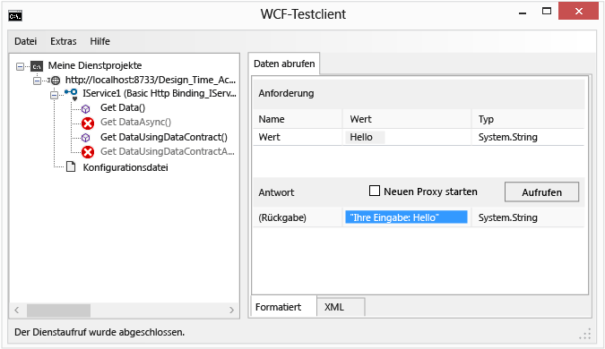
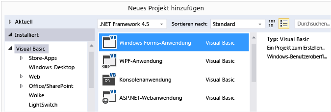

# Exemplarische Vorgehensweise: Erstellen eines einfachen WCF-Diensts in Windows Forms

In dieser exemplarischen Vorgehensweise wird gezeigt, wie Sie einen einfachen [!INCLUDE[vsindigo](../data-tools/includes/vsindigo_md.md)]-Dienst erstellen, testen und über eine Windows Forms-Anwendung darauf zugreifen können.

[!INCLUDE[note_settings_general](../data-tools/includes/note_settings_general_md.md)]

## Erstellen Sie den Dienst.

### So erstellen Sie einen WCF-Dienst

1.  Zeigen Sie im Menü **Datei** auf **Neu** , und klicken Sie dann auf **Projekt**.

2.  Erweitern Sie im Dialogfeld **Neues Projekt** den Knoten **Visual Basic** oder **Visual C#**, und klicken Sie anschließend auf **WCF** und dann auf **WCF-Dienstbibliothek**. Klicken Sie auf **OK**, um das Projekt zu öffnen.

     

    > [!NOTE]
    >  Dadurch wird ein funktionierender Dienst erstellt, der getestet und aufgerufen werden kann. Die folgenden beiden Schritte veranschaulichen, wie Sie die Standardmethode ändern können, um einen anderen Datentyp zu verwenden. In einer echten Anwendung würden Sie dem Dienst auch Ihre eigenen Funktionen hinzufügen.

3.  

     Doppelklicken Sie im **Projektmappen-Explorer** auf **IService1.vb** oder **IService1.cs**, und suchen Sie die folgende Zeile:

     [!code-csharp[WCFWalkthrough#4](../data-tools/codesnippet/CSharp/walkthrough-creating-a-simple-wcf-service-in-windows-forms_1.cs)]
     [!code-vb[WCFWalkthrough#4](../data-tools/codesnippet/VisualBasic/walkthrough-creating-a-simple-wcf-service-in-windows-forms_1.vb)]

     Ändern Sie den Typ für die `value` Parameter in Zeichenfolge:

     [!code-csharp[WCFWalkthrough#1](../data-tools/codesnippet/CSharp/walkthrough-creating-a-simple-wcf-service-in-windows-forms_2.cs)]
     [!code-vb[WCFWalkthrough#1](../data-tools/codesnippet/VisualBasic/walkthrough-creating-a-simple-wcf-service-in-windows-forms_2.vb)]

     Beachten Sie im obigen Code die `<OperationContract()>`- oder `[OperationContract]`-Attribute. Diese Attribute sind für jede Methode erforderlich, die vom Dienst zur Verfügung gestellt wird.

4.  

     Doppelklicken Sie im **Projektmappen-Explorer** auf **Service1.vb** oder **Service1.cs**, und suchen Sie die folgende Zeile:

     [!code-vb[WCFWalkthrough#5](../data-tools/codesnippet/VisualBasic/walkthrough-creating-a-simple-wcf-service-in-windows-forms_3.vb)]
     [!code-csharp[WCFWalkthrough#5](../data-tools/codesnippet/CSharp/walkthrough-creating-a-simple-wcf-service-in-windows-forms_3.cs)]

     Ändern Sie den Typ für die `value` Parameter in Zeichenfolge:

     [!code-csharp[WCFWalkthrough#2](../data-tools/codesnippet/CSharp/walkthrough-creating-a-simple-wcf-service-in-windows-forms_4.cs)]
     [!code-vb[WCFWalkthrough#2](../data-tools/codesnippet/VisualBasic/walkthrough-creating-a-simple-wcf-service-in-windows-forms_4.vb)]

## Testen Sie den Dienst

### So testen Sie einen WCF-Dienst

1.  Drücken Sie **F5**, um den Dienst auszuführen. Ein **WCF-Testclient** Formular angezeigt wird, und lädt den Dienst.

2.  Doppelklicken Sie im **WCF-Testclient**-Formular auf die **GetData()**-Methode unter **IService1**. Die **GetData** Registerkarte wird angezeigt.

     

3.  Wählen Sie im Feld **Anforderung** das Feld **Wert** aus, und geben Sie `Hello` ein.

     

4.  Klicken Sie auf die Schaltfläche **Aufrufen**. Wenn eine **Sicherheitswarnung** klicken Sie im angezeigten Dialogfeld **OK**. Das Ergebnis zeigt an, der **Antwort** Feld.

     

5.  Klicken Sie im Menü **Datei** auf **Beenden**, um das Testformular zu schließen.

## Greifen Sie auf den Dienst

### So greifen Sie auf einen WCF-Dienst zu

1.  Zeigen Sie im Menü **Datei** auf die Option **Hinzufügen**, und klicken Sie anschließend auf **Neues Projekt**.

2.  In der **neues Projekt** Dialogfeld erweitern Sie die **Visual Basic** oder **Visual C#**  Knoten **Windows**, und wählen Sie dann auf  **Windows Forms-Anwendung**. Klicken Sie auf **OK**, um das Projekt zu öffnen.

     

3.  Klicken Sie mit der rechten Maustaste auf **WindowsApplication1** und dann auf **Dienstverweis hinzufügen**. Die **Hinzufügen eines Dienstverweises** Dialogfeld wird angezeigt.

4.  Klicken Sie im Dialogfeld **Dienstverweis hinzufügen** auf **Ermitteln**.

     

     **"Service1"** zeigt in der **Services** Bereich.

5.  Klicken Sie auf **OK**, um den Dienstverweis hinzuzufügen.

### So erstellen Sie eine Clientanwendung

1.  Doppelklicken Sie im **Projektmappen-Explorer** auf **Form1.vb** oder **Form1.cs**, um den Windows Forms-Designer zu öffnen, wenn er nicht bereits geöffnet ist.

2.  Ziehen Sie aus der **Toolbox** ein `TextBox`-Steuerelement, ein `Label`-Steuerelement und ein `Button`-Steuerelement auf das Formular.

     

3.  Doppelklicken Sie auf `Button`, und fügen Sie dem `Click`-Ereignishandler den folgenden Code hinzu:

     [!code-csharp[WCFWalkthrough#3](../data-tools/codesnippet/CSharp/walkthrough-creating-a-simple-wcf-service-in-windows-forms_5.cs)]
     [!code-vb[WCFWalkthrough#3](../data-tools/codesnippet/VisualBasic/walkthrough-creating-a-simple-wcf-service-in-windows-forms_5.vb)]

4.  Klicken Sie im **Projektmappen-Explorer** mit der rechten Maustaste auf **WindowsApplication1**, und klicken Sie auf **Als Startprojekt festlegen**.

5.  Drücken Sie **F5**, um das Projekt auszuführen. Geben Sie Text ein, und klicken Sie auf die Schaltfläche. Zeigt die Bezeichnung "Ihre Eingabe:" und zeigt den Text an, die Sie eingegeben haben.

     

## Siehe auch

- [Windows Communication Foundation-Dienste und WCF Data Services in Visual Studio](../data-tools/windows-communication-foundation-services-and-wcf-data-services-in-visual-studio.md)