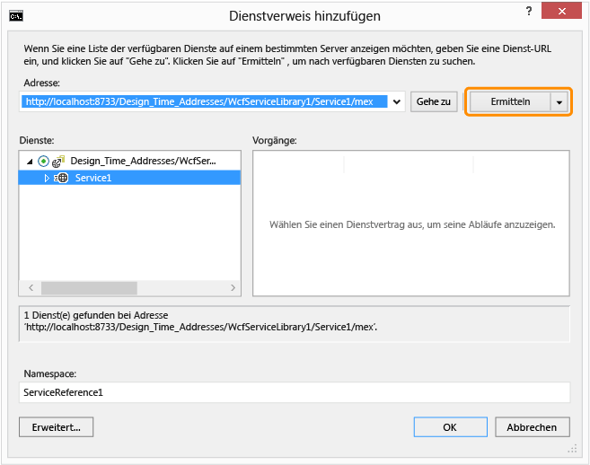

# Walkthrough: Creating and Accessing WCF Services
In dieser exemplarischen Vorgehensweise wird gezeigt, wie Sie einen einfachen [!INCLUDE[vsindigo](../data-tools/includes/vsindigo_md.md)]\-Dienst erstellen, testen und über eine Windows Forms\-Anwendung darauf zugreifen können.  
  
 [!INCLUDE[note_settings_general](../data-tools/includes/note_settings_general_md.md)]  
  
## Erstellen des Diensts  
  
#### So erstellen Sie einen WCF\-Dienst  
  
1.  Zeigen Sie im Menü **Datei** auf **Neu**, und klicken Sie dann auf **Projekt**.  
  
2.  Erweitern Sie im Dialogfeld **Neues Projekt** den Knoten **Visual Basic** oder **Visual C\#**, und klicken Sie anschließend auf **WCF**, gefolgt von **WCF\-Dienstbibliothek**.  Klicken Sie auf **OK**, um das Projekt zu öffnen.  
  
       
  
    > [!NOTE]
    >  Dadurch wird ein funktionierender Dienst erstellt, der getestet und aufgerufen werden kann.  Die folgenden beiden Schritte veranschaulichen, wie Sie die Standardmethode ändern können, um einen anderen Datentyp zu verwenden.  In einer echten Anwendung würden Sie dem Dienst auch Ihre eigenen Funktionen hinzufügen.  
  
3.    
  
     Doppelklicken Sie im **Projektmappen\-Explorer** auf "IService1.vb" oder "IService1.cs", und suchen Sie die folgende Zeile:  
  
     [!code-cs[WCFWalkthrough#4](../data-tools/codesnippet/CSharp/walkthrough-creating-a-simple-wcf-service-in-windows-forms_1.cs)]
     [!code-vb[WCFWalkthrough#4](../data-tools/codesnippet/VisualBasic/walkthrough-creating-a-simple-wcf-service-in-windows-forms_1.vb)]  
  
     Ändern Sie den Typ für den `value`\-Parameter in `String`:  
  
     [!code-cs[WCFWalkthrough#1](../data-tools/codesnippet/CSharp/walkthrough-creating-a-simple-wcf-service-in-windows-forms_2.cs)]
     [!code-vb[WCFWalkthrough#1](../data-tools/codesnippet/VisualBasic/walkthrough-creating-a-simple-wcf-service-in-windows-forms_2.vb)]  
  
     Beachten Sie im obigen Code die `<OperationContract()>`\- oder `[OperationContract]`\-Attribute.  Diese Attribute sind für jede Methode erforderlich, die vom Dienst zur Verfügung gestellt wird.  
  
4.    
  
     Doppelklicken Sie im **Projektmappen\-Explorer** auf "Service1.vb" oder "Service1.cs", und suchen Sie die folgende Zeile:  
  
     [!code-vb[WCFWalkthrough#5](../data-tools/codesnippet/VisualBasic/walkthrough-creating-a-simple-wcf-service-in-windows-forms_3.vb)]
     [!code-cs[WCFWalkthrough#5](../data-tools/codesnippet/CSharp/walkthrough-creating-a-simple-wcf-service-in-windows-forms_3.cs)]  
  
     Ändern Sie den Typ für den value\-Parameter in `String`:  
  
     [!code-cs[WCFWalkthrough#2](../data-tools/codesnippet/CSharp/walkthrough-creating-a-simple-wcf-service-in-windows-forms_4.cs)]
     [!code-vb[WCFWalkthrough#2](../data-tools/codesnippet/VisualBasic/walkthrough-creating-a-simple-wcf-service-in-windows-forms_4.vb)]  
  
## Testen des Diensts  
  
#### So testen Sie einen WCF\-Dienst  
  
1.  Drücken Sie **F5**, um die Anwendung auszuführen.  Ein **WCF\-Testclient**\-Formular wird angezeigt und lädt den Dienst.  
  
2.  Doppelklicken Sie im **WCF\-Testclient**\-Formular auf die **GetData\(\)**\-Methode unter **IService1**.  Die Registerkarte **GetData** wird angezeigt.  
  
       
  
3.  Wählen Sie im Feld **Anforderung** das Feld **Wert** aus, und geben Sie `Hello` ein.  
  
       
  
4.  Klicken Sie auf die Schaltfläche **Aufrufen**.  Wenn ein Dialogfeld mit einer **Sicherheitswarnung** angezeigt wird, klicken Sie auf **OK**.  Das Ergebnis wird im Feld **Antwort** angezeigt.  
  
       
  
5.  Klicken Sie im Menü **Datei** auf **Beenden**, um das Testformular zu schließen.  
  
## Zugriff auf den Dienst  
  
#### So greifen Sie auf einen WCF\-Dienst zu  
  
1.  Wählen Sie im Menü **Datei** die Option **Hinzufügen** aus, und klicken Sie anschließend auf **Neues Projekt**.  
  
2.  Erweitern Sie im Dialogfeld **Neues Projekt** den Knoten **Visual Basic** oder **Visual C\#**, wählen Sie **Windows** und dann **Windows Forms\-Anwendung** aus.  Klicken Sie auf **OK**, um das Projekt zu öffnen.  
  
       
  
3.  Klicken Sie mit der rechten Maustaste auf **WindowsApplication1** und dann auf **Dienstverweis hinzufügen**.  Das Dialogfeld **Dienstverweis hinzufügen** wird angezeigt.  
  
4.  Klicken Sie im Dialogfeld **Dienstverweis hinzufügen** auf **Ermitteln**.  
  
       
  
     **Service1** wird im Bereich **Services** angezeigt.  
  
5.  Klicken Sie auf **OK**, um den Dienstverweis hinzuzufügen.  
  
#### So erstellen Sie eine Clientanwendung  
  
1.  Doppelklicken Sie im **Projektmappen\-Explorer** auf **Form1.vb** oder **Form1.cs**, um den Windows Forms\-Designer zu öffnen, wenn er nicht bereits geöffnet ist.  
  
2.  Ziehen Sie aus dem **Werkzeugkasten** ein `TextBox`\-Steuerelement, ein `Label`\-Steuerelement und ein `Button`\-Steuerelement auf das Formular.  
  
       
  
3.  Doppelklicken Sie auf `Button`, und fügen Sie dem `Click`\-Ereignishandler den folgenden Code hinzu:  
  
     [!code-cs[WCFWalkthrough#3](../data-tools/codesnippet/CSharp/walkthrough-creating-a-simple-wcf-service-in-windows-forms_5.cs)]
     [!code-vb[WCFWalkthrough#3](../data-tools/codesnippet/VisualBasic/walkthrough-creating-a-simple-wcf-service-in-windows-forms_5.vb)]  
  
4.  Klicken Sie im **Projektmappen\-Explorer** mit der rechten Maustaste auf **WindowsApplication1**, und wählen Sie **Als Startprojekt festlegen** aus.  
  
5.  Drücken Sie **F5**, um das Projekt auszuführen.  Geben Sie Text ein, und klicken Sie auf die Schaltfläche.  Zeigt die Bezeichnung "Ihre Eingabe:" und den von Ihnen eingegebenen Text an.  
  
       
  
## Siehe auch  
 [Beispiel zur Verwendung von ASMX\- und WCF\-Diensten](http://msdn.microsoft.com/de-de/788ddf2c-2ac1-416b-8789-2fbb1e29b8fe)