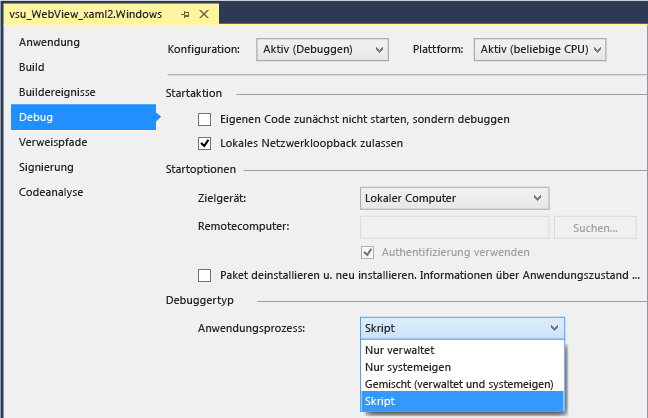
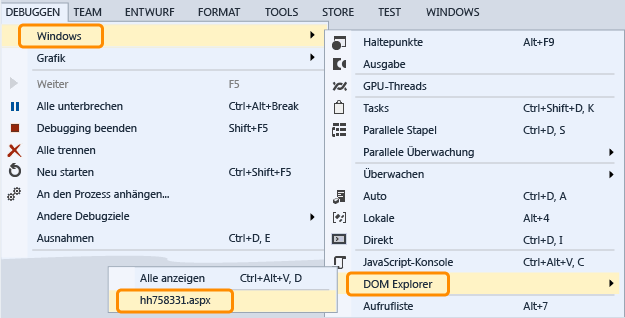

# Debuggen eines WebView-Steuerelements in einer uwp-App
  
 Um `WebView`-Steuerelemente in einer Windows-Runtime-App zu überprüfen und zu debuggen, können Sie Visual Studio so konfigurieren, dass es den Skriptdebugger anfügt, wenn Sie Ihre App starten. Haben Sie zwei Möglichkeiten für die Interaktion mit `WebView` steuert die Verwendung des Debuggers:  
  
-   Öffnen der [DOM Explorer](../debugger/quickstart-debug-html-and-css.md) für eine `WebView` Instanz, und prüfen Sie DOM-Elemente, untersuchen Sie CSS-formatvorlagenprobleme und Testen Sie dynamisch gerenderte Änderungen an Formatvorlagen.  
  
-   Wählen Sie die Webseite oder `iFrame` angezeigt, der `WebView` Instanz als Ziel in der [JavaScript-Konsole](../debugger/javascript-console-commands.md) Fenster und interagieren Sie dann über Konsolenbefehle mit der Webseite. Die Konsole bietet Zugriff auf den aktuellen Skriptausführungskontext.  
  
### Anfügen des Debuggers (C#, Visual Basic, C++)  
  
1.  In Visual Studio: Fügen Sie ein `WebView`-Steuerelement an Ihre Windows-Runtime-App an.  
  
2.  Öffnen Sie im Projektmappen-Explorer die Eigenschaften für das Projekt durch Auswahl **Eigenschaften** aus dem Kontextmenü für das Projekt.  
  
3.  Wählen Sie **Debuggen**. In der **Anwendungsprozess** wählen **Skript**.  
  
       
  
4.  (Optional) Für nicht-Express-Versionen von Visual Studio, deaktivieren Sie Just-in-Time (JIT) Debuggen, indem Sie auswählen **Extras > Optionen > Debugging > Just-in-Time**, und klicken Sie dann deaktivieren von JIT-Debuggen für Skript.  
  
    > [!NOTE]
    >  Indem Sie das JIT-Debuggen deaktivieren, können Sie Dialogfelder für unbehandelte Ausnahmen ausblenden, die auf einigen Webseiten auftreten. In Visual Studio Express ist das JIT-Debuggen stets deaktiviert.  
  
5.  Drücken Sie die Taste F5, um mit dem Debuggen zu beginnen.  
  
### Verwenden des DOM Explorers, um ein WebView-Steuerelement zu untersuchen und zu debuggen  
  
1.  (C#, Visual Basic, C++) Fügen Sie den Skriptdebugger an Ihre App an. Die Anleitung dazu finden Sie im ersten Abschnitt.  
  
2.  Fügen Sie ein `WebView`-Steuerelement an Ihre App an, wenn Sie dies noch nicht getan haben, und drücken Sie F5, um mit dem Debuggen zu beginnen.  
  
3.  Navigieren Sie zu der Seite, die die `Webview`-Steuerelemente enthält.  
  
4.  Öffnen Sie das DOM Explorer-Fenster für die `WebView` Steuerelement durch Auswahl **Debuggen**, **Windows**, **DOM Explorer**, und wählen Sie dann die URL des der `WebView` , die Sie überprüfen möchten.  
  
       
  
     Der mit dem `WebView` verknüpfte DOM Explorer erscheint als neue Registerkarte in Visual Studio.  
  
5.  Anzeigen und Ändern von live-DOM-Elemente und CSS-Formatvorlagen, wie in beschrieben [Debuggen von CSS-Stilen mithilfe von DOM Explorer](../debugger/debug-css-styles-using-dom-explorer.md).  
  
### Verwenden des JavaScript-Konsolenfensters, um ein WebView-Steuerelement zu untersuchen und zu debuggen  
  
1.  (C#, Visual Basic, C++) Fügen Sie den Skriptdebugger an Ihre App an. Die Anleitung dazu finden Sie im ersten Abschnitt.  
  
2.  Fügen Sie ein `WebView`-Steuerelement an Ihre App an, wenn Sie dies noch nicht getan haben, und drücken Sie F5, um mit dem Debuggen zu beginnen.  
  
3.  Öffnen Sie im JavaScript-Konsolenfenster für das `WebView` Steuerelement durch Auswahl **Debuggen**, **Windows**, **JavaScript-Konsole**.  
  
     Das JavaScript-Konsolenfenster wird angezeigt.  
  
4.  Navigieren Sie zu der Seite, die die `Webview`-Steuerelemente enthält.  
  
5.  Wählen Sie im Konsolenfenster die Webseite oder einen `iFrame` angezeigt, indem die `WebView` steuern, der **Ziel** Liste.  
  
       
  
    > [!NOTE]
    >  Mithilfe der Konsole können Sie jeweils mit einem einzelnen `WebView`, `iFrame`, Freigabe-Vertrag oder Web-Worker interagieren. Jedes Element erfordert eine separate Instanz des Webplattform-Hosts (WWAHost.exe). Sie können jeweils mit einem Host interagieren.  
  
6.  Anzeigen und Ändern von Variablen in Ihrer app aus, oder verwenden Sie Konsolenbefehle, wie in beschrieben [Schnellstart: Debuggen von JavaScript](../debugger/quickstart-debug-javascript-using-the-console.md) und [JavaScript-Konsolenbefehle](../debugger/javascript-console-commands.md).  
  
## Siehe auch  
 [Schnellstart: Debuggen von HTML und CSS](../debugger/quickstart-debug-html-and-css.md)