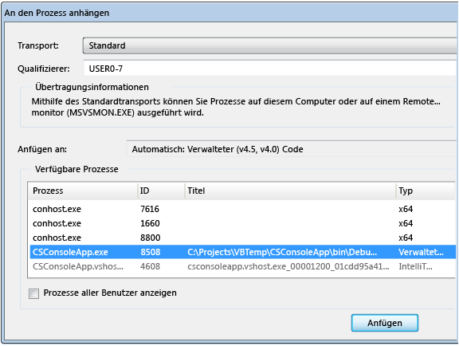
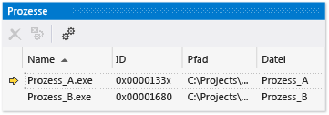

# Debuggen mehrerer Prozesse
Hier wird erklärt, wie Starten von debuggingprozessen, wechseln zwischen Prozessen, unterbrechen und Fortsetzen der Ausführung, schrittweises Ausführen des Quellcodes, Anhalten des Debuggings sowie und beenden und Abtrennen von Prozessen.  
  
##   Konfigurieren des ausführungsverhaltens mehrerer Prozesse  
 Wenn standardmäßig mehrere Prozesse im Debugger ausgeführt werden, wirken sich die Befehle für Unterbrechen, Durchlaufen und Beenden des Debuggers normalerweise auf alle Prozesse aus. Wenn beispielsweise ein Prozess an einem Haltepunkt angehalten wird, wird die Ausführung aller anderen Prozesse auch angehalten. Sie können dieses Standardverhalten ändern, um mehr Kontrolle über die Ziele von Ausführungsbefehlen zu erhalten.  
  
1.  Klicken Sie auf **Debuggen > Optionen und Einstellungen**.  
  
2.  Auf der **Debuggen**, **allgemeine** Seite löschen der **alle Prozesse anhalten, wenn ein Prozess anhält** Kontrollkästchen.  
  
  [Inhalt](#BKMK_Contents)  
  
##   Suchen der Quell- und Symboldateien (PDB-Dateien)  
 Um zum Quellcode eines Prozesses zu navigieren, muss der Debugger Zugriff auf die Quell- und Symboldateien des Prozesses haben. Finden Sie unter [angeben von Symbol(PDB)- und Quelldateien](../debugger/specify-symbol-dot-pdb-and-source-files-in-the-visual-studio-debugger.md).  
  
 Wenn Sie die Dateien für einen Prozess zugreifen können, können Sie mithilfe des Fensters Disassembly navigieren. Finden Sie unter [Vorgehensweise: Verwenden des Fensters Disassembly](../debugger/how-to-use-the-disassembly-window.md)  
  
  [Inhalt](#BKMK_Contents)  
  
##   Starten von mehreren Prozessen in einer VS-Projektmappe, Anfügen an einen Prozess, automatisches Starten eines Prozesses im debugger  
  
-   [Starten Sie das Debuggen von mehreren Prozessen in Visual Studio-Projektmappe](#BKMK_Start_debugging_multiple_processes_in_a_Visual_Studio_solution)  
  
-   [Ändern des Startprojekts](#BKMK_Change_the_startup_project)  
  
-   [Starten eines bestimmten Projekts in einer Projektmappe](#BKMK_Start_a_specific_project_in_a_solution)  
  
-   [Starten Sie mehrere Projekte in einer Projektmappe](#BKMK_Start_multiple_projects_in_a_solution)  
  
-   [Fügen an einen Prozess an](#BKMK_Attach_to_a_process)  
  
-   [Automatisches Starten eines Prozesses im debugger](#BKMK_Automatically_start_an_process_in_the_debugger)  
  
> [!NOTE]
>  Auch wenn sich das untergeordnete Projekt in derselben Projektmappe befindet, wird der Debugger nicht automatisch an einen untergeordneten Prozess angefügt, der durch einen debuggten Prozess gestartet wird. So debuggen Sie einen untergeordneten Prozess  
>   
>  -   Fügen Sie den Debugger an den untergeordneten Prozess an, nachdem dieser gestartet wurde.  
>   
>      - oder -   
> -   Konfigurieren Sie Windows so, dass der untergeordnete Prozess in einer neuen Instanz des Debuggers automatisch gestartet wird.  
  
###   Starten Sie das Debuggen von mehreren Prozessen in Visual Studio-Projektmappe  
 Wenn Sie mehr als ein Projekt in einer Visual Studio-Projektmappe haben, die unabhängig ausgeführt werden kann (Projekte, die in separaten Prozessen ausgeführt werden), können Sie auswählen, welche Projekte vom Debugger gestartet werden.  
  
   
  
####   Ändern des Startprojekts  
 Um das Startprojekt für eine Projektmappe zu ändern, wählen Sie das Projekt im Projektmappen-Explorer, und wählen Sie dann **als Startprojekt festlegen** aus dem Kontextmenü.  
  
####   Starten eines bestimmten Projekts in einer Projektmappe  
 Um ein Projekt für eine Projektmappe ohne Ändern des standardstartprojekts zu starten, wählen Sie das Projekt im Projektmappen-Explorer, und wählen Sie dann **Debuggen** aus dem Kontextmenü. Sie können dann wählen **neue Instanz starten** oder **in neue Instanz springen**.  
  
  [Starten von mehreren Prozessen in einer VS-Projektmappe, Anfügen an einen Prozess, automatisches Starten eines Prozesses im Debugger](../debugger/debug-multiple-processes.md#BKMK_Start_multiple_processes_in_a_VS_solution__attach_to_a_process__automatically_start_a_process_in_the_debugger)  
  
  [Inhalt](#BKMK_Contents)  
  
####   Starten Sie mehrere Projekte in einer Projektmappe  
  
1.  Wählen Sie die Projektmappe im Projektmappen-Explorer, und wählen Sie dann **Eigenschaften** in dem eingeblendeten Kontextmenü.  
  
2.  Wählen Sie **allgemeine Eigenschaften**, **Startprojekt** auf die **Eigenschaften** (Dialogfeld).  
  
3.  Für jedes Projekt, das Sie ändern möchten, wählen Sie entweder **starten**, **Starten ohne Debuggen**, oder **keine**.  
  
  [Starten von mehreren Prozessen in einer VS-Projektmappe, Anfügen an einen Prozess, automatisches Starten eines Prozesses im Debugger](../debugger/debug-multiple-processes.md#BKMK_Start_multiple_processes_in_a_VS_solution__attach_to_a_process__automatically_start_a_process_in_the_debugger)  
  
  [Inhalt](#BKMK_Contents)  
  
###   Fügen an einen Prozess an  
 Der Debugger kann auch mit *Anfügen* auf Programme, die in Prozessen außerhalb von Visual Studio ausgeführt werden, einschließlich Programme, die auf einem Remotegerät ausgeführt werden. Nachdem Sie den Debugger an ein Programm angefügt haben, können Sie dessen Ausführungsbefehle verwenden, den Programmzustand überprüfen usw. Die Möglichkeiten zum Überprüfen des Programms sind ggf. eingeschränkt. Dies hängt davon ab, ob das Programm mit Debuginformationen erstellt wurde, ob Sie Zugriff auf den Quellcode des Programms haben und ob der JIT-Compiler der Common Language Runtime die Debuginformationen verfolgt.  
  
 Finden Sie unter [Anfügen an ausgeführte Prozesse](../debugger/attach-to-running-processes-with-the-visual-studio-debugger.md) für Weitere Informationen.  
  
 **Fügen Sie an einen Prozess, der auf dem lokalen Computer ausgeführt wird an**  
  
 Klicken Sie auf **Debuggen > an den Prozess anhängen**. Auf der **an den Prozess anhängen** Dialogfeld Feld, wählen Sie den Prozess der **verfügbare Prozesse** aus, und wählen Sie dann **Anfügen**.  
  
   
  
  [Inhalt](#BKMK_Contents)  
  
###   Automatisches Starten eines Prozesses im debugger  
 In bestimmten Fällen müssen Sie möglicherweise den Startcode für ein Programm debuggen, das von einem anderen Prozess gestartet wird. Zu den Beispielen hierfür gehören Dienste und benutzerdefinierte Setupaktionen. Für diese Szenarios können Sie festlegen, dass der Debugger beim Starten der Anwendung gestartet und automatisch an die Anwendung angefügt wird.  
  
1.  Starten Sie den Registrierungs-Editor (**regedit.exe**).  
  
2.  Navigieren Sie zu der **HKEY_LOCAL_MACHINE\Software\Microsoft\Windows NT\CurrentVersion\Image File Execution Options** Ordner.  
  
3.  Wählen Sie den Ordner der Anwendung aus, die Sie im Debugger starten möchten.  
  
     Wenn der Name der app nicht als untergeordneter Ordner aufgeführt wird, wählen Sie **Image File Execution Options** und wählen Sie dann **neu**, **Schlüssel** in dem eingeblendeten Kontextmenü. Wählen Sie den neuen Schlüssel aus, wählen Sie **umbenennen** im Kontextmenü, und geben Sie dann den Namen der app.  
  
4.  Wählen Sie im Kontextmenü des Anwendungsordners **neu**, **Zeichenfolgenwert**.  
  
5.  Ändern Sie den Namen des neuen Werts aus **neuer Wert** auf `debugger`.  
  
6.  Wählen Sie im Kontextmenü des debuggereintrags **ändern**.  
  
7.  Geben Sie im Dialogfeld Zeichenfolge bearbeiten `vsjitdebugger.exe` in der **Wertdaten** Feld.  
  
       
  
   
  
  [Inhalt](#BKMK_Contents)  
  
##   Wechseln zwischen Sie Prozessen, unterbrechen Sie und fortsetzen Sie der Ausführung, schrittweises Ausführen des Quellcodes  
  
-   [Zwischen Prozessen wechseln](#BKMK_Switch_between_processes)  
  
-   [Unterbrechen, durchlaufen und Fortsetzen von Befehlen](#BKMK_Break__step__and_continue_commands)  
  
###   Zwischen Prozessen wechseln  
 Sie können beim Debuggen mit mehreren Prozessen verbunden sein, es ist jedoch jeweils nur ein Prozess im Debugger aktiv. Sie können festlegen, dass die aktive oder *aktuelle* verarbeiten, in der Symbolleiste Debugspeicherort oder in der **Prozesse** Fenster. Um zwischen den Prozessen zu wechseln, müssen sich beide Prozesse im Unterbrechungsmodus befinden.  
  
 **Zum Festlegen des aktuellen Prozesses**  
  
-   Wählen Sie auf der Symbolleiste Debugspeicherort **Prozess** zum Anzeigen der **Prozess** Listenfeld. Wählen Sie den Prozess aus, den Sie als aktuellen Prozess festlegen möchten.  
  
       
  
     Wenn die **Debugspeicherort** Symbolleiste nicht sichtbar ist, wählen Sie **Tools**, **anpassen**. Auf der **Symbolleisten** Registerkarte **Debugspeicherort**.  
  
-   Öffnen der **Prozesse** Fenster (Kontextmenü **Strg + Alt + Z**), suchen Sie den Prozess, die Sie als aktuellen Prozess festlegen möchten, und doppelklicken Sie darauf.  
  
       
  
     Der aktuelle Prozess ist durch einen gelben Pfeil gekennzeichnet.  
  
 Wenn Sie zu einem Projekt wechseln, wird dieses als aktueller Prozess zum Debuggen festgelegt. In den angezeigten Debuggerfenstern ist der Zustand für den aktuellen Prozess angegeben, und alle Befehle für die schrittweise Ausführung beeinflussen nur den aktuellen Prozess.  
  
  [Wechseln zwischen Prozessen, unterbrechen und Fortsetzen der Ausführung, schrittweises Ausführen des Quellcodes](../debugger/debug-multiple-processes.md#BKMK_Switch_processes__break_and_continue_execution__step_through_source)  
  
  [Inhalt](#BKMK_Contents)  
  
###   Unterbrechen, durchlaufen und Fortsetzen von Befehlen  
  
> [!NOTE]
>  Standardmäßig beeinflussen die Debuggerbefehle für Unterbrechen, Durchlaufen und Fortsetzen sämtliche Prozesse, die debuggt werden. Um dieses Verhalten zu ändern, finden Sie unter [Konfigurieren des ausführungsverhaltens mehrerer Prozesse](#BKMK_Configure_the_execution_behavior_of_multiple_processes)  
  
||||  
|-|-|-|  
|**Befehl**|**Anhalten Sie alle Prozesse, wenn ein Prozess anhält**   Aktiviert (Standard)|**Anhalten Sie alle Prozesse, wenn ein Prozess anhält**   Gelöscht|  
|**Debuggen** Menü:   -   **Alle unterbrechen**|Alle Prozesse werden unterbrochen.|Alle Prozesse werden unterbrochen.|  
|**Debuggen** Menü:   -   **Fortsetzen**|Alle Prozesse werden fortgesetzt.|Alle angehaltenen Prozesse werden fortgesetzt.|  
|**Debuggen** Menü:   -   **Einzelschritt** -   **Prozedurschritt** -   **Ausführen bis Rücksprung**|Alle Prozesse werden während der aktuellen Prozessschritte ausgeführt.   Anschließend werden alle Prozesse unterbrochen.|Aktuelle Prozessschritte.   Angehaltene Prozesse werden fortgesetzt.   Ausgeführte Prozesse werden fortgesetzt.|  
|**Debuggen** Menü:   -   **Einzelschritt in aktuellem Prozess** -   **Prozedurschritt in aktuellem Prozess** -   **Ausführen bis Rücksprung aktuellen Prozess**|N/V|Aktuelle Prozessschritte.   Andere Prozesse behalten ihren vorhandenen Zustand bei (angehaltener Zustand oder Ausführzustand).|  
|Quellcodefenster   -   **Haltepunkt**|Alle Prozesse werden unterbrochen.|Nur der Prozess im Quellcodefenster wird unterbrochen.|  
|Kontextmenü des Quellcodefensters:   -   **Führen bis Cursor aus**   Das Quellcodefenster muss sich im aktuellen Prozess befinden.|Alle Prozesse werden ausgeführt, während der Prozess im Quellcodefenster bis zum Cursor ausgeführt und dann unterbrochen wird.   Anschließend werden alle anderen Prozesse unterbrochen.|Der Prozess im Quellcodefenster wird bis zum Cursor ausgeführt.   Andere Prozesse behalten ihren vorhandenen Zustand bei (angehaltener Zustand oder Ausführzustand).|  
|**Prozesse** Kontextmenü des Fensters:   -   **Prozess anhalten**|N/V|Der ausgewählte Prozess wird angehalten.   Andere Prozesse behalten ihren vorhandenen Zustand bei (angehaltener Zustand oder Ausführzustand).|  
|**Prozesse** Kontextmenü des Fensters:   -   **Prozess fortsetzen**|N/V|Der ausgewählte Prozess wird fortgesetzt.   Andere Prozesse behalten ihren vorhandenen Zustand bei (angehaltener Zustand oder Ausführzustand).|  
  
  [Wechseln zwischen Prozessen, unterbrechen und Fortsetzen der Ausführung, schrittweises Ausführen des Quellcodes](../debugger/debug-multiple-processes.md#BKMK_Switch_processes__break_and_continue_execution__step_through_source)  
  
  [Inhalt](#BKMK_Contents)  
  
##   Anhalten des Debuggings, beenden und Abtrennen von Prozessen  
  
-   [Anhalten, beenden und Abtrennen von Befehlen](#BKMK_Stop__terminate__and_detach_commands)  
  
 Standardmäßig wird bei der Auswahl **Debuggen**, **Beenden des Debuggens** , wenn mehrere Prozesse im Debugger geöffnet sind, wird der Debugger beendet oder trennt, die von allen Prozessen, je nachdem, wie der Prozess, in geöffnet wurde der Debugger:  
  
-   Wenn der aktuelle Prozess im Debugger gestartet wurde, wird dieser Prozess beendet.  
  
-   Wenn der Debugger an den aktuellen Prozess angefügt wurde, wird er vom Prozess getrennt. Der Prozess wird weiterhin ausgeführt.  
  
 Beispielsweise, wenn Sie einen Prozess aus Visual Studio-Projektmappe debuggen, Anfügen an einen anderen Prozess, der bereits ausgeführt wird, und wählen Sie dann **Beenden des Debuggens**, wird die Debugsitzung beendet den Prozess, der in Visual Studio gestartet wurde wird beendet, während der Prozess, den von Ihnen angefügten ununterbrochen wird ausgeführt. Sie können die folgenden Schritte ausführen, um die Methode zum Beenden des Debuggings festzulegen.  
  
> [!NOTE]
>  Die **alle Prozesse anhalten, wenn ein Prozess anhält** Option wirkt sich nicht darauf aus, beenden, Debuggen oder zu beenden und Abtrennen von Prozessen.  
  
 **So ändern, wie das Debuggen beenden einen einzelnen Prozess beeinflusst**  
  
-   Öffnen der **Prozesse** Fenster (Kontextmenü **Strg + Alt + Z**). Wählen Sie einen Prozess, und aktivieren bzw. Deaktivieren der **nach Beenden des Debuggens trennen** Kontrollkästchen.  
  
###   Anhalten, beenden und Abtrennen von Befehlen  
  
|||  
|-|-|  
|**Befehl**|**Beschreibung**|  
|**Debuggen** Menü:   -   **Beenden des Debuggens**|Wenn das Verhalten von geändert wurde **Prozesse** Fenster **nach Beenden des Debuggings trennen** Option:   1.  Die vom Debugger gestarteten Prozesse werden beendet. 2.  Angefügte Prozesse werden vom Debugger getrennt.|  
|**Debuggen** Menü:   -   **Alle beenden**|Alle Prozesse werden beendet.|  
|**Debuggen** Menü:   -   **Alle trennen**|Der Debugger wird von allen Prozessen getrennt.|  
|**Prozesse** Kontextmenü des Fensters:   -   **Trennen eines Prozesses**|Der Debugger wird vom ausgewählten Prozess getrennt.   Andere Prozesse behalten ihren vorhandenen Zustand bei (angehaltener Zustand oder Ausführzustand).|  
|**Prozesse** Kontextmenü des Fensters:   -   **Prozess beenden**|Der ausgewählte Prozess wird beendet.   Andere Prozesse behalten ihren vorhandenen Zustand bei (angehaltener Zustand oder Ausführzustand).|  
|**Prozesse** Kontextmenü des Fensters:   -   **Nach Beenden des Debuggings trennen**|Wechselt zwischen dem Verhalten von **Debuggen**, **Beenden des Debuggens** für den ausgewählten Prozess:   -Überprüft: Der Debugger vom Prozess getrennt werden. -Deaktiviert: Der Prozess wird beendet.|  
  
  [Anhalten des Debuggings, beenden und Abtrennen von Prozessen](../debugger/debug-multiple-processes.md#BKMK_Stop_debugging__terminate_or_detach_from_processes)  
  
  [Inhalt](#BKMK_Contents)  
  
## Siehe auch  
 [Angeben von Symbol(PDB)- und Quelldateien](../debugger/specify-symbol-dot-pdb-and-source-files-in-the-visual-studio-debugger.md)   
 [Fügen an laufende Prozesse an](../debugger/attach-to-running-processes-with-the-visual-studio-debugger.md)   
 [Navigieren im Code mit dem Debugger](../debugger/navigating-through-code-with-the-debugger.md)   
 [Just-in-Time-Debuggen](../debugger/just-in-time-debugging-in-visual-studio.md)   
 [Debuggen von Multithreadanwendungen](../debugger/debug-multithreaded-applications-in-visual-studio.md)