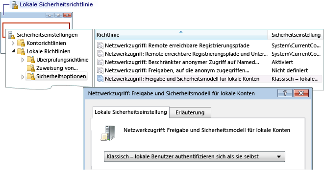

# Error: Workgroup Remote Logon Failure
This error reads:  
  
 Logon failure: unknown user name or bad password  
  
 **Cause**  
  
 This error can occur when you are debugging from a machine on a workgroup and you try to connect to remote machine. Possible causes include:  
  
-   There is no account with the matching name and password on the remote machine.  
  
-   If both the Visual Studio computer and the remote machine are on workgroups, this error may occur due to the default **Local Security Policy** setting on the remote machine. The default setting for the **Local Security Policy** setting is **Guest only - local users authenticate as Guest**. To debug on this setup, you must change the setting on the remote machine to **Classic - local users authenticate as themselves**.  
  
> [!NOTE]
>  You must be an administrator to carry out the following tasks.  
  
### To open the Local Security Policy window  
  
1.  Start the **secpol.msc** Microsoft Management Console snap-in. Type secpol.msc in Windows search, the Windows Run box, or at a command prompt.  
  
### To add user rights assignments  
  
1.  Open the **Local Security Policy** window.  
  
2.  Expand the **Local Policies** folder.  
  
3.  Click **User Rights Assignment**.  
  
4.  In the **Policy** column, double-click **Debug programs** to view current local group policy assignments in the **Local Security Policy Setting** dialog box.  
  
       
  
5.  To add new users, click the **Add User or Group** button.  
  
### To change the Sharing and Security Model  
  
1.  Open the **Local Security Policy** window.  
  
2.  Expand the **Local Policies** folder.  
  
3.  Click **Security Options**.  
  
4.  In the **Policy** column, double-click **Network access: Sharing and security model for local accounts**.  
  
5.  In the **Network access: Sharing and security model for local accounts** dialog box, change the value to **Classic - local users authenticate as themselves** and click the **Apply** button.  
  
       
  
## See Also  
 [Remote Debugging Errors and Troubleshooting](../debugger/remote-debugging-errors-and-troubleshooting.md)   
 [Remote Debugging](../debugger/remote-debugging.md)
