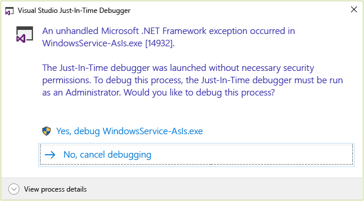

# <a name="how-to-debug-the-onstart-method"></a>Gewusst wie: Debuggen der OnStart-Methode
Sie können einen Windows-Dienst debuggen, indem Sie den Dienst starten und den Debugger an den Dienstprozess anfügen. Weitere Informationen finden Sie unter [How to: Debug Windows Service Applications](/dotnet/framework/windows-services/how-to-debug-windows-service-applications). Zum Debuggen der <xref:System.ServiceProcess.ServiceBase.OnStart%2A?displayProperty=fullName> -Methode eines Windows-Diensts müssen Sie den Debugger allerdings aus der Methode starten.  
  
1.  Fügen Sie am Anfang der <xref:System.Diagnostics.Debugger.Launch%2A> -Methode einen Aufruf von `OnStart()`hinzu.  
  
    ```csharp  
    protected override void OnStart(string[] args)  
    {  
        System.Diagnostics.Debugger.Launch();  
     }  
    ```  
  
2.  Starten Sie den Dienst (dazu können Sie `net start`oder das Fenster **Dienste** verwenden).  
  
     Ein Dialogfeld ähnlich dem folgenden sollte angezeigt werden:  
  
       
  
3.  Wählen Sie **Ja, Debuggen \<Dienstname >.**  
  
4.  Wählen Sie im Fenster des Just-In-Time-Debuggers die Version von Visual Studio aus, die Sie zum Debuggen verwenden möchten.  
  
       
  
5.  Eine neue Instanz von Visual Studio wird gestartet, und die Ausführung wird beim Erreichen der `Debugger.Launch()` -Methode beendet.  
  
## <a name="see-also"></a>Siehe auch  
 [Debuggersicherheit](../debugger/debugger-security.md)   
 [Debuggen von verwaltetem Code](../debugger/debugging-managed-code.md)