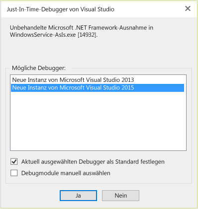

# Gewusst wie: Debuggen der OnStart-Methode
[!INCLUDE[vs2017banner](../code-quality/includes/vs2017banner.md)]

Sie können einen Windows\-Dienst debuggen, indem Sie den Dienst starten und den Debugger an den Dienstprozess anfügen. Weitere Informationen finden Sie unter [How to: Debug Windows Service Applications](../Topic/How%20to:%20Debug%20Windows%20Service%20Applications.md). Zum Debuggen der <xref:System.ServiceProcess.ServiceBase.OnStart%2A?displayProperty=fullName>\-Methode eines Windows\-Diensts müssen Sie den Debugger allerdings aus der Methode starten.  
  
1.  Fügen Sie am Anfang der `OnStart()`\-Methode einen Aufruf von <xref:System.Diagnostics.Debugger.Launch%2A> hinzu.  
  
    ```c#  
    protected override void OnStart(string[] args)  
    {  
        System.Diagnostics.Debugger.Launch();  
     }  
    ```  
  
2.  Starten Sie den Dienst \(dazu können Sie `net start` oder das Fenster **Dienste** verwenden\).  
  
     Ein Dialogfeld ähnlich dem folgenden sollte angezeigt werden:  
  
       
  
3.  Wählen Sie **Ja, \<Dienstname\> debuggen** aus.  
  
4.  Wählen Sie im Fenster des Just\-In\-Time\-Debuggers die Version von Visual Studio aus, die Sie zum Debuggen verwenden möchten.  
  
       
  
5.  Eine neue Instanz von Visual Studio wird gestartet, und die Ausführung wird beim Erreichen der `Debugger.Launch()`\-Methode beendet.  
  
## Siehe auch  
 [Debuggersicherheit](../debugger/debugger-security.md)   
 [Debuggen von verwaltetem Code](../debugger/debugging-managed-code.md)