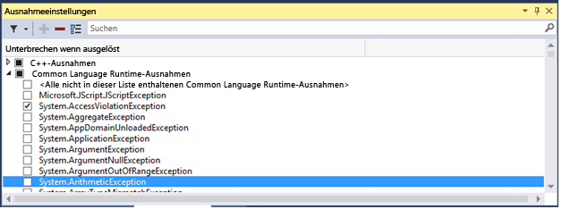
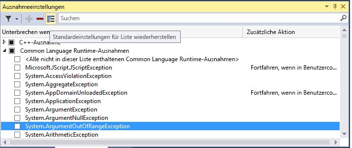
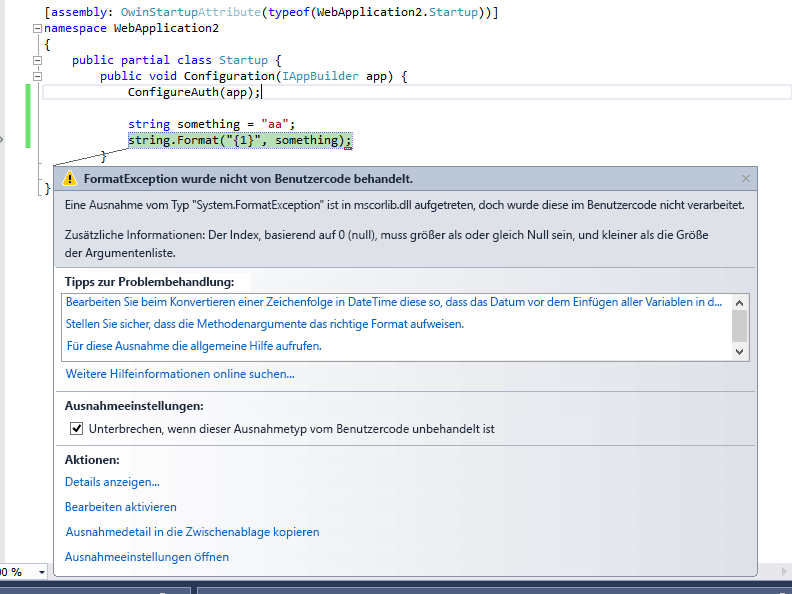
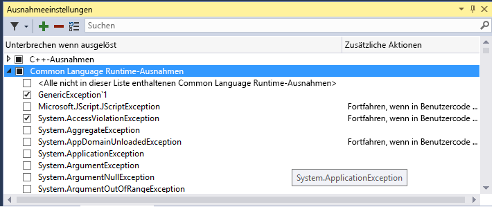

# <a name="manage-exceptions-with-the-debugger-in-visual-studio"></a>Verwalten von Ausnahmen mit dem Debugger in Visual Studio

Eine Ausnahme ist ein Hinweis auf einen Fehlerstatus, der auftritt, während ein Programm ausgeführt wird. Sie können dem Debugger feststellen, welche Ausnahmen (oder Sätze von Ausnahmen) auf unterbrechen und an welchem Punkt die Unterbrechung des Debuggers sollen (wenn der Debugger unterbrochen wird, hier erfahren Sie, in dem die Ausnahme ausgelöst wurde). Sie können auch hinzufügen oder Löschen von Ausnahmen. Verwenden Sie eine Projektmappe in Visual Studio geöffnet ist, **Debuggen > Windows > Ausnahmeeinstellungen** So öffnen die **Ausnahmeeinstellungen** Fenster. 

Können und sollten Handler, die auf die wichtigsten Ausnahmen reagieren bereitstellen, aber es ist wichtig zu wissen, wie den Debugger zur Ausführung für einige Ausnahmen zu unterbrechen, immer zu konfigurieren.
  
Wenn eine Ausnahme ausgelöst wird, schreibt der Debugger eine Ausnahmemeldung an das Fenster „Ausgabe“. In den folgenden Fällen kann er die Ausführung unterbrechen:  
  
-   Wenn eine Ausnahme ausgelöst und nicht behandelt wird.  
  
-   Wenn der Debugger konfiguriert ist, um die Ausführung zu unterbrechen, bevor ein Handler aufgerufen wird.  
  
-   Wenn Sie festgelegt haben [nur mein Code](../debugger/just-my-code.md), und der Debugger wird so konfiguriert, dass um bei jeder Ausnahme zu unterbrechen, die nicht im Benutzercode behandelt wird.  
  
> [!NOTE]
>  ASP.NET verfügt über einen Ausnahmehandler der obersten Ebene, der Fehlerseiten in einem Browser anzeigt. Die Ausführung wird nicht unterbrochen, es sei denn, **Nur eigenen Code** ist aktiviert. Ein Beispiel finden Sie weiter unten unter [Setting the debugger to continue on user-unhandled exceptions](../debugger/managing-exceptions-with-the-debugger.md#BKMK_UserUnhandled) .  
  
> [!NOTE]
>  In einem Visual Basic-Anwendung verwaltet der Debugger alle Fehler als Ausnahmen behandelt, auch wenn Sie Fehlerhandler des Error-Format verwenden.    
  
## <a name="tell-the-debugger-to-break-when-an-exception-is-thrown"></a>Der Debugger die Ausführung zu unterbrechen, wenn eine Ausnahme ausgelöst wird  
Der Debugger kann die Ausführung beim Auftreten einer Ausnahme sofort unterbrechen. Dadurch haben Sie die Möglichkeit, die Ausnahme zu untersuchen, bevor ein Handler aufgerufen wird.  
  
In der **Ausnahmeeinstellungen** Fenster (**Debuggen > Windows > Ausnahmeeinstellungen**), erweitern Sie den Knoten für eine Kategorie von Ausnahmen (z. B. **Common Language Runtime-Ausnahmen**, d. h. .NET-Ausnahmen), und wählen Sie das Kontrollkästchen für eine bestimmte Ausnahme innerhalb dieser Kategorie (z. B. **System.AccessViolationException**). Sie können auch eine ganze Kategorie von Ausnahmen auswählen.  
  
  

> [!TIP]
> Nach spezifischen Ausnahmen können Sie mithilfe des Fensters **Suche** in der Symbolleiste **Ausnahmeeinstellungen** suchen. Sie können die Suchergebnisse auch nach bestimmten Namespaces filtern (z. B. **System.IO**).
  
Bei Auswahl eine Ausnahme in der **Ausnahmeeinstellungen** Fenster, wo die Ausnahme ausgelöst wird, unabhängig davon, ob sie verarbeitet oder nicht behandelt wird, wird Debugger die Ausführung unterbrochen. An dieser Stelle wird die Ausnahme als „erste Chance“ bezeichnet. Im Folgenden einige Szenarios:  
  
*  In der folgenden C#-Konsolenanwendung löst die Main-Methode eine **AccessViolationException** in einem `try/catch` -Blocks aus:  
  
    ```CSharp  
    static void Main(string[] args)  
    {  
        try  
        {  
            throw new AccessViolationException();  
            Console.WriteLine("here");  
        }  
        catch (Exception e)  
        {  
            Console.WriteLine("caught exception");  
        }  
        Console.WriteLine("goodbye");  
    }  
    ```  
  
     Wenn Sie **AccessViolationException** in den **Ausnahmeeinstellungen**aktiviert haben, wird die Ausführung an der `throw` -Zeile unterbrochen, wenn Sie diesen Code im Debugger ausführen. Danach können Sie die Ausführung fortsetzen. In der Konsole sollten beide Zeilen angezeigt werden:  
  
    ```  
    caught exception  
    goodbye  
    ```  
  
     Die `here` -Zeile wird jedoch nicht angezeigt.  
  
*  Eine C#-Konsolenanwendung verweist auf eine Klassenbibliothek mit einer Klasse mit zwei Methoden, eine Methode, die eine Ausnahme auslöst und diese verarbeitet, und eine zweite Methode, die die gleiche Ausnahme auslöst, aber nicht behandelt:  
  
    ```csharp 
    public class Class1  
    {  
        public void ThrowHandledException()  
        {  
            try  
            {  
                throw new AccessViolationException();  
            }  
            catch (AccessViolationException ave)  
            {  
                Console.WriteLine("caught exception" + ave.Message);  
            }  
        }  
  
        public void ThrowUnhandledException()  
        {  
            throw new AccessViolationException();  
        }  
    }  
    ```  
  
     Dies ist die Hauptmethode der Konsolenanwendung ein:  
  
    ```CSharp  
    static void Main(string[] args)  
    {  
        Class1 class1 = new Class1();  
        class1.ThrowHandledException();  
        class1.ThrowUnhandledException();  
    }  
    ```  
  
     Wenn Sie **AccessViolationException** in den **Ausnahmeeinstellungen**aktiviert haben, wird die Ausführung an der `throw` -Zeile sowohl in **ThrowHandledException()** als auch in **ThrowUnhandledException()**klicken.  
  
 Wenn Sie die Ausnahmeeinstellungen auf die Standardwerte zurücksetzen möchten, klicken Sie in der Symbolleiste auf die Schaltfläche **Wiederherstellen** :  
  
   
  
##  <a name="BKMK_UserUnhandled"></a>Entsprechende Konfiguration des Debuggers zum Fortfahren bei Ausnahmen vom Benutzercode unbehandelt  
 Wenn Sie .NET- oder JavaScript-Code mit [Just My Code](../debugger/just-my-code.md)debuggen, können Sie den Debugger so einstellen, dass er bei Ausnahmen, die an anderer Stelle als im Benutzercode behandelt werden, die Ausführung nicht unterbricht.  
  
1.  Öffnen Sie im Fenster **Ausnahmeeinstellungen** das Kontextmenü, indem Sie mit der rechten Maustaste auf „Fenster“ klicken und dann **Spalten anzeigen**auswählen. (Wenn Sie **Nur eigenen Code**deaktiviert haben, wird dieser Befehl nicht angezeigt.)  
  
2.  Daraufhin sollte eine zweite Spalte mit dem Namen **Zusätzliche Aktionen**angezeigt werden. Diese Spalte zeigt für bestimmte Ausnahmen die Einstellung **Fortsetzen, wenn nicht vom Benutzercode behandelt** , was bedeutet, dass der Debugger die Ausführung nicht unterbricht, wenn diese Ausnahme nicht vom Benutzercode, sondern von externem Code behandelt wird.  
  
3.  Sie können diese Einstellung für eine bestimmte Ausnahme ändern: Wählen Sie die Ausnahme aus, klicken Sie mit der rechten Maustaste und aktivieren/deaktivieren Sie **Fortsetzen, wenn nicht vom Benutzercode behandelt**. Sie können die Einstellung auch für eine ganze Kategorie von Ausnahmen ändern, z. B. für alle Common Language Runtime-Ausnahmen.  
  
 Beispielsweise behandeln ASP.NET-Webanwendungen Ausnahmen dadurch, dass sie diese in einen HTTP 500-Statuscode konvertieren ([Exception Handling in ASP.NET API](http://www.asp.net/web-api/overview/error-handling/exception-handling)), wodurch es möglicherweise unmöglich wird, die Quelle der Ausnahme zu bestimmen. Im folgenden Beispiel wird durch den Benutzercode `String.Format()` aufgerufen, wodurch eine <xref:System.FormatException>ausgelöst wird. Die Ausführung wird folgendermaßen unterbrochen:  
  
   
  
## <a name="add-and-delete-exceptions"></a>Hinzufügen und Löschen von Ausnahmen  
 Sie können Ausnahmen hinzufügen und löschen. Sie können jeden Typ von Ausnahme aus einer beliebigen Kategorie löschen, indem Sie die Ausnahme auswählen und in der Symbolleiste **Ausnahmeeinstellungen** auf die Schaltfläche **Löschen** (das Minuszeichen) klicken, oder indem Sie die mit der rechten Maustaste auf die Ausnahme klicken und im Kontextmenü **Löschen** auswählen. Das Löschen einer Ausnahme hat dieselbe Wirkung wie das Deaktivieren, d. h., der Debugger wird nicht unterbrochen, wenn die Ausnahme ausgelöst wird.  
  
 Zum Hinzufügen einer Ausnahme: Wählen Sie im Fenster **Ausnahmeeinstellungen** eine der Ausnahmekategorien (z. B. **Common Language Runtime**), und klicken Sie auf die Schaltfläche **Hinzufügen** . Geben Sie den Namen der Ausnahme ein (z. B. **System.UriTemplateMatchException**). Die Ausnahme wird zur Liste hinzugefügt (in alphabetischer Reihenfolge) und wird automatisch geprüft.  
  
 Wenn Sie eine Ausnahme zu den Ausnahmen für den GPU-Speicherzugriff, den JavaScript-Laufzeitausnahmen oder den Win32-Ausnahmekategorien hinzufügen möchten, müssen Sie den Fehlercode und die Beschreibung einfügen.  
  
> [!TIP]
>  Überprüfen Sie die Rechtschreibung! Die **Ausnahmeeinstellungen** Fenster prüft nicht, ob eine hinzugefügte Ausnahme vorhanden ist. Wenn Sie geben also **Sytem.UriTemplateMatchException**, erhalten Sie einen Eintrag für diese Ausnahme (und nicht für **"System.uritemplatematchexception"**).  
  
 Ausnahmeeinstellungen werden in der SUO-Datei der Projektmappe beibehalten, sie gelten also für eine bestimmte Projektmappe. Sie können keine spezifische Ausnahme für andere Projektmappen wiederverwenden. Zu diesem Zeitpunkt werden nur hinzugefügte Ausnahmen beibehalten, gelöschte Ausnahmen nicht. Anders ausgedrückt ist die hinzugefügte Ausnahme weiterhin vorhanden, wenn Sie die Projektmappe schließen und wieder öffnen. Wenn Sie eine Ausnahme dagegen löschen und die Projektmappe anschließend schließen und wieder öffnen, wird die Ausnahme nicht mehr angezeigt.  
  
 Das Fenster **Ausnahmeeinstellungen** unterstützt generische Ausnahmetypen in C#, aber nicht in Visual Basic. Um bei Ausnahmen wie `MyNamespace.GenericException<T>`eine Unterbrechung vorzunehmen, müssen Sie die Ausnahme als **MyNamespace.GenericException`1**hinzufügen. Wenn Sie eine Ausnahme wie die Folgende erstellt haben:  
  
```CSharp  
public class GenericException<T> : Exception  
{  
    public GenericException() : base("This is a generic exception.")  
    {  
    }  
}  
```  
  
 können Sie die Ausnahme folgendermaßen zu den **Ausnahmeeinstellungen** hinzufügen:  
  
   

## <a name="add-conditions-to-an-exception"></a>Hinzufügen von Bedingungen zu einer Ausnahme

Sie können Bedingungen für Ausnahmen in Festlegen der **Ausnahmeeinstellungen** (Dialogfeld). Derzeit unterstützte Bedingungen umfassen die Modul-Namen einschließen oder ausschließen, für die Ausnahme. Wenn Modulnamen als Bedingungen festlegen, Sie können auswählen, für die Ausnahme nur auf bestimmten Codemodule unterbrechen oder können Sie wichtige auf bestimmte Module vermeiden.

> [!NOTE]
> Hinzufügen von Bedingungen auf eine Ausnahme ist neu in[!include[vs_dev15](../misc/includes/vs_dev15_md.md)]

Um bedingte Ausnahmen hinzuzufügen, wählen Sie die **Bedingung bearbeiten** Symbol im Dialogfeld "Ausnahmeeinstellungen" oder mit der rechten Maustaste der Ausnahme, und wählen Sie **Bedingungen bearbeiten**.


  
## <a name="see-also"></a>Siehe auch  
 [Fortfahren mit der Ausführung nach einer Ausnahme](../debugger/continuing-execution-after-an-exception.md)   
 [Vorgehensweise: Untersuchen von Systemcode nach einer Ausnahme](../debugger/how-to-examine-system-code-after-an-exception.md)   
 [Vorgehensweise: Verwenden von systemeigenen Laufzeitfehlerüberprüfungen](../debugger/how-to-use-native-run-time-checks.md)   
 [Zur Laufzeit mithilfe von Laufzeitüberprüfungen ohne die C-Laufzeitbibliothek](../debugger/using-run-time-checks-without-the-c-run-time-library.md)   
 [Debugger – Grundlagen](../debugger/debugger-basics.md)