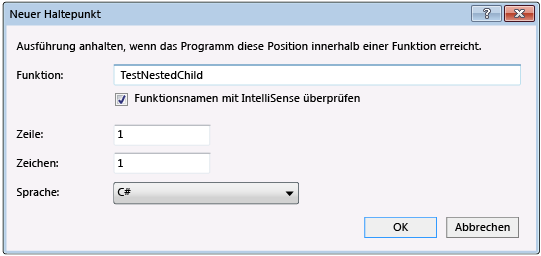
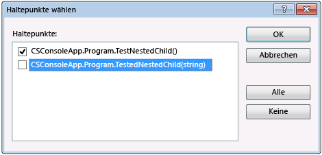

# Navigieren im Code mit dem Debugger
[!INCLUDE[vs2017banner](../code-quality/includes/vs2017banner.md)]

Es gibt viele Möglichkeiten, Code im Debugger zu durchlaufen: Sie können Methoden schrittweise ausführen oder überspringen, die Ausführung bis zu einem Haltepunkt oder einer angegebenen Position veranlassen und angeben, ob das Debuggen auf Ihren eigenen Code beschränkt werden soll oder ob Sie Symbole einfügen möchten, um externen Code zu debuggen.  
  
##  <a name="BKMK_Step_into__over__or_out_of_the_code"></a> Code schrittweise ausführen, überspringen oder bis zum Rücksprung ausführen  
 Eine der häufigsten Debugprozeduren ist das *Stepping*. Beim Stepping wird der Code zeilenweise ausgeführt. Wenn die Ausführung angehalten wurde \(der Debugger beispielsweise bis zu einem Haltepunkt ausgeführt wurde\), können Sie drei Befehle im Menü **Debuggen** verwenden, um den Code schrittweise zu durchlaufen:  
  
|Menübefehl|Tastenkombination|Beschreibung|  
|----------------|-----------------------|------------------|  
|**Einzelschritt**|**F11**|Wenn die nächste Zeile einen Funktionsaufruf enthält, führt der Befehl **Einzelschritt** nur den Aufruf selbst aus und hält anschließend bei der ersten Codezeile innerhalb der Funktion an. Andernfalls wird mit dem Befehl **Einzelschritt** die nächste Anweisung ausgeführt.|  
|**Prozedurschritt**|**F10**|Wenn die Zeile einen Funktionsaufruf enthält, führt der Befehl **Prozedurschritt** die aufgerufene Funktion aus und hält dann bei der ersten Codezeile in der aufrufenden Funktion an. Andernfalls wird mit dem Befehl **Einzelschritt** die nächste Anweisung ausgeführt.|  
|**Ausführen bis Rücksprung**|**Shift\+F11**|**Ausführen bis Rücksprung** setzt die Ausführung des Codes bis zur Rückgabe der Funktion fort und unterbricht anschließend die Ausführung am Rücksprungpunkt in der aufrufenden Funktion.|  
  
-   Bei einem geschachtelten Funktionsaufruf führt **Einzelschritt** die am tiefsten geschachtelte Funktion in Einzelschritten aus. Wenn Sie **Einzelschritt** für einen Aufruf wie `Func1(Func2())` verwenden, führt der Debugger die Funktion `Func2` in Einzelschritten aus.  
  
-   Der Debugger durchläuft tatsächlich durch Codeanweisungen anstatt durch physische Zeilen. Beispielsweise kann eine `if`\-Klausel in eine Zeile geschrieben werden:  
  
    ```c#  
    int x = 42;  
    string s = "Not answered";  
    if( int x == 42) s = "Answered!";  
    ```  
  
    ```vb  
    Dim x As Integet = 42  
    Dim s As String = "Not answered"  
    If x = 42 Then s = "Answered!"  
    ```  
  
     Wenn Sie einen Einzelschritt in diese Zeile ausführen, behandelt der Debugger die Bedingung als einen Schritt und das Ergebnis als anderen Schritt \(in diesem Beispiel lautet die Bedingung "true"\).  
  
 Informationen zur visuellen Nachverfolgung der Aufrufliste während der schrittweisen Ausführung innerhalb von Funktionen finden Sie unter [Zuordnen von Methoden in der Aufrufliste beim Debuggen](../debugger/map-methods-on-the-call-stack-while-debugging-in-visual-studio.md).  
  
##  <a name="BKMK_Break_into_code_by_using_breakpoints_or_Break_All"></a> Unterbrechen im Code mithilfe von Haltepunkten oder alle unterbrechen  
 Wenn Sie eine Anwendung mit dem Visual Studio\-Debugger debuggen, wird die Anwendung entweder ausgeführt, oder sie befindet sich im Unterbrechungsmodus.  
  
 Der Debugger unterbricht die Ausführung der Anwendung, wenn sie einen Haltepunkt erreicht oder wenn eine Ausnahme auftritt. Sie können die Ausführung auch jederzeit manuell unterbrechen.  
  
 Beim Haltepunkt handelt es sich um ein Signal, das den Debugger anweist, die Ausführung der Anwendung an einem bestimmten Punkt zeitweise zu unterbrechen. Wenn die Ausführung an einem Haltepunkt unterbrochen wird, befindet sich das Programm im so genannten Unterbrechungsmodus. Beim Wechsel in den Unterbrechungsmodus wird die Ausführung des Programms nicht gestoppt oder beendet. Die Ausführung kann jederzeit fortgesetzt werden.  
  
 Die meisten Debuggerfunktionen, z. B. die Anzeige von Variablenwerten im Fenster "Lokal" oder die Auswertung von Ausdrücken im Überwachungsfenster, sind nur im Unterbrechungsmodus verfügbar. Alle Elemente der Anwendung bleiben erhalten \(z. B. verbleiben Funktionen, Variablen und Objekte im Arbeitsspeicher\), jedoch werden ihre Bewegungen und Aktivitäten ausgesetzt. Während des Unterbrechungsmodus können die Positionen und Zustände der Elemente untersucht werden, um nach Verstößen oder Fehlern zu suchen. Sie können auch im Unterbrechungsmodus Anpassungen der Anwendung vornehmen.  
  
 Sie können Haltepunkte so konfigurieren, dass die Ausführung aufgrund von mehreren Bedingungen angehalten wird. Siehe [Verwenden von Haltepunkten](../debugger/using-breakpoints.md). In diesem Abschnitt werden zwei grundlegende Methoden zum Unterbrechen im Code erläutert.  
  
1.  **Festlegen von Haltepunkten im Code**  
  
     Um einen einfachen Haltepunkt im Code festzulegen, öffnen Sie die Quellcodedatei im Visual Studio\-Editor. Setzen Sie den Cursor in die Codezeile, in der Sie die Ausführung unterbrechen möchten. Wählen Sie dann im Kontextmenü **Haltepunkt**, **Haltepunkt einfügen** \(Tastatur: **F9**\). Der Debugger unterbricht die Ausführung, kurz bevor die Zeile ausgeführt wird.  
  
       
  
     Haltepunkte in Visual Studio bieten einen umfangreichen Satz von zusätzlichen Funktionen, wie z. B. bedingte Haltepunkte und Ablaufverfolgungspunkte. Siehe [Verwenden von Haltepunkten](../debugger/using-breakpoints.md).  
  
2.  **Manuelles Unterbrechen im Code**  
  
     Um die Ausführung einer Anwendung in der nächsten verfügbaren Codezeile zu unterbrechen, wählen Sie **Debuggen**, **Alle unterbrechen** \(Tastatur: **Ctrl\+Alt\+Break**\).  
  
-   Wenn Sie mit aktivierter Option "Nur mein Code" debuggen, wird die Ausführung in der nächsten Codezeile des Projekts unterbrochen. Siehe [Schrittweises Durchlaufen für "Nur mein Code" beschränken](#BKMK_Restrict_stepping_to_Just_My_Code).  
  
-   Wenn Sie mehrere Programme debuggen, hat ein Haltepunkt beziehungsweise der Befehl Alle unterbrechen standardmäßig Auswirkungen auf alle gedebuggten Programme. Siehe [Konfigurieren des Ausführungsverhaltens mehrerer Prozesse](../debugger/debug-multiple-processes.md#BKMK_Configure_the_execution_behavior_of_multiple_processes).  
  
-   Wenn Sie die Ausführung von Code ohne zugehörige Quell\- oder Symboldateien \(PDB\-Dateien\) unterbrechen, wird im Debugger die Seite **Die Quelldatei wurde nicht gefunden** oder **Symbol nicht gefunden** geöffnet, auf der Sie die entsprechenden Dateien suchen können. Siehe [Angeben von Symbol\(PDB\)\- und Quelldateien](../debugger/specify-symbol-dot-pdb-and-source-files-in-the-visual-studio-debugger.md).  
  
     Wenn Sie nicht auf die zugehörigen Hilfsdateien zugreifen können, können Sie dennoch die Assemblyanweisungen im Disassemblyfenster debuggen.  
  
##  <a name="BKMK_Run_to_a_specified_location_or_function"></a> Ausführung bis zu einer angegebenen Position oder Funktion  
 Möglicherweise möchten Sie die Ausführung in einigen Fällen nur bis zu einem bestimmten Punkt im Code ausführen und dann anhalten. Wenn Sie einen Haltepunkt an der Position festgelegt haben, an der Sie die Ausführung unterbrechen möchten, wählen Sie **Debuggen**, **Debugging starten** aus \(sofern Sie das Debugging noch nicht gestartet haben\), oder wählen Sie **Debuggen**, **Weiter** aus. \(In beiden Fällen ist **F5** die zugehörige Tastenkombination\). Der Debugger hält am nächsten Haltepunkt in der Ausführung des Codes an. Wählen Sie **Debuggen**, **Weiter** aus, bis der gewünschte Haltepunkt erreicht wird.  
  
 Sie können den Code auch bis zu der Stelle, an der Sie den Cursor im Code\-Editor platziert haben, oder bis zu einer angegebenen Funktion ausführen.  
  
 **Ausführen bis zur Cursorplatzierung**  
  
 Um den Code bis zur Cursorposition auszuführen, platzieren Sie den Cursor in einem Quellcodefenster auf eine ausführbare Codezeile. Klicken Sie im Kontextmenü des Editors auf **Ausführen bis Cursor**.  
  
 **Ausführen bis zu einer Funktion in der Aufrufliste**  
  
 Wählen Sie die Funktion im Fenster **Aufrufliste** aus, und klicken Sie dann im Kontextmenü auf **Ausführen bis Cursor**. Weitere Informationen zur visuellen Nachverfolgung der Aufrufliste finden Sie unter [Zuordnen von Methoden in der Aufrufliste beim Debuggen](../debugger/map-methods-on-the-call-stack-while-debugging-in-visual-studio.md).  
  
 **Ausführen bis zu einer Funktion anhand des Namens**  
  
 Sie können den Debugger anweisen, die Anwendung auszuführen, bis eine bestimmte Funktion erreicht wird. Sie können die Funktion anhand ihres Namens angeben oder in der Aufrufliste auswählen.  
  
 Um eine Funktion anhand des Namens anzugeben, wählen Sie **Debuggen**, **Neuer Haltepunkt**, **Halten bei Funktion** aus, und geben Sie dann den Namen der Funktion und andere Identifikationsinformationen ein.  
  
   
  
 Wenn die Funktion überladen ist oder sich in mehreren Namespaces befindet, können Sie die gewünschten Funktionen im Dialogfeld **Haltepunkte wählen** auswählen.  
  
   
  
##  <a name="BKMK_Set_the_next_statement_to_execute"></a> Nächste auszuführende Anweisung festlegen  
 Nachdem Sie die Ausführung im Debugger unterbrochen haben, können Sie den Ausführungspunkt verschieben, um die nächste auszuführende Codeanweisung festzulegen. Die Position der nächsten auszuführenden Anweisung wird durch eine gelbe Pfeilspitze am Rand eines Quellcodefensters oder Disassemblierungsfensters markiert. Durch das Verschieben dieser Pfeilspitze können Sie einen Teil des Codes überspringen oder zu einer bereits ausgeführten Zeile zurückkehren. Dies ist zum Beispiel sinnvoll, um einen Codeabschnitt zu überspringen, von dem bereits bekannt ist, dass er einen Fehler enthält.  
  
   
  
 Zum Festlegen der nächsten auszuführenden Anweisung verwenden Sie eines der folgenden Verfahren:  
  
-   Ziehen Sie die gelbe Pfeilspitze in einem Quellcodefenster in derselben Quelldatei an die Position, an der Sie die nächste Anweisung festlegen möchten.  
  
-   Platzieren Sie den Cursor in einem Quellcodefenster in der Zeile, die Sie als Nächstes ausführen möchten, und wählen Sie im Kontextmenü die Option **Nächste Anweisung festlegen**.  
  
-   Platzieren Sie den Cursor im Dissamblyfenster auf die Assemblyanweisung, die Sie als Nächstes ausführen möchten, und wählen Sie im Kontextmenü die Option **Nächste Anweisung festlegen**.  
  
> [!CAUTION]
>  Das Festlegen der nächsten Anweisung bewirkt, dass der Programmzähler direkt zur neuen Position springt. Seien Sie daher vorsichtig, wenn Sie diesen Befehl verwenden.  
>   
>  -   Anweisungen zwischen den alten und neuen Ausführungspunkten werden nicht ausgeführt.  
> -   Wenn Sie den Ausführungspunkt rückwärts verschieben, werden dazwischenliegende Anweisungen nicht rückgängig gemacht.  
> -   Wenn Sie die nächste Anweisung in eine andere Funktion oder in einen anderen Gültigkeitsbereich verschieben, wird i. d. R. die Aufrufliste beeinträchtigt, wodurch ein Laufzeitfehler oder eine Ausnahme ausgelöst wird. Wenn Sie versuchen, die nächste Anweisung in einen anderen Gültigkeitsbereich zu verschieben, wird ein Dialogfenster mit einer Warnung geöffnet, in dem Sie den Vorgang abbrechen können. In Visual Basic können Sie die nächste Anweisung nicht in einen anderen Bereich oder in eine andere Funktion verlegen.  
> -   In systemeigenem C\+\+\-Code kann das Festlegen der nächsten Anweisung bei aktivierter Laufzeitprüfung dazu führen, dass am Ende der Methode eine Ausnahme ausgelöst wird.  
> -   Wenn die Funktion "Bearbeiten und Fortfahren" aktiviert ist, schlägt das Ausführen der Option **Nächste Anweisung festlegen** fehl, wenn Sie Änderungen vorgenommen haben, die von "Bearbeiten und Fortfahren" nicht sofort neu zugeordnet werden können. Dies kann auftreten, wenn Sie z. B. Code in einem catch\-Block bearbeitet haben. Dann wird die Fehlermeldung angezeigt, dass der Vorgang nicht unterstützt wird.  
  
> [!NOTE]
>  In verwaltetem Code können Sie die nächste Anweisung unter den folgenden Bedingungen nicht verschieben:  
>   
>  -   Die nächste Anweisung und die aktuelle Anweisung befinden sich in verschiedenen Methoden.  
> -   Das Debuggen wurde über Just\-In\-Time\-Debuggen gestartet.  
> -   Die Aufrufliste wird gerade entladen.  
> -   Eine System.StackOverflowException oder eine System.Threading.ThreadAbortException wurden ausgelöst.  
  
 Während die Anwendung aktiv ausgeführt wird, ist es nicht möglich, die nächste Anweisung festzulegen. Zum Festlegen der nächsten Anweisung muss sich der Debugger im Unterbrechungsmodus befinden.  
  
##  <a name="BKMK_Restrict_stepping_to_Just_My_Code"></a> Schrittweises Durchlaufen für "Nur mein Code" beschränken  
 Gelegentlich möchten Sie vielleicht während des Debuggens nur den Code betrachten, den Sie selbst geschrieben haben, und anderen Code \(z. B. Systemaufrufe\) ignorieren. Sie können dazu die Debugoption Nur mein Code verwenden. Mit der Option Nur mein Code wird nicht\-benutzerseitiger Code verborgen, sodass dieser Code in den Debuggerfenstern nicht angezeigt wird. Beim Durchführen von Einzelschritten geht der Debugger den nicht\-benutzerseitigen Code durch, hält bei der Ausführung dieses Codes jedoch nicht an. Siehe [Nur mein Code](../debugger/just-my-code.md).  
  
> [!NOTE]
>  Nur mein Code wird in Geräteprojekten nicht unterstützt.  
  
##  <a name="BKMK_Step_into_system_calls"></a> Schrittweise Ausführung von Systemaufrufen  
 Wenn Sie Debugsymbole für den Systemcode geladen haben und "Nur mein Code" deaktiviert ist, können Sie einen Systemaufruf ebenso wie jeden anderen Aufruf schrittweise ausführen.  
  
 Informationen zum Zugriff auf Microsoft\-Symboldateien finden Sie im Abschnitt [Verwenden Sie Symbolserver, um Symboldateien zu suchen, die sich nicht auf dem lokalen Computer befinden.](../debugger/specify-symbol-dot-pdb-and-source-files-in-the-visual-studio-debugger.md#BKMK_Use_symbol_servers_to_find_symbol_files_not_on_your_local_machine) im Thema [Angeben von Symbol\(PDB\)\- und Quelldateien](../debugger/specify-symbol-dot-pdb-and-source-files-in-the-visual-studio-debugger.md).  
  
 So laden Sie Symbole für eine bestimmte Systemkomponente während des Debuggings:  
  
1.  Öffnen Sie das Fenster "Module" \(Tastatur: **Ctrl\+Alt\+U**\).  
  
2.  Wählen Sie das Modul aus, für das Sie Symbole laden möchten.  
  
     Sie können in der Spalte **Symbolstatus** feststellen, für welche Module Symbole geladen sind.  
  
3.  Wählen Sie im Kontextmenü die Option **Symbole laden** aus.  
  
##  <a name="BKMK_Step_into_properties_and_operators_in_managed_code"></a> Schrittweise Ausführung von Eigenschaften und Operatoren in verwaltetem Code  
 Standardmäßig überspringt der Debugger die Eigenschaften und Operatoren in verwaltetem Code. In den meisten Fällen sorgt dies für einen besseren Debugvorgang. Um die schrittweise Ausführung von Eigenschaften oder Operatoren zu aktivieren, wählen Sie **Debuggen**, **Optionen und Einstellungen** aus. Deaktivieren Sie auf der Seite **Debuggen**, **Allgemein** das Kontrollkästchen **Eigenschaften und Operatoren überspringen \(nur verwaltet\)**.