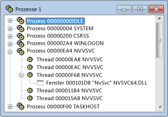

# Prozessansicht
Die Prozesse zeigt eine Strukturansicht aller aktiven Prozesse auf Ihrem System. Die Prozess-ID und den Modulnamen werden angezeigt. Verwenden Sie die Prozessansicht aus, wenn Sie möchten einen bestimmte Systemprozess zu überprüfen, die zum Ausführen eines Programms in der Regel entspricht. Prozesse werden durch Modulnamen identifiziert, oder sie werden als "Systemprozesse."  
  
 Microsoft Windows unterstützt mehrere Prozesse. Jeder Prozess kann einen oder mehrere Threads verfügen kann und jeder Thread eines oder mehrere zugeordnete Fenster auf oberster Ebene. Jedes Fenster der obersten Ebene kann eine Reihe von Windows besitzen. A + Symbol gibt an, dass eine Ebene reduziert wird. Die reduzierte Ansicht besteht aus einer Zeile pro Prozess. Klicken Sie auf das Pluszeichen auf die Ebene zu erweitern.  
  
 Verwenden Sie die Prozessansicht aus, wenn Sie möchten einen bestimmte Systemprozess zu überprüfen, die zum Ausführen eines Programms in der Regel entspricht. Prozesse werden durch Modulnamen identifiziert, oder sie werden als "Systemprozesse." Suchen Sie einen Prozess, reduzieren Sie die Struktur und Durchsuchen Sie die Liste.  
  
## Verfahren  
  
#### Zum Öffnen der Ansicht Prozesse  
  
1.  Aus der **Spy++** Menü wählen **Prozesse**.  
  
   
Spy++-Prozessansicht  
  
 Die obige Abbildung zeigt die Prozesse an, mit Prozessen und Threads Knoten erweitert.  
  
### In diesem Abschnitt  
 [Suchen eines Prozesses in der Prozessansicht](../debugger/how-to-search-for-a-process-in-processes-view.md)  
 Erläutert, wie einen bestimmten Prozess in der Prozessansicht gefunden.  
  
 [Anzeigen von Prozesseigenschaften](../debugger/how-to-display-process-properties.md)  
 Erläutert, wie Weitere Informationen zu einer Meldung angezeigt.  
  
### Verwandte Abschnitte  
 [Spy++-Ansichten](../debugger/spy-increment-views.md)  
 Erläutert die Spy++-Strukturansichten von Windows, Nachrichten, Prozesse und Threads an.  
  
 [Verwenden von Spy++](../debugger/using-spy-increment.md)  
 Führt das Tool Spy++ und erläutert, wie sie verwendet werden kann.  
  
 [Dialogfeld "Prozesssuche"](../debugger/process-search-dialog-box.md)  
 So suchen Sie den Knoten für einen bestimmten Prozess in der Prozessansicht verwendet.  
  
 [Dialogfeld "Prozesseigenschaften"](../debugger/process-properties-dialog-box.md)  
 Zeigt die Eigenschaften eines Prozesses in Prozessansicht ausgewählt.  
  
 [Spy++-Referenz](../debugger/spy-increment-reference.md)  
 Enthält Abschnitte beschreiben die einzelnen Spy++-Menü und das Dialogfeld.