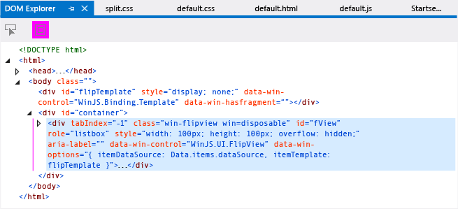
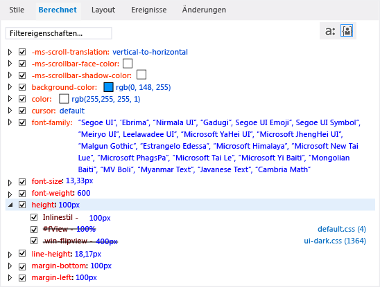

# <a name="debug-html-and-css-in-uwp-apps-in-visual-studio"></a>Debuggen von HTML und CSS in UWP-apps in Visual Studio
  
 Visual Studio bietet für JavaScript-Apps umfassende Debugfunktionen, die Internet Explorer- und Visual Studio-Entwicklern zum großen Teil vertraut sind. Diese Features werden für UWP-apps und erstellt mit Visual Studio-Tools für Apache Cordova-apps unterstützt.  
  
 Mit dem interaktiven Debuggingmodell der DOM-Überprüfungstools können Sie die gerenderte HTML und den CSS-Code anzeigen und bearbeiten. Dies alles ist möglich, ohne dass der Debugger beendet und neu gestartet werden muss.
  
 Informationen zu anderen JavaScript-Debugfunktionen, z. B. mithilfe von JavaScript-Konsolenfenster ein, und Festlegen von Haltepunkten, finden Sie unter [Schnellstart: Debuggen von JavaScript](../debugger/quickstart-debug-javascript-using-the-console.md) und [Debuggen von apps in Visual Studio](../debugger/debug-store-apps-in-visual-studio.md).  
  
##  <a name="InspectingDOM"></a> Überprüfen des Live-DOM  
 Im Dom Explorer wird eine Ansicht der gerenderten Seite angezeigt. Zudem können Sie den Dom Explorer verwenden, um Werte zu ändern und die Ergebnisse sofort anzuzeigen. Dadurch können Sie Änderungen testen, ohne den Debugger zu beenden und neu zu starten. Bei dieser Methode wird der Quellcode des Projekts beim Interagieren mit der Seite nicht geändert. Daher nehmen Sie die Änderungen nach dem Auffinden der gewünschten Codekorrekturen am Quellcode vor.  
  
> [!TIP]
>  Um den Debugger nicht zu beenden und neu zu starten, wenn Sie Änderungen am Quellcode vornehmen, können Sie die App mithilfe der Schaltfläche **Windows-App aktualisieren** auf der Symbolleiste "Debuggen" (oder durch Drücken der F4-TASTE) anschließend aktualisieren. Weitere Informationen finden Sie unter [Aktualisieren einer app (JavaScript)](../debugger/refresh-an-app-javascript.md).  
  
 Sie können den Dom Explorer für folgende Aufgaben verwenden:  
  
-   Navigation in der DOM-Element-Teilstruktur und Überprüfung von gerenderter HTML sowie CSS- und JavaScript-Code.  
  
-   Dynamische Bearbeitung von Attributen und CSS-Formatvorlagen für gerenderte Elemente und unmittelbare Anzeige der Ergebnisse.  
  
-   Überprüfung, wie CSS-Formatvorlagen auf Seitenelemente angewendet wurden und Verfolgung der angewendeten Regeln.  
  
 Beim Debuggen von Apps müssen Sie häufig Elemente im DOM Explorer auswählen. Wenn Sie ein Element auswählen, werden die auf den Registerkarten des Live-DOM rechts angezeigten Werte automatisch aktualisiert, sodass diese dem im DOM Explorer ausgewählten Element entsprechen. Zu diesen Registerkarten gehören **Formatvorlagen**, **Berechnet**, **Layout**. UWP-apps unterstützen auch die **Ereignisse** und **Änderungen** Registerkarten. Weitere Informationen über das Auswählen von Elementen finden Sie unter [Selecting elements](#SelectingElements).  
  
> [!TIP]
>  Wenn das Fenster "DOM Explorer" geschlossen ist, wählen Sie **Debuggen**>**Windows** > **DOM Explorer** aus, um es erneut zu öffnen. Das Fenster wird nur während einer Skriptdebugsitzung angezeigt.  
  
 In der folgenden Prozedur wird eine App mithilfe vom DOM Explorer interaktiv debuggt. Sie erstellen eine Anwendung, die ein `FlipView` -Steuerelement verwendet und debuggen diese anschließend. Die App enthält mehrere Fehler.  
  
> [!WARNING]
>  Die folgende Beispiel-app ist eine UWP-app. Die gleichen Funktionen werden für Cordova unterstützt. Die App an sich ist jedoch anders.  
  
#### <a name="to-debug-by-inspecting-the-live-dom"></a>So debuggen Sie durch Überprüfen des Live-DOM  
  
1.  Erstellen Sie in Visual Studio eine neue Projektmappe, indem Sie **Datei** > **Neues Projekt**.  
  
2.  Wählen Sie **JavaScript** > **Windows Universal**, und wählen Sie dann **WinJS-App**.  
  
3.  Geben Sie einen Namen für das Projekt ein, beispielsweise `FlipViewApp`, und wählen Sie **OK** aus, um die App zu erstellen.  
  
4.  Fügen Sie in das BODY-Element aus "Index.HTML" folgenden Code ein:  
  
    ```html  
    <div id="flipTemplate" data-win-control="WinJS.Binding.Template"  
             style="display:none">  
        <div class="fixedItem" >  
              
        </div>  
    </div>  
    <div id="fView" style="width:100px;height:100px"  
        data-win-control="WinJS.UI.FlipView" data-win-options="{  
        itemDataSource: Data.items.dataSource, itemTemplate: flipTemplate }">  
    </div>  
    ```  
  
5.  Öffnen Sie default.css und fügen Sie das folgende CSS hinzu:  
  
    ```css  
    #fView {  
        background-color:#0094ff;  
        height: 100%;  
        width: 100%;  
        margin: 25%;  
    }  
    ```  
  
6.  Ersetzen Sie den Code in "default.js" durch folgenden Code:  
  
    ```javascript  
    (function () {  
        "use strict";  
  
        var app = WinJS.Application;  
        var activation = Windows.ApplicationModel.Activation;  
  
        var myData = [];  
        for (var x = 0; x < 4; x++) {  
            myData[x] = { flipImg: "/images/logo.png" }  
        };  
  
        var pages = new WinJS.Binding.List(myData, { proxy: true });  
  
        app.onactivated = function (args) {  
            if (args.detail.kind === activation.ActivationKind.launch) {  
                if (args.detail.previousExecutionState !==  
                activation.ApplicationExecutionState.terminated) {  
                    // TODO: . . .  
                } else {  
                    // TODO: . . .  
                }  
                args.setPromise(WinJS.UI.processAll());  
  
                updateImages();  
            }  
        };  
  
        function updateImages() {  
  
            pages.setAt(0, { flipImg: "http://public-domain-photos.com/free-stock-photos-1/flowers/cactus-76.jpg" });  
            pages.setAt(1, { flipImg: "http://public-domain-photos.com/free-stock-photos-1/flowers/cactus-77.jpg" });  
            pages.setAt(2, { flipImg: "http://public-domain-photos.com/free-stock-photos-1/flowers/cactus-78.jpg" });  
        };  
  
        app.oncheckpoint = function (args) {  
        };  
  
        app.start();  
  
        var publicMembers = {  
            items: pages  
        };  
  
        WinJS.Namespace.define("Data", publicMembers);  
  
    })();  
    ```  
  
     Die folgende Abbildung zeigt, was wir angezeigt, wenn wir diese app ausführen möchten. Um diesen Status für die App zu erreichen, müssen Sie allerdings zunächst eine Anzahl von Fehlern beheben.  
  
       
  
7.  Wählen Sie **lokalen Computer** aus der Dropdown-Liste neben der **Debuggen starten** Schaltfläche der **Debuggen** Symbolleiste:  
  
       
  
8.  Wählen Sie **Debuggen** > **Simulator**aus oder drücken Sie F5, um die Anwendung im Debugmodus auszuführen.  
  
     Dadurch wird die app ausgeführt, aber ein fast gänzlich leeres Fenster angezeigt, da es sich bei der Formatierung einige Fehler enthält. Das erste `FlipView` -Bild wird in einem kleinen Quadrat neben der Bildschirmmitte angezeigt.  
  
10. Wechseln Sie zu Visual Studio, und wählen Sie die Registerkarte **DOM Explorer** aus.  
  
    > [!TIP]
    >  Sie können ALT+TAB oder F12 drücken, um zwischen Visual Studio und der ausgeführten App zu wechseln.  
  
11. Wählen Sie im Fenster „DOM Explorer“ das DIV-Element für den Abschnitt aus, der über die ID `"fView"`verfügt. Verwenden Sie die Pfeiltasten, um das richtige DIV-Element anzuzeigen und auszuwählen. (Die rechts-Taste können Sie einen seiner untergeordneten Elemente anzeigen.)  
  
       
  
    > [!TIP]
    >  Sie können auch das DIV-Element in der unteren linken Ecke des JavaScript-Konsolenfensters auswählen, indem Sie eingeben `select(fView)` an die >> Eingabe-Eingabeaufforderung, und dann die EINGABETASTE drücken.  
  
     Die Werte, die auf den Registerkarten rechts im DOM Explorer-Fenster zu sehen sind, werden automatisch aktualisiert, sodass diese dem aktuellen Element im DOM Explorer entsprechen.  
  
12. Wählen Sie die Registerkarte **Berechnet** auf der rechten Seite aus.  
  
     Diese Registerkarte zeigt den berechneten oder den abschließenden Wert für jede Eigenschaft des ausgewählten DOM-Elements an.  
  
13. Öffnen Sie die CSS-Regel für die Höhe. Beachten Sie, dass ein Inline auf 100px, dies ist inkonsistent mit dem Höhenwert von 100 % für festgelegt die `#fView` CSS-Selektor. Da die `#fView` -Auswahl durchgestrichenen Text enthält, hat die Inlineformatvorlage Vorrang vor diesem Format.  
  
     In der folgenden Abbildung ist die Registerkarte **Berechnet** dargestellt.  
  
       
  
14. Doppelklicken Sie im Hauptfenster von DOM Explorer auf das Inlineformat für die Höhe und die Breite des DIV-Elements `fView` . Sie können die Werte jetzt hier bearbeiten. In diesem Szenario möchten wir sie vollständig entfernen.  
  
15. Doppelklicken Sie im Hauptfenster auf `width: 100px;height: 100px;`, drücken Sie die **löschen** Schlüssel, und drücken Sie dann die **EINGABETASTE**. Nachdem Sie die EINGABETASTE drücken, werden die neuen Werte sofort in der app dargestellt, obwohl Sie die Debugsitzung nicht beendet wurde.  
  
    > [!IMPORTANT]
    >  Ebenso wie die Attributwerte im Fenster "DOM Explorer" können Sie auch Werte aktualisieren, die auf den Registerkarten **Formatvorlagen**, **Berechnet**und **Layout** angezeigt werden. Weitere Informationen finden Sie unter [Debuggen von CSS-Stilen mithilfe von DOM Explorer](../debugger/debug-css-styles-using-dom-explorer.md) und [Debuggen von Layout mithilfe von DOM Explorer](../debugger/debug-layout-using-dom-explorer.md).  
  
16. Wechseln Sie zur app, indem Sie ihn auswählen oder Alt + Tab.  
  
     Das `FlipView` -Steuerelement wird jetzt größer als die Bildschirmgröße vom Simulator oder Windows Phone-Emulator dargestellt. Dies ist nicht das beabsichtigte Ergebnis. Wechseln Sie zur weiteren Untersuchung zu Visual Studio zurück.  
  
17. Wählen Sie im DOM Explorer die Registerkarte **Berechnet** erneut aus, und öffnen Sie die Höhenregel. Das fView-Element zeigt weiterhin einen Wert von 100 %, wie vom CSS erwartet, aber der berechnete Wert ist gleich der app-Bildschirm angezeigte Höhe (z. B. 800 Pixeln, 667,67 Pixel oder einen anderen Wert), dies ist nicht für diese app gewünscht. Im nächsten Schritt untersuchen wir die Höhe und Breite für Entfernen der `fView` DIV-Element.  
  
18. Deaktivieren Sie auf der Registerkarte **Formatvorlagen** die Höhen- und Breiteneigenschaften für die `#fView` CSS-Auswahl.  
  
     Auf der Registerkarte **Berechnet** wird nun eine Höhe von 400px angezeigt. Die Informationen geben an, dass dieser Wert aus dem .win-flipview Selektor stammt, der in ui-dark.css angegeben wird. Dies ist eine CSS-Datei der Plattform.  
  
19. Wechseln Sie zur App zurück.  
  
     Sie sehen eine Verbesserung. Es muss jedoch noch ein weiteres Problem behoben werden: Die Ränder sind zu groß.  
  
20. Um zu untersuchen, wechseln Sie zu Visual Studio, und wählen Sie die **Layout** Tab, um das feldmodell des Elements anzuzeigen.  
  
     In der **Layout** Registerkarte sehen Sie Folgendes:  
  
    -   255px (Offset) und 255px (Rand) oder ähnliche Werte, je nach Ihrer Auflösung für dieses Gerät. 
  
     Die folgende Abbildung zeigt die **Layout** Registerkarte sieht bei Verwendung ein Emulators mit 100 px Offset und Rand).  
  
       
  
     Dies scheint nicht richtig. Auf der Registerkarte **Berechnet** werden die gleichen Randwerte angezeigt.  
  
21. Wählen Sie die Registerkarte **Formatvorlagen** aus, und suchen Sie die CSS-Auswahl `#fView` . Hier sehen Sie einen Wert von 25 % für die Eigenschaft **Rand** .  
  
22. Wählen Sie die 25 % aus, ändern Sie sie in 25px, und drücken Sie die EINGABETASTE.  
  
23. Wählen Sie außerdem auf der Registerkarte **Formatvorlagen** die Höhenregel für die .win-flipview-Auswahl aus und ändern Sie 400 px in 500 px. Drücken Sie dann die EINGABETASTE.  
  
24. Wechseln Sie zur Anwendung. Hier sehen Sie, dass die Platzierung von Elementen korrekt aussieht. Um Korrekturen an der Quelle auszuführen und die Anwendung zu aktualisieren, ohne den Debugger zu beenden und neu starten, gehen Sie wie folgt vor.  
  
#### <a name="to-refresh-your-app-while-debugging"></a>So aktualisieren Sie die App beim Debuggen  
  
1.  Wechseln Sie bei ausgeführter Anwendung zu Visual Studio.  
  
2.  Öffnen Sie "default.html", und bearbeiten Sie den Quellcode, indem Sie die Höhe und die Breite des `"fView"` -DIV-Elements auf 100 % ändern.  
  
3.  Klicken Sie auf der Debug-Symbolleiste auf die Schaltfläche **Windows-App aktualisieren** (oder drücken Sie F4). Die Schaltfläche sieht wie folgt aus: .  
  
     Die Seiten der App werden erneut geladen, und der Simulator oder Windows Phone-Emulator wechselt in den Vordergrund zurück.  
  
     Weitere Informationen zur Aktualisierungsfunktion finden Sie unter [Aktualisieren einer app (JavaScript)](../debugger/refresh-an-app-javascript.md).  
  
##  <a name="SelectingElements"></a> Selecting elements  
 Sie können beim Debuggen einer App DOM-Elemente auf drei Arten auswählen:  
  
-   Durch das Klicken auf Elemente direkt im DOM Explorer-Fenster (oder mithilfe der Pfeiltasten)  
  
-   Mit der Schaltfläche **Element auswählen** (STRG+B)  
  
-   Mit der Schaltfläche `select` -Befehl, der zu den [JavaScript Console commands](../debugger/javascript-console-commands.md).  
  
 Wenn Sie das DOM Explorer-Fenster zur Auswahl von Elementen verwenden und mit dem Mauszeiger auf ein Element zeigen, wird das entsprechende Element in der ausgeführten App hervorgehoben. Elemente werden im DOM Explorer durch Anklicken ausgewählt oder mit den Pfeiltasten markiert und ausgewählt. Sie können Elemente im DOM Explorer auch auswählen, indem Sie die Schaltfläche **Element auswählen** verwenden. Die folgende Abbildung zeigt die Schaltfläche **Element auswählen** .  
  
   
  
 Wenn Sie auf **Element auswählen** klicken (oder STRG+B drücken), wird der Auswahlmodus geändert, sodass Sie ein Element im DOM Explorer auswählen können, indem Sie in der ausgeführten App auf dieses klicken. Nach einem Einzelklick wechselt der Modus wieder zum normalen Auswahlmodus zurück. Wenn Sie auf **Element auswählen**klicken, wird die Anwendung in den Vordergrund gestellt. Zudem wird der Cursor geändert, um den neuen Auswahlmodus wiederzugeben. Wenn Sie auf das konturierte Element klicken, kehrt der Dom Explorer mit dem ausgewählten Element in den Vordergrund zurück.  
  
 Bevor Sie **Element auswählen**auswählen, können Sie festlegen, ob die Elemente in der ausgeführten App mithilfe der Umschaltfläche **Webseiten-Markierungsfelder anzeigen** hervorgehoben werden sollen. Die folgende Abbildung zeigt diese Schaltfläche. Standardmäßig werden die Hervorhebungen angezeigt.  
  
   
  
 Wenn Sie die Hervorhebung von Elementen ausgewählt haben, werden Elemente, auf die Sie im Simulator zeigen, hervorgehoben. Die Farben für hervorgehobene Elemente entsprechen dem Feldmodell, das auf der Registerkarte **Layout** im DOM Explorer angezeigt wird.  
  
> [!NOTE]
>  Im Windows Phone-Emulator wird das Hervorheben von Elementen durch Zeigen mit dem Mauszeiger nur teilweise unterstützt.  
  
## <a name="see-also"></a>Siehe auch  
 [Debug apps in Visual Studio](../debugger/debug-store-apps-in-visual-studio.md)   
 [Aktualisieren einer app (JavaScript)](../debugger/refresh-an-app-javascript.md)   
 [Debuggen eines WebView-Steuerelements](../debugger/debug-a-webview-control.md)   
 [Tastenkombinationen](../debugger/keyboard-shortcuts-html-and-javascript.md)   
 [JavaScript-Konsolenbefehle](../debugger/javascript-console-commands.md)   
 [Debuggen von HTML, CSS und JavaScript-Beispielcode](../debugger/debug-html-css-and-javascript-sample-code.md)   
 [Produktsupport und Barrierefreiheit](https://msdn.microsoft.com/library/tzbxw1af(VS.120).aspx)