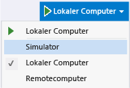

# Aktualisieren einer uwp-app in Visual Studio
  
 Sie können Änderungen an Code vornehmen, während Sie Debuggen, und aktualisieren Sie eine uwp-app mit JavaScript durch Auswählen der **Windows-app aktualisieren** auf die Schaltfläche der **Debuggen** Symbolleiste. Durch Auswählen dieser Schaltfläche wird die App erneut geladen, ohne den Debugger zu beenden und erneut zu starten. Die Aktualisierungsfunktion ermöglicht es Ihnen, HTML, CSS und JavaScript-Code zu ändern und das Ergebnis schnell anzuzeigen. Diese Funktion wird für uwp-apps unterstützt.  
  
 Aktualisieren hält weder den App-Zustand aufrecht noch reflektiert es die folgenden Änderungen zur App:  
  
-   Paketmanifestdateiänderungen, einschließlich Änderungen an den im Paketmanifest angegebenen Bildern.  
  
-   Verweisänderungen, wie das Hinzufügen oder Entfernen eines SDK-Verweises, oder Änderungen an den Komponenten für Windows-Runtime (.winmd-Dateien).  
  
-   Ressourcenänderungen, wie Änderungen an den Zeichenfolgen in .resjson-Dateien.  
  
-   Projektdateiänderungen, die zu Pfadnamenänderungen, neuen Projektdateien oder gelöschten Dateien führen.  
  
-   Projekt- und Elementeigenschaftenänderungen, wie Änderungen am ausgewählten Debugging-Gerät oder Änderungen an der Paketaktion für eine Datei (im Eigenschaftenfenster).  
  
> [!IMPORTANT]
>  Wenn Sie Verweise oder das Paketmanifest ändern oder andere Änderungen vornehmen, die in der vorangehenden Liste aufgeführt sind, müssen Sie den Debugger beenden und neu starten, um HTML-, CSS- und JavaScript-Quelldateien zu aktualisieren.  
  
### So aktualisieren Sie eine App  
  
1.  Wählen Sie mit dem Ihr uwp-Projekt in Visual Studio geöffnet, **lokalen** als Debugziel.
  
       
  
3.  Drücken Sie F5, um die App im Debugmodus auszuführen.  
  
4.  Wechseln Sie zu Visual Studio. 
  
5.  Bearbeiten Sie auf der Homepage Ihrer uwp-App einige der HTML-Datei aus.
  
7.  Klicken Sie auf die **Windows-app aktualisieren** Schaltfläche, die wie folgt: . (Oder drücken Sie F4)  
  
8.  Wechseln Sie zur App. Die app wird erneut geladen, und der aktualisierte HTML-Code wird verwendet, um die app zu rendern.
  
## Siehe auch  
 [Schnellstart: Debuggen von HTML und CSS](../debugger/quickstart-debug-html-and-css.md)