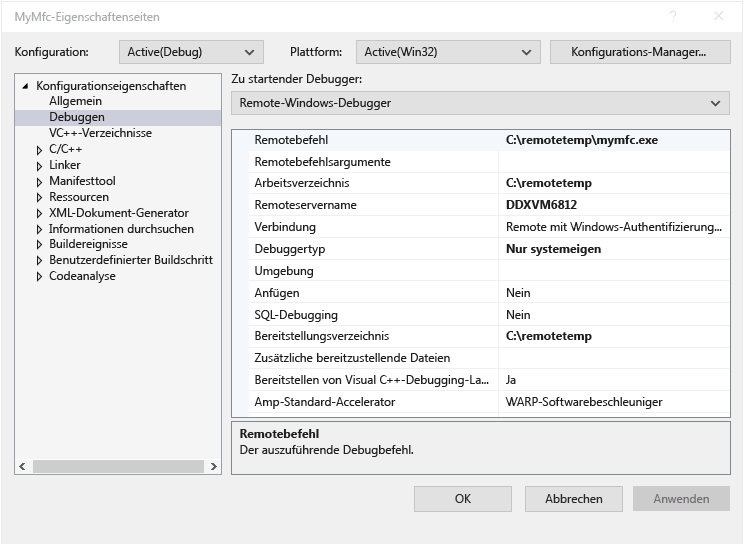
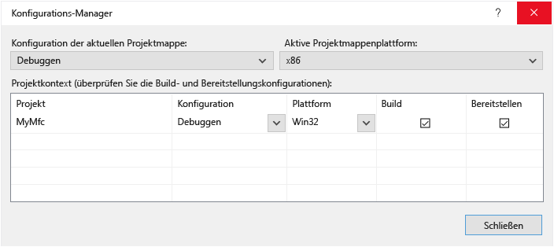

# Remotedebuggen eines Visual C++-Projekts in Visual Studio
Zum Debuggen einer Visual Studio-Anwendung auf einem anderen Computer, installieren und Ausführen der Remotetools auf dem Computer, auf dem Sie Ihre app bereitstellen können, konfigurieren Sie das Projekt, um die Verbindung mit dem Remotecomputer in Visual Studio, und klicken Sie dann bereitstellen und Ausführen Ihrer app.

Informationen zum Remotedebuggen von universellen Windows-Apps (UWP) finden Sie unter [ein installiertes App-Paket Debuggen](debug-installed-app-package.md).

## Anforderungen

Der Remotedebugger wird unterstützt, unter Windows 7 und höher (kein Telefon) und Versionen von Windows Server mit Windows Server 2008 Service Pack 2 gestartet. Eine vollständige Liste der Anforderungen, finden Sie unter [Anforderungen](../debugger/remote-debugging.md#requirements_msvsmon).

> [!NOTE]
> Debuggen zwischen zwei Computern über einen Proxy verbunden wird nicht unterstützt. Remotedebuggen über eine hohe Latenz oder niedriger Bandbreite, wie z. B. DFÜ, Internet oder über das Internet Ländern wird nicht empfohlen und möglicherweise fehl oder sehr langsam sein.
  
## Herunterladen und Installieren der Remotetools

[!INCLUDE [remote-debugger-download](../debugger/includes/remote-debugger-download.md)]
  
> [!TIP]
> In einigen Szenarien kann es am effizientesten, führen Sie den Remotedebugger aus einer Dateifreigabe sein. Weitere Informationen finden Sie unter [führen Sie den Remotedebugger aus einer Dateifreigabe](../debugger/remote-debugging.md#fileshare_msvsmon).
  
## Einrichten des Remotedebuggers

[!INCLUDE [remote-debugger-configuration](../debugger/includes/remote-debugger-configuration.md)]

> [!NOTE]
> Wenn Sie benötigen Berechtigungen für zusätzliche Benutzer hinzufügen ändern den Authentifizierungsmodus oder Portnummer für den Remotedebugger, finden Sie unter [Konfigurieren des Remotedebuggers](../debugger/remote-debugging.md#configure_msvsmon).

## Remotedebuggen eines Visual C++-Projekts  
 In der folgenden Prozedur den Namen und Pfad des Projekts C:\remotetemp\MyMfc und der Name des Remotecomputers ist **MJO DL**.  
  
1.  Erstellen eine MFC-Anwendung mit dem Namen **Mymfc.**  
  
2.  Legen Sie einen Haltepunkt an einer beliebigen Stelle in der Anwendung, die leicht, z. B. in erreicht wird **"MainFrm.cpp"**, am Anfang des `CMainFrame::OnCreate`.  
  
3.  Projektmappen-Explorer mit der Maustaste auf das Projekt und wählen Sie **Eigenschaften**. Öffnen der **Debuggen** Registerkarte.  
  
4.  Legen Sie die **zu startender Debugger** auf **Remote-Windows-Debugger**.  
  
       
  
5.  Nehmen Sie die folgenden Änderungen an den Eigenschaften vor:  
  
    |Einstellung|Wert|
    |-|-|  
    |Remotebefehl|C:\remotetemp\mymfc.exe|  
    |Arbeitsverzeichnis|C:\remotetemp|  
    |Remoteservername|MJO-DL:*Portnumber*|  
    |Verbindung|Remote mit Windows-Authentifizierung|  
    |Debuggertyp|Nur systemeigen|  
    |Bereitstellungsverzeichnis|C:\remotetemp.|  
    |Zusätzliche bereitzustellende Dateien|C:\data\mymfcdata.txt.|  
  
     Wenn Sie zusätzliche Dateien – (optional) bereitstellen, muss der Ordner auf beiden Computern vorhanden.  
  
6.  Klicken Sie im Projektmappen-Explorer mit der rechten Maustaste in der Projektmappe, und wählen Sie **Configuration Manager**.  
  
7.  Für die **Debuggen** Konfiguration der **bereitstellen** Kontrollkästchen.  
  
       
  
8.  Starten des Debuggens (**Debuggen > Debuggen starten**, oder **F5**).  
  
9. Die ausführbare Datei wird automatisch auf dem Remotecomputer bereitgestellt.  
  
10. Wenn Sie aufgefordert werden, geben Sie die Netzwerkanmeldeinformationen zum Verbinden mit dem Remotecomputer.  
  
     Die erforderlichen Anmeldeinformationen sind spezifisch für Ihr Netzwerk Sicherheitskonfiguration. Sie können z. B. auf einem Domänencomputer wählen Sie ein Sicherheitszertifikat oder geben Sie Ihren Domänennamen und Kennwort. Auf einem Computer außerhalb der Domäne Sie möglicherweise Geben Sie den Computernamen und einen gültigen Benutzernamen ein Konto, z. B.  **MJO-DL\name@something.com** , zusammen mit dem richtigen Kennwort.  
  
11. Auf dem Visual Studio-Computer sollte angezeigt werden, dass die Ausführung am Haltepunkt angehalten wird.  
  
    > [!TIP]
    >  Alternativ können die Dateien in einem getrennten Schritt bereitgestellt werden. In der **Projektmappen-Explorer** mit der rechten Maustaste die **Mymfc** Knoten und wählen Sie dann **bereitstellen**.  
  
 Wenn bestimmte Dateien ohne Code von der Anwendung benötigt werden, müssen Sie diese zum Visual Studio-Projekt hinzufügen. Erstellen eines Projektordners für die zusätzlichen Dateien (in der **Projektmappen-Explorer**, klicken Sie auf **hinzufügen > neuen Ordner**.) Klicken Sie dann die Dateien in den Ordner hinzuzufügen (in der **Projektmappen-Explorer**, klicken Sie auf **hinzufügen > Vorhandenes Element**, wählen Sie die Dateien). Auf der **Eigenschaften** Seite für jede Datei **in Ausgabeverzeichnis kopieren** auf **immer kopieren**.
  
## Einrichten des Debuggings mit Remotesymbolen 

[!INCLUDE [remote-debugger-symbols](../debugger/includes/remote-debugger-symbols.md)] 
  
## Siehe auch  
 [Debuggen in Visual Studio](../debugger/index.md)  
 [Debugger – Featuretour](../debugger/debugger-feature-tour.md)   
 [Konfigurieren der Windows-Firewall für Remotedebuggen](../debugger/configure-the-windows-firewall-for-remote-debugging.md)   
 [Remotedebugger-Portzuweisungen](../debugger/remote-debugger-port-assignments.md)   
 [Remotedebuggen von ASP.NET auf einem Remotecomputer mit IIS](../debugger/remote-debugging-aspnet-on-a-remote-iis-computer.md)  
 [Remotedebuggen – Fehler und Problembehandlung](../debugger/remote-debugging-errors-and-troubleshooting.md)