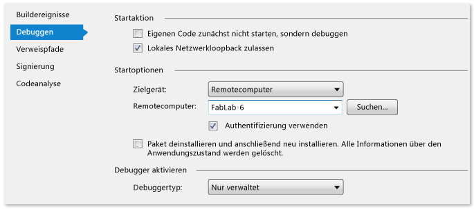

# Führen Sie die uwp-apps auf einem Remotecomputer
  
  
Um eine uwp-app auf einem Remotecomputer auszuführen, müssen Sie Sie mithilfe von Visual Studio-Remotetools anfügen. Die Remotetools ermöglichen es Ihnen, ausführen, Debuggen, profilieren und Testen einer UWP-app, die auf einem Gerät von einem zweiten Computer ausgeführt wird, auf dem Visual Studio ausgeführt wird. Auf einem Remotegerät ausführen kann besonders dann effektiv sein, wenn der Visual Studio-Computer, die speziell für uwp-apps, wie Toucheingabe, GeoLocation und physische Ausrichtung Funktion nicht unterstützt. In diesem Thema wird beschrieben, wie Sie eine Remotesitzung konfigurieren und starten.

In einigen Szenarien werden die Remotetools automatisch installiert, wenn Sie auf einem Remotegerät bereitstellen.

- Windows 10-PCs Ersteller Update oder spätere Versionen ausführen, finden Sie unter [ein installiertes App-Paket Debuggen](debug-installed-app-package.md#remote). Remotetools werden automatisch installiert.
- Windows 10 Xbox, IOT und HoloLens Geräte finden Sie unter [ein installiertes App-Paket Debuggen](debug-installed-app-package.md#remote). Remotetools werden automatisch installiert.
- Für Windows Phone, Sie müssen physisch am Telefon verbunden werden, müssen Sie entweder eine [Entwicklerlizenz](https://msdn.microsoft.com/en-us/library/windows/apps/xaml/hh974578.aspx) (Windows Phone 8 und 8.1) oder aktivieren Sie [Entwicklermodus](/windows/uwp/get-started/enable-your-device-for-development) (Windows Mobile 10), und Sie müssen Wählen Sie **Gerät** als Debugziel. Remote-Tools sind nicht erforderlich oder unterstützt.

Für Windows 8.1 und Windows 10-PCs, die ein Pre-Ersteller-Update-Version von Windows ausgeführt müssen Sie die Remotetools auf dem Remotecomputer manuell installieren vor dem Debuggen können. Befolgen Sie die Anweisungen in diesem Thema.
  
##   Erforderliche Komponenten  
 So debuggen Sie auf einem Remotegerät:  
  
-   Das Remotegerät und der Visual Studio-Computer müssen über ein Netzwerk verbunden oder mit einem Ethernetkabel direkt verbunden werden. Das Debugging über das Internet wird nicht unterstützt.  

- Das Remotegerät muss für die Entwicklung aktiviert sein.

    - Für Windows 8 und Windows 8.1-Geräte ein [Entwicklerlizenz](https://msdn.microsoft.com/en-us/library/windows/apps/xaml/hh974578.aspx) muss auf dem Remotegerät installiert sein.
    - Sie müssen für Windows 10-Geräte aktivieren [Entwicklermodus](/windows/uwp/get-started/enable-your-device-for-development). 
  
-   Für Windows 10-PCs vor Windows 10 Creator Update eine Version von Windows 10 ausführen müssen Sie installieren und die Remotedebugkomponenten ausführen.
  
-   Sie müssen Administrator auf dem Remotegerät sein, um die Firewall während der Installation zu konfigurieren. Sie müssen Benutzerzugriff auf das Remotegerät haben, um die Verbindung mit dem Remotedebugger herstellen oder ihn ausführen zu können.  
  
##   Sicherheit  
 Standardmäßig verwendet der Remotedebugger die Windows-Authentifizierung.  
  
> [!WARNING]
>  Sie haben außerdem die Möglichkeit, den Remotedebugger im Modus "Keine Authentifizierung" auszuführen, hiervon wird jedoch dringend abgeraten. In diesem Modus gibt es keine Netzwerksicherheit. Wählen Sie den Modus "Ohne Authentifizierung" nur aus, wenn Sie sicher sind, dass das Netzwerk nicht durch bösartigen oder feindlichen Datenverkehr gefährdet ist.  
  
##   Herstellen einer direkten Verbindung mit einem Remotegerät  
 Um eine direkte Verbindung mit einem Remotegerät herzustellen, schließen Sie den Visual Studio-Computer mit einem Standardethernetkabel an das Gerät an. Wenn das Gerät keinen Ethernet-Anschluss besitzt, können Sie für die Verbindung mit dem Kabel einen USB-Ethernet-Adapter verwenden.  
  
## Herunterladen und Installieren der Remotetools

[!INCLUDE [remote-debugger-download](../debugger/includes/remote-debugger-download.md)]
  
## Einrichten des Remotedebuggers

[!INCLUDE [remote-debugger-configuration](../debugger/includes/remote-debugger-configuration.md)]
  
##   Konfigurieren des Visual Studio-Projekts für das Remotedebuggen  
 In den Eigenschaften des Projekts geben Sie das Remotegerät an, mit dem eine Verbindung hergestellt werden soll. Das Verfahren unterscheidet sich je nach Programmiersprache. Sie können entweder den Netzwerknamen des Remotegeräts eingeben, oder es im Dialogfeld "Remotedebuggerverbindung auswählen" auswählen.  
  
   
  
 Im Dialogfeld werden nur die Geräte aufgelistet, die sich im lokalen Teilnetz von Visual Studio-Computers befinden und die den Remotedebugger ausführen.  
  
> [!TIP]
>  Sollten Sie Probleme beim Herstellen einer Verbindung mit einem Remotegerät haben, versuchen Sie, die IP-Adresse des Geräts einzugeben. Um die IP-Adresse eines Geräts zu bestimmen, öffnen Sie ein Befehlsfenster, und geben Sie dann **ipconfig**ein. Die IP-Adresse wird als **IPv4 Address**aufgeführt.  
  
###   Auswählen des Remotegeräts für C#- und Visual Basic-Projekte  
   
  
1.  Wählen Sie im Projektmappen-Explorer den Projektnamen aus und gehen Sie anschließend im Kontextmenü auf **Eigenschaften** .  
  
2.  Wählen Sie **Debuggen**aus.  
  
3.  Wählen Sie in der Liste **Zielgerät** die Option **Remotecomputer** aus.  
  
4.  Geben Sie den Netzwerknamen des Remotegeräts im Feld **Remotecomputer** ein, oder wählen Sie **Suchen** aus, um das Gerät im Dialogfeld **Remotedebuggerverbindung auswählen** auszuwählen.  
  
###   Auswählen des Remotegeräts für JavaScript- und C++-Projekte  
   
  
1.  Wählen Sie im Projektmappen-Explorer den Projektnamen aus und gehen Sie anschließend im Kontextmenü auf **Eigenschaften** .  
  
2.  Erweitern Sie den Knoten **Konfigurationseigenschaften** , und wählen Sie dann **Debuggen**aus.  
  
3.  Wählen Sie **Remote Debugger** in der Liste **Zu startender Debugger** aus.  
  
4.  Geben Sie im Feld **Computername** den Netzwerknamen des Remotegeräts ein, oder wählen Sie im Feld den Pfeil nach unten aus, um im Dialogfeld **Remotedebuggerverbindung auswählen** das Gerät auszuwählen.  
  
##   Ausführen einer Remotedebugsitzung  
 Sie starten, beenden und navigieren eine Remotedebugsitzung genauso wie eine lokale Sitzung. Bevor Sie mit dem Debuggen beginnen, stellen Sie sicher, dass der Remotedebugmonitor auf dem Remotegerät ausgeführt wird.  
  
 Wählen Sie anschließend im Menü **Debuggen** (Tastatur: F5) die Option **Debuggen starten** aus. Das Projekt wird neu kompiliert, anschließend für das Remotegerät bereitgestellt und darauf gestartet . An Haltepunkten unterbricht der Debugger die Ausführung, und Sie können Ihren Code schrittweise ausführen, ihn überspringen oder verlassen. Wählen Sie **Debuggen beenden** aus, um Ihre Debugsitzung zu beenden, und schließen Sie die Remoteapp. Weitere Informationen finden Sie unter [Debuggen von apps in Visual Studio](../debugger/debug-store-apps-in-visual-studio.md).  
  
## Siehe auch  
 [Testen von UWP-Apps mit Visual Studio](../test/testing-store-apps-with-visual-studio.md)   
 [Debuggen von apps in Visual Studio](../debugger/debug-store-apps-in-visual-studio.md)