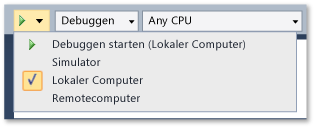

# Führen Sie die uwp-apps auf dem lokalen Computer
  
  
 Zum Debuggen, testen oder Durchführen einer Leistungsanalyse für eine uwp-app, können Sie der app auf dem gleichen Computer, der als Host Visual Studio ausführen. Falls das Geräte-Display ein Touchscreen ist, können Sie alle Funktionen der App ausführen; andernfalls sind Sie auf Tastatur- und Mausgesten beschränkt.  
  
##  Ausführen auf einem lokalen Computer  
 Wählen Sie zum Ausführen der app auf dem lokalen Computer **lokalen** aus der Dropdown-Liste neben der Schaltfläche "Debugging starten" auf der Debugger **Standard** Symbolleiste.  
  
   
  
 Angezeigt der **Standard** -Symbolleiste klicken Sie auf die **Ansicht** Sie im Menü **Symbolleisten**, und klicken Sie dann auf **Standard**.  
  
 Die von Ihnen in der Dropdownliste getroffene Auswahl wird in die Projekteigenschaftendatei übernommen und als Standardausführungsziel verwendet.  
  
 Sie können das Ausführungsziel auch direkt in der Projekteigenschaftendatei festlegen. Mit der rechten Maustaste in des Namens des Projekts **Projektmappen-Explorer** und wählen Sie dann **Eigenschaften**. Führen Sie dann eine der folgenden Aktionen aus:  
  
-   Klicken Sie in c# und Visual Basic-Projekten auf **Debuggen** und wählen Sie dann **lokalen** aus der **Zielgerät** Dropdown-Liste.  
  
       
  
-   Erweitern Sie in C++ und JavaScript-Projekten, die **Konfigurationseigenschaften** Knoten, klicken Sie auf **Debuggen**, und wählen Sie dann **lokaler Debugger** aus der **Debugger zum Starten** Liste.  
  
       