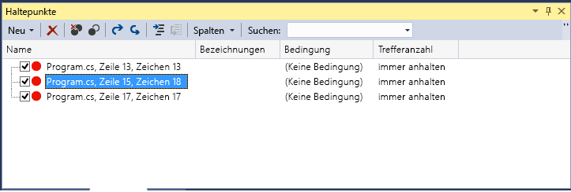
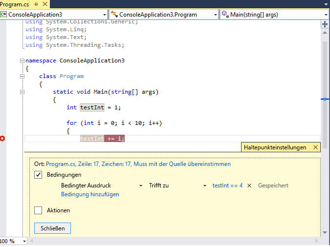
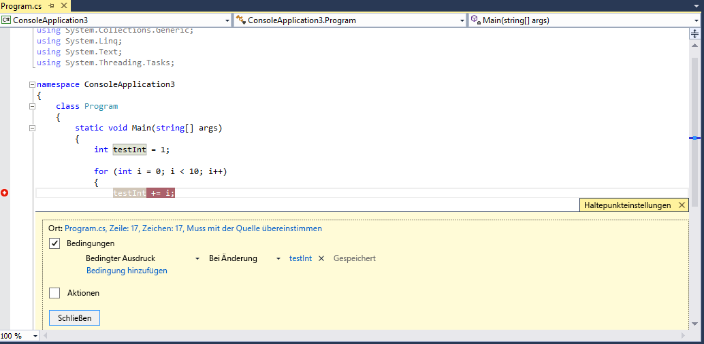

# <a name="use-breakpoints-in-the-visual-studio-debugger"></a>Verwenden Sie Haltepunkte in Visual Studio-Debugger
Sie können Haltepunkte festlegen, wenn Sie die Ausführung des Debuggers stoppen möchten, um möglicherweise den Status der Codevariablen oder die Aufrufliste anzuzeigen. Sie sind eine der wichtigsten Debugverfahren in der Toolbox eines Entwicklers.  
  
##  <a name="BKMK_Overview"></a>Festlegen eines Haltepunkts für die Zeile im Quellcode  
 Sie legen einen Zeilenhaltepunkt in Quellcode, indem Sie in den linken Rand einer Quellcodedatei oder den Cursor in einer Codezeile platzieren und dann F9 drücken. Der Haltepunkt wird als roter Punkt im linken Bereich angezeigt, und die Codezeile wird ebenfalls eingefärbt:  
  
   
  
 Beim Erreichen des Haltepunkts wird die Ausführung dieses Codes im Debugger gestoppt, bevor der Code in der Zeile ausgeführt wird. Die Zeile des Quellcodes ist gelb gefärbt:  
  
   
  
 An dieser Stelle lautet der Wert von `testInt` immer noch 1.  
  
 Sie können den aktuellen Status der Anwendung anzeigen, dazu gehören auch die Variablenwerte und die Aufrufliste. Weitere Informationen zur Aufrufliste finden Sie unter [How to: Use the Call Stack Window](../debugger/how-to-use-the-call-stack-window.md).  
  
 Sie können einen Haltepunkt für jede beliebige Zeile mit ausführbarem Code festlegen. Im weiter oben aufgeführten C#-Code können Sie einen Haltepunkt zu der Variablendeklaration festlegen, die `for` -Schleife oder Code innerhalb der `for` -Schleifen, Sie können jedoch keinen Haltepunkt zu dem Namespace oder den Klassendeklarationen oder der Methodensignatur festlegen.  
  
##  <a name="BKMK_Set_a_breakpoint_in_a_source_file"></a> Festlegen anderer Arten von Haltepunkten  
 Sie können auch Haltepunkte in der Aufrufliste, im Disassemblyfenster und in systemeigenem C++-Code zu einer Datenbedingung oder einer Speicheradresse festlegen.  
  
## <a name="BKMK_Set_a_breakpoint_in_the_call_stack_window"></a> Festlegen eines Haltepunkts im Aufruflistenfenster  
 Sie können die Ausführung bei der Anweisung oder in der Zeile unterbrechen, zu der eine aufrufende Funktion zurückkehrt, indem Sie im Fenster **Aufrufliste** einen Haltepunkt festlegen. Weitere Informationen zur Aufrufliste finden Sie unter [How to: Use the Call Stack Window](../debugger/how-to-use-the-call-stack-window.md). Der Debugger muss die Ausführung beendet haben.  
  
1.  Starten Sie das Debuggen der Anwendung, und warten Sie bis die Ausführung gestoppt wurde (z. B. an einem Haltepunkt). Öffnen der **Aufrufliste** Fenster (**Debuggen > Windows > Aufrufliste**, oder **STRG + ALT + C**).  
  
2.  Maustaste auf die Aufruffunktion, und wählen Sie dann **Haltepunkt > Haltepunkt einfügen**, oder verwenden Sie einfach die Tastenkombination **F9**.  
  
3.  Im linken Rand der Aufrufliste neben dem Funktionsaufrufnamen wird ein Haltepunktsymbol angezeigt.  
  
 Im Fenster **Haltepunkte** wird der Aufruflistenhaltepunkt als Adresse mit Speicherort angezeigt, der der nächsten ausführbaren Anweisung der Funktion entspricht. Der Debugger unterbricht die Ausführung an der Anweisung.  
  
 Zur visuellen nachverfolgung während der codeausführung finden Sie unter [Zuordnen von Methoden in der Aufrufliste während des Debuggens](../debugger/map-methods-on-the-call-stack-while-debugging-in-visual-studio.md).  
  
## <a name="setting-a-breakpoint-in-the-disassembly-window"></a>Festlegen eines Haltepunkts im Disassemblyfenster  
 Um einen Haltepunkt in einer Assemblyanweisung festzulegen, muss sich der Debugger im Unterbrechungsmodus befinden.  
  
1.  Starten Sie das Debuggen der Anwendung, und warten Sie bis die Ausführung gestoppt wurde (z. B. an einem Haltepunkt). Öffnen der **Disassembly** Fenster (**Debuggen > Windows > Disassembly**, oder **Strg + Alt + D**).  
  
2.  Klicken Sie links in den Rand bei der Anweisung, bei der Sie halten möchten, oder positionieren Sie Ihren Cursor über der Anweisung und drücken Sie **F9**.  
  
## <a name="BKMK_set_a_data_breakpoint_native_cplusplus_only"></a>Festlegen eines Haltepunkts für Daten (nur systemeigener C++-Code)  
 Datenhaltepunkte unterbrechen die Ausführung, wenn sich ein Wert ändert, der in einer bestimmten Speicheradresse gespeichert ist. Wenn der Wert ausgelesen jedoch nicht geändert wird, wird die Ausführung nicht unterbrochen. Zum Festlegen von Datenhaltepunkten muss sich der Debugger im Unterbrechungsmodus befinden.  
  
1.  Starten Sie das Debuggen der Anwendung, und warten Sie, bis ein Haltepunkt erreicht wird. Auf der **Debuggen** Menü Wählen Sie **Neuer Haltepunkt > Datenhaltepunkt** (oder öffnen Sie die **Haltepunkte** Fenster, und wählen Sie **neu > Datenhaltepunkt**.  
  
2.  Geben Sie im Feld **Adresse** eine Speicheradresse oder einen Ausdruck ein, der als Speicheradresse ausgewertet wird. Geben Sie beispielsweise `&avar` ein, um die Ausführung bei einer Änderung des Inhalts der Variable `avar` zu unterbrechen.  
  
3.  Geben Sie im Feld **Byteanzahl** die Anzahl der Bytes an, die der Debugger überwachen soll. Wenn Sie beispielsweise **4**auswählen, überwacht der Debugger vier Bytes ab `&avar` und unterbricht, wenn eines dieser Bytes seinen Wert ändert.  
  
 Bedenken Sie, dass Datenhaltepunkte von der Anwendbarkeit der spezifischen Speicheradressen abhängen.  
  
-   Die Adresse der Variable verändert sich von einer Debugsitzung zur nächsten. Aus diesem Grund werden Datenhaltepunkte am Ende einer Debugsitzung automatisch deaktiviert.  
  
-   Wenn Sie einen Datenhaltepunkt zu einer lokalen Variable festlegen, bleibt der Haltepunkt aktiviert, wenn die Funktion beendet wird, die Speicheradresse ist jedoch nicht mehr gültig und das Verhalten des Haltepunkts ist unvorhersehbar. Wenn Sie ein Datenhaltepunkt zu einer lokalen Variable festlegen, sollten Sie diesen vor dem Ende der Funktion entfernen oder deaktivieren.  
  
 Unter folgenden Bedingungen funktionieren Datenhaltepunkte nicht:  
  
-   Ein Prozess, der nicht gedebuggt wird, wird in eine Speicheradresse geschrieben.  
  
-   Der Speicherort wird von zwei oder mehr Prozessen gemeinsam verwendet.  
  
-   Der Speicherort wird innerhalb des Kernels aktualisiert. Wenn Speicher beispielsweise an eine 32-Bit Windows `ReadFile` -Funktion übergeben wird, wird der Speicher aus dem Kernelmodus aktualisiert und der Debugger unterbricht den Speicherschreibvorgang nicht.  
  
## <a name="setting-a-breakpoint-with-a-memory-address-native-c-only"></a>Festlegen eines Haltepunkts mit einer Speicheradresse (nur systemeigenes C++)  
 Sie können auch die Adresse eines Objekts verwenden, um einen Haltepunkt für eine Methode zu setzen, die in einer bestimmten Instanz aufgerufen wird.  Im Folgenden ein Beispiel:  
  
 Bei einem Objekt vom Typ `my_class` mit der Adresse können Sie einen Funktionshaltepunkt für eine Methode namens `my_method` festlegen, die von dieser Instanz aufgerufen wird.  
  
1.  Legen Sie einen Haltepunkt an einer Stelle nach der Instanziierung der Instanz der Klasse fest.  
  
2.  Suchen Sie nach der Adresse der Instanz (z. B. `0xcccccccc`).  
  
3.  Klicken Sie auf **Debuggen > Neuer Haltepunkt > Funktionshaltepunkt** (oder **ALT + F9, B**).  
  
4.  Fügen Sie im Feld **Funktionsname** folgenden Text hinzu:  
  
    ```C++  
    ((my_class *) 0xcccccccc)->my_method  
    ```  
  
##  <a name="BKMK_Specify_advanced_properties_of_a_breakpoint_"></a> Verwalten von Haltepunkten  
 Können Sie die **Haltepunkte** Fenster (**Debuggen > Windows > Haltepunkte**, oder **STRG + ALT + B**) um alle Haltepunkte anzuzeigen, die Sie in der Projektmappe festgelegt haben:  
  
   
  
 Das Fenster **Haltepunkte** ist ein zentraler Ort zum Verwalten aller Haltepunkte, der besonders bei großen Projektmappen oder komplexen Debugszenarios hilfreich sein kann, bei denen Haltepunkte wichtig sind. Wenn Sie den Zustand und den Speicherort eines Satzes Haltepunkte speichern oder freigeben müssen, können Sie Haltepunktdateien nur vom Fenster **Haltepunkte** aus speichern und importieren.  
  
##  <a name="BKMK_Specify_a_breakpoint_condition_using_a_code_expression"></a> Erweiterte Haltepunkte  
  
## <a name="breakpoint-conditions"></a>Haltepunktbedingungen  
 Sie können steuern, wann und wo ein Haltepunkt ausgeführt wird, indem Sie Bedingungen festlegen.  
  
1.  Klicken Sie mit der rechten Maustaste auf den Haltepunkt, oder zeigen Sie auf den Haltepunkt, und wählen Sie das Symbol „Einstellungen“.  
  
2.  Wählen Sie im Kontextmenü **Bedingungen**. Daraufhin wird das fenster **Haltepunkteinstellungen** :  
  
   
  
 Beim Überprüfen des Felds **Bedingungen** wird das Fenster erweitert, um die verschiedenen Arten von Bedingungen anzuzeigen.  
  
 **Bedingungsausdruck:** Wenn Sie Bedingungsausdruck auswählen, können Sie anschließend zwei Bedingungen auswählen: **true** und **Bei Änderung**. Wählen Sie **Ist „true“ (wahr)** aus, um die Ausführung zu unterbrechen, wenn der Ausdruck erfüllt ist. Wenn Sie **Hat sich geändert** auswählen, wird die Ausführung unterbrochen, wenn sich der Wert des Ausdrucks geändert hat.  
  
 Im folgenden Beispiel legen wir den Haltepunkt fest, der nur erreicht wird, wenn der Wert von `testInt` **4**lautet:  
  
   
  
 Im folgenden Beispiel legen wir den Haltepunkt fest, der nur erreicht wird, wenn sich der Wert `testInt` ändert:  
  
   
  
 Das Verhalten des Feld „Änderungszeitpunkt“ unterscheidet sich von dem der übrigen Programmiersprachen. Wenn Sie **Hat sich geändert** für systemeigenen Code auswählen, wird die erste Auswertung der Bedingung vom Debugger nicht als Änderung betrachtet. Der Haltepunkt wird also bei der ersten Auswertung nicht erreicht. Falls gewünscht **bei Änderung** für verwalteten Code, der Haltepunkt erreicht wird, bei der ersten Auswertung nach **bei Änderung** ausgewählt ist.  
  
 Wenn Sie eine Haltepunktbedingung mit ungültiger Syntax festlegen, wird sofort eine Warnmeldung angezeigt. Wenn Sie eine Haltepunktbedingung mit gültiger Syntax aber ungültiger Semantik angeben, wird beim ersten Erreichen des Haltepunkts eine Warnmeldung angezeigt. In beiden Fällen unterbricht der Debugger die Ausführung beim Erreichen des ungültigen Haltepunkts. Der Haltepunkt wird nur übersprungen, wenn die Bedingung gültig ist mit `false`bewertet wird.  
  
 Die Bedingung kann ein beliebiger gültiger Ausdruck sein, der vom Debugger erkannt wird. Weitere Informationen zu gültigen Ausdrücken finden Sie unter [Expressions in the Debugger](../debugger/expressions-in-the-debugger.md).  
  
## <a name="using-object-ids-in-breakpoint-conditions-c-and-f"></a>Verwenden von Objekt-IDs in Haltepunktbedingungen (C# und F#)  
 Manchmal möchten Sie das Verhalten eines bestimmten Objekts beobachten. Sie möchten z. B. herausfinden, warum ein Objekt mehr als einmal in eine Auflistung eingefügt wurde. In C# und F# können Sie Objekt-IDs für bestimmte Instanzen von [Verweistypen](/dotnet/csharp/language-reference/keywords/reference-types) erstellen und in Haltepunktbedingungen verwenden. Die Objekt-ID wird von den Debugdiensten der CLR (Common Language Runtime) generiert und dem Objekt zugeordnet.  Um eine Objekt-ID zu erstellen, führen Sie folgende Schritte aus:  
  
1.  Legen Sie im Code nach der Erstellung des Objekts einen Haltepunkt fest.  
  
2.  Starten Sie das Debugging, und suchen Sie den Haltepunkt, wenn die Ausführung im Haltepunkt anhält, im **Lokalfenster** , klicken Sie mit der rechten Maustaste darauf, und wählen Sie **Objekt-ID erstellen**aus.  
  
     Sie sollten ein **$** und eine Zahl im **Lokalfenster** einen Haltepunkt festlegen. Dies ist die Objekt-ID.  
  
3.  Fügen Sie einen neuen bedingten Haltepunkt, an dem Punkt hinzu, der untersucht werden soll, z. B., wenn das Objekt der Auflistung hinzugefügt werden soll.  
  
4.  Verwenden Sie die Objekt-ID im Feld "Bedingter Ausdruck". Wenn beispielsweise die Variable `item` auf das Objekt verweist, das der Auflistung hinzugefügt werden soll, würden Sie **item == $n**eingeben, wobei **n** der Nummer der Objekt-ID entspricht.  
  
     Die Ausführung wird an dem Punkt unterbrochen, an dem dieses Objekt der Auflistung hinzugefügt werden soll.  
  
 Wenn Sie später die Objekt-ID löschen möchten, können Sie mit der rechten Maustaste im **Lokalfenster** auf die Variable klicken und **Objekt-ID löschen**auswählen.  
  
 Durch Objekt-IDs werden schwache Verweise erstellt, und sie verhindern sie nicht, dass das Objekt in die Garbage Collection aufgenommen wird. Sie gelten nur für die aktuelle Debugsitzung.  
  
## <a name="hit-count"></a>Trefferanzahl  
 Wenn Sie vermuten, dass eine Schleife im Code nach einer bestimmten Anzahl von Iterationen Iterationsebene, legen Sie einen Haltepunkt beim Beenden der Ausführung nach einer angegebenen Anzahl an Treffern auf die zugeordneten branchenspezifische Code anstatt wird gezwungen, drücken wiederholt **F5**  um die Iterationsebene zu erreichen.  
  
 Setzen Sie im Fenster **Haltepunkteinstellungen** die Bedingung auf **Trefferanzahl**. Anschließend können Sie die Iterationsanzahl angeben. Im folgenden Beispiel legen wir den Haltepunkt fest, der bei jeder Iteration erreicht werden soll:  
  
   
  
## <a name="filter"></a>Filter  
 Sie können einen Haltepunkt so einschränken, dass dieser nur auf bestimmten Geräten oder in angegebenen Prozesse und Threads aktiviert wird.  
  
 Setzten Sie im Fenster **Haltepunkteinstellung**die Bedingung auf den Wert **Filter**. Geben Sie einen oder mehrere der folgenden Ausdrücke ein:  
  
-   MachineName = "name"  
  
-   ProcessId = value  
  
-   ProcessName = "name"  
  
-   ThreadId = value  
  
-   ThreadName = "name"  
  
 Schließen Sie Zeichenfolgewerte in doppelte Anführungszeichen ein. Sie können Klauseln mit `&` (AND), `||` (OR), `!` (NOT), und Klammern kombinieren.  
  
##  <a name="BKMK_Print_to_the_Output_window_with_tracepoints"></a> Haltepunktaktionen und Ablaufverfolgungspunkte  
 Beim Ablaufverfolgungspunkt handelt es sich um einen Haltepunkt, der im Fenster „Ausgabe“eine Meldung ausgibt. Ein Ablaufverfolgungspunkt kann wie eine temporäre Trace-Anweisung in der Programmiersprache reagieren.  
  
 Aktivieren Sie im Fenster **Haltepunkteinstellungen** das Kontrollkästchen **Aktionen** . Wählen Sie in der Gruppe **Aktion** die Option **Meldung im Ausgabe-Fenster protokollieren** aus. Sie können eine allgemeine Zeichenfolge drucken, z. B. **das ist ein Test**. Um den Wert einer Variablen oder eines Ausdrucks einzuschließen, schließen Sie ihn mit geschweiften Klammern ein.  
  
 Um die Ausführung bei Erreichen des Ablaufverfolgungspunkts zu unterbrechen, deaktivieren Sie das Kontrollkästchen **Ausführung fortsetzen** . Wenn **Ausführung fortsetzen** aktiviert ist, wird die Ausführung nicht angehalten. In beiden Fällen wird die Meldung gedruckt.  
  
 Sie können die folgenden speziellen Schlüsselwörter in der **Meldung**verwenden.  
  
|||  
|-|-|  
|**$ADDRESS**|Aktuelle Anweisung|  
|**$CALLER**|Aufrufen des Funktionsnamens|  
|**$CALLSTACK**|Aufrufliste|  
|**$FUNCTION**|Name der aktuellen Funktion|  
|**$PID**|Prozess-ID|  
|**$PNAME**|Prozessname|  
|**$TID**|Thread-ID|  
|**$TNAME**|Threadname|  
|**$TICK**||  
|**$TNAME**||  
  
##  <a name="BKMK_Set_a_breakpoint_at_a_function_return_in_the_Call_Stack_window"></a> Haltepunktbezeichnungen  
 Haltepunktbezeichnungen werden nur im Fenster **Haltepunkte** verwendet, um die Liste der Haltepunkte zu sortieren und zu filtern. Um eine Bezeichnung einem Haltepunkt hinzuzufügen, wählen Sie die Zeile mit Haltepunkten aus, und klicken Sie dann im Kontextmenü auf **Bezeichnung** .  
  
## <a name="export-and-import-breakpoints"></a>Exportieren und Importieren von Haltepunkten  
 Sie können einen Haltepunkt in eine XML-Datei exportieren, indem Sie mit der rechten Maustaste auf den Haltepunkt klicken und **Exportieren**wählen. Die Datei wird standardmäßig im Projektmappenverzeichnis gespeichert. Öffnen Sie zum Importieren von Haltepunkten das Fenster **Haltepunkte** (**STRG + ALT + B**), und klicken Sie in der Symbolleiste auf den Pfeil-nach-rechts (die QuickInfo lautet **Haltepunkte aus einer Datei importieren**).  
  
## <a name="troubleshoot-breakpoints"></a>Problembehandlung von Haltepunkten  
  
### <a name="i-deleted-a-breakpoint-but-i-continue-to-hit-it-when-i-start-debugging-again"></a>Ich habe einen Haltepunkt gelöscht, aber erreiche ihn beim erneuten Debuggen weiterhin  
 Wenn Sie einen Haltepunkt während des Debuggens gelöscht haben, kann es in manchen Fällen vorkommen, dass Sie den Haltepunkt beim nächsten Debuggen erneut erreichen. Zum Beenden des Erreichens dieses Haltepunkt müssen Sie sicherstellen, dass alle Instanzen des Haltepunkts aus dem Fenster **Haltepunkte** entfernt wurden.  
  
### <a name="the-debugger-cant-locate-the-correct-version-of-the-source-file-for-a-breakpoint"></a>Der Debugger kann die richtige Version der Quelldatei für einen Haltepunkt nicht finden  
 Wenn eine Quelldatei geändert wurde und deshalb nicht mehr mit dem debuggenden Code übereinstimmt, kann der Debugger die Quelldatei, die einem Haltepunkt entspricht, möglicherweise nicht finden, obwohl diese vorhanden ist.  
  
1.  Wenn Sie möchten Visual Studio Quellcode anzeigen, die nicht mit der Version übereinstimmt, die Sie Debuggen, wählen Sie **Debuggen > Optionen und Einstellungen**. Deaktivieren Sie auf der Seite **Debugging/Allgemein** das Kontrollkästchen **Quelldateien müssen exakt mit der Originalversion übereinstimmen** .  
  
2.  Sie können den Haltepunkt auch an die Quelldatei binden. Wählen Sie den Haltepunkt aus, und klicken Sie im Kontextmenü auf **Bedingungen** . Aktivieren Sie im Fenster **Haltepunkteinstellungen** das Kontrollkästchen **Unterschiede zwischen Quellcode und Originalversion zulassen** .  
  
### <a name="breakpoints-dont-work-in-a-dll"></a>Haltepunkte funktionieren nicht in einer DLL-Datei  
 In einer Quelldatei kann kein Haltepunkt festgelegt werden, wenn die erforderlichen Debuginformationen für das Modul, in dem sich der Code befindet, nicht vom Debugger geladen wurden. Zu den Symptomen gehören u. a. Meldungen wie **Der Haltepunkt kann nicht festgelegt werden**. An der Haltepunktposition wird das Haltepunkt-Warnsymbol angezeigt. Sobald der Code geladen wurde, werden die Warnungsmeldungen des Haltepunkts zu tatsächlichen Haltepunkten. Weitere Informationen zum Laden von Symbolen finden Sie unter [angeben von Symboldateien (.pdb) und Quelldateien](../debugger/specify-symbol-dot-pdb-and-source-files-in-the-visual-studio-debugger.md).  
  
## <a name="see-also"></a>Siehe auch  
 [Navigieren im Code mit dem Debugger](../debugger/navigating-through-code-with-the-debugger.md)
