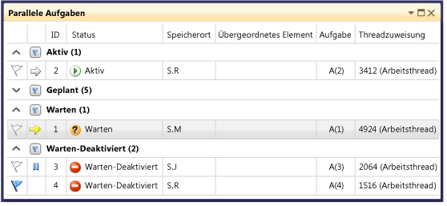
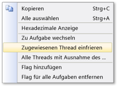

# Verwenden des Fensters "Aufgaben"

Die **Aufgaben** Fenster ähnelt der **Threads** Fenster mit dem Unterschied, dass die It Informationen über zeigt <xref:System.Threading.Tasks.Task?displayProperty=fullName>, [Task_handle](/cpp/parallel/concrt/reference/task-group-class), oder [WinJS.Promise ](/previous-versions/windows/apps/br211867(v=win.10)) -Objekte anstelle von jedem Thread. Wie Threads stellen auch Aufgaben asynchrone Vorgänge dar, die gleichzeitig ausgeführt werden können. Es dürfen jedoch mehrere Aufgaben im selben Thread ausgeführt werden.

In verwaltetem Code können Sie die **Aufgaben** Fenster bei der Arbeit mit <xref:System.Threading.Tasks.Task?displayProperty=fullName> Objekte oder mit der **"await"** und **Async** Schlüsselwörter (**"await"** und **Async** in Visual Basic). Weitere Informationen zu Aufgaben in verwaltetem Code finden Sie unter [zur parallelen Programmierung](/dotnet/standard/parallel-programming/index).

In nativem Code können Sie die **Aufgaben** Fenster bei der Arbeit mit [Aufgabengruppen](/cpp/parallel/concrt/task-parallelism-concurrency-runtime), [parallele Algorithmen](/cpp/parallel/concrt/parallel-algorithms), [asynchrone Agents](/cpp/parallel/concrt/asynchronous-agents), und [einfache Aufgaben](/cpp/parallel/concrt/task-scheduler-concurrency-runtime). Weitere Informationen zu Aufgaben in systemeigenem Code, finden Sie unter [Concurrency Runtime](/cpp/parallel/concrt/concurrency-runtime).

In JavaScript können Sie das Fenster "Aufgaben" Wenn Sie mit der Zusage arbeiten `.then` Code. Finden Sie unter [asynchrone Programmierung in JavaScript (UWP-apps)](/previous-versions/windows/apps/hh700330(v=win.10)) für Weitere Informationen.

Sie können die **Aufgaben** Fenster, wenn Sie den Debugger zu unterbrechen. Sie können darauf zugreifen, auf die **Debuggen** Menü, indem Sie auf **Windows** , und klicken Sie dann auf **Aufgaben**. Die folgende Abbildung zeigt die **Aufgaben** Fenster im Standardmodus.

> [!NOTE]
> In verwaltetem Code eine <xref:System.Threading.Tasks.Task> -Objekt mit dem Status der [TaskStatus.Created](<xref:System.Threading.Tasks.TaskStatus.Created>), [TaskStatus.WaitingForActivation](<xref:System.Threading.Tasks.TaskStatus.WaitingForActivation>), oder [TaskStatus.WaitingToRun](<xref:System.Threading.Tasks.TaskStatus.WaitingToRun>) möglicherweise nicht angezeigt der **Aufgaben** Wartungszeitfensters, in verwalteten Threads in einem Standby- oder Verknüpfungszustand Zustand befinden.

## Informationen in der Spalte „Aufgaben“

Die Spalten in der **Aufgaben** Fenster die folgenden Informationen angezeigt.

|Spaltenname|Beschreibung|
|-----------------|-----------------|
|**Flags**|Zeigt an, welche Aufgaben gekennzeichnet sind. Zudem können Sie Aufgaben kennzeichnen bzw. deren Kennzeichnung aufheben.|
|**Symbole**|Ein gelber Pfeil gibt die aktuelle Aufgabe an. Die aktuelle Aufgabe ist die oberste Aufgabe im aktuellen Thread.   Ein weißer Pfeil gibt die unterbrechende Aufgabe an, d. h., die Aufgabe, die beim Aufrufen des Debuggers aktuell war.   Das Pausensymbol gibt eine Aufgabe an, die vom Benutzer eingefroren wurde. Sie können eine Aufgabe einfrieren und deaktivieren, indem Sie in der Liste mit der rechten Maustaste darauf klicken.|
|**ID**|Eine vom System bereitgestellte Nummer für die Aufgabe. In nativem Code ist diese Nummer die Adresse der Aufgabe.|
|**Status**|Der aktuelle Status (geplant, aktiv, blockiert, blockiert, wartet auf oder abgeschlossen) der Aufgabe. Eine geplante Aufgabe wurde noch nicht ausgeführt und verfügt daher noch über keine Aufrufliste, keinen zugewiesenen Thread oder weitere Informationen.   Eine aktive Aufgabe hat vor dem Unterbrechen im Debugger Code ausgeführt.   Eine wartet auf oder auf blockierte Aufgabe ist blockiert, da er auf ein Ereignis signalisiert werden, eine Sperre aufgehoben wird oder auf den Abschluss einer anderen Aufgabe wartet.   Eine blockierte Aufgabe ist eine wartende Aufgabe, deren Thread an einem anderen Thread blockiert ist.   Zeigen Sie auf die **Status** Zelle für eine Aufgabe blockiert oder wartet auf, um weitere Informationen zum Block anzuzeigen. **Warnung:** der **Aufgaben** Fenster zeigt Deadlocks nur für eine blockierte Aufgabe, die eine Synchronisierungsprimitive verwendet werden, die von Wait Chain Traversal (WCT) unterstützt wird. Z. B. für einen Deadlock <xref:System.Threading.Tasks.Task> -Objekt, das WCT verwendet wird, meldet der Debugger **erwartet-deadlocked**. Für eine Aufgabe mit Deadlock, die von der Concurrency Runtime verwaltet wird, die nicht WCT verwendet wird, meldet der Debugger **warten**. Weitere Informationen zu WCT finden Sie unter [Wait Chain Traversal](/windows/desktop/Debug/wait-chain-traversal).|
|**Startzeit**|Die Uhrzeit, zu der die Aufgabe aktiviert wurde.|
|**Dauer**|Die Anzahl von Sekunden, die die Aufgabe aktiv war.|
|**Abschlusszeit**|Die Uhrzeit, zu der die Aufgabe abgeschlossen wurde.|
|**Position**|Die aktuelle Position in der Aufrufliste der Aufgabe. Zeigen Sie auf diese Zelle, um die gesamte Aufrufliste für die Aufgabe anzuzeigen. Für geplante Aufgaben ist in dieser Spalte kein Wert vorhanden.|
|**Aufgabe**|Die ursprüngliche Methode und Argumente, die beim Erstellen an die Aufgabe übergeben wurden.|
|**AsyncState**|Für verwalteten Code ist dies der Aufgabenstatus. Standardmäßig ist diese Spalte ausgeblendet. Um diese Spalte anzuzeigen, öffnen Sie das Kontextmenü für einen der Spaltenheader. Wählen Sie **Spalten**, **AsyncState**.|
|**Übergeordnete**|Die ID der Aufgabe, von der diese Aufgabe erstellt wurde. Wenn diese Spalte leer ist, verfügt die Aufgabe über kein übergeordnetes Element. Dies gilt nur für verwaltete Programme.|
|**Threadzuweisung**|Die ID und der Name des Threads, in dem die Aufgabe ausgeführt wird.|
|**AppDomain**|Für verwalteten Code die Anwendungsdomäne, in der die Aufgabe ausgeführt wird.|
|**task_group**|Für nativen Code die Adresse der [Task_group](/cpp/parallel/concrt/reference/task-group-class) -Objekt, das die Aufgabe geplant. Für asynchrone Agents und einfache Aufgaben wird diese Spalte auf 0 festgelegt.|
|**Process**|Die ID des Prozesses, in dem die Aufgabe ausgeführt wird.|

 Sie können der Ansicht Spalten hinzufügen, indem Sie mit der rechten Maustaste auf eine Spaltenüberschrift klicken und die gewünschten Spalten auswählen. (Entfernen Sie Spalten, indem Sie die jeweilige Auswahl aufheben.) Sie können auch die Anordnung der Spalten ändern, indem Sie sie nach links oder rechts ziehen. Das Kontextmenü für Spalten wird in der folgenden Abbildung veranschaulicht.

 

## Sortieren von Aufgaben
 Wenn Sie Aufgaben nach Spaltenkriterien sortieren möchten, klicken Sie auf den Spaltenheader. Beispielsweise, indem Sie auf die **ID** Spaltenüberschrift klicken, können Sie die Aufgaben nach Aufgaben-ID sortieren: 1,2,3,4,5 usw. Klicken Sie erneut auf den Spaltenheader, um die Sortierreihenfolge umzukehren. Die aktuelle Sortierspalte und die Sortierreihenfolge werden durch einen Pfeil in der Spalte angegeben.

## Gruppieren von Aufgaben
 Sie können Aufgaben nach jeder Spalte in der Listenansicht gruppieren. Z. B. durch einen Rechtsklick auf die **Status** Spaltenüberschrift, und klicken Sie dann auf **Group by-** > **[*Status*]**, können Sie Gruppieren Sie alle Aufgaben, die den gleichen Status aufweisen. Beispielsweise können Sie schnell erkennen, Tasks erwartet, sodass Sie untersuchen können, welchen Gründen diese blockiert werden. Sie können auch Gruppen reduzieren, die während der Debugsitzung nicht von Interesse sind. Auf die gleiche Weise können Sie nach den anderen Spalten gruppieren. Eine Gruppe kann gekennzeichnet bzw. die Kennzeichnung einer Gruppe kann aufgehoben werden, indem Sie auf die Schaltfläche neben dem Gruppenheader klicken. Die folgende Abbildung zeigt die **Aufgaben** Fenster im gruppierten Modus.

 

## Ansicht über- und untergeordneter Elemente
 (Diese Ansicht ist nur für verwalteten Code verfügbar.) Mit der rechten Maustaste die **Status** Spaltenüberschrift, und klicken Sie dann auf **Group by-** > **übergeordneten**, können Sie die Liste der Aufgaben in eine hierarchische Ansicht, in denen ändern jede untergeordnete Aufgabe ist es sich um einen Unterknoten darstellt, der angezeigt werden kann oder die unter dem übergeordneten Element ausgeblendet werden kann.

## Kennzeichnen von Aufgaben
 Sie können den Thread, der die Aufgabe, die auf dem eine Aufgabe ausgeführt wird, wählen Sie die Aufgabe Liste, und klicken dann kennzeichnen **zugewiesenen Thread kennzeichnen** aus dem Kontextmenü oder durch Klicken auf das Flagsymbol in der ersten Spalte. Wenn Sie mehrere Aufgaben kennzeichnen, können Sie nach der Flagspalte sortieren, um alle gekennzeichneten Aufgaben an oberster Stelle anzuzeigen, sodass Sie sich auf die betreffenden Aufgaben konzentrieren können. Sie können auch die **parallele Stapel** Fenster ausschließlich gekennzeichnete Aufgaben. Damit können Sie Aufgaben herausfiltern, die für das Debugging nicht von Interesse sind. Flags werden nicht zwischen Debugsitzungen beibehalten.

## Einfrieren und Reaktivieren von Aufgaben
 Sie können den Thread, der auf dem eine Aufgabe ausgeführt wird, durch einen Rechtsklick auf das Aufgabenlistenelement, und klicken Sie dann auf Einfrieren **zugewiesenen Thread einfrieren**. (Wenn eine Aufgabe bereits eingefroren ist, wird der Befehl ist **zugewiesenen Thread entsperren**.) Wenn Sie einen Thread einfrieren, wird dieser Thread nicht ausgeführt, wenn Sie Code nach dem aktuellen Haltepunkt schrittweise durchlaufen. Die **Einfrieren aller Threads, aber diese eine** Befehl bleibt hängen alle Threads mit Ausnahme der, der das Aufgabenlistenelement ausführt.

 In der folgenden Abbildung werden die anderen Menüelemente für die einzelnen Aufgaben angezeigt.

 

## Wechseln das aktive Aufgabe oder den Zielframe

Die **zu Aufgabe wechseln** Befehl wird der aktuellen Aufgabe die aktive Aufgabe. Die **zu Rahmen wechseln** Befehl wird der ausgewählte Stack Rahmen für den aktiven Stapelrahmen. Der Debuggerkontext wechselt in den aktuellen Vorgang oder den ausgewählten Stapelrahmen.

## Siehe auch

- [Debugger – Grundlagen](../debugger/getting-started-with-the-debugger.md)
- [Debuggen von verwaltetem Code](../debugger/debugging-managed-code.md)
- [Parallele Programmierung](/dotnet/standard/parallel-programming/index)
- [Concurrency Runtime](/cpp/parallel/concrt/concurrency-runtime)
- [Verwenden des Fensters "Parallele Stapel"](../debugger/using-the-parallel-stacks-window.md)
- [Exemplarische Vorgehensweise: Debuggen einer parallelen Anwendung](../debugger/walkthrough-debugging-a-parallel-application.md)