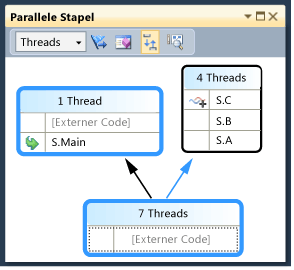
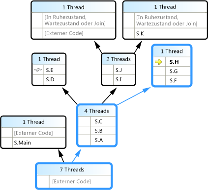
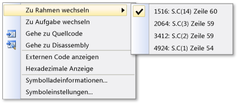
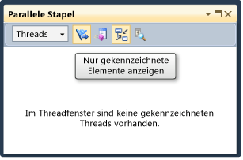
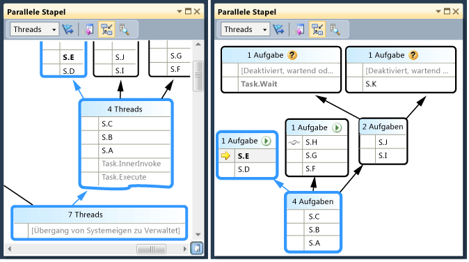
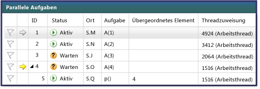
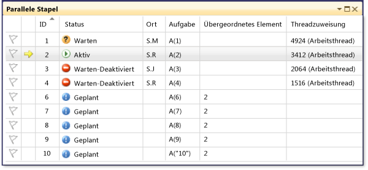
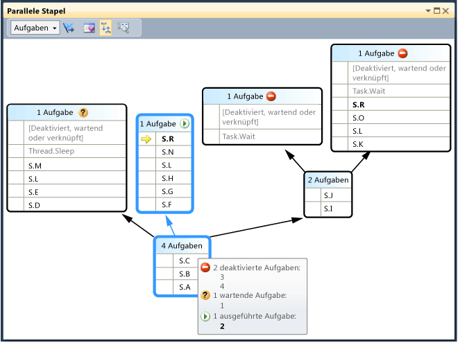
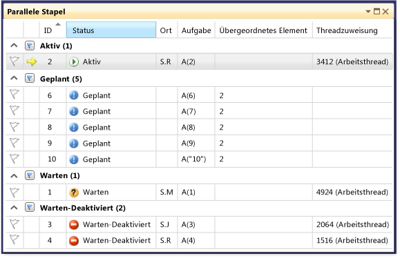

# Exemplarische Vorgehensweise: Debuggen einer parallelen Anwendung in Visual Studio
Diese exemplarische Vorgehensweise zeigt, wie die **Parallele Aufgaben** und **parallele Stapel** Windows zum Debuggen einer parallelen Anwendung. Diese Windows-Hilfe Sie verstehen, und überprüfen Sie das Laufzeitverhalten des Codes, der verwendet die [Task Parallel Library (TPL)](/dotnet/standard/parallel-programming/task-parallel-library-tpl) oder [Concurrency Runtime](/cpp/parallel/concrt/concurrency-runtime). Diese exemplarische Vorgehensweise bietet Beispielcode mit integrierten Haltepunkte. Nachdem der Code unterbrochen wird, die exemplarische Vorgehensweise zeigt, wie die **Parallele Aufgaben** und **parallele Stapel** Windows, um es zu untersuchen.  
  
 In dieser exemplarischen Vorgehensweise werden die folgenden Aufgaben erklärt:  
  
-   Anzeigen der Aufruflisten aller Threads in einer Ansicht.  
  
-   Anzeigen der Liste der `System.Threading.Tasks.Task`-Instanzen, die in der Anwendung erstellt werden.  
  
-   Anzeigen der tatsächlichen Aufruflisten mit Aufgaben anstelle von Threads.  
  
-   Gewusst wie: Navigieren zu Code aus der **Parallele Aufgaben** und **parallele Stapel** Windows.  
  
-   Skalieren der Fenster durch Gruppieren, Vergrößern/Verkleinern und sonstigen entsprechenden Funktionen.  
  
## Voraussetzungen  
 Diese exemplarische Vorgehensweise setzt voraus, dass **nur mein Code** aktiviert ist (er ist standardmäßig aktiviert, in neueren Versionen von Visual Studio). Auf der **Tools** Menü klicken Sie auf **Optionen**, erweitern Sie die **Debuggen** Knoten **allgemeine**, und wählen Sie dann **aktivieren Nur mein Code (nur verwaltet)**. Wenn Sie diese Funktion nicht festlegen, können Sie die vorliegende exemplarische Vorgehensweise zwar verwenden, Ihre Ergebnisse weichen jedoch möglicherweise von den Abbildungen ab.  
  
## C#-Beispiel  
 Wenn Sie das C#-Beispiel verwenden, wird in dieser exemplarischen Vorgehensweise auch davon ausgegangen, dass externer Code ausgeblendet ist. Maustaste zum Umschalten der Anzeige von externem Code, der **Namen** Tabellenheader der **Aufrufliste** Fenster, und aktivieren bzw. deaktivieren **externen Code anzeigen**. Wenn Sie diese Funktion nicht festlegen, können Sie die vorliegende exemplarische Vorgehensweise zwar verwenden, Ihre Ergebnisse weichen jedoch möglicherweise von den Abbildungen ab.  
  
## C++-Beispiel  
 Wenn Sie das C++-Beispiel verwenden, können Sie Verweise auf externen Code in diesem Thema ignorieren. Externer Code bezieht sich ausschließlich auf das C#-Beispiel.  
  
## Abbildungen  
 Die Abbildungen in diesem Thema wurden auf einem Quad-Core-Computer aufgezeichnet, auf dem das C#-Beispiel ausgeführt wird. Sie können diese exemplarische Vorgehensweise auch mit anderen Konfigurationen durcharbeiten. Die Abbildungen unterscheiden sich jedoch möglicherweise von der Anzeige auf Ihrem Computer.  
  
## Erstellen des Beispielprojekts  
 Der Beispielcode in dieser exemplarischen Vorgehensweise ist für eine Anwendung ohne konkrete Aufgaben. Das Ziel besteht lediglich darin zu erläutern, wie mit den Toolfenstern parallele Anwendungen gedebuggt werden.  
  
#### So erstellen Sie das Beispielprojekt  
  
1.  Zeigen Sie in Visual Studio im Menü **Datei** auf **Neu**, und klicken Sie auf **Projekt**.  
  
2.  In der **installierte Vorlagen** Bereich, wählen Sie entweder Visual c#, Visual Basic oder Visual C++. Stellen Sie für verwaltete Sprachen sicher, dass im Frameworkfeld [!INCLUDE[net_v40_short](../code-quality/includes/net_v40_short_md.md)] angezeigt wird.  
  
3.  Wählen Sie **Konsolenanwendung** , und klicken Sie dann auf **OK**. Behalten Sie die Debugkonfiguration bei (Standardeinstellung).  
  
4.  Öffnen Sie die CPP-, CS- oder VB-Codedatei im Projekt. Löschen Sie den Dateiinhalt, um eine leere Codedatei zu erstellen.  
  
5.  Fügen Sie den folgenden Code für die ausgewählte Sprache in die leere Codedatei ein.  
  
 [!code-csharp[Debugger#1](../debugger/codesnippet/CSharp/walkthrough-debugging-a-parallel-application_1.cs)]
 [!code-cpp[Debugger#1](../debugger/codesnippet/CPP/walkthrough-debugging-a-parallel-application_1.cpp)]
 [!code-vb[Debugger#1](../debugger/codesnippet/VisualBasic/walkthrough-debugging-a-parallel-application_1.vb)]  
  
1.  Auf der **Datei** Menü klicken Sie auf **alle speichern**.  
  
2.  Auf der **erstellen** Menü klicken Sie auf **Projektmappe neu erstellen**.  
  
     Beachten Sie, dass es vier Aufrufe zu `Debugger.Break` (`DebugBreak` im C++-Beispiel) gibt. Daher müssen keine Haltepunkte eingefügt werden; wenn nur die Anwendung ausgeführt wird, hat dies bis zu vier Unterbrechungen im Debugger zur Folge.  
  
## Verwenden des Fensters Parallele Stapel: Threadansicht  
 Klicken Sie im Menü **Debuggen** auf **Debuggen starten**. Warten Sie, bis der erste Haltepunkt erreicht wird.  
  
#### So zeigen Sie die Aufrufliste eines einzelnen Threads an  
  
1.  Auf der **Debuggen** Sie im Menü **Windows** , und klicken Sie dann auf **Threads**. Andocken der **Threads** -Fensters am unteren Rand von Visual Studio.  
  
2.  Auf der **Debuggen** Sie im Menü **Windows** , und klicken Sie dann auf **Aufrufliste**. Andocken der **Aufrufliste** -Fensters am unteren Rand von Visual Studio.  
  
3.  Doppelklicken Sie auf einen Thread in der **Threads** Fenster zum aktuellen werden soll. Aktuelle Threads sind durch einen gelben Pfeil gekennzeichnet. Wenn Sie den aktuellen Thread ändern, wird seine Aufrufliste angezeigt, der **Aufrufliste** Fenster.  
  
#### So untersuchen Sie das Fenster Parallele Stapel  
  
1.  Auf der **Debuggen** Sie im Menü **Windows** , und klicken Sie dann auf **parallele Stapel**. Stellen Sie sicher, dass **Threads** in das Feld in der oberen linken Ecke ausgewählt ist.  
  
     Mithilfe der **parallele Stapel** Fenster können Sie mehrere Aufruflisten gleichzeitig in einer Ansicht anzeigen. Die folgende Abbildung zeigt die **parallele Stapel** oben im Fenster der **Aufrufliste** Fenster.  
  
       
  
     Die Aufrufliste des Hauptthreads wird in einem Feld angezeigt, während die Aufruflisten für die anderen vier Threads als Gruppe in einem anderen Feld angezeigt werden. Vier Threads werden als Gruppe angezeigt, da für ihre Stapelrahmen dieselben Methodenkontexte verwendet werden; d. h., sie befinden sich in denselben Methoden: `A`, `B` und `C`. Zum Anzeigen der Thread-IDs und Namen der Threads, die gemeinsam das gleiche Feld bewegen Sie den Mauszeiger über das Feld mit dem Header (**4 Threads**). Der aktuelle Thread wird fett formatiert angezeigt.  
  
       
  
     Der gelbe Pfeil gibt den aktiven Stapelrahmen des aktuellen Threads an.
  
     Sie können festlegen, wie viele Details für die Stapelrahmen angezeigt (**Modulnamen**, **Parametertypen**, **Parameternamen**, **Parameterwerte**, **Zeilennummern** und **Byte-Offsets**) mit der rechten Maustaste die **Aufrufliste** Fenster.  
  
     Durch eine blaue Hervorhebung um ein Feld wird angegeben, dass der aktuelle Thread zu diesem Feld gehört. Der aktuelle Thread wird auch durch den fett formatierten Stapelrahmen in der QuickInfo angegeben. Wenn Sie im Fenster Threads den Hauptthread doppelklicken, können Sie beobachten, die blaue Hervorhebung in der **parallele Stapel** Fenster entsprechend verschoben wird.  
  
       
  
#### So setzen Sie die Ausführung bis zum zweiten Haltepunkt fort  
  
1.  Um die Ausführung fortzusetzen, bis zum zweite Haltepunkt erreicht wird, auf die **Debuggen** Menü klicken Sie auf **Fortfahren**. In der folgenden Abbildung wird die Threadstruktur beim zweiten Haltepunkt dargestellt.  
  
       
  
     Beim ersten Haltepunkt gingen alle vier Threads von den Methoden S.A zu S.B zu S.C über. Diese Informationen in immer noch sichtbar ist die **parallele Stapel** Fenster, aber die vier Threads weiter ausgeführt haben. Ein Thread ist zu S.D und dann zu S.E übergegangen. Ein anderer hat mit S.F, S.G und S.H fortgefahren. Zwei andere wechselten zu S.I und S.J. Von dort ging einer zu S.K über, während der andere zu nicht vom Benutzer stammendem externen Code wechselte.  
  
     Sie können zeigen Sie auf den Header des Felds, z. B. **1 Thread** oder **2 Threads**, um die Thread-IDs der Threads anzuzeigen. Sie können mit dem Mauszeiger auf Stapelrahmen zeigen, um die Thread-IDs sowie andere Details zum Rahmen zu überprüfen. Die blaue Hervorhebung gibt den aktuellen Thread an, während mit dem gelben Pfeil der aktive Stapelrahmen des aktuellen Threads angegeben wird.  
  
     Die Faden-Symbol (interweaved Linien) Geben Sie den aktiven Stapelrahmen der der nicht aktuellen Threads an. In der **Aufrufliste** Fenster, doppelklicken Sie auf S.B, um die Frames zu wechseln. Die **parallele Stapel** Fenster gibt den aktuellen Stapelrahmen des aktuellen Threads an, mit einem grünen gekrümmten Pfeilsymbol.  
  
     In der **Threads** Fenster, wechseln Sie zwischen Threads, und beachten Sie, dass die Ansicht in der **parallele Stapel** Fenster wird aktualisiert.  
  
     Sie können die zu einem anderen Thread oder zu einem anderen Frame eines anderen Threads wechseln, indem Sie mithilfe des Kontextmenüs in der **parallele Stapel** Fenster. Z. B. mit der rechten Maustaste S.J, zeigen Sie auf **zu Rahmen wechseln**, und klicken Sie dann auf einen Befehl.  
  
       
  
     Maustaste auf S.C, und zeigen Sie auf **zu Rahmen wechseln**. Ein Befehl ist mit einem Häkchen versehen, das den Stapelrahmen des aktuellen Threads angibt. Sie können zu diesem Frame desselben Threads (nur der grüne Pfeil wird verschoben) wechseln, oder Sie können zum anderen Thread (die blaue Hervorhebung wird ebenfalls verschoben) wechseln. Die folgende Abbildung zeigt das Untermenü.  
  
       
  
     Wenn ein Methodenkontext nur einem Stapelrahmen zugeordnet ist, im Feldheader **1 Thread** und Sie können durch Doppelklicken zu wechseln. Wenn Sie auf einen Methodenkontext doppelklicken, dem mehrere Frames zugeordnet sind, wird das Menü automatisch aufgerufen. Wie Sie mit dem Mauszeiger auf die Methodenkontexte zeigen, wird rechts ein schwarzes Dreieck angezeigt. Wenn Sie auf dieses Dreieck klicken, wird ebenfalls das Kontextmenü geöffnet.  
  
     Bei großen Anwendungen mit einer Vielzahl von Threads kann es sich empfehlen, sich nur auf eine Teilmenge von Threads zu konzentrieren. Die **parallele Stapel** Fenster können Aufruflisten nur für gekennzeichnete Threads angezeigt. Verwenden Sie zum Kennzeichnen von Threads das Kontextmenü oder die erste Zelle eines Threads. 

     Klicken Sie auf der Symbolleiste auf die **nur gekennzeichnete Elemente anzeigen** Schaltfläche neben dem Listenfeld.  

       

     Jetzt nur der gekennzeichnete Thread wird in der **parallele Stapel** Fenster.
  
#### So setzen Sie die Ausführung bis zum dritten Haltepunkt fort  
  
1.  Um die Ausführung fortzusetzen, bis zum dritte Haltepunkt erreicht wird, auf die **Debuggen** Menü klicken Sie auf **Fortfahren**.  
  
     Wenn mehrere Threads in derselben Methode enthalten sind, diese sich jedoch nicht am Anfang der Aufrufliste befand, wird die Methode in verschiedenen Feldern angezeigt. Ein Beispiel am aktuellen Haltepunkt ist S.L. Hierin sind drei Threads enthalten, und die Methode wird in drei Feldern angezeigt. Doppelklicken Sie auf S.L.  
  
       
  
     Beachten Sie, dass S.L in den anderen beiden Feldern fett formatiert ist, damit dort ersichtlich ist, an welcher Stelle die Methode außerdem angezeigt wird. Wenn Sie anzeigen möchten, welche frames s.l aufrufen und welche frames Aufrufe, klicken Sie auf die **Methodenansicht ein-/ausschalten** auf der Symbolleiste. Die folgende Abbildung zeigt die Methodenansicht von der **parallele Stapel** Fenster.  
  
       
  
     Das Diagramm wurde für die ausgewählte Methode pivotiert, und diese wurde in einem eigenen Feld in der Mitte der Ansicht positioniert. Die Aufgerufenen und die Aufrufer werden am oberen und unteren Rand angezeigt. Klicken Sie auf die **Methodenansicht ein-/ausschalten** Schaltfläche erneut aus, um diesen Modus belassen.  
  
     Das Kontextmenü von der **parallele Stapel** Fenster weist zudem die folgenden anderen Elementen.  
  
    -   **Hexadezimale Anzeige** die Zahlen in den QuickInfos Dezimal-und hexadezimaldarstellung umgeschaltet.  
  
    -   **Symbol Settings** die entsprechenden Dialogfelder zu öffnen.  
  
    -   **Threads in Quelle anzeigen** Schaltet die Anzeige der Threadmarker in Ihrem Quellcode, der den Speicherort des Threads in Ihrem Quellcode angezeigt wird.
  
    -   **Externen Code anzeigen** werden alle Frames angezeigt, auch wenn sie nicht im Benutzercode sind. Das Diagramm wird erweitert, um die zusätzlichen Frames aufzunehmen (die möglicherweise abgeblendet dargestellt werden, da keine Symbole dafür vorhanden sind).  

2.  In der **parallele Stapel** Fenster, stellen Sie sicher, dass die **automatischen Bildlauf zu aktuellem Stapelrahmen durchführen** befindet sich auf der Symbolleiste auf.  

     Wenn Sie bei großen Diagrammen zum nächsten Haltepunkt wechseln, können Sie einen automatischen Bildlauf der Anzeige zum aktiven Stapelrahmen des aktuellen Threads ausführen lassen (d. h. des Threads, der den Haltepunkt zuerst erreicht hat).
  
3.  Bevor Sie, in fortfahren der **parallele Stapel** Fenster, einen Bildlauf ganz nach links und ganz nach unten.  
  
#### So setzen Sie die Ausführung bis zum vierten Haltepunkt fort  
  
1.  Um die Ausführung fortzusetzen, bis zum vierte Haltepunkt erreicht wird, auf die **Debuggen** Menü klicken Sie auf **Fortfahren**.  
  
     Beachten Sie, wie ein automatischer Bildlauf der Ansicht an die korrekte Position stattfindet. Schalten Sie zwischen Threads in der **Threads** Fenster oder Switch Stapelrahmen im die **Aufrufliste** Fenster, und beachten Sie, dass wie die Sicht Stapelrahmen zum richtigen Frame. Deaktivieren Sie **automatischen Bildlauf zu aktuellem Stapelrahmen durchführen** aus, und beobachten Sie den Unterschied.  
  
     Die **Vogelperspektive** auch hilfreich bei großen Diagrammen in der **parallele Stapel** Fenster. Wird standardmäßig die **Vogelperspektive** befindet sich auf. Aber Sie können es durch Klicken auf die Schaltfläche zwischen den Bildlaufleisten in der unteren rechten Ecke des Fensters umschalten, wie in der folgenden Abbildung dargestellt.  
  
       
  
     In Vogelperspektive können Sie das Rechteck schnell um das Diagramm verschieben.  
  
     Eine weitere Möglichkeit, das Diagramm in beliebiger Richtung zu verschieben, besteht darin, auf einen leeren Bereich des Diagramms zu klicken und das Diagramm an die gewünschte Stelle zu ziehen.  
  
     Zum Vergrößern und Verkleinern der Ansicht des Diagramms halten Sie STRG gedrückt, während Sie das Mausrad drehen. Sie können auch auf der Symbolleiste auf die Schaltfläche Zoom klicken und das Tool Zoom verwenden.  
  
     Sie können auch den Stapel in oben nach unten angeordnet anstatt von unten nach oben, anzeigen, indem Sie auf die **Tools** Menü auf **Optionen**, und klicken Sie dann aktivieren oder Deaktivieren der Option "unter" die **Debuggen** Knoten.  
  
2.  Bevor Sie fortfahren, auf die **Debuggen** Menü klicken Sie auf **Beenden des Debuggens** zu der die Ausführung.  
  
## Verwenden des Fensters Parallele Aufgaben und der Aufgabenansicht des Fensters Parallele Stapel  
 Es empfiehlt sich, vor dem Fortfahren die früheren Prozeduren abzuschließen.  
  
#### So starten Sie die Anwendung neu, bis der erste Haltepunkt erreicht wird  
  
1.  Auf der **Debuggen** Menü klicken Sie auf **Debuggen** und warten Sie, bis der erste Haltepunkt erreicht wird.  
  
2.  Auf der **Debuggen** Sie im Menü **Windows** , und klicken Sie dann auf **Threads**. Andocken der **Threads** -Fensters am unteren Rand von Visual Studio.  
  
3.  Auf der **Debuggen** Sie im Menü **Windows** , und klicken Sie auf **Aufrufliste**. Andocken der **Aufrufliste** -Fensters am unteren Rand von Visual Studio.  
  
4.  Doppelklicken Sie auf einen Thread in der **Threads** Fenster stellt die aktuelle. Aktuelle Threads sind durch einen gelben Pfeil gekennzeichnet. Wenn Sie den aktuellen Thread ändern, werden die anderen Fenster aktualisiert. Nun werden Aufgaben untersucht.  
  
5.  Auf der **Debuggen** Sie im Menü **Windows**, und klicken Sie dann auf **Aufgaben**. Die folgende Abbildung zeigt die **Aufgaben** Fenster.  
  
       
  
     Für jede ausgeführte Aufgabe können Sie die zugehörige ID lesen. Diese wird zusammen mit der gleichnamigen Eigenschaft, der ID und dem Namen des ausführenden Threads und ihrer Position zurückgegeben (wenn Sie mit dem Mauszeiger darauf zeigen, wird eine QuickInfo mit der gesamten Aufrufliste angezeigt). Außerdem unter dem **Aufgabe** Spalte sehen Sie die Methode, die in die Aufgabe übergeben wurde; in anderen Worten den Ausgangspunkt.  
  
     Alle Spalten können sortiert werden. Beachten Sie das Sortiersymbol, das Sortierspalte und -richtung angibt. Sie können auch die Anordnung der Spalten ändern, indem Sie sie nach links oder rechts ziehen.  
  
     Der gelbe Pfeil gibt die aktuelle Aufgabe an. Sie können zwischen Aufgaben wechseln, indem Sie auf eine Aufgabe doppelklicken oder indem Sie das Kontextmenü aufrufen. Beim Wechseln zwischen Aufgaben wird der zugrunde liegende Thread zum aktuellen Thread, und die übrigen Fenster werden aktualisiert.  
  
     Wenn Sie manuell von einer Aufgabe zu einer anderen wechseln, wird der gelbe Pfeil verschoben. Ein weißer Pfeil zeigt jedoch weiterhin die Aufgabe an, die die Unterbrechung des Debuggers verursacht hat.  
  
#### So setzen Sie die Ausführung bis zum zweiten Haltepunkt fort  
  
1.  Um die Ausführung fortzusetzen, bis zum zweite Haltepunkt erreicht wird, auf die **Debuggen** Menü klicken Sie auf **Fortfahren**.  
  
     Zuvor die **Status** Spalte alle Aufgaben als aktiv angezeigt, aber jetzt zwei Aufgaben blockiert werden. Aufgaben können aus vielen anderen Gründen blockiert werden. In der **Status** Spalte, zeigen Sie auf eine wartende Aufgabe, um zu erfahren, warum er blockiert wird. In der folgenden Abbildung wartet beispielsweise Aufgabe 3 auf Aufgabe 4.  
  
       
  
     Aufgabe 4 wiederum wartet auf einen Monitor, der zu dem Thread gehört, der Aufgabe 2 zugewiesen ist. (Mit der rechten Maustaste in der Kopfzeile, und wählen Sie **Spalten** > **Threadzuweisung** an den Thread Zuweisungswert für Aufgabe 2).
  
     
  
     Sie können eine Aufgabe kennzeichnen, indem Sie auf das Flag in der ersten Spalte von der **Aufgaben** Fenster.  
  
     Sie können kennzeichnen, können Sie Aufgaben zwischen den verschiedenen Haltepunkten einer Debugsitzung verfolgen oder Aufgaben filtern, deren Aufruflisten im, die **parallele Stapel** Fenster.  
  
     Wenn Sie verwendet die **parallele Stapel** Fenster oben, haben Sie die Anwendungsthreads angezeigt. Anzeigen der **parallele Stapel** zeigen Sie Fenster erneut, diesmal jedoch die Anwendungsaufgaben. Dazu **Aufgaben** in das Feld auf der linken oberen Ecke. In der folgenden Abbildung wird die Aufgabenansicht dargestellt.  
  
       
  
     Threads, die derzeit keine Aufgaben ausführen, werden nicht in der Aufgabenansicht des angezeigt werden die **parallele Stapel** Fenster. Auch für Threads, die Aufgaben ausführen, werden einige der für Aufgaben irrelevanten Stapelrahmen im Stapel von oben und unten gefiltert.  
  
     Anzeigen der **Aufgaben** Fenster erneut. Klicken Sie mit der rechten Maustaste auf einen Spaltenheader, um das Kontextmenü für die betreffende Spalte aufzurufen.  
  
     Über das Kontextmenü können Spalten hinzugefügt und entfernt werden. Die Spalte AppDomain ist z. B. nicht ausgewählt. Daher wird sie in der Liste nicht aufgeführt. Klicken Sie auf **übergeordneten**. Die **übergeordneten** Spalte wird ohne Werte für die vier Aufgaben angezeigt.  
  
#### So setzen Sie die Ausführung bis zum dritten Haltepunkt fort  
  
1.  Um die Ausführung fortzusetzen, bis zum dritte Haltepunkt erreicht wird, auf die **Debuggen** Menü klicken Sie auf **Fortfahren**.  
  
     Eine neue Aufgabe, Aufgabe 5, wird nun ausgeführt, und Aufgabe 4 ist nun wartend. Warum wird mit dem Mauszeiger auf die wartende Aufgabe in der **Status** Fenster. In der **übergeordneten** Spalte, beachten Sie, dass Aufgabe 4 ist der übergeordnete Aufgabe 5.  
  
     Um die über-/ unterordnungsbeziehung besser zu visualisieren, mit der rechten Maustaste in der Kopfzeile der Spalte, und klicken Sie dann auf **übergeordneten untergeordnete Ansicht**. Die Anzeige entspricht der folgenden Abbildung:  
  
       
  
     Beachten Sie, dass Aufgabe 4 und Aufgabe 5 im selben Thread ausgeführt werden (Anzeigen der **Threadzuweisung** Spalte, wenn es ausgeblendet ist). Diese Informationen werden nicht angezeigt, der **Threads** Fenster; dieser Stelle ist ein weiterer Vorteil der Anzeige der **Aufgaben** Fenster. Um dies zu bestätigen, zeigen Sie an der **parallele Stapel** Fenster. Stellen Sie sicher, dass Ihnen eingesehene **Aufgaben**. Suchen Sie die Aufgaben 4 und 5 durch Doppelklicken in der **Aufgaben** Fenster. Wenn Sie jedoch die blaue Hervorhebung der **parallele Stapel** Fenster wird aktualisiert. Sie können die Aufgaben 4 und 5 auch suchen, durch das Scannen der QuickInfos auf die **parallele Stapel** Fenster.  
  
       
  
     In der **parallele Stapel** rechten Maustaste auf S.P, und klicken Sie dann auf **zu Thread wechseln**. Das Fenster wechselt zur Threadansicht, und der entsprechende Frame wird angezeigt. Sie können beide Aufgaben im selben Thread sehen.  
  
       
  
     Dies ist ein weiterer Vorteil der Aufgabenansicht im die **parallele Stapel** Fenster im Vergleich zu den **Threads** Fenster.  
  
#### So setzen Sie die Ausführung bis zum vierten Haltepunkt fort  
  
1.  Um die Ausführung fortzusetzen, bis zum dritte Haltepunkt erreicht wird, auf die **Debuggen** Menü klicken Sie auf **Fortfahren**. Klicken Sie auf die **ID** Spaltenüberschrift sortiert nach ID auf. Die Anzeige entspricht der folgenden Abbildung:  
  
       
  
     Da Aufgabe 5 abgeschlossen wurde, wird sie nicht mehr angezeigt. Wenn also nicht die Groß-/Kleinschreibung auf dem Computer, und der Deadlock nicht angezeigt, Schritt einmal durch Drücken von **F11**.  
  
     Aufgabe 3 und Aufgabe 4 warten nun auf einander, und blockiert werden. Es sind auch fünf neue Aufgaben vorhanden, die untergeordnete Elemente von Aufgabe 2 darstellen und nun geplant sind. Geplante Aufgaben sind Aufgaben, die im Code gestartet, jedoch noch nicht ausgeführt wurden. Aus diesem Grund ihre **Speicherort** und **Threadzuweisung** Spalten sind leer.  
  
     Anzeigen der **parallele Stapel** Fenster erneut. Der Header der einzelnen Felder weist jeweils eine QuickInfo auf, in der die Thread-IDs und -Namen angegeben werden. Wechseln zur Ansicht der Aufgaben in der **parallele Stapel** Fenster. Zeigen Sie auf einen Header, um die Aufgaben-ID sowie den Namen und den Status der Aufgabe anzuzeigen, wie in der folgenden Abbildung veranschaulicht.  
  
       
  
     Sie können die Aufgaben nach Spalten gruppieren. In der **Aufgaben** Fenster mit der rechten Maustaste die **Status** Spaltenüberschrift, und klicken Sie dann auf **Gruppieren nach Status**. Die folgende Abbildung zeigt die **Aufgaben** nach Status gruppierte Fenster.  
  
       
  
     Sie können auch nach einer beliebigen anderen Spalte gruppieren. Durch das Gruppieren von Aufgaben können sich auf eine Teilmenge von Aufgaben konzentrieren. Jede reduzierbare Gruppe weist eine Anzahl von Elementen auf, die zu einer Gruppe gehören.
  
     Die letzte Funktion von der **Aufgaben** Fenster, um zu überprüfen ist das Kontextmenü, das angezeigt wird, wenn Sie eine Aufgabe mit der rechten Maustaste.  
  
     Im Kontextmenü sind weitere Befehle enthalten, die vom Status der Aufgabe abhängen. Folgende Befehle zählen **Kopie**, **Alles markieren**, **Hexadezimale Anzeige**, **wechseln zur Aufgabe**, **fixieren zugewiesen Thread-**, **dies jedoch alle Threads einfrieren**, und **zugewiesenen Thread entsperren**, und **Flag**.  
  
     Sie können den zugrunde liegenden Thread einer Aufgabe oder mehrerer Aufgaben einfrieren, oder Sie können alle Threads außer dem zugewiesenen Thread einfrieren. Ein eingefrorener Thread wird dargestellt, der **Aufgaben** Fenster, wie er befindet sich im die **Threads** Fenster durch ein blaues *anhalten* Symbol.  
  
## Zusammenfassung  
 Diese exemplarische Vorgehensweise veranschaulicht die **Parallele Aufgaben** und **parallele Stapel** Debuggerfenster. Verwenden Sie diese Fenster für tatsächliche Projekte, in denen Code mit mehreren Threads enthalten ist. Sie können parallelen Code in C++, C# oder Visual Basic untersuchen.  
  
## Siehe auch  
 [Debuggen von Multithreadanwendungen](../debugger/walkthrough-debugging-a-parallel-application.md)   
 [Debugger – Grundlagen](../debugger/debugger-basics.md)   
 [Debuggen von verwaltetem Code](../debugger/debugging-managed-code.md)   
 [Parallele Programmierung](/dotnet/standard/parallel-programming/index)   
 [Concurrency Runtime](/cpp/parallel/concrt/concurrency-runtime)   
 [Verwenden das Fenster "Parallele Stapel"](../debugger/using-the-parallel-stacks-window.md)   
 [Verwenden des Fensters „Aufgaben“](../debugger/using-the-tasks-window.md)