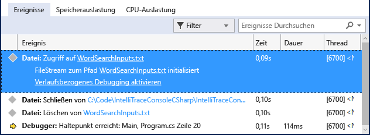
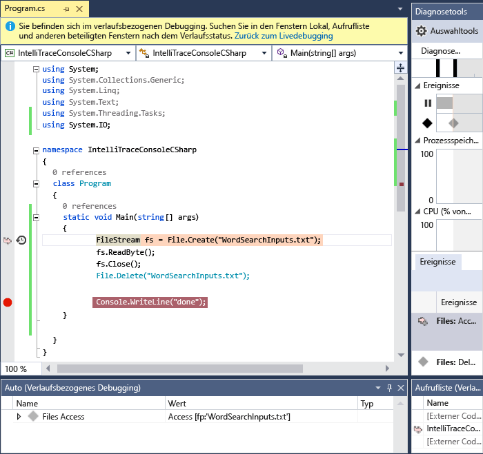

# Exemplarische Vorgehensweise: Verwenden von IntelliTrace
[!INCLUDE[vs2017banner](../code-quality/includes/vs2017banner.md)]

Sie können IntelliTrace zum Sammeln von Informationen über bestimmte Ereignisse oder Ereigniskategorien oder zum Erfassen von einzelnen Funktionsaufrufen zusätzlich zu den Ereignissen verwenden. In der folgenden Vorgehensweisen wird gezeigt, wie dies umzusetzen ist.  
  
 Sie können IntelliTrace in der Visual Studio Enterprise Edition verwenden\(jedoch nicht in der Professional oder Community Edition\).  
  
##  <a name="GettingStarted"></a> Verwenden von IntelliTrace nur mit  Ereignissen  
 Sie können ein Debugging nur mit IntelliTrace\-Ereignissen durchführen. IntelliTrace\-Ereignisse sind Debuggerereignisse, Ausnahmen, .NET Framework\-Ereignisse und andere Systemereignisse. Bevor Sie mit dem Debuggen beginnen, sollten Sie bestimmte Ereignisse aktivieren oder deaktivieren, um die von IntelliTrace aufgezeichneten Ereignisse zu steuern. Weitere Informationen finden Sie unter [IntelliTrace\-Features](../debugger/intellitrace-features.md).  
  
 Die folgenden Schritte zeigen das Debuggen nur mit IntelliTrace\-Ereignissen:  
  
1.  Aktivieren Sie das IntelliTrace\-Ereignis für den Dateizugriff. Wechseln Sie zur Seite **Extras \/ Optionen \/ IntelliTrace \/ IntelliTrace\-Ereignisse**, und erweitern Sie die Kategorie **Datei**. Aktivieren Sie die Ereigniskategorie **Datei**. Dadurch werden alle Dateiereignisse \(Zugriff, Schließen, Löschen\) überprüft.  
  
2.  Erstellen Sie eine C\#\- Konsolenanwendung. Fügen Sie in der Datei "Program.cs" die folgende `using`\-Anweisung hinzu:  
  
    ```c#  
    using System.IO;  
    ```  
  
3.  Erstellen Sie ein <xref:System.IO.FileStream>\-Element in der Main\-Methode, lesen Sie es aus, schließen Sie es, und löschen Sie die Datei. Fügen Sie eine weitere Zeile hinzu, um einen Haltepunkt festlegen zu können:  
  
    ```c#  
    static void Main(string[] args) { FileStream fs = File.Create("WordSearchInputs.txt"); fs.ReadByte(); fs.Close(); File.Delete("WordSearchInputs.txt"); Console.WriteLine("done"); }  
    ```  
  
4.  Legen Sie einen Haltepunkt auf `Console.WriteLine("done");` fest.  
  
5.  Starten Sie das Debuggen wie gewohnt. \(Drücken Sie **F5**, oder klicken Sie auf **Debuggen \/ Debugging starten**.  
  
    > [!TIP]
    >  Halten Sie während des Debuggens die Fenster **Lokal** und **Auto** geöffnet, um die Werte darin anzuzeigen und aufzuzeichnen.  
  
6.  Die Ausführung hält am Haltepunkt an. Wenn das Fenster **Diagnosetools** nicht angezeigt wird, klicken Sie auf **Debuggen \/ Fenster \/ IntelliTrace\-Ereignisse**.  
  
     Wechseln Sie im Fenster **Diagnosetools** zur Registerkarte **Ereignisse** \(es sollten drei Registerkarten vorhanden sein: **Ereignisse**, **Speicherauslastung** und **CPU\-Auslastung**\). Die Registerkarte **Ereignisse** zeigt eine chronologische Liste aller Ereignisse, die mit dem letzten Ereignis endet, bevor die Ausführung vom Debugger unterbrochen wurde. Es sollte ein Ereignis namens **Access WordSearchInputs.txt** angezeigt werden.  
  
     Der folgende Screenshot stammt aus Visual Studio 2015 Update 1.  
  
       
  
7.  Wählen Sie das Ereignis aus, um die Details zu erweitern.  
  
     Der folgende Screenshot stammt aus Visual Studio 2015 Update 1.  
  
       
  
     Sie können den Link des Pfadnamens auswählen, um die Datei zu öffnen. Wenn der vollständige Pfadname nicht verfügbar ist, wird das Dialogfeld **Datei öffnen** angezeigt.  
  
     Klicken Sie auf **Verlaufsbezogenes Debugging aktivieren**, um den Kontext des Debuggers auf den Zeitpunkt festzulegen, zu dem das ausgewählte Ereignis gesammelt wurde. So werden Verlaufsdaten in den Fenstern **Aufrufliste**, **Lokal** sowie in den anderen zugehörigen Debuggerfenstern angezeigt. Wenn Quellcode verfügbar ist, bewegt Visual Studio den Zeiger auf den entsprechenden Code im Quellcodefenster, damit Sie ihn überprüfen können.  
  
     Der folgende Screenshot stammt aus Visual Studio 2015 Update 1.  
  
       
  
8.  Wenn Sie den Fehler nicht finden, überprüfen Sie andere Ereignisse, die zu dem Fehler geführt haben. Sie können auch veranlassen, dass IntelliTrace Aufrufinformationen aufzeichnet, damit Sie die Funktionsaufrufe schrittweise durchlaufen können.  
  
## Verwenden von IntelliTrace mit  Ereignissen und Funktionsaufrufen  
 IntelliTrace kann neben Ereignissen auch Funktionsaufrufe aufzeichnen. Auf diese Weise können Sie den Verlauf der Aufrufliste anzeigen und Aufrufe in Ihrem Code schrittweise durchlaufen. IntelliTrace zeichnet Daten wie z. B. Funktionsnamen, Einstiegs\- und Endpunkte von Funktionen sowie bestimmte Parameter\- und Rückgabewerte auf. Siehe [IntelliTrace\-Features](../debugger/intellitrace-features.md).  
  
1.  Aktivieren Sie Aufrufauflistung ein. Wählen Sie unter **Extras \/ Optionen \/ IntelliTrace \/ Allgemein** die Option **IntelliTrace\-Ereignis\- und \-Aufrufinformationen** aus. IntelliTrace beginnt beim Start der nächsten Debugsitzung mit dem Sammeln dieser Informationen.  
  
    > [!TIP]
    >  Dies kann zu einer Verlangsamung der Anwendung und zu einer Vergrößerung aller auf dem Datenträger gespeicherten IntelliTrace\-Protokolldateien \(ITRACE\-Dateien\) führen. Um möglichst viele Aufrufdaten abzurufen, die Auswirkungen jedoch möglichst gering zu halten, zeichnen Sie nur die Daten aus den Modulen auf, die für Sie von Interesse sind. Um die maximale Größe der ITRACE\-Dateien zu ändern, wechseln Sie zu **Extras \/ Optionen \/ IntelliTrace \/ Erweitert**, und geben Sie die maximale Menge an Datenträgerspeicherplatz an. Der Standardwert ist 250 MB.  
  
2.  Beginnen Sie mit dem Debuggen der im vorherigen Abschnitt erstellten C\#\-Konsolenanwendung. Die Ausführung hält am Haltepunkt an. Wenn das Fenster **Diagnosetools** nicht angezeigt wird, klicken Sie auf **Debuggen \/ Fenster \/ IntelliTrace\-Ereignisse**.  
  
3.  Wechseln Sie zur Registerkarte **Aufrufe** .  
  
     Nun sehen Sie die Funktionsaufrufe Ihrer Anwendung, die mit dem Stammaufruf \(in der aktuellen Lösung der Main\-Einstiegspunkt\) beginnen und an der Stelle enden, an der die Ausführung unterbrochen wurde.  
  
     Wählen Sie einen der Funktionsaufrufe aus, und doppelklicken Sie darauf. Nun sollten die Einstiegs\- und Endpunkte der Funktion sowie die Aufrufe des aktuellen Aufrufs in anderen Funktionen und die vom Aufruf ausgelösten IntelliTrace\-Ereignisse angezeigt werden. Wenn Sie das verlaufsbezogene Debugging nicht aktiviert haben, wird es mit dieser Aktion aktiviert. Weitere Informationen zum verlaufsbezogenen Debuggen finden Sie unter [Verlaufsbezogenes Debugging](../debugger/historical-debugging.md).  
  
    > [!NOTE]
    >  Wie Sie sehen, sind einige Aufrufe abgeblendet. Dies liegt daran, dass IntelliTrace keine Daten aus den entsprechenden Modulen aufgezeichnet hat. Um diese Daten anzuzeigen, lassen Sie IntelliTrace Daten aus diesen Modulen sammeln. Informationen zum Angeben von Modulen finden Sie unter [IntelliTrace\-Features](../debugger/intellitrace-features.md).  
  
## Nächste Schritte