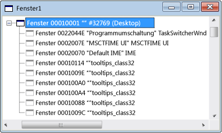

# Fensteransicht
Wenn Sie erstmalig Spy++ öffnen, zeigt Windows-Ansicht eine Struktur mit allen Windows- und Steuerelemente im System. Werden die Fenster-Handle und die Klasse angezeigt. Das aktuelle Desktopfenster ist am Anfang der Struktur. Alle anderen Fenster sind untergeordnete Elemente des Desktops, und anhand der Hierarchie Standardfenster aufgeführt sind. Gleichgeordnete Fenster werden im erweiterbaren Listen unter der übergeordneten Elemente eingezogen angezeigt.  
  
 Die folgende Abbildung zeigt eine typische Spy++-Windows-Ansicht mit den obersten Knoten erweitert.  
  
   
Spy++-Fensteransicht  
  
 Das aktuelle Desktopfenster ist am Anfang der Struktur. Alle anderen Fenster sind untergeordnete Elemente des Desktops, und werden anhand der Hierarchie Standardfenster mit nebengeordnete Fenster nach Z-Reihenfolge geordnet aufgeführt. Sie können erweitern oder reduzieren Sie alle übergeordneten Knoten der Struktur, indem Sie auf das + oder - Symbol neben dem Knoten.  
  
 Windows-Ansicht den Fokus hat, können Sie das Suchtool im Verwenden der [Fenster Meldungssuche (Dialogfeld)](../debugger/window-search-dialog-box.md) zum Anzeigen von Informationen in einem beliebigen geöffneten Fenster auf Ihrem System.  
  
## In diesem Abschnitt  
 [Vorgehensweise: Verwenden des Suchtools](../debugger/how-to-use-the-finder-tool.md)  
 Zeigt, wie dieses Tool Windows für die Eigenschaften oder Meldungen überprüft.  
  
 [Vorgehensweise: Suchen nach einem Fenster in der Fensteransicht](../debugger/how-to-search-for-a-window-in-windows-view.md)  
 Erläutert, wie Sie ein bestimmtes Fenster in der Windows-Ansicht.  
  
 [Vorgehensweise: Anzeigen von Fenstereigenschaften](../debugger/how-to-display-window-properties.md) m  
 Verfahren zum Öffnen des Dialogfelds Eigenschaften.  
  
## Verwandte Abschnitte  
 [Spy++-Ansichten](../debugger/spy-increment-views.md)  
 Erläutert die Spy++-Strukturansichten von Windows, Nachrichten, Prozesse und Threads.  
  
 [Verwenden von Spy++](../debugger/using-spy-increment.md)  
 Führt das Tool Spy++ und erläutert, wie sie verwendet werden kann.  
  
 [Dialogfeld "Fenster suchen"](../debugger/find-window-dialog-box.md)  
 Zum Anzeigen der Eigenschaften oder Nachrichten von einem bestimmten Fenster verwendet.  
  
 [Dialogfeld "Fenstersuche"](../debugger/window-search-dialog-box.md)  
 Verwendet, um den Knoten für ein bestimmtes Fenster in der Windows-Ansicht zu suchen.  
  
 [Fenstereigenschaften (Dialogfeld)](../debugger/window-properties-dialog-box.md)  
 Verwendet zum Anzeigen der Eigenschaften eines Fensters in Windows-Ansicht ausgewählt.  
  
 [Spy++-Referenz](../debugger/spy-increment-reference.md)  
 Enthält Abschnitte, die jedes Spy++ Menü- und Dialogfeldressourcen Feld beschreibt.