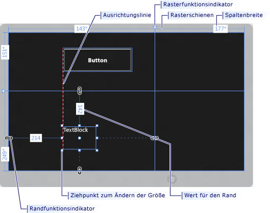
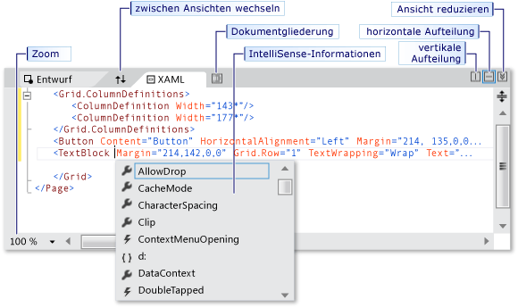

# Erstellen einer Benutzeroberfläche mit dem XAML-Designer in Visual Studio
Der XAML-Designer in Visual Studio stellt eine visuelle Schnittstelle bereit, mit der Sie XAML-basierte Windows- und Web-Apps entwerfen können. Sie können Benutzeroberflächen für Ihre Apps erstellen, indem Sie Steuerelemente aus der **Toolbox** ziehen und Eigenschaften im Fenster **Eigenschaften** festlegen. Sie können XAML-Code auch direkt in der XAML-Ansicht bearbeiten.

 Informationen zu erweiterten XAML-Designaufgaben, etwa Animationen und Verhalten, finden Sie unter [Creating a UI by using Blend for Visual Studio](../designers/creating-a-ui-by-using-blend-for-visual-studio.md). Siehe auch[Entwerfen von XAML-Code in Visual Studio und Blend für Visual Studio](../designers/designing-xaml-in-visual-studio.md).

## XAML-Designer-Arbeitsbereich
 Der Arbeitsbereich im XAML-Designer besteht aus mehreren visuellen Schnittstellenelementen. Diese umfassen die **Zeichenfläche**, den **XAML-Editor**, das **Gerätefenster**, das Fenster **Dokumentgliederung** und das Fenster **Eigenschaften**. Um den XAML-Designer zu öffnen, klicken Sie mit der rechten Maustaste auf eine XAML-Datei im **Projektmappen-Explorer** und wählen Sie **Ansicht-Designer**aus.

## Erstellungsansichten
 Der XAML-Designer stellt eine XAML-Ansicht und eine synchronisierte Entwurfsansicht des gerenderten XAML-Markups Ihrer App bereit. Mit einer XAML-Datei, die in Visual Studio geöffnet ist, können Sie zwischen Entwurfsansicht und XAML-Ansicht wechseln, indem Sie die Registerkarten **Entwurf** und **XAML** verwenden. Sie können die Schaltfläche **Bereiche austauschen** verwenden, um festzulegen, welches Fenster im Vordergrund angezeigt wird: entweder die Zeichenfläche oder der XAML-Editor.

 In der Entwurfsansicht ist das Fenster, welches die *Zeichenfläche* enthält, das aktive Fenster, und Sie können es als primäre Arbeitsoberfläche verwenden. Sie können es verwenden, um eine Seite Ihrer App visuell zu entwerfen, indem Sie Elemente hinzufügen oder zeichnen, und indem Sie diese dann ändern. Weitere Informationen finden Sie unter [Working with elements in XAML Designer](../designers/working-with-elements-in-xaml-designer.md). Diese Abbildung zeigt die Zeichenfläche in der Entwurfsansicht.

 

 Diese Funktionen sind auf der Zeichenfläche verfügbar:

 **Ausrichtungslinien** Ausrichtungslinien sind *Ausrichtungsgrenzen*, die als rot gestrichelte Linien angezeigt werden und verdeutlichen, wann die Ränder von Steuerelementen oder Textbaselines ausgerichtet sind. Ausrichtungsgrenzen werden nur angezeigt, wenn **Andocken an Ausrichtungslinien** aktiviert ist.

 **Rasterschienen** `Grid`-Schienen werden verwendet, um Zeilen und Spalten in einem [Raster](http://msdn.microsoft.com/library/windows/apps/windows.ui.xaml.controls.grid.aspx)-Bereich zu verwalten. Sie können Zeilen und Spalten erstellen und löschen, und Sie können jeweils ihre relative Breite und Höhe anpassen. Die vertikale Rasterschiene, die auf der linken Seite der Zeichenfläche angezeigt wird, wird für Zeilen verwendet, und die horizontale Linie, die oben angezeigt wird, wird für Spalten verwendet.

 **Rasteradorner** Ein Rasteradorner wird als Dreieck angezeigt, an das eine vertikale oder horizontale Linie auf der Rasterschiene angefügt ist. Wenn Sie einen Rasteradorner ziehen, werden die Breiten und Höhen von benachbarten Spalten oder Zeilen aktualisiert, während Sie die Maus verschieben.

 Rasteradorner werden verwendet, um die Breite und Höhe der Zeilen und Spalten eines Rasters zu steuern. Sie können eine neue Spalte oder Zeile hinzufügen, indem Sie in die Rasterschienen klicken. Wenn Sie eine neue Zeilen- oder Spaltenlinie für einen Rasterbereich hinzufügen, der mindestens zwei Spalten oder Zeilen enthält, wird außerhalb der Schiene eine Minisymbolleiste angezeigt, in der Sie die Breite und die Höhe genau festlegen können. In der Minisymbolleiste können Sie die Größenanpassungsoptionen für Zeilen und Spalten des Rasters festlegen.

 **Ziehpunkte zur Größenänderung** Ziehpunkte zur Größenänderung werden auf ausgewählten Steuerelementen angezeigt und ermöglichen Ihnen das Ändern der Größe des Steuerelements. Wenn Sie die Größe eines Steuerelements ändern, werden normalerweise die Werte für die Höhe und Breite angezeigt, um Ihnen bei der Größenfestlegung des Steuerelements behilflich zu sein. Weitere Informationen zum Bearbeiten von Steuerelementen in der **Entwurfsansicht** finden Sie unter [Arbeiten mit Elementen im XAML-Designer](../designers/working-with-elements-in-xaml-designer.md).

 **Ränder** Ränder sind fest definierte Abstände zwischen der Kante eines Steuerelements und der Kante dessen Containers. Sie können die Ränder eines Steuerelements festlegen, indem Sie die [Rand](http://msdn.microsoft.com/library/windows/apps/windows.ui.xaml.frameworkelement.margin.aspx) -Eigenschaften unter **Layout** im Eigenschaftenfenster verwenden.

 **Randadorner** Sie können Randadorner verwenden, um die Ränder eines Elements unter Berücksichtigung des jeweiligen Layoutcontainers zu ändern. Wenn ein Randfunktionsindikator geöffnet ist, wird kein Rand festgelegt, und der Randfunktionsindikator zeigt eine unterbrochene Kette an. Wenn der Rand nicht festgelegt wird, verbleiben Elemente an Ort und Stelle, wenn die Größe des Layoutcontainers zur Laufzeit geändert wird. Wenn ein Randadorner geschlossen ist, zeigt ein Randadorner eine nicht unterbrochene Kette an, und Elemente verschieben sich mit dem Rand, während der Layoutcontainer zur Laufzeit angepasst wird (der Rand bleibt unverändert).

 **Elementziehpunkte** Sie können ein Element ändern, indem Sie Elementziehpunkte verwenden, die auf der Zeichenfläche angezeigt werden, wenn Sie den Mauszeiger über die Ecken des blauen Felds bewegen, das ein Element umgibt. Mit diesen Handles können Sie das Element drehen, dessen Größe ändern, es spiegeln, verschieben oder ihm einen Eckradius hinzufügen. Das Symbol für das Elementhandle variiert je nach Funktion und ändert sich je nach der genauen Position des Zeigers. Wenn Sie die Elementhandles nicht sehen, stellen Sie sicher, dass das Element ausgewählt ist.

 In der **Entwurfsansicht** sind zusätzliche Zeichenflächenbefehle im unteren linken Bildschirmbereich verfügbar, wie hier gezeigt wird:

 

 Diese Befehle sind auf dieser Symbolleiste verfügbar:

 **Zoom** Mithilfe des Zooms können Sie die Entwurfsoberfläche skalieren. Sie können mit dem Zoom die Größe von 12,5 % bis 800 % ändern oder Optionen wie **An Auswahl anpassen** und **An Alle anpassen**auswählen.

 **Ausrichtungsgitter anzeigen/ausblenden** Zeigt das Ausrichtungsgitter an, das die Rasterlinien anzeigt, oder blendet es aus. Rasterlinien werden verwendet, wenn Sie entweder **Andocken an Rasterlinien** oder **Andocken an Ausrichtungslinien** aktivieren.

 **Andocken an Rasterlinien aktivieren bzw. deaktivieren** Wenn **Andocken an Rasterlinien** aktiviert ist und Sie ein Element auf der Zeichenfläche ziehen, richtet sich das Element im Allgemeinen an den nächstgelegenen horizontalen und vertikalen Rasterlinien aus.

 **Andocken an Ausrichtungslinien aktivieren bzw. deaktivieren** Mit Ausrichtungslinien können Sie mehrere Steuerelemente zueinander ausrichten. Wenn **Andocken an Ausrichtungslinien** aktiviert ist, wenn Sie ein Steuerelement relativ zu anderen Steuerelementen ziehen, werden Ausrichtungsgrenzen angezeigt, wenn die Kanten und der Text von einigen Steuerelementen horizontal oder vertikal ausgerichtet werden. Eine Ausrichtungsgrenze wird als rot-gestrichelte Linie angezeigt.

 In der **XAML**-Ansicht ist das Fenster mit dem XAML-Editor das aktive Fenster, und der XAML-Editor ist Ihr primäres Entwicklungstool. Die Extensible Application Markup Language (XAML) stellt ein deklaratives, auf XML basierendes Vokabular bereit, mit dem die Benutzeroberfläche einer Anwendung festgelegt werden kann. Die XAML-Ansicht enthält IntelliSense und automatische Formatierung, Syntaxhervorhebung und Tagnavigation. Diese Abbildung zeigt die XAML-Ansicht:

 

 **Leiste für geteilte Ansicht** Die Leiste für geteilte Ansicht wird am oberen Rand der XAML-Ansicht angezeigt, wenn sich der XAML-Editor im unteren Fenster befindet. Mit der Leiste für geteilte Ansicht können Sie die relative Größe der **Entwurfsansicht** und der **XAML**-Ansicht steuern. Sie können auch die Positionen der Ansichten austauschen (mithilfe der Schaltfläche **Bereiche austauschen** ). Außerdem können Sie angeben, ob die Ansichten horizontal oder vertikal angeordnet werden und jede dieser Ansichten reduzieren.

 **Markupzoom** Der Markupzoom ermöglicht es Ihnen, die **XAML**-Ansicht zu skalieren. Es stehen Zoomstufen von 20 % bis 400 % zur Verfügung.

## Gerätefenster
 Das **Gerätefenster** im XAML-Designer ermöglicht es Ihnen, während der Entwurfszeit verschiedene Ansichten, Anzeigevarianten und Anzeigeoptionen für Ihr Projekt zu simulieren. Das **Gerätefenster** ist im Menü **Entwurf** verfügbar, wenn Sie im XAML-Designer arbeiten. Hier sehen Sie, wie es aussieht:

 

 Dies sind die Optionen, die im Gerätefenster verfügbar sind:

 **Anzeige** Gibt die verschiedenen Anzeigegrößen und Auflösungen für die App an.

 **Ausrichtung** Gibt die verschiedenen Ausrichtungen für die App an: **Querformat** oder **Hochformat**.

 **Rand** Gibt die verschiedenen Randausrichtungen für die App an: **Beide**, **Links**, **Rechts** oder **Keine**.

 **Hoher Kontrast** Zeigt eine Vorschau der App anhand der gewählten Kontrasteinstellung an. Diese Einstellung überschreibt, sofern der Wert nicht auf **Standard** festgelegt ist, die in *App.xaml* festgelegte `RequestedTheme`-Eigenschaft.

 **Skalierung überschreiben** Schaltet die Emulation der Dokumentskalierung innerhalb der Entwurfsoberfläche ein und aus. Dies ermöglicht es Ihnen, den skalierenden Prozentsatz um einem Faktor zu erhöhen. Aktivieren Sie das Kontrollkästchen, um die Emulation einzuschalten. Wenn beispielsweise der Skalierungsprozentsatz 100 % beträgt, kann das Dokument innerhalb der Entwurfsoberfläche auf bis zu 140 % skaliert werden. Diese Option ist deaktiviert, wenn der aktuelle Skalierungsprozentsatz 180 beträgt.

 **Minimale Breite** Gibt die Einstellung für die Mindestbreite an. Die Mindestbreite kann in *App.xaml* geändert werden.

 **Thema** Gibt das App-Thema an. Beispielsweise können sie zwischen einem **dunklen** und einem **hellen** Thema wechseln.

 **Chrome anzeigen** Schaltet den simulierten Tabletrahmen um Ihre App in der Entwurfsansicht ein und aus. Aktivieren Sie das Kontrollkästchen, um den Rahmen anzuzeigen.

 **Auf Bildschirm zuschneiden** Gibt den Anzeigemodus an. Aktivieren Sie das Kontrollkästchen, wenn die Dokumentgröße auf die Größe der Anzeige zugeschnitten werden soll.

## Fenster Dokumentgliederung
 Das Dokumentgliederungsfenster im XAML-Designer unterstützt Sie bei der Ausführung dieser Aufgaben:

-   Anzeigen der hierarchischen Struktur aller Elemente auf der Zeichenfläche.

-   Auswählen von Elementen, sodass Sie diese ändern können (Verschieben der Objekte innerhalb der Hierarchie, Ändern der Objekte auf der Zeichenfläche, Festlegen ihrer Eigenschaften im Eigenschaftenfenster usw.). Weitere Informationen finden Sie unter [Arbeiten mit Elementen im XAML-Designer](../designers/working-with-elements-in-xaml-designer.md)

-   Erstellen und Ändern von Vorlagen für Elemente, welche Steuerelemente sind.

-   Verwenden Sie das Kontextmenü für ausgewählte Elemente. Das gleiche Menü ist auch für ausgewählte Elemente auf der Zeichenfläche verfügbar.

 Wählen Sie zum Anzeigen des Fensters **Dokumentgliederung** in der Menüleiste **Ansicht** > **Weitere Fenster** > **Dokumentgliederung** aus.

 

 Dies sind die verfügbaren Optionen im Fenster **Dokumentgliederung**:

 **Dokumentgliederung** In der Hauptansicht im Fenster **Dokumentgliederung** wird die Hierarchie eines Dokuments in einer Baumstruktur angezeigt. Sie können den hierarchischen Charakter der Dokumentgliederung verwenden, um das Dokument mit unterschiedlicher Detailliertheit zu überprüfen und um Elemente einzeln oder in Gruppen zu sperren und auszublenden.

 **Anzeigen/Ausblenden** Zeigt Zeichenflächenelemente an, die Elementen in der Dokumentgliederung entsprechen, oder blendet diese aus. Verwenden Sie die Schaltflächen **Anzeigen/Ausblenden**, die das Symbol eines Auges haben, wenn sie angezeigt werden, oder drücken Sie **STRG**+**H**, um Elemente auszublenden, und **UMSCHALT**+**STRG**+**H**, um diese anzuzeigen.

 **Sperren/Entsperren** Sperrt oder entsperrt Zeichenflächenelemente, die Elementen in der Dokumentgliederung entsprechen. Gesperrte Elemente können nicht geändert werden. Verwenden Sie die Schaltflächen **Sperren/Entsperren**, die beim Sperren ein Vorhängeschlosssymbol anzeigen, oder drücken Sie **STRG**+**L**, um Elemente zu sperren, und **UMSCHALT**+**STRG**+**L**, um diese zu entsperren.

 **Bereich auf pageRoot zurücksetzen:** Die Option oben im Fenster **Dokumentgliederung**, die als Pfeil-nach-oben-Symbol dargestellt wird, gibt die Dokumentgliederung an den vorherigen Bereich zurück. Die Vergrößerung des Bereichs ist nur möglich, wenn Sie sich im Bereich eines Stils oder einer Vorlage befinden.

## Eigenschaftenfenster
 Im Fenster **Eigenschaften** können Sie Eigenschaftswerte für Steuerelemente festlegen. Hier sehen Sie, wie es aussieht:

 

 Oben im Fenster **Eigenschaften** gibt es verschiedene Optionen. Sie können den Namen des aktuell ausgewählten Elements ändern, indem Sie das Feld **Name** verwenden. In der linken oberen Ecke gibt es ein Symbol, welches das aktuell ausgewählte Element darstellt. Um die Eigenschaften nach Kategorie oder alphabetisch zu sortieren, klicken Sie auf **Kategorie**, **Name**oder auf **Quelle** in der Liste **Anordnen nach** . Um die Liste der Ereignisse für ein Steuerelement zu sehen, klicken Sie auf die Schaltfläche **Ereignisse** , wodurch ein Blitzschlagsymbol angezeigt wird. Um nach einer Eigenschaft zu suchen, beginnen Sie mit der Eingabe des Namens der Eigenschaft im Feld **Eigenschaften durchsuchen** . Im Fenster **Eigenschaften** werden die Eigenschaften angezeigt, die mit Ihrer Suche übereinstimmen, während Sie Ihre Eingabe vornehmen. Einige Eigenschaften ermöglichen es Ihnen, erweiterte Eigenschaften festzulegen, indem Sie eine Nach-Unten-Schaltfläche auswählen. Weitere Informationen zur Verwendung von Eigenschaften und zur Behandlung von Ereignissen finden Sie unter [Schnellstart: Hinzufügen von Steuerelementen und Behandeln von Ereignissen](http://go.microsoft.com/fwlink/?LinkID=247983)

 Rechts von jedem Eigenschaftenwert befindet sich ein *Eigenschaftenmarker* , der als Feldsymbol angezeigt wird. Die Anzeige des Eigenschaftenmarkers weist darauf hin, ob es eine Datenbindung oder eine Ressource gibt, die auf die Eigenschaft angewendet wurde. Beispielsweise zeigt ein weißes Feldsymbol einen Standardwert an, ein schwarzes Feldsymbol zeigt in der Regel an, dass eine lokale Ressource angewendet wurde, und ein oranges Feld zeigt in der Regel an, dass eine Datenbindung angewendet wurde. Wenn Sie auf den Eigenschaftenmarker klicken, können Sie zur Definition eines Stils navigieren, den Datenbindungs-Generator öffnen oder die Ressourcenauswahl öffnen.

## Siehe auch

- [Arbeiten mit Elementen im XAML-Designer](../designers/working-with-elements-in-xaml-designer.md)
- [So erstellen Sie eine Ressource und wenden Sie an](../designers/how-to-create-and-apply-a-resource.md)
- [Exemplarische Vorgehensweise: Binden an Daten im XAML-Designer](../designers/walkthrough-binding-to-data-in-xaml-designer.md)