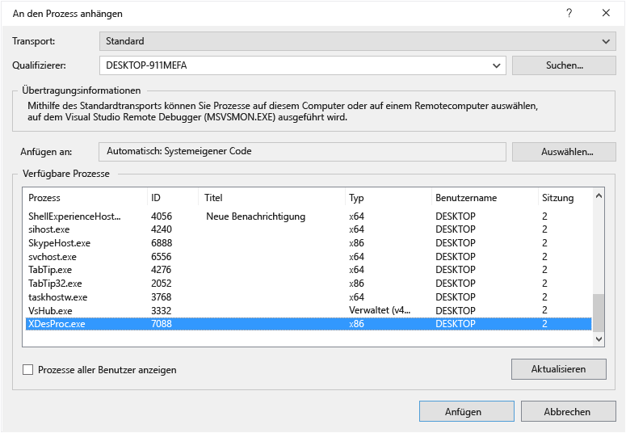

# Debuggen oder Deaktivieren von Projektcode im XAML-Designer
[!INCLUDE[vs2017banner](../code-quality/includes/vs2017banner.md)]

In vielen Fällen können Ausnahmefehler im XAML\-Designer durch Projektcode verursacht werden, der versucht, auf Eigenschaften oder Methoden zuzugreifen, die verschiedene Werte zurückgeben oder auf verschiedene Weise funktionieren, wenn die Anwendung im Designer ausgeführt wird. Sie können diese Ausnahmen auflösen, indem Sie den Projektcode in einer anderen Instanz von Visual Studio debuggen. Sie verhindern sie vorübergehend, indem Sie Projektcode im Designer deaktivieren.  
  
 Der Projektcode umfasst Folgendes:  
  
-   Benutzerdefinierte Steuerelemente und Benutzersteuerelemente  
  
-   Klassenbibliotheken  
  
-   Wertkonverter  
  
-   Bindungen für Entwurfszeitdaten, die aus Projektcode generiert werden  
  
 Wenn Projektcode deaktiviert ist, zeigt Visual Studio Platzhalter – z. B. den Namen der Eigenschaft für eine Bindung, in der die Daten nicht mehr verfügbar sind – oder einen Platzhalter für ein Steuerelement an, das nicht mehr ausgeführt wird.  
  
   
  
#### So ermitteln Sie, ob das Projektcode eine Ausnahme verursacht  
  
1.  Wählen Sie im Dialogfeld des Ausnahmefehlers den Link **Klicken Sie hier, um den Designer neu zu laden** aus.  
  
2.  Klicken Sie auf der Menüleiste auf **Debuggen** und **Debuggen starten**, um die Anwendung zu erstellen und auszuführen.  
  
     Wenn die Anwendung erfolgreich erstellt wurde und ausgeführt wird, wird die Ausnahme zur Entwurfszeit ggf. durch Projektcode verursacht, der im Designer ausgeführt wird.  
  
#### So debuggen Sie Projektcode, der im Designer ausgeführt wird  
  
1.  Wählen Sie im Dialogfeld des Ausnahmefehlers den Link **Klicken Sie hier, um das Ausführen von Projektcode zu deaktivieren und den Designer erneut zu laden** aus.  
  
2.  Wählen Sie im Windows Task\-Manager die Schaltfläche **Task beenden** aus, um alle Instanzen des XAML\-Designers von Visual Studio zu schließen, die zurzeit ausgeführt werden.  
  
       
  
3.  Öffnen Sie in Visual Studio die XAML\-Seite, die den Code oder das Steuerelement enthält, den bzw. das Sie debuggen möchten.  
  
4.  Öffnen Sie eine neue Instanz von Visual Studio, und öffnen Sie dann eine zweite Instanz Ihres Projekts.  
  
5.  Legen Sie einen Haltepunkt in Ihrem Projektcode fest.  
  
6.  Wählen Sie in der neuen Instanz von Visual Studio auf der Menüleiste **Debuggen** und **An den Prozess anhängen** aus.  
  
7.  Wählen Sie im Dialogfeld **An den Prozess anhängen** in der Liste **Verfügbare Prozesse** die Datei **XDesProc.exe** aus, und wählen Sie dann die Schaltfläche **Anfügen** aus.  
  
       
  
     Dies ist der Prozess für den XAML\-Designer in der ersten Instanz von Visual Studio.  
  
8.  Wählen Sie in der ersten Instanz von Visual Studio auf der Menüleiste **Debuggen** und dann **Debuggen starten** aus.  
  
     Sie können den Code nun schrittweise durchlaufen, der im Designer ausgeführt wird.  
  
#### So deaktivieren Sie Projektcode im Designer  
  
-   Wählen Sie im Dialogfeld des Ausnahmefehlers den Link **Klicken Sie hier, um das Ausführen von Projektcode zu deaktivieren und den Designer erneut zu laden** aus.  
  
-   Alternativ können Sie auf der Symbolleiste im XAML\-Designer die Schaltfläche **Projektcode deaktivieren**  auswählen.  
  
       
  
     Sie können die Schaltfläche erneut umschalten, um Projektcode erneut zu aktivieren.  
  
    > [!NOTE]
    >  Für Projekte für ARM\- oder X64\-Prozessoren kann Visual Studio keinen Projektcode im Designer ausführen. Die Schaltfläche **Projektcode deaktivieren** ist daher im Designer deaktiviert.  
  
-   Jede dieser Optionen bewirkt, dass der Designer erneut geladen und anschließend der gesamte Code für das zugehörige Projekt deaktiviert wird.  
  
    > [!NOTE]
    >  Das Deaktivieren von Projektcode kann zu einem Verlust von Entwurfszeitdaten führen. Eine Alternative besteht darin, den im Designer ausgeführten Code zu debuggen.  
  
## Siehe auch  
 [Designing XAML in Visual Studio and Blend for Visual Studio](../designers/designing-xaml-in-visual-studio.md)