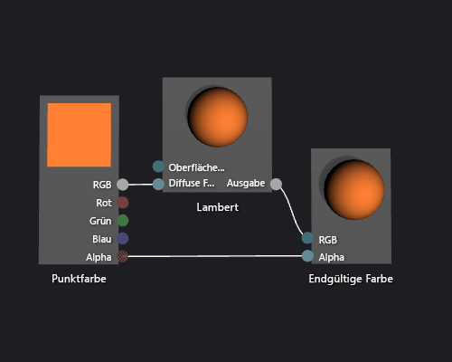

# Gewusst wie: Erstellen eines Lambert-Shaders
[!INCLUDE[vs2017banner](../code-quality/includes/vs2017banner.md)]

Dieses Dokument veranschaulicht, wie Sie den Shader\-Designer und die Directed Graph Shader Language \(DGSL\) verwenden, um einen Beleuchtungs\-Shader zu erstellen, der das klassische Lambert\-Beleuchtungsmodell implementiert.  
  
 In diesem Dokument werden die folgenden Aktivitäten veranschaulicht:  
  
-   Hinzufügen von Knoten einem Shaderdiagramm  
  
-   Trennen von Knoten  
  
-   Knoten verbinden  
  
## Das Lambert\-Beleuchtungsmodell  
 Das Lambert\-Beleuchtungsmodell umfasst Umgebungslicht und gerichtetes Licht, um Objekte in einer 3D\-Szene zu schattieren.  Die Umgebungsfarbe Komponenten stellen ein für eine grundlegende Beleuchtung in der 3D\-Szene.  Die direktionalen Komponenten stellen zusätzliche Beleuchtung aus den direktionalen \(weit entfernten\) Lichtquellen.  Die Umgebungsbeleuchtung hat die gleichen Auswirkungen auf alle Oberflächen in der Szene, unabhängig von ihrer Ausrichtung.  Für eine bestimmte Oberfläche ist dies das Produkt der Umgebungsfarbe der Oberfläche und der Farbe und Intensität des Umgebungslichts in der Szene.  Das gerichtete Licht hat auf jede Oberfläche in der Szene andere Auswirkungen, je nach Ausrichtung der Oberfläche im Verhältnis zur Richtung der Lichtquelle.  Es ist ein Produkt der diffusen Farbe und Ausrichtung der Oberfläche und der Farbe, Intensität und Richtung der Lichtquellen.  Oberflächen, die direkt in Richtung der Lichtquelle zeigen, erhalten die maximale Lichteinwirkung, und Oberflächen, die sich von der Lichtquelle abwenden, erhalten keine Lichteinwirkung.  unter dem Lambert\-Beleuchtungsmodell werden die Umgebungskomponente und eine oder mehrere Komponenten des gerichteten Lichts kombiniert, um festzustellen sich Rechnen auf diffusen Farbeinwirkung für jeden Punkt auf dem Objekt.  
  
 Bevor Sie beginnen, stellen Sie sicher, dass das Fenster **Eigenschaften** und der **Werkzeugkasten** angezeigt werden.  
  
#### So erstellen Sie einen Lambert\-Shader  
  
1.  Erstellen Sie einen DGSL\-Shader, mit dem Sie arbeiten können.  Wie Sie dem Projekt einen DGSL\-Shader hinzufügen, erfahren Sie im Abschnitt "Erste Schritte" in [Shader\-Designer](../designers/shader-designer.md).  
  
2.  Trennen Sie den Knoten **Punktfarbe** vom Knoten **Endgültige Farbe**.  Wählen Sie das **RGB** Terminal des Knotens **Punktfarbe**, und dann **Zeilen umbrechen** aus.  Lassen Sie das **Alpha** Terminal verbunden.  
  
3.  Fügen Sie dem Diagramm einen **Lambert**\-Knoten hinzu.  Wählen Sie im **Werkzeugkasten** unter **Hilfsprogramm** die Option **Lambert** aus, und verschieben Sie sie auf die Entwurfsoberfläche.  Der Lambert\-Knoten berechnet das gesamte Materials Farbeinwirkung des Pixels, auf Grundlage Umgebungslicht und Materials Beleuchtungsparameter.  
  
4.  Schließen Sie den Knoten **Punktfarbe** an den Knoten **Lambert** an.  Im Modus **Auswählen** verschieben Sie das **RGB** Terminal des Knotens **Punktfarbe** auf das Terminal **Diffuse Farbe** des Knotens **Lambert**.  Diese Verbindung stellt dem Lambert\-Knoten mit der interpolierten diffusen Farbe des Pixels.  
  
5.  Verbinden Sie den berechneten Farbwert mit der endgültigen Farbe.  Verschieben Sie das **Ausgabe** Terminal des Knotens **Lambert** auf das Terminal **RGB** des Knotens **Endgültige Farbe**.  
  
 Die folgende Abbildung zeigt das endgültige Shaderdiagramm und eine Vorschau des auf das Teekannenmodell angewendeten Shaders.  
  
> [!NOTE]
>  Um die Wirkung des Shaders in dieser Abbildung besser zu veranschaulichen, wurde eine orangefarbene Farbe verwendet wurde mit dem Parameter **MaterialDiffuse** des Shader verwendet.  Ein Spiel oder eine App können diesen Parameter verwenden, um einen eindeutigen Farbwert für jedes Objekt zu erzeugen.  Informationen zu passen Parameter, finden Sie Befehlsvorschau Shaderabschnitt in [Shader\-Designer](../designers/shader-designer.md).  
  
   
  
 Für einige Shader erzielen Sie mit bestimmte Formen möglicherweise bessere Vorschauen.  Weitere Informationen dazu, wie von Shadern im Shader\-Designer, finden Sie Befehlsvorschau Shaderabschnitt in [Shader\-Designer](../designers/shader-designer.md) in der Vorschau angezeigt.  
  
 Die folgende Abbildung zeigt den in diesem Dokument beschriebenen Shader, der auf ein 3D\-Modell angewendet wurde.  
  
   
  
 Weitere Informationen zum Anwenden eines Schaders in einem 3D\-Modell finden Sie unter [Gewusst wie: Anwenden eines Shaders auf ein 3D\-Modell](../designers/how-to-apply-a-shader-to-a-3-d-model.md).  
  
## Siehe auch  
 [Gewusst wie: Anwenden eines Shaders auf ein 3D\-Modell](../designers/how-to-apply-a-shader-to-a-3-d-model.md)   
 [Gewusst wie: Exportieren eines Shaders](../designers/how-to-export-a-shader.md)   
 [Gewusst wie: Erstellen eines standardmäßigen Phong\-Shaders](../designers/how-to-create-a-basic-phong-shader.md)   
 [Shader\-Designer](../designers/shader-designer.md)   
 [Shader\-Designer\-Knoten](../designers/shader-designer-nodes.md)