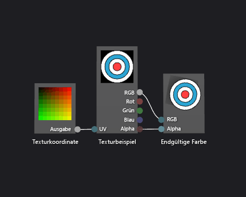

# Gewusst wie: Erstellen eines Basistextur-Shaders
[!INCLUDE[vs2017banner](../code-quality/includes/vs2017banner.md)]

In diesem Dokument wird die Verwendung des Shader\-Designers und der Directed Graph Shader Language \(DGSL\) zur Erstellung eines Einzeltexturshaders veranschaulicht.  Die endgültige Farbe wird vom Shader direkt auf RGB\- und Alphawerte festgelegt, die der Textur entnommen wurden.  
  
 In diesem Dokument werden die folgenden Aktivitäten veranschaulicht:  
  
-   Entfernen von Knoten aus einem Shaderdiagramm  
  
-   Knoten einem Diagramm hinzufügen  
  
-   Einstellungsshaderparameter  
  
-   Einstellungsparametersichtbarkeit  
  
-   Knoten verbinden  
  
## Erstellen eines Standadtexturshaders  
 Sie können einen Standard\-Einzeltexturshader implementieren, indem Sie die Farb\- und Alphawerte eines Texturesample direkt entsprechend der endgültigen Ausgabefarbe schreiben.  
  
 Bevor Sie beginnen, stellen Sie sicher, dass das Fenster **Eigenschaften** und der **Werkzeugkasten** angezeigt werden.  
  
#### So erstellen Sie einen Basistexturshader  
  
1.  Erstellen Sie einen DGSL\-Shader, mit dem Sie arbeiten können.  Wie Sie dem Projekt einen DGSL\-Shader hinzufügen, erfahren Sie im Abschnitt "Erste Schritte" in [Shader\-Designer](../designers/shader-designer.md).  
  
2.  Löschen Sie den Knoten **Punktfarbe**.  Wählen Sie im **Auswahl**\-Modus den Knoten **Punktfarbe** aus und wählen Sie in der Menüleiste **Bearbeiten** anschließend **Löschen** aus.  Dadurch wird Platz für den Knoten geschaffen, der im nächsten Schritt hinzugefügt wird.  
  
3.  Fügen Sie dem Diagramm einen Knoten **Texturesample** hinzu.  Wählen Sie im **Werkzeugkasten** unter **Struktur Texturesample** aus und bewegen Sie ihn auf die Entwurfsoberfläche.  
  
4.  Fügen Sie dem Diagramm einen Knoten **Texturkoordinate** hinzu.  Wählen Sie im **Werkzeugkasten** unter **Struktur Texturkoordinate** aus und bewegen Sie ihn auf die Entwurfsoberfläche.  
  
5.  Wählen Sie eine Textur, um gültig.  Im Modus **Auswählen** wählen Sie den Knoten **Textursample** und dann im Fenster **Eigenschaften**, angeben der Textur aus, die Sie verwenden möchten, indem Sie die Eigenschaft **Filename** verwenden.  
  
6.  Machen Sie die Textur öffentlich zugänglich.  Wählen Sie den Knoten **Textursample** und dann im Fenster **Eigenschaften**, legen Sie die Eigenschaft **Zugriff** auf **Öffentlich**.  Nun können Sie die Textur aus einem anderen Tool wie dem **Modell\-Editor** festlegen.  
  
7.  Verbinden Sie die Texturkoordinaten mit den Texturesample.  Verschieben Sie das **Ausgabe**\-Terminal des Knotens **Texturkoordinate** im **Auswahl**\-Modus zum **UV**\-Terminal des Knotens **Texturesample**.  Die Verbindung überprüft die Textur an den angegebenen Koordinaten.  
  
8.  Verbinden Sie das Texturesample mit der endgültigen Farbe.  Verschieben Sie das **RGB** Terminal des Knotens **Textursample** auf das Terminal **RGB** des Knotens **Endgültige Farbe**, und verschieben Sie das **Alpha** Terminal des Knotens **Textursample** auf das Terminal **Alpha** des Knotens **Endgültige Farbe**.  
  
 Die folgende Abbildung zeigt das endgültige Shaderdiagramm und eine Vorschau des auf einen Würfel angewendeten Shaders.  
  
> [!NOTE]
>  In dieser Abbildung ist eine Ebene verwendet, da die Vorschauform und eine Textur angegeben wurde, um die Auswirkungen des Shaders besser zu veranschaulichen.  
  
   
  
 Für einige Shader erzielen Sie mit bestimmte Formen möglicherweise bessere Vorschauen.  Weitere Informationen über die Vorschau von Shadern im Shader\-Designer finden Sie unter [Shader\-Designer](../designers/shader-designer.md)  
  
## Siehe auch  
 [Gewusst wie: Anwenden eines Shaders auf ein 3D\-Modell](../designers/how-to-apply-a-shader-to-a-3-d-model.md)   
 [Grafik\-Editor](../designers/image-editor.md)   
 [Shader\-Designer](../designers/shader-designer.md)   
 [Shader\-Designer\-Knoten](../designers/shader-designer-nodes.md)