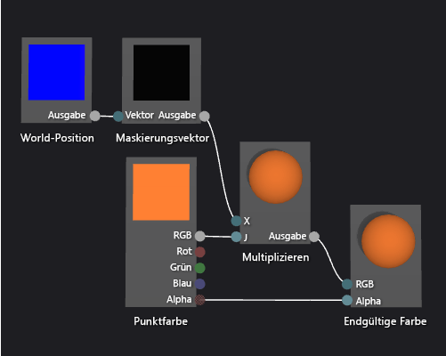

# Gewusst wie: Erstellen eines geometriebasierten Farbverlauf-Shaders
[!INCLUDE[vs2017banner](../code-quality/includes/vs2017banner.md)]

In diesem Dokument wird die Verwendung des Shader\-Designers und der Directed Graph Shader Language zur Erstellung eines geometriebasierten Farbverlaufsshaders beschrieben.  Der Shader skaliert einen konstanten RGB\-Farbwert anhand der Höhe jedes Punktes eines Objekts im Welt\-Raum.  
  
 In diesem Dokument werden die folgenden Aktivitäten veranschaulicht:  
  
-   Hinzufügen von Knoten einem Shaderdiagramm  
  
-   Knoteneigenschaften festlegen  
  
-   Trennen von Knoten  
  
-   Knoten verbinden  
  
## Erstellen eines geometriebasierten Farbverlaufsshaders  
 Sie können einen geometriebasierten Shader implementieren, indem Sie die Position des Pixels in den Shader integrieren.  In den Schattierungssprachen enthält ein Pixel mehr Informationen als nur die Farbe und Position auf einem 2D\-Bildschirm.  Pixel\-gewusst, da ein *Fragment* in mehreren eine Auflistung von Werten System\-ist, die eine Oberfläche beschreiben, die einem Pixel entspricht.  Der Shader, der in diesem Dokument beschriebene, verwendet die Höhe jedes Pixels eines 3D\-Objekts im Welt\-Raum, um die Ausgabefarbe des Fragments zu beeinflussen.  
  
 Bevor Sie beginnen, stellen Sie sicher, dass das Fenster **Eigenschaften** und der **Werkzeugkasten** angezeigt werden.  
  
#### So erstellen Sie einen geometriebasierten Farbverlaufshader  
  
1.  Erstellen Sie einen DGSL\-Shader, mit dem Sie arbeiten können.  Wie Sie dem Projekt einen DGSL\-Shader hinzufügen, erfahren Sie im Abschnitt "Erste Schritte" in [Shader\-Designer](../designers/shader-designer.md).  
  
2.  Trennen Sie den Knoten **Punktfarbe** vom Knoten **Endgültige Farbe**.  Wählen Sie das **RGB** Terminal des Knotens **Punktfarbe**, und dann **Zeilen umbrechen** aus.  Dadurch wird Platz für den Knoten geschaffen, der im nächsten Schritt hinzugefügt wird.  
  
3.  Fügen Sie dem Diagramm einen Knoten **Multiplizieren** hinzu.  Wählen Sie im **Werkzeugkasten** unter **Berechnungen** die Option **Multiplizieren** aus, und verschieben Sie sie auf die Entwurfsoberfläche.  
  
4.  Fügen Sie dem Diagramm einen Knoten **Maskierungsvektor** hinzu.  Wähen Sie im **Werkzeugkasten** unter **Hilfsprogramm** die Option **Maskierungsvektor** aus und verschieben Sie den Knoten auf die Entwurfsoberfläche.  
  
5.  Geben Sie für den Knoten **Maskierungsvektor** Maskenwerte an.  Im Modus **Auswählen** wählen Sie den Knoten **Maskierungsvektor** und dann im Fenster **Eigenschaften**, legen Sie die Eigenschaft **Grün \/ Y** auf **True** fest und legen Sie dann die Eigenschaften **Rot \/ X**, **Blau \/ Z** und **Alpha \/ W** auf **False**.  In diesem Beispiel entsprechen die Eigenschaften **Rot \/ X**, **Grün \/ Y** und **Blau \/ Z** den x, y und zu in z\-Komponenten des Knotens **World\-Position**, und **Alpha \/ W** wird nicht verwendet.  Da nur **Grün \/ Y** auf **True** festgelegt wurde, bleibt nur die y\-Komponente des Eingabevektors bestehen, nachdem sie maskiert wurde.  
  
6.  Fügen Sie dem Diagramm einen Knoten **Welt\-Position** hinzu.  Wählen Sie im **Werkzeugkasten** unter **Konstanten** die Option **World\-Position** aus und verschieben Sie ihn auf die Entwurfsoberfläche.  
  
7.  Maskieren Sie die Position des Fragments im Welt\-Raum.  Verschieben Sie das **Ausgabe** \-Terminal des Knotens **World\-Position** im **Auswahl**\-Modus zum **Vektor**\-Terminal des Knotens **Maskierungsvektor**.  Diese Verbindung maskiert die Position des Fragments, damit die X\- und z\-Komponenten ignorieren werden.  
  
8.  Multiplizieren Sie die RGB\-Farbenkonstante mit der maskierten Position im Welt\-Raum.  Verschieben Sie das **RGB** Terminal des Knotens **Punktfarbe** auf das Terminal **Y** des Knotens **Multiplizieren**, und verschieben Sie das **Ausgabe** Terminal des Knotens **Maskierungsvektor** auf das Terminal **X** des Knotens **Multiplizieren**.  Die Verbindung skaliert den Farbwert anhand der Höhe des Pixels im Raum.  
  
9. Verbinden Sie den skalierten Farbwert mit der endgültigen Farbe.  Verschieben Sie das **Ausgabe** Terminal des Knotens **Multiplizieren** auf das Terminal **RGB** des Knotens **Endgültige Farbe**.  
  
 Die folgende Abbildung zeigt das endgültige Shaderdiagramm und eine Vorschau des auf die Kugel angewendeten Shaders.  
  
> [!NOTE]
>  In der Abbildung wird zur besseren Veranschaulichung des Schadereffekts die Farbe Orange angegeben. Da die Vorschauform jedoch über keine Position im Welt\-Raum verfügt, wird der Shader nicht vollständig in der Vorschau des Shader\-Designers angezeigt.  Die Vorschau des Shader muss in einer wirklichen Szene angezeigt werden, damit der vollständige Effekt deutlich wird.  
  
   
  
 Für einige Shader erzielen Sie mit bestimmte Formen möglicherweise bessere Vorschauen.  Informationen darüber, wie von Shadern im Shader\-Designer, finden Sie in [Shader\-Designer](../designers/shader-designer.md)**Vorschau von Shadern** in der Vorschau angezeigt  
  
 Die folgende Abbildung veranschaulicht, wie der in diesem Dokument beschriebenen Shader auf die in [Gewusst wie: Modellieren eines 3D\-Geländes](../designers/how-to-model-3-d-terrain.md) dargestellte 3D\-Szene angewendet wird.  Die Farbintensität erhöht sich mit der Höhe des Punktes in der Welt.  
  
   
  
 Weitere Informationen zum Anwenden eines Schaders in einem 3D\-Modell finden Sie unter [Gewusst wie: Anwenden eines Shaders auf ein 3D\-Modell](../designers/how-to-apply-a-shader-to-a-3-d-model.md).  
  
## Siehe auch  
 [Gewusst wie: Anwenden eines Shaders auf ein 3D\-Modell](../designers/how-to-apply-a-shader-to-a-3-d-model.md)   
 [Gewusst wie: Exportieren eines Shaders](../designers/how-to-export-a-shader.md)   
 [Gewusst wie: Modellieren eines 3D\-Geländes](../designers/how-to-model-3-d-terrain.md)   
 [Gewusst wie: Erstellen eines Graustufentextur\-Shaders](../designers/how-to-create-a-grayscale-texture-shader.md)   
 [Shader\-Designer](../designers/shader-designer.md)   
 [Shader\-Designer\-Knoten](../designers/shader-designer-nodes.md)