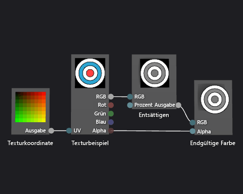

# Vorgehensweise: Erstellen eines Graustufentextur-Shaders

In diesem Artikel wird veranschaulicht, wie der Shader-Designer und die Directed Graph Shader Language (DGSL) zum Erstellen eines Graustufentextur-Shaders verwendet werden. Dieser Shader verändert die RGB-Farbwerte des Textursamples und verwendet es anschließend zusammen mit dem unveränderten Alphawert, um die endgültige Farbe festzulegen.

## Erstellen eines Graustufentextur-Shaders

Sie können einen Graustufentextur-Shader implementieren, indem Sie den Farbwert eines Textursamples ändern, bevor Sie es in die endgültige Ausgabefarbe schreiben.

Bevor Sie beginnen, stellen Sie sicher, dass das Fenster **Eigenschaften** und die **Toolbox** angezeigt werden.

1.  Erstellen Sie einen Basistexturshader wie unter [Vorgehensweise: Erstellen eines Basistexturshaders](../designers/how-to-create-a-basic-texture-shader.md) beschrieben.

2.  Trennen Sie das Terminal **RGB** des Knotens **Textursample** vom Terminal **RGB** des Knotens **Endgültige Farbe**. Klicken Sie im Modus **Auswählen** auf das Terminal **RGB** des Knotens **Textursample** und anschließend auf **Link aufheben**. Dadurch wird Platz für den Knoten geschaffen, der im nächsten Schritt hinzugefügt wird.

3.  Fügen Sie einen Knoten **Entsättigen** in das Diagramm ein. Klicken Sie in der **Toolbox** unter **Filter** auf **Entsättigen**, und verschieben Sie es auf die Entwurfsoberfläche.

4.  Berechnen Sie den Graustufenwert mithilfe des Knotens **Entsättigen**. Verschieben Sie im Modus **Auswählen** das Terminal **RGB** des Knotens **Textursample** auf das Terminal **RGB** des Knotens **Entsättigen**.

    > [!NOTE]
    > In der Standardeinstellung entsättigt der Knoten **Entsättigen** die Eingabefarbe vollständig und nutzt für die Graustufen-Konvertierung die normale Gewichtung der Leuchtdichte. Sie können ändern, wie sich der Knoten **Entsättigen** verhält, indem Sie entweder den Wert der Eigenschaft **Leuchtdichte** ändern, oder indem Sie die Eingabefarbe teilweise entsättigen. Bestimmen Sie einen Skalarwert im Bereich [0,1) für das Terminal **Prozent** des Knotens **Entsättigen**, um die Eingabefarbe teilweise zu entsättigen.

5.  Verbinden Sie den berechneten Graustufenwert mit der endgültige Farbe. Verschieben Sie das Terminal **Ausgabe** des Knotens **Entsättigen** auf das Terminal **RGB** des Knotens **Endgültige Farbe**.

In der folgenden Abbildung wird das fertige Shader-Diagramm sowie eine Vorschau eines Würfels gezeigt, auf dem der Shader angewandt wurde.

> [!NOTE]
> In dieser Abbildung wird eine Ebene als Vorschauform verwendet, und eine Textur wurde angegeben, um den Effekt des Shaders besser zu veranschaulichen.

Bestimmte Formen sorgen vielleicht für bessere Vorschauen für einige Shader. Weitere Informationen zur Verwendung der Vorschau von Shadern im Shader-Designer finden Sie unter [Shader-Designer](../designers/shader-designer.md).

## Siehe auch

- [Vorgehensweise: Anwenden eines Shaders auf ein 3D-Modell](../designers/how-to-apply-a-shader-to-a-3-d-model.md)
- [Vorgehensweise: Exportieren eines Shaders](../designers/how-to-export-a-shader.md)
- [Image Editor](../designers/image-editor.md)
- [Shader-Designer](../designers/shader-designer.md)
- [Shader-Designer-Knoten](../designers/shader-designer-nodes.md)