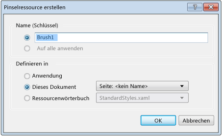

# So erstellen Sie eine Ressource und wenden Sie an
Stile und Vorlagen für Elemente im XAML-Designer werden in wieder verwendbaren Einheiten namens Ressourcen gespeichert. Stile ermöglichen es Ihnen, Elementeigenschaften festzulegen und diese Einstellungen für ein konsistentes Erscheinungsbild für mehrere Elemente wiederzuverwenden. Eine [ControlTemplate](/uwp/api/Windows.UI.Xaml.Controls.ControlTemplate) definiert die Darstellung eines Steuerelements und kann auch als Ressource angewendet werden. Weitere Informationen finden Sie unter [Schnellstart: Styling controls (Formatieren von Steuerelementen)](http://go.microsoft.com/fwlink/?LinkID=248239) und [QuickStart: Control templates (Schnellstart: Steuerelementvorlagen)](http://go.microsoft.com/fwlink/?LinkID=247982).

 Wenn Sie eine neue Ressource von einer vorhandenen Eigenschaft, [Formatvorlage](/uwp/api/Windows.UI.Xaml.Style) oder `ControlTemplate` erstellen, können Sie im Dialogfeld **Ressource erstellen** die Ressource auf Anwendungs-, Dokument- oder Elementebene definieren. Diese Ebenen bestimmen, wo Sie die Ressource verwenden können. Wenn Sie beispielsweise die Ressource auf der Elementebene definieren, kann die Ressource nur auf das Element angewendet werden, für das sie erstellt wurde. Sie können die Ressource auch in einem Ressourcenverzeichnis speichern. Hierbei handelt es sich um eine eigene Datei, die in anderen Projekten wieder verwendet werden kann.

### So erstellen Sie eine neue Ressource

1.  Erstellen Sie mit einer im XAML-Designer geöffneten XAML-Datei ein Element, oder wählen Sie ein Element im Fenster "Dokumentgliederung" aus.

2.  Wählen Sie im Eigenschaftenfenster den Eigenschaftenmarker aus, der als Feldsymbol rechts neben einem Eigenschaftswert angezeigt wird, und wählen Sie dann **In neue Ressource konvertieren** aus. Ein weißes Feldsymbol gibt einen Standardwert an, und ein schwarzes Feldsymbol gibt in der Regel an, dass eine lokale Ressource angewendet wurde.

     Das Dialogfeld für das Erstellen einer Ressource wird angezeigt. Dieses Dialogfeld wird angezeigt, wenn Sie eine Ressource mit einem Pinsel erstellen:

     

3.  Geben Sie im Feld **Name (Schlüssel)** einen Schlüsselnamen ein. Dies ist der Name, den Sie verwenden können, wenn Sie möchten, dass andere Elemente auf die Ressource verweisen.

4.  Wählen Sie unter **Definieren in** die Option aus, die angibt, wo die Ressource definiert werden soll:

    -   Damit die Ressource für alle Dokumente in der Anwendung verfügbar ist, wählen Sie **Anwendung** aus.

    -   Damit die Ressource nur für das aktuelle Dokument zur Verfügung steht, wählen Sie **Dieses Dokument** aus.

    -   Um die Ressource nur für das Element zur Verfügung zu stellen, aus dem die Ressource oder die dazugehörigen untergeordneten Elemente erstellt wurden, wählen Sie **Dieses Dokument** und anschließend in der Dropdownliste **Element**: **Name** aus.

    -   Um die Ressource in einer Ressourcenverzeichnisdatei zu definieren, die in anderen Projekten wiederverwendet werden kann, klicken Sie auf **Ressourcenverzeichnis**, und wählen Sie dann eine vorhandene Ressourcenverzeichnisdatei, z.B. **StandardStyles.xaml**, in der Dropdownliste aus.

5.  Klicken Sie auf **OK**, um die Ressource zu erstellen und auf das Element anzuwenden, aus dem Sie sie erstellt haben.

### So wenden Sie eine Ressource auf ein Element oder auf eine Eigenschaft an

1. Wählen Sie im Fenster „Dokumentgliederung“ das Element aus, auf das eine Ressource angewendet werden soll.

2. Führen Sie einen der folgenden Schritte aus:

   - Anwenden einer Ressource auf eine Eigenschaft Wählen Sie im Eigenschaftenfenster den Eigenschaftenmarker neben dem Eigenschaftswert und dann **Lokale Ressource** oder **Systemressource** aus. Anschließend wählen Sie eine verfügbare Ressource aus der angezeigten Liste aus.

      Wenn eine Ressource, die Sie erwarten, nicht angezeigt wird, kann dies möglicherweise daran liegen, dass der Typ der Ressource nicht mit dem Typ der Eigenschaft übereinstimmt.

   - Anwenden eines Stils oder einer Steuerelementvorlagenressource auf ein Steuerelement Öffnen Sie das Kontextmenü für ein Steuerelement im Fenster „Dokumentgliederung“, wählen Sie **Vorlage bearbeiten** oder **Zusätzliche Vorlagen bearbeiten** und dann **Ressource anwenden** aus. Wählen Sie anschließend den Namen der Steuerelementvorlage aus der angezeigten Liste aus.

     > [!NOTE]
     > Mit **Vorlage bearbeiten** werden Steuerelementvorlagen angewendet. Mit **Zusätzliche Vorlagen bearbeiten** werden andere Vorlagentypen angewendet.

     Sie können Ressourcen anwenden, wenn sie kompatibel sind. Beispielsweise können Sie eine Pinselressource auf die **Vordergrund**-Eigenschaft eines <xref:Windows.UI.Xaml.Controls.TextBox>-Steuerelements anwenden.

### So bearbeiten Sie eine Ressource

1.  Wählen Sie ein Element auf der Zeichenfläche oder im Fenster "Dokumentgliederung" aus.

2.  Wählen Sie den Eigenschaftenmarker „Standard“ oder „Lokal“ rechts neben der Eigenschaft im Eigenschaftenfenster aus, und wählen Sie dann **Ressource bearbeiten** zum Öffnen des Dialogfelds **Ressource bearbeiten** aus.

3.  Ändern Sie die Optionen für die Ressource.

## Siehe auch

- [Erstellen einer Benutzeroberfläche mit dem XAML-Designer](../designers/creating-a-ui-by-using-xaml-designer-in-visual-studio.md)