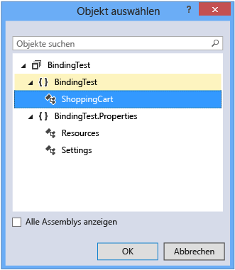
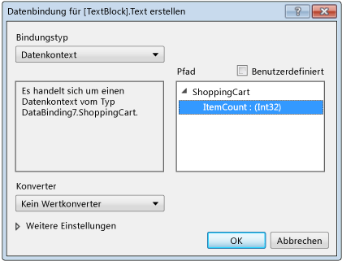

# Exemplarische Vorgehensweise: Binden an Daten im XAML-Designer
[!INCLUDE[vs2017banner](../code-quality/includes/vs2017banner.md)]

Im XAML\-Designer können Sie Datenbindungseigenschaften mithilfe der Zeichenfläche und des Eigenschaftenfensters festlegen.  In dieser exemplarischen Vorgehensweise wird veranschaulicht, wie Daten an ein Steuerelement gebunden werden.  Insbesondere wird veranschaulicht, wie eine einfache Einkaufswagenklasse erstellt wird, die über eine [DependencyProperty](http://msdn.microsoft.com/library/windows/apps/windows.ui.xaml.dependencyproperty.aspx) mit dem Namen `ItemCount` verfügt, und wie die `ItemCount`\-Eigenschaft an die **Text**\-Eigenschaft eines [TextBlock](http://msdn.microsoft.com/library/windows/apps/windows.ui.xaml.controls.textblock.aspx)\-Steuerelements gebunden wird.  
  
### So erstellen Sie eine Klasse, die als Datenquelle verwendet wird  
  
1.  Wählen Sie im Menü **Datei** die Optionsfolge **Neu**, **Projekt** aus.  
  
2.  Wählen Sie im Dialogfeld **Neues Projekt** den Knoten **Visual C\#** oder **Visual Basic** aus, erweitern Sie den Knoten **Windows Desktop**, und wählen Sie dann die Vorlage **WPF\-Anwendung** aus.  
  
3.  Geben Sie dem Projekt den Namen "BindingTest", und wählen Sie dann die Schaltfläche **OK**.  
  
4.  Öffnen Sie die Datei "MainWindow.xaml.cs" \(oder "MainWindow.xaml.vb"\), und fügen Sie den folgenden Code hinzu.  Fügen Sie in C\# den Code im `BindingTest`\-Namespace \(vor der letzten schließenden Klammer in der Datei\) hinzu.  In Visual Basic können Sie einfach die neue Klasse hinzufügen.  
  
    ```c#  
    public class ShoppingCart : DependencyObject  
    {  
        public int ItemCount  
        {  
            get { return (int)GetValue(ItemCountProperty); }  
            set { SetValue(ItemCountProperty, value); }  
        }  
  
        public static readonly DependencyProperty ItemCountProperty =  
             DependencyProperty.Register("ItemCount", typeof(int),  
             typeof(ShoppingCart), new PropertyMetadata(0));  
    }  
  
    ```  
  
    ```vb  
    Public Class ShoppingCart  
        Inherits DependencyObject  
  
        Public Shared ReadOnly ItemCountProperty As DependencyProperty = DependencyProperty.Register(  
            "ItemCount", GetType(Integer), GetType(ShoppingCart), New PropertyMetadata(0))  
        Public Property ItemCount As Integer  
            Get  
                ItemCount = CType(GetValue(ItemCountProperty), Integer)  
            End Get  
            Set(value As Integer)  
                SetValue(ItemCountProperty, value)  
            End Set  
        End Property  
    End Class  
    ```  
  
     Dieser Code legt den Wert 0 als Standardelementanzahl mithilfe des [PropertyMetadata](http://msdn.microsoft.com/library/windows/apps/windows.ui.xaml.propertymetadata.aspx)\-Objekts fest.  
  
5.  Wählen Sie im Menü **Datei** die Option **Erstellen** und dann **Projektmappe erstellen** aus.  
  
### So binden Sie die ItemCount\-Eigenschaft an ein TextBlock\-Steuerelement  
  
1.  Öffnen Sie im Projektmappen\-Explorer das Kontextmenü für "MainWindow.xaml", und wählen Sie **Ansicht\-Designer** aus.  
  
2.  Wählen Sie in der Toolbox ein [Raster](http://msdn.microsoft.com/library/windows/apps/windows.ui.xaml.controls.grid.aspx)\-Steuerelement aus, und fügen Sie es dem Formular hinzu.  
  
3.  Wenn Sie `Grid` ausgewählt haben, wählen Sie im Eigenschaftenfenster die Schaltfläche **Neu** neben der **DataContext**\-Eigenschaft aus.  
  
4.  Vergewissern Sie sich, dass im Dialogfeld **Objekt auswählen** das Kontrollkästchen **Alle Assemblys anzeigen** deaktiviert ist, wählen Sie **ShoppingCart** unter dem **BindingTest**\-Namespace aus, und klicken Sie dann auf die Schaltfläche **OK**.  
  
     Die folgende Abbildung zeigt das Dialogfeld **Objekt auswählen** mit der ausgewählten Option **ShoppingCart**.  
  
       
  
5.  Wählen Sie in der **Toolbox** ein `TextBlock`\-Steuerelement aus, um es dem Formular hinzuzufügen.  
  
6.  Wenn Sie das `TextBlock`\-Steuerelement ausgewählt haben, wählen Sie im Eigenschaftenfenster den Eigenschaftenmarker rechts neben der **Text**\-Eigenschaft und dann **Datenbindung erstellen** aus.  \(Der Eigenschaftenmarker sieht wie ein kleines Feld aus.\)  
  
7.  Wählen Sie im Dialogfeld "Datenbindung erstellen" im Feld **Pfad** die **ItemCount: \(int32\)**\-Eigenschaft aus, und klicken Sie dann auf die Schaltfläche **OK**.  
  
     Die folgende Abbildung zeigt das Dialogfeld **Datenbindung erstellen** mit der ausgewählten **ItemCount**\-Eigenschaft.  
  
       
  
8.  Drücken Sie F5, um die App auszuführen.  
  
     Das `TextBlock`\-Steuerelement sollte den Standardwert 0 als Text anzeigen.  
  
## Siehe auch  
 [Erstellen einer Benutzeroberfläche mit dem XAML\-Designer](../designers/creating-a-ui-by-using-xaml-designer-in-visual-studio.md)   
 [NIB: Add Value Converter dialog box](http://msdn.microsoft.com/de-de/c5f3d110-a541-4b55-8bca-928f77778af8)