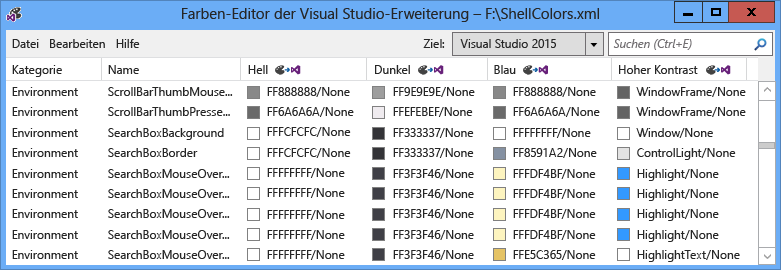
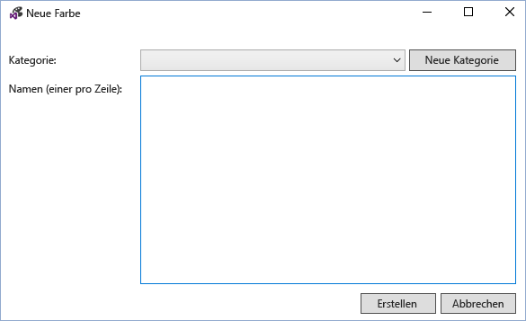
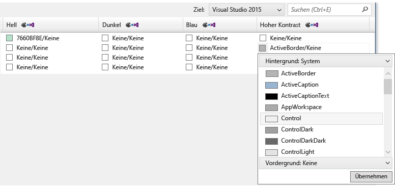
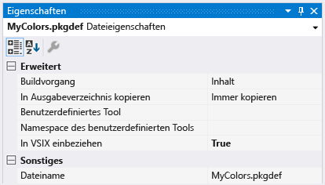
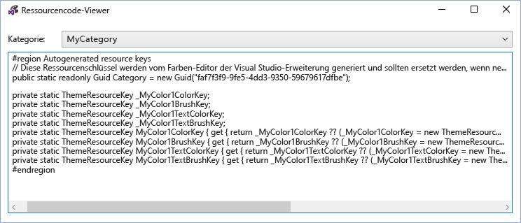

# <a name="vsix-color-editor"></a>VSIX-Farb-Editor
Das Visual Studio-Erweiterung Farb-Editor-Tool kann erstellen und Bearbeiten von Farben für Visual Studio. Das Tool kann auch Design-Ressourcenschlüssel generieren, damit, dass die Farben im Code verwendet werden können. Dieses Tool eignet sich zum Ausführen von Farben für Visual Studio-Erweiterung, die Designs unterstützt. Mit diesem Tool kann PKGDEF und XML-Dateien öffnen. Visual Studio-Designs (.vstheme-Dateien) können mit Visual Studio Extension-Farb-Editor verwendet werden, durch die Dateierweiterung in XML zu ändern. Darüber hinaus können .vstheme-Dateien in einer aktuellen XML-Datei importiert werden.

 

 **Paketdefinitionsdateien**

 Paketdefinitionsdateien (PKGDEF) sind die Dateien, die Designs definieren. Die Farben selbst werden in Design Farbe XML-Dateien gespeichert, die in eine PKGDEF-Datei kompiliert werden. Die PKGDEF-Dateien werden in Visual Studio durchsuchbaren Speicherorte bereitgestellt, zur Laufzeit verarbeitet und zusammengeführt, um Designs zu definieren.

 **Farbtoken**

 Ein Token für die Farbe besteht aus vier Elemente:

- **Kategoriename:** Eine logische Gruppierung für einen Satz von Farben. Verwenden Sie den Kategorienamen einer vorhandenen aus, wenn Sie Farben, die spezifisch auf die gewünschte UI-Element oder eine Gruppe von Elementen der Benutzeroberfläche sind bereits vorhanden sind.

- **Tokenname:** Ein beschreibender Namen für die Farbe, token und legt ihn fest. Umfassen, Hintergrund und Tokennamen Vordergrund (Text) als auch alle ihre Status, und diese sollten benannt werden, damit es ist leicht zu erkennen, die Paare und die Zustände, denen sie gelten.

- **RGB-Werte (oder Blasen angeordnet):** Erforderlich für jedes farbige Design. Immer erstellen Sie Hintergrund- und RGB-Werte in Paare. Farben werden für die Hintergrund-/Vordergrundfarbe gekoppelt, sodass die Textfarbe (Vordergrund) immer vor dem Hintergrund gelesen werden, auf denen es gezeichnet wird. Diese Farben werden verknüpft und werden zusammen verwendet werden, in der Benutzeroberfläche. Wenn der Hintergrund nicht für die Verwendung mit Text vorgesehen ist, ist Sie eine Vordergrundfarbe nicht definiert.

- **System-Farbname:** Für die Verwendung im hohen Kontrast angezeigt werden.

## <a name="how-to-use-the-tool"></a>Gewusst wie: Verwenden Sie das tool
 So weit wie möglich ist, und falls zutreffend, sollten vorhandene Visual Studio-Farben anstatt neue wiederverwendet werden. Allerdings sollte in Fällen, in denen keine richtigen Farben definiert sind, benutzerdefinierte Farben erstellt werden um eine Erweiterung Design kompatibel zu halten.

 **Erstellen neue farbtoken**

 Um benutzerdefinierte Farben, die mit der Farb-Editor für Visual Studio-Erweiterung zu erstellen, gehen Sie folgendermaßen vor:

1. Bestimmen Sie die Kategorie und Token-Namen für die neue Farbe-Token.

2. Wählen Sie die Farbtöne, die das UI-Element für jedes Design und die Systemfarbe für hohen Kontrast verwenden.

3. Verwenden Sie im Farb-Editor, um neue Farbe-Token zu erstellen.

4. Verwenden Sie die Farben in Visual Studio-Erweiterung.

5. Testen Sie die Änderungen in Visual Studio.

   **Schritt 1: Bestimmen Sie die Kategorie und Token-Namen für die neue Farbe-Token.**

   Die bevorzugte Benennung Schema für eine VSColor ist **[Category] [UI-Typ] [Status]**. Verwenden Sie nicht das Wort "Color" VSColor die Namen, da sie redundant ist.

   Kategorienamen logische Gruppierungen bereitzustellen und sollten als eng wie möglich definiert werden. Z. B. der Namen eines einzelnen Toolfensters möglicherweise einen Kategorienamen, aber der Name des ein gesamtes Unternehmen Einheit oder ein Projekt-Team ist nicht. Einträge in Kategorien gruppieren kann Verwechslungen zwischen Farben mit dem gleichen Namen.

   Ein token-Namen muss eindeutig anzugeben, Typ des Elements und die Situationen oder "State", für die die Farbe angewendet werden. Z. B. eine aktive Datentipp **[UI-Typ]** konnte mit dem Namen "**DataTip**" und die **[Status]** konnte mit dem Namen "**Active**," im sich ergebenden ein Name der Farbe des "**DataTipActive**." Da Datentipps Text verwenden, müssen sowohl ein, und eine Hintergrundfarbe definiert werden. Mithilfe von ein Paar von Hintergrund-/Vordergrundfarbe des Farb-Editors erstellt automatisch die Farben "**DataTipActive**" für den Hintergrund und "**DataTipActiveText**" für den Vordergrund.

   Wenn das Element der Benutzeroberfläche nur ein Status, verfügt die **[Status]** Teil des Namens kann ausgelassen werden. Z. B. wenn ein Suchfeld einen Rahmen hat, und es gibt keine statusänderung, die die Rahmenfarbe des betreffen können, klicken Sie dann der Namen für die Farbe des Rahmens-Token kann einfach aufgerufen werden "**SearchBoxBorder**."

   Einige allgemeine Namen enthalten:

- Aktiv

- Inaktiv

- MouseOver

- MouseDown

- Ausgewählt

- Focused

  Beispiele für einige Tokennamen für Teile des Listenelement-Steuerelements:

- ListItem

- ListItemBorder

- ListItemMouseOver

- ListItemMouseOverBorder

- ListItemSelected

- ListItemSelectedBorder

- ListItemDisabled

- ListItemDisabledBorder

  **Schritt 2: Wählen Sie die Farbtöne, die das UI-Element für jedes Design und die Systemfarbe für hohen Kontrast verwenden.**

  Wenn Sie benutzerdefinierte Farben für die Benutzeroberfläche auswählen, wählen Sie ein Element der vorhandenes Benutzeroberfläche ähnlich, und verwenden Sie die Farben als Basis. Die Farben für in-the-Box-UI-Elemente haben überprüfen und testen, vorgenommen, damit sie entsprechende Aussehen und Verhalten sich korrekt in allen Designs übernimmt.

  **Schritt 3: Verwenden Sie im Farb-Editor, um neue Farbe-Token zu erstellen.**

  Starten Sie im Farb-Editor, und öffnen Sie, oder erstellen Sie eine neue XML-Datei in einer benutzerdefinierten Designs Farben. Wählen Sie **Bearbeiten > neue Farbe** aus dem Menü. Dadurch öffnet sich ein Dialogfeld zum Angeben der Kategorie und einen oder mehrere Namen für die Color-Einträge innerhalb dieser Kategorie:

  

  Wählen Sie eine vorhandene Kategorie oder **neue Kategorie** um eine neue Kategorie zu erstellen. Ein weiteres Dialogfeld wird geöffnet, erstellen einen neuen Kategorienamen ein:

  

  Die neue Kategorie in zur Verfügung stehen dann die **neue Farbe** Kategorie Dropdown-Menü. Klicken Sie nach dem Auswählen einer Kategorie an, geben Sie einen Namen pro Zeile für jede neue Farbe-Token, und wählen Sie "Erstellen", wenn abgeschlossen:

  

  Die Farbwerte werden paarweise Hintergrund-/Vordergrundfarbe angezeigt, mit "Keine" gibt an, dass die Farbe nicht definiert wurde. Hinweis: Wenn eine Farbe nicht mit einen Text-Hintergrundfarbe/Farbpaar verfügt, muss nur der Hintergrund definiert werden.

  

  Um ein Token für die Farbe zu bearbeiten, wählen Sie einen Eintrag Farbe für das Design (Spalte) des Tokens. Fügen Sie dem Wert für die durch einen hexadezimalen Farbwert 8-stellige über den ARGB-Format eingeben, einen System-Farbnamen in die Zelle eingeben, oder verwenden im Dropdown-Menü auf die gewünschte Farbe über einen Satz von Farbe Schieberegler oder eine Liste von Systemfarben hinzu.

  

  

  Komponenten, die nicht zum Anzeigen von Text benötigen, geben Sie nur eine Farbe Wert ein: die Farbe des Hintergrunds. Andernfalls geben Sie Werte für sowohl Hintergrund- und Textfarbe, die durch einen Schrägstrich getrennt.

  Geben Sie gültige Farbnamen der Windows-System, bei der Eingabe von Werten für hohen Kontrast. Geben Sie keine hartcodierten über den ARGB-Werte. Sie können eine Liste mit gültigem Systemstatus Farbnamen anzeigen, dazu "Hintergrund: System"oder" Vordergrund: System"aus der Farbe der Dropdown-Menüs Wert. Wenn Sie Elemente erstellen, die Textkomponenten verfügen, verwenden Sie die richtige Hintergrundtext System Farbpaar oder der Text kann nicht gelesen werden.

  Wenn Sie fertig sind, erstellen, festlegen und die Farbe-Token bearbeiten, speichern Sie sie in die gewünschte XML oder eine PKGDEF-Format. Farbe mit weder einem Hintergrund-Token und ein Satz Vordergrund werden als leere Farben im XML-Format gespeichert, aber im Format der PKGDEF verworfen. Ein Dialogfeld wird über Farbe verloren warnen, wenn Sie versuchen, leere Farben in einer PKGDEF-Datei zu speichern.

  **Schritt 4: Verwenden Sie die Farben in Visual Studio-Erweiterung.**

  Klicken Sie nach dem Definieren der neuen Farbe-Token enthalten die PKGDEF in der Projektdatei mit "Buildvorgang" auf "Content" festgelegt, und legen Sie "In VSIX einbeziehen" auf "True".

  

  Wählen Sie in der Visual Studio Extension Farb-Editor Datei > Ansicht-Ressourcencode zum Anzeigen des Codes, der verwendet wird, für den Zugriff auf die benutzerdefinierte Farben in WPF-basierte Benutzeroberfläche.

  

  Dieser Code in einer statischen Klasse im Projekt eingefügt. Ein Verweis auf **Microsoft.VisualStudio.Shell.\< VSVersion >.0.dll** muss dem Projekt mit hinzugefügt werden die **ThemeResourceKey** Typ.

```csharp
namespace MyCustomColors
{
    public static class MyCategory
    {
        #region Autogenerated resource keys
        // These resource keys are generated by Visual Studio Extension Color Editor, and should be replaced when new colors are added to this category.
        public static readonly Guid Category = new Guid("faf7f3f9-9fe5-4dd3-9350-59679617dfbe");

        private static ThemeResourceKey _MyColor1ColorKey;
        private static ThemeResourceKey _MyColor1BrushKey;
        private static ThemeResourceKey _MyColor1TextColorKey;
        private static ThemeResourceKey _MyColor1TextBrushKey;
        public static ThemeResourceKey MyColor1ColorKey { get { return _MyColor1ColorKey ?? (_MyColor1ColorKey = new ThemeResourceKey(Category, "MyColor1", ThemeResourceKeyType.BackgroundColor)); } }
        public static ThemeResourceKey MyColor1BrushKey { get { return _MyColor1BrushKey ?? (_MyColor1BrushKey = new ThemeResourceKey(Category, "MyColor1", ThemeResourceKeyType.BackgroundBrush)); } }
        public static ThemeResourceKey MyColor1TextColorKey { get { return _MyColor1TextColorKey ?? (_MyColor1TextColorKey = new ThemeResourceKey(Category, "MyColor1", ThemeResourceKeyType.ForegroundColor)); } }
        public static ThemeResourceKey MyColor1TextBrushKey { get { return _MyColor1TextBrushKey ?? (_MyColor1TextBrushKey = new ThemeResourceKey(Category, "MyColor1", ThemeResourceKeyType.ForegroundBrush)); } }
        #endregion
    }
}
```

 Dies ermöglicht den Zugriff auf die Farben im XAML-Code und die Reaktion auf Designänderungen-Benutzeroberfläche.

```xaml
<UserControl x:Class="NewTestProject.TestPackageControl" Name="MyToolWindow"
             xmlns="http://schemas.microsoft.com/winfx/2006/xaml/presentation"
             xmlns:x="http://schemas.microsoft.com/winfx/2006/xaml"
             xmlns:ns="clr-namespace:MyCustomColors">
  <Grid>
    <TextBlock Background="{DynamicResource {x:Static ns:MyCategory.MyColor1BrushKey}}"
               Foreground="{DynamicResource {x:Static ns:MyCategory.MyColor1TextBrushKey}}"
      >Sample Text</TextBlock>

  </Grid>
</UserControl>
```

 **Schritt 5: Testen Sie die Änderungen in Visual Studio.**

 Farb-Editor kann farbtoken vorübergehend auf die ausgeführten Instanzen von Visual Studio live Änderungen an Farben anzuzeigen, ohne Neuerstellung das Erweiterungspaket anwenden. Zu diesem Zweck klicken Sie auf die Schaltfläche "Wenden Sie sich dieses Design für die Ausführung von Fenstern in Visual Studio an" befindet sich auf den Header der einzelnen Spalten Design. Dieses temporäre Design verschwindet, wenn die VSIX-Farb-Editor geschlossen wird.

 

 Um die Änderungen permanent zu machen, neu, und erneutes Bereitstellen von Visual Studio-Erweiterung nach der PKGDEF-Datei, die neuen Farben hinzugefügt und das Schreiben des Codes, die diese Farben verwendet werden. Neuerstellen von Visual Studio-Erweiterung führt die Registrierungswerte für die neuen Farben in den restlichen die Designs zusammen. Klicken Sie dann Visual Studio neu starten, Anzeigen der Benutzeroberflächenautomatisierungs und stellen Sie sicher, dass die neuen Farben wie erwartet angezeigt werden.

## <a name="notes"></a>Hinweise
 Dieses Tool dient zum Erstellen von benutzerdefinierter Farben für die bereits vorhandenen Visual Studio-Designs oder bearbeiten die Farben des Designs ein benutzerdefiniertes Visual Studio-Design verwendet werden soll. Um vollständige benutzerdefinierte Visual Studio-Designs erstellen, laden die [Erweiterung für Visual Studio Color Theme Editor](https://marketplace.visualstudio.com/items?itemName=VisualStudioProductTeam.VisualStudio2015ColorThemeEditor) aus der Visual Studio Gallery Erweiterungen.

## <a name="sample-output"></a>Beispielausgabe
 **XML-Color-Ausgabe**

 Die vom Tool generierten XML-Datei werden etwa wie folgt:

```xml
<Themes>
  <Theme Name="Light" GUID="{de3dbbcd-f642-433c-8353-8f1df4370aba}">
    <Category Name="CategoryName" GUID="{eee9d521-dac2-48d9-9a5e-5c625ba2040c}">
      <Color Name="ColorName1">
        <Background Type="CT_RAW" Source="FFFFFFFF" />
      </Color>
      <Color Name="ColorName2">
        <Background Type="CT_RAW" Source="FFFFFFFF" />
        <Foreground Type="CT_RAW" Source="FF000000" />
      </Color>
      <Color Name="ColorName3">
        <Background Type="CT_RAW" Source="FFFF0000" />
      </Color>
      <Color Name="ColorName4">
        <Background Type="CT_RAW" Source="FF000088" />
        <Foreground Type="CT_RAW" Source="FFFFFFFF" />
      </Color>
    </Category>
  </Theme>
  <Theme Name="Dark" GUID="{1ded0138-47ce-435e-84ef-9ec1f439b749}">...</Theme>
  <Theme Name="Blue" GUID="{a4d6a176-b948-4b29-8c66-53c97a1ed7d0}">...</Theme>
  <Theme Name="HighContrast" GUID="{a5c004b4-2d4b-494e-bf01-45fc492522c7}">...</Theme>
</Themes>

```

 **Farbausgabe PKGDEF**

 Die PKGDEF-Datei, die vom Tool generierte werden etwa wie folgt:

```
[$RootKey$\Themes\{de3dbbcd-f642-433c-8353-8f1df4370aba}\CategoryName]
"Data"=hex:78,00,00,00,0b,00,00,00,01,00,00,00,21,d5,e9,ee,c2,da,d9,48,9a,5e,5c,62,5b,a2,04,0c,04,00,00,00,0a,00,00,00,43,6f,6c,6f,72,4e,61,6d,65,31,01,ff,ff,ff,ff,00,0a,00,00,00,43,6f,6c,6f,72,4e,61,6d,65,32,01,ff,ff,ff,ff,01,00,00,00,ff,0a,00,00,00,43,6f,6c,6f,72,4e,61,6d,65,33,01,ff,00,00,ff,00,0a,00,00,00,43,6f,6c,6f,72,4e,61,6d,65,34,01,00,00,88,ff,01,ff,ff,ff,ff
[$RootKey$\Themes\{1ded0138-47ce-435e-84ef-9ec1f439b749}\CategoryName]
"Data"=hex:...
[$RootKey$\Themes\{a4d6a176-b948-4b29-8c66-53c97a1ed7d0}\CategoryName]
"Data"=hex:...
[$RootKey$\Themes\{a5c004b4-2d4b-494e-bf01-45fc492522c7}\CategoryName]
"Data"=hex:...

```

 **C#-Schlüssel ressourcenwrappers**

 Die Farbe Ressourcenschlüssel, der vom Tool generierte werden etwa wie folgt:

```csharp
namespace MyNamespace
{
    public static class MyColors
    {
        #region Autogenerated resource keys
        // These resource keys are generated by Visual Studio Extension Color Editor, and should be replaced when new colors are added to this category.

        public static string ColorName1ColorKey { get { return "ColorName1ColorKey"; } }
        public static string ColorName1BrushKey { get { return "ColorName1BrushKey"; } }

        public static string ColorName2ColorKey { get { return "ColorName2ColorKey"; } }
        public static string ColorName2BrushKey { get { return "ColorName2BrushKey"; } }
        public static string ColorName2TextColorKey { get { return "ColorName2TextColorKey"; } }
        public static string ColorName2TextBrushKey { get { return "ColorName2TextBrushKey"; } }

        public static string ColorName3ColorKey { get { return "ColorName4ColorKey"; } }
        public static string ColorName3BrushKey { get { return "ColorName4BrushKey"; } }
        public static string ColorName3TextColorKey { get { return "ColorName4TextColorKey"; } }
        public static string ColorName3TextBrushKey { get { return "ColorName4TextBrushKey"; } }
        #endregion
    }
}
```

 **WPF-Wörterbuch ressourcenwrappers**

 Die Farbe **ResourceDictionary** vom Tool generierte Schlüssel werden wie folgt:

```xaml
<ResourceDictionary xmlns="http://schemas.microsoft.com/winfx/2006/xaml/presentation"
        xmlns:x="http://schemas.microsoft.com/winfx/2006/xaml"
        xmlns:colors="clr-namespace:MyNamespace">

  <SolidColorBrush x:Key="{x:Static colors:MyColors.ColorName1BrushKey}" Color="#FFFFFFFF" />
  <Color x:Key="{x:Static colors:MyColors.ColorName1ColorKey}" A="255" R="255" G="255" B="255" />

  <SolidColorBrush x:Key="{x:Static colors:MyColors.ColorName2BrushKey}" Color="#FFFFFFFF" />
  <Color x:Key="{x:Static colors:MyColors.ColorName2ColorKey}" A="255" R="255" G="255" B="255" />
  <SolidColorBrush x:Key="{x:Static colors:MyColors.ColorName2TextBrushKey}" Color="#FF000000" />
  <Color x:Key="{x:Static colors:MyColors.ColorName2TextColorKey}" A="255" R="0" G="0" B="0" />

  <SolidColorBrush x:Key="{x:Static colors:MyColors.ColorName3BrushKey}" Color="#FFFF0000" />
  <Color x:Key="{x:Static colors:MyColors.ColorName3ColorKey}" A="255" R="255" G="0" B="0" />

  <SolidColorBrush x:Key="{x:Static colors:MyColors.ColorName4BrushKey}" Color="#FF000088" />
  <Color x:Key="{x:Static colors:MyColors.ColorName4ColorKey}" A="255" R="0" G="0" B="136" />
  <SolidColorBrush x:Key="{x:Static colors:MyColors.ColorName4TextBrushKey}" Color="#FFFFFFFF" />
  <Color x:Key="{x:Static colors:MyColors.ColorName4TextColorKey}" A="255" R="255" G="255" B="255" />
</ResourceDictionary>
```