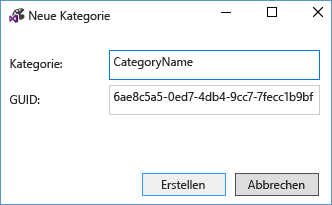
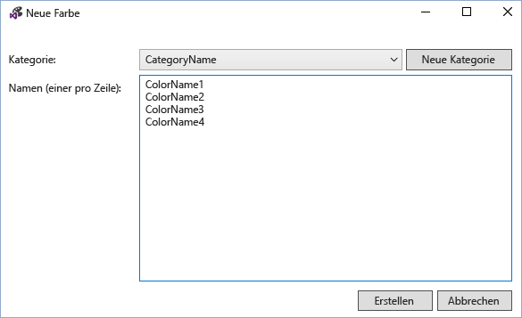
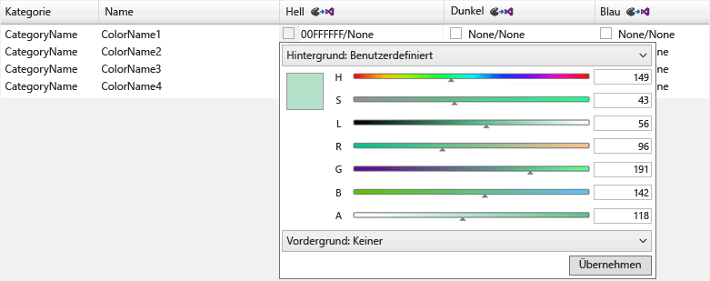

# <a name="vsix-color-editor"></a>VSIX-Farb-Editor
Das Visual Studio-Erweiterung Farb-Editor-Tool kann erstellen und Bearbeiten von benutzerdefinierten Farben für Visual Studio. Generiert das Tool kann auch designschlüssel-Ressource so, dass die Farben im Code verwendet werden können. Dieses Tool eignet sich zum treffen von Farben für eine Visual Studio-Erweiterung, die Designs unterstützt. Mit diesem Tool kann PKGDEF und XML-Dateien öffnen. Visual Studio-Designs (.vstheme-Dateien) können mit Farben-Editor von Visual Studio Erweiterung verwendet werden, indem Sie die Erweiterung in XML ändern. Darüber hinaus können .vstheme Dateien in eine aktuelle XML-Datei importiert werden.  
  
   
  
 **Paketdefinitionsdateien**  
  
 Paketdefinitionsdateien (PKGDEF) sind Dateien, die Designs definieren. Die Farben selbst werden in Design Farbe XML-Dateien gespeichert, die in eine PKGDEF-Datei kompiliert werden. Die PKGDEF-Dateien sind für Visual Studio durchsuchbaren Speicherorte bereitgestellt, zur Laufzeit verarbeitet und zusammengeführt, um die Designs definieren.  
  
 **Farbtoken**  
  
 Eine farbtoken besteht aus vier Elemente:  
  
-   **Kategoriename:** eine logische Gruppierung für einen Satz von Farben. Verwenden Sie den Kategorienamen einer vorhandenen aus, wenn Farben aus, die spezifisch für die gewünschte UI-Element oder eine Gruppe von Elementen der Benutzeroberfläche sind bereits vorhanden sind.  
  
-   **Tokenname:** einen beschreibenden Namen für die farbtoken und token stellt. Umfassen, Hintergrund und Tokennamen Vordergrund (Text) sowie alle ihre Status, und diese heißen, damit es ist einfach zu identifizieren, die Paare und die Zustände, denen sie gelten.  
  
-   **Werte (oder Farbtöne)-Color:** für jedes farbige Design erforderlich sind. Immer erstellen Sie Hintergrund- und Farbwerte in Paaren. Farben werden für die Hintergrund-/Vordergrundfarbe gekoppelt, damit die Textfarbe (Vordergrund) immer für die Farbe des Hintergrunds lesbar ist, auf dem er gezeichnet wird. Diese Farben werden verknüpft und werden zusammen verwendet werden, in der Benutzeroberfläche. Wenn der Hintergrund nicht zur Verwendung mit Text vorgesehen ist, definieren Sie eine Vordergrundfarbe aus.  
  
-   **Farbe Systemnamen:** für die Verwendung in hohem Kontrast angezeigt.  
  
## <a name="how-to-use-the-tool"></a>Gewusst wie: Verwenden Sie das tool  
 So weit wie möglich ist, und falls zutreffend, sollten vorhandene Visual Studio Farben wiederverwendet werden, anstatt neue zu. Allerdings sollten für die Fälle, in denen keine entsprechenden Farben definiert sind, benutzerdefinierte Farben erstellt werden um eine Erweiterung Designumgebung kompatibel zu halten.  
  
 **Erstellen neue farbtoken**  
  
 Um benutzerdefinierte Farben mit Farben-Editor für Visual Studio-Erweiterung zu erstellen, gehen Sie folgendermaßen vor:  
  
1.  Bestimmen Sie die Kategorie und Token-Namen für die neue Farbe-Token.  
  
2.  Wählen Sie die Farbtöne, die das Benutzeroberflächenelement für jedes Design und die Systemfarbe für hohen Kontrast verwenden.  
  
3.  Verwenden des Farb-Editors zum Erstellen von neuen Farbe-Token.  
  
4.  Verwenden Sie die Farben in einer Visual Studio-Erweiterung.  
  
5.  Testen Sie die Änderungen in Visual Studio.  
  
 **Schritt 1: Ermitteln der Kategorie und Tokennamen für die neue Farbe-Token.**  
  
 Die bevorzugte Benennung Schema für eine VSColor ist **[Category] [Benutzeroberflächentyp] [State]**. Verwenden Sie das Wort "Color" nicht in VSColor-Namen an, wie sie redundant ist.  
  
 Kategorienamen logische Gruppierungen bereitstellen, und sollte als eng wie möglich definiert werden. Z. B. der Namen eines einzelnen Toolfensters möglicherweise einen Kategorienamen, aber der Name eines gesamten Business Unit oder ein Projekt Teams ist. Einträge in Kategorien gruppieren kann Verwechslungen zwischen Farben mit demselben Namen zu verhindern.  
  
 Tokennamen muss klar angeben, den Elementtyp und die Situationen oder "Bundesland", für die die Farbe angewendet werden soll. Z. B. eine aktive Datentipp des **[Benutzeroberflächentyp]** konnte mit dem Namen "**DataTip**" und die **[State]** konnte mit dem Namen "**Active**," im resultierenden ein Name der Farbe des "**DataTipActive**." Da Datentipps Text verwenden, müssen sowohl eine Vordergrund- und Hintergrundfarbe, definiert werden. Mithilfe der Verbindungsaufbau Hintergrund-/Vordergrundfarbe des Farb-Editors erstellt automatisch die Farben "**DataTipActive**" für den Hintergrund und "**DataTipActiveText**" für den Vordergrund.  
  
 Verfügt das Element der Benutzeroberfläche nur einem Status, der **[State]** Teil des Namens kann ausgelassen werden. Z. B. wenn ein Suchfeld einen Rahmen hat, und es ist keine Änderung des Zustands, die die Rahmenfarbe des auswirken würde, klicken Sie dann der Namen für den Rahmen farbtoken kann einfach aufgerufen werden "**SearchBoxBorder**."  
  
 Einige allgemeine Namen enthalten:  
  
-   Aktiv  
  
-   Inaktive  
  
-   MouseOver  
  
-   MouseDown  
  
-   Ausgewählt  
  
-   Focused  
  
 Beispiele für einige Tokennamen für Teile des Listenelement-Steuerelements:  
  
-   ListItem  
  
-   ListItemBorder  
  
-   ListItemMouseOver  
  
-   ListItemMouseOverBorder  
  
-   ListItemSelected  
  
-   ListItemSelectedBorder  
  
-   ListItemDisabled  
  
-   ListItemDisabledBorder  
  
 **Schritt 2: Wählen Sie die Farbtöne, die das Benutzeroberflächenelement für jedes Design und die Systemfarbe für hohen Kontrast verwenden.**  
  
 Wenn Sie benutzerdefinierte Farben für die Benutzeroberfläche auswählen, wählen Sie eine ähnliche vorhandenen Benutzeroberflächenelement, und verwenden Sie die Farben als Basis. Die Farben für in-the-Box-Benutzeroberflächenelemente unterzogen überprüfen und testen, sodass sie entsprechende Aussehen und Verhalten sich richtig, in allen Designs.  
  
 **Schritt 3: Verwenden des Farb-Editors zum Erstellen von neuen Farbe-Token.**  
  
 Starten Sie des Farb-Editors, und öffnen Sie oder erstellen Sie eine neues benutzerdefiniertes Design Farben XML-Datei. Wählen Sie **Bearbeiten > neue Farbe** aus dem Menü. Daraufhin wird ein Dialogfeld zum Angeben der Kategorie und eine oder mehrere Namen für Farbe Einträge innerhalb dieser Kategorie:  
  
   
  
 Wählen Sie eine vorhandene Kategorie aus, oder wählen Sie **neue Kategorie** um eine neue Kategorie zu erstellen. Ein weiteres Dialogfeld wird geöffnet, erstellen einen neuen Kategorienamen ein:  
  
   
  
 Die neue Kategorie klicken Sie dann zur Verfügung gestellt, in der **neu ausgewählte Farbe** Dropdown Menü. Geben Sie einen Namen pro Zeile für jede neue Farbe-Token, und wählen Sie "Erstellen", wenn Sie fertig sind, nach der Auswahl einer Kategorie:  
  
   
  
 Die Farbwerte werden paarweise Hintergrund-/Vordergrundfarbe angezeigt, mit "None" gibt an, dass die Farbe nicht definiert wurde. Hinweis: Wenn eine Farbe keinen Text Farbhintergrund/Farbpaar, muss dann nur der Hintergrund definiert werden.  
  
   
  
 Um eine Farbe-Token zu bearbeiten, wählen Sie eine Farbe-Eintrag für das Design (Spalte) des Tokens aus. Fügen Sie den Farbwert durch einen hexadezimalen Farbwert in 8-stellige ARGB-Format eingeben, einen Farbnamen System in die Zelle eingeben, oder wählen Sie die gewünschte Farbe über einen Satz von Farbe oder eine Liste der Systemfarben mithilfe des Dropdown-Menüs.  
  
   
  
   
  
 Geben Sie für Komponenten, die nicht zum Anzeigen von Text müssen Sie nur einen Farbwert: die Farbe des Hintergrunds. Andernfalls geben Sie Werte für sowohl Hintergrund- und Textfarbe, getrennt durch einen Schrägstrich ein.  
  
 Geben Sie gültige Farbnamen der Windows-System, beim Eingeben von Werten für hohen Kontrast. Geben Sie nicht hartcodiert ARGB-Werte. Sie können eine Liste der gültigen System Farbnamen anzeigen, indem Sie die Dropdownmenüs Farbe auswählen "Im Hintergrund: System" oder "Vordergrund: System". Beim Erstellen von Elementen, die Textkomponenten verfügen, verwenden Sie die richtige Hintergrund/Text System Farbe-Paar, oder der Text ist möglicherweise nicht lesbar.  
  
 Wenn Sie fertig sind, erstellen, das Festlegen und die farbtoken bearbeiten, speichern Sie sie in die gewünschte XML oder eine PKGDEF-Format. Farbe Token weder einen Hintergrund noch eine Reihe Vordergrund als leere Farben im XML-Format gespeichert, doch in der PKGDEF-Format verworfen. Ein Dialogfeld werden Sie Datenverluste Farbe informiert, wenn Sie versuchen, leere Farben eine PKGDEF-Datei zu speichern.  
  
 **Schritt 4: Verwenden Sie die Farben in einer Visual Studio-Erweiterung.**  
  
 Nach dem Definieren der neuen Farbe, enthalten die PKGDEF in der Projektdatei mit "Buildvorgang" auf "Inhalt" festgelegt, und legen Sie "In VSIX einschließen" auf "True".  
  
   
  
 In der Visual Studio Erweiterung Farb-Editor, wählen Sie die Datei > Ansicht Ressourcencode Code anzeigen, die verwendet wird, für den Zugriff auf die benutzerdefinierte Farben in WPF-basierte Benutzeroberfläche.  
  
   
  
 Schließen Sie diesen Code in einer statischen Klasse im Projekt. Ein Verweis auf **Microsoft.VisualStudio.Shell.\< VSVersion >.0.dll** muss das Projekt für die Verwendung hinzugefügt werden die **ThemeResourceKey** Typ.  
  
```csharp  
namespace MyCustomColors  
{  
    public static class MyCategory  
    {  
        #region Autogenerated resource keys  
        // These resource keys are generated by Visual Studio Extension Color Editor, and should be replaced when new colors are added to this category.  
        public static readonly Guid Category = new Guid("faf7f3f9-9fe5-4dd3-9350-59679617dfbe");  
  
        private static ThemeResourceKey _MyColor1ColorKey;  
        private static ThemeResourceKey _MyColor1BrushKey;  
        private static ThemeResourceKey _MyColor1TextColorKey;  
        private static ThemeResourceKey _MyColor1TextBrushKey;  
        public static ThemeResourceKey MyColor1ColorKey { get { return _MyColor1ColorKey ?? (_MyColor1ColorKey = new ThemeResourceKey(Category, "MyColor1", ThemeResourceKeyType.BackgroundColor)); } }  
        public static ThemeResourceKey MyColor1BrushKey { get { return _MyColor1BrushKey ?? (_MyColor1BrushKey = new ThemeResourceKey(Category, "MyColor1", ThemeResourceKeyType.BackgroundBrush)); } }  
        public static ThemeResourceKey MyColor1TextColorKey { get { return _MyColor1TextColorKey ?? (_MyColor1TextColorKey = new ThemeResourceKey(Category, "MyColor1", ThemeResourceKeyType.ForegroundColor)); } }  
        public static ThemeResourceKey MyColor1TextBrushKey { get { return _MyColor1TextBrushKey ?? (_MyColor1TextBrushKey = new ThemeResourceKey(Category, "MyColor1", ThemeResourceKeyType.ForegroundBrush)); } }  
        #endregion  
    }  
}  
```  
  
 Dies ermöglicht den Zugriff auf die Farben in XAML-Code und die Benutzeroberfläche auf Designänderungen reagieren kann.  
  
```xaml  
<UserControl x:Class="NewTestProject.TestPackageControl" Name="MyToolWindow"  
             xmlns="http://schemas.microsoft.com/winfx/2006/xaml/presentation"  
             xmlns:x="http://schemas.microsoft.com/winfx/2006/xaml"  
             xmlns:ns="clr-namespace:MyCustomColors">  
  <Grid>  
    <TextBlock Background="{DynamicResource {x:Static ns:MyCategory.MyColor1BrushKey}}"  
               Foreground="{DynamicResource {x:Static ns:MyCategory.MyColor1TextBrushKey}}"  
      >Sample Text</TextBlock>  
  
  </Grid>  
</UserControl>  
```  
  
 **Schritt 5: Testen Sie die Änderungen in Visual Studio.**  
  
 Des Farb-Editors kann farbtoken vorübergehend auf die ausgeführten Instanzen von Visual Studio live Änderungen von Farben anzuzeigen, ohne das Neuerstellen der Erweiterungspaket anwenden. Zu diesem Zweck klicken Sie auf die Schaltfläche "Anwenden dieses Design für die Ausführung von Fenstern in Visual Studio" in der Kopfzeile jeder Spalte Design. Dieses temporäre Design werden behoben, wenn die VSIX-Farb-Editor geschlossen wird.  
  
   
  
 Um die Änderungen permanent zu machen, zu erstellen und die Erweiterung für Visual Studio nach der PKGDEF-Datei neuen Farben hinzugefügt und das Schreiben des Codes, die diese Farben verwenden bereitzustellen. Erneutes Erstellen der Visual Studio-Erweiterung werden die Registrierungswerte für die neue Farben in den Rest der Designs zusammengeführt. Starten Sie Visual Studio, zeigen Sie die Benutzeroberfläche an und stellen Sie sicher, dass die neue Farben wie erwartet angezeigt werden.  
  
## <a name="notes"></a>Hinweise  
 Dieses Tool dient zum Erstellen benutzerdefinierter Farben für die bereits vorhandenen Visual Studio-Designs, oder bearbeiten die Farben der ein benutzerdefiniertes Design von Visual Studio verwendet werden. Um vollständige benutzerdefinierte Visual Studio-Designs zu erstellen, laden die [Erweiterung für Visual Studio Color Theme Editor](http://visualstudiogallery.msdn.microsoft.com/6f4b51b6-5c6b-4a81-9cb5-f2daa560430b) aus der Visual Studio-Erweiterungenkatalog.  
  
## <a name="sample-output"></a>Beispielausgabe  
 **XML-Farbe Ausgabe**  
  
 Die XML-Datei, die vom Tool generierte werden etwa wie folgt verwendet:  
  
```xml  
<Themes>  
  <Theme Name="Light" GUID="{de3dbbcd-f642-433c-8353-8f1df4370aba}">  
    <Category Name="CategoryName" GUID="{eee9d521-dac2-48d9-9a5e-5c625ba2040c}">  
      <Color Name="ColorName1">  
        <Background Type="CT_RAW" Source="FFFFFFFF" />  
      </Color>  
      <Color Name="ColorName2">  
        <Background Type="CT_RAW" Source="FFFFFFFF" />  
        <Foreground Type="CT_RAW" Source="FF000000" />  
      </Color>  
      <Color Name="ColorName3">  
        <Background Type="CT_RAW" Source="FFFF0000" />  
      </Color>  
      <Color Name="ColorName4">  
        <Background Type="CT_RAW" Source="FF000088" />  
        <Foreground Type="CT_RAW" Source="FFFFFFFF" />  
      </Color>  
    </Category>  
  </Theme>  
  <Theme Name="Dark" GUID="{1ded0138-47ce-435e-84ef-9ec1f439b749}">...</Theme>  
  <Theme Name="Blue" GUID="{a4d6a176-b948-4b29-8c66-53c97a1ed7d0}">...</Theme>  
  <Theme Name="HighContrast" GUID="{a5c004b4-2d4b-494e-bf01-45fc492522c7}">...</Theme>  
</Themes>  
  
```  
  
 **Ausgabe der PKGDEF-Farbe**  
  
 Die PKGDEF-Datei, die vom Tool generierte werden etwa wie folgt verwendet:  
  
```  
[$RootKey$\Themes\{de3dbbcd-f642-433c-8353-8f1df4370aba}\CategoryName]  
"Data"=hex:78,00,00,00,0b,00,00,00,01,00,00,00,21,d5,e9,ee,c2,da,d9,48,9a,5e,5c,62,5b,a2,04,0c,04,00,00,00,0a,00,00,00,43,6f,6c,6f,72,4e,61,6d,65,31,01,ff,ff,ff,ff,00,0a,00,00,00,43,6f,6c,6f,72,4e,61,6d,65,32,01,ff,ff,ff,ff,01,00,00,00,ff,0a,00,00,00,43,6f,6c,6f,72,4e,61,6d,65,33,01,ff,00,00,ff,00,0a,00,00,00,43,6f,6c,6f,72,4e,61,6d,65,34,01,00,00,88,ff,01,ff,ff,ff,ff  
[$RootKey$\Themes\{1ded0138-47ce-435e-84ef-9ec1f439b749}\CategoryName]  
"Data"=hex:...  
[$RootKey$\Themes\{a4d6a176-b948-4b29-8c66-53c97a1ed7d0}\CategoryName]  
"Data"=hex:...  
[$RootKey$\Themes\{a5c004b4-2d4b-494e-bf01-45fc492522c7}\CategoryName]  
"Data"=hex:...  
  
```  
  
 **C#-Ressource Schlüssel wrapper**  
  
 Die vom Tool generierte Farbe Ressourcenschlüssel werden etwa wie folgt verwendet:  
  
```csharp  
namespace MyNamespace  
{  
    public static class MyColors  
    {  
        #region Autogenerated resource keys  
        // These resource keys are generated by Visual Studio Extension Color Editor, and should be replaced when new colors are added to this category.  
  
        public static string ColorName1ColorKey { get { return "ColorName1ColorKey"; } }  
        public static string ColorName1BrushKey { get { return "ColorName1BrushKey"; } }  
  
        public static string ColorName2ColorKey { get { return "ColorName2ColorKey"; } }  
        public static string ColorName2BrushKey { get { return "ColorName2BrushKey"; } }  
        public static string ColorName2TextColorKey { get { return "ColorName2TextColorKey"; } }  
        public static string ColorName2TextBrushKey { get { return "ColorName2TextBrushKey"; } }  
  
        public static string ColorName3ColorKey { get { return "ColorName4ColorKey"; } }  
        public static string ColorName3BrushKey { get { return "ColorName4BrushKey"; } }  
        public static string ColorName3TextColorKey { get { return "ColorName4TextColorKey"; } }  
        public static string ColorName3TextBrushKey { get { return "ColorName4TextBrushKey"; } }  
        #endregion  
    }  
}  
```  
  
 **WPF-Wörterbuch ressourcenwrappers**  
  
 Die Farbe **: "ResourceDictionary"** vom Tool generierte Schlüssel werden etwa wie folgt:  
  
```xaml  
<ResourceDictionary xmlns="http://schemas.microsoft.com/winfx/2006/xaml/presentation"  
        xmlns:x="http://schemas.microsoft.com/winfx/2006/xaml"  
        xmlns:colors="clr-namespace:MyNamespace">  
  
  <SolidColorBrush x:Key="{x:Static colors:MyColors.ColorName1BrushKey}" Color="#FFFFFFFF" />  
  <Color x:Key="{x:Static colors:MyColors.ColorName1ColorKey}" A="255" R="255" G="255" B="255" />  
  
  <SolidColorBrush x:Key="{x:Static colors:MyColors.ColorName2BrushKey}" Color="#FFFFFFFF" />  
  <Color x:Key="{x:Static colors:MyColors.ColorName2ColorKey}" A="255" R="255" G="255" B="255" />  
  <SolidColorBrush x:Key="{x:Static colors:MyColors.ColorName2TextBrushKey}" Color="#FF000000" />  
  <Color x:Key="{x:Static colors:MyColors.ColorName2TextColorKey}" A="255" R="0" G="0" B="0" />  
  
  <SolidColorBrush x:Key="{x:Static colors:MyColors.ColorName3BrushKey}" Color="#FFFF0000" />  
  <Color x:Key="{x:Static colors:MyColors.ColorName3ColorKey}" A="255" R="255" G="0" B="0" />  
  
  <SolidColorBrush x:Key="{x:Static colors:MyColors.ColorName4BrushKey}" Color="#FF000088" />  
  <Color x:Key="{x:Static colors:MyColors.ColorName4ColorKey}" A="255" R="0" G="0" B="136" />  
  <SolidColorBrush x:Key="{x:Static colors:MyColors.ColorName4TextBrushKey}" Color="#FFFFFFFF" />  
  <Color x:Key="{x:Static colors:MyColors.ColorName4TextColorKey}" A="255" R="255" G="255" B="255" />  
</ResourceDictionary>  
```