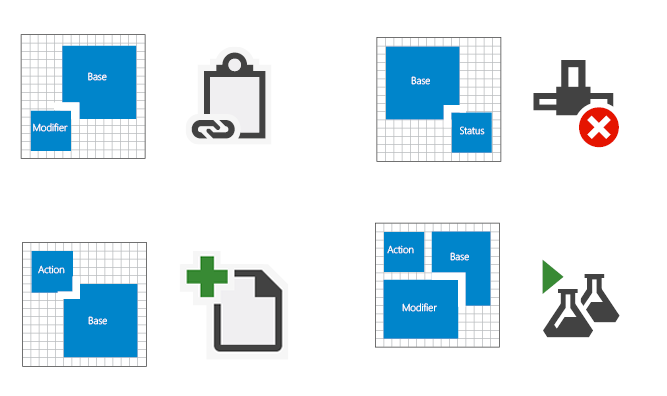

# Bilder und Symbole f&#252;r Visual Studio
[!INCLUDE[vs2017banner](../../code-quality/includes/vs2017banner.md)]

##   Image-Verwendung in Visual Studio  
 Vor dem Erstellen von Grafiken, Betracht Verwendung von mehr als 1.000 Bildern in den [Visual Studio-Bildbibliothek](http://www.microsoft.com/en-my/download/details.aspx?id=35825).  
  
### Typen von Bildern  
  
-   **Symbole**. Kleine Bilder, die in Befehle, Hierarchien, Vorlagen usw. angezeigt werden. Die in Visual Studio verwendet Standardsymbolgröße ist eine 16 x 16-PNG-DATEI. Symbole, die automatisch von der Image-Dienst erzeugten generieren, das XAML-Format für die Unterstützung von ANZEIGEN.  
  
     **HINWEIS:** während Bilder im Menüsystem verwendet werden, sollten Sie ein Symbol für jeden Befehl nicht erstellen. Wenden Sie sich an [Menüs und Befehlen für Visual Studio](../../extensibility/ux-guidelines/menus-and-commands-for-visual-studio.md) um festzustellen, ob der Befehl ein Symbol abgerufen werden soll.  
  
-   **Miniaturansichten.** Bilder im Vorschaubereich eines Dialogfelds, z. B. das Dialogfeld "Neues Projekt" verwendet.  
  
-   **Dialogfeld Bilder.** Bilder, die im Assistenten als beschreibende Grafiken oder Nachricht Indikatoren oder Dialogfelder angezeigt werden. Verwenden Sie selten und nur bei Bedarf ein schwieriges Konzept veranschaulichen oder die Aufmerksamkeit des Benutzers (Warnung) zu erhalten.  
  
-   **Animierte Bilder.** Statusanzeigen, Statusleisten und Vorgang Dialogfelder verwendet.  
  
-   **Cursor.** Verwendet, um anzugeben, ob ein Vorgang mit der Maus, wobei ein Objekt gelöscht werden kann usw. zulässig ist.  
  
##   Symbol entwerfen  
  
### Übersicht  
 Visual Studio verwendet moderne Symbole, die von clean Geometrie und 50/50 Saldo positiv/negativ (Hell/Dunkel) haben, und direkte, verständliche Metaphern verwenden. Symbol "wichtig" Entwurf Punkte im Mittelpunkt Klarheit, Vereinfachung und Kontext.  
  
-   **Klarheit:** konzentrieren, die Core-Metapher, die ein Symbol den Sinn und wahren bietet.  
  
-   **Vereinfachung:** reduzieren Sie das Symbol auf die zentrale Bedeutung – das Design über erhalten Sie nur die erforderlichen Elemente und schnörkellos.  
  
-   **Kontext:** sollten Sie alle Aspekte der Rolle ein Symbol während der Entwicklung Konzept bei der Entscheidung, welche Elemente auf das Symbol Core Metapher bilden von entscheidender Bedeutung ist.  
  
 Mit Symbolen gibt es eine Reihe von Punkten Entwurf, um zu vermeiden:  
  
-   Verwenden Sie keine Symbole, die Elemente der Benutzeroberfläche außer bei Bedarf angeben. Wählen Sie einen weitere abstrakte oder symbolischen Ansatz, wenn das Element der Benutzeroberfläche weder allgemeine, offensichtlich noch eindeutig ist.  
  
-   Nicht zu viele gemeinsame Elemente wie Dokumente, Ordner, Pfeile und die Lupe aus. Verwenden Sie diese Elemente nur, wenn für das Symbol Bedeutung. Z. B. sollte die Lupe nach rechts zeigenden angeben nur suchen, durchsuchen und finden.  
  
-   Obwohl einige ältere Symbolelementen die Verwendung der Perspektive beibehalten, erstellen Sie keine neue Symbole mit Perspektive, wenn das Element verfügt nicht über die Klarheit, ohne ihn.  
  
-   Unterzubringen Sie nicht zu viele Informationen in ein Symbol. Ein einfaches Bild, das leicht erkannt oder als ein Symbol erkannt werden kann, ist viel nützlicher als eine übermäßig komplexe Bild. Ein Symbol kann nicht die ganze Geschichte zu erzählen.  
  
### Symbol für Erstellung  
  
#### Konzept-Entwicklung  
 Visual Studio ist eine Vielzahl von Symboltypen in die Benutzeroberfläche. Während der Entwicklung der Symbolart sorgfältig prüfen. Verwenden Sie für Ihre Symbolelementen unklar oder ungewöhnlich, dass UI-Objekte. Entscheiden Sie sich für die symbolische in diesen Fällen, wie z. B. mit dem Smarttag-Symbol. Beachten Sie, dass die Bedeutung des abstrakten Tags auf der linken Seite als die vage und UI-basierte Version auf der rechten Seite ist:  
  
|||  
|-|-|  
|**Richtige Verwendung von symbolischen Bilder**|**Falsche Verwendung von symbolischen Bilder**|  
|||  
  
 Es gibt Fälle, die Standard, leicht zu erkennende Benutzeroberflächenelemente für Symbole gut funktionieren. Fügen Sie im Fenster ein Beispiel ist:  
  
|||  
|-|-|  
|**Richtige UI-Element in einem Symbol**|**Falsche Element der Benutzeroberfläche in einem Symbol**|  
|||  
  
 Verwenden Sie ein Dokument nicht als Basiselement auf das Symbol von Bedeutung ist. Ohne das Dokument ist Element im Dokument hinzufügen (siehe unten) die Bedeutung verloren gehen, während mit Aktualisierung das Dokumentelement nicht erforderlich, kommunizieren die Bedeutung ist.  
  
|||  
|-|-|  
|**Richtige Verwendung von Dokumentsymbol**|**Falsche Verwendung von Dokumentsymbol**|  
|||  
  
 Das Konzept der "Show" muss durch das Symbol dargestellt werden, die am besten veranschaulicht, was angezeigt wird, z. B. wie bei im Beispiel alle Dateien anzeigen. Eine Metapher Linse kann verwendet werden, das Konzept der "Ansicht", falls erforderlich, z. B. mit dem Beispiel Ressourcenansicht an.  
  
|||  
|-|-|  
|**"Anzeigen"**|**"Ansicht"**|  
|||  
  
 Der nach rechts vergrößern können nur darstellen suchen soll, suchen und durchsuchen. Nach links zeigenden Variante mit dem Pluszeichen (+) oder Minuszeichen sollte darstellen nur vergrößern / verkleinern.  
  
|||  
|-|-|  
|**"Suchen"**|**"Zoom"**|  
|||  
  
 Verwenden Sie in der Struktur nicht das Ordnersymbol und Modifizierer. Sofern verfügbar, verwenden Sie nur den Modifizierer.  
  
|||  
|-|-|  
|**Symbole der richtigen Struktur anzeigen**|**Symbole für falsche Struktur anzeigen**|  
| | |  
  
### Stildetails  
  
#### Layout  
 Stapeln von Elementen wie für standard 16 x 16-Symbole dargestellt:  
  
   
  
 **Layoutstack für 16 x 16-Symbole**  
  
 Status Notification Elemente sind besser als eigenständige Symbole verwendet. Kontexte sind vorhanden, jedoch in denen eine Benachrichtigung bei base-Elements, z. B. mit dem Symbol für Task abgeschlossen gestapelt werden sollten:  
  
   
  
 **Eigenständige Benachrichtigungssymbole**  
  
   
  
 **Symbol für abgeschlossene Aufgabe**  
  
 Symbole sind in der Regel ICO-Dateien, die verschiedenen Größen enthalten. Die meisten 16 x 16-Symbole werden dieselben Elemente enthalten. Die 32 x 32-Versionen sind weitere Details, darunter den Projekttyp, falls zutreffend.  
  
   
  
 **VB Windows-Steuerelementbibliothek-Projekt Symbole, 16 x 16 und 32 x 32**  
  
 Zentrieren Sie ein Symbol in deren Rahmen Pixel. Wenn dies nicht möglich ist, richten Sie das Symbol am Anfang und/oder rechts von dem Frame.  
  
   
  
 **Innerhalb des pixelframes zentriertes Symbol**  
  
   
  
 **Symbol oben ausgerichtet rechts von dem Frame**  
  
   
  
 **Und zentriertes Symbol am Anfang der frame**  
  
 Um ideale Ausrichtung und einen Lastenausgleich zu erreichen, vermeiden Sie das Symbol Basiselement mit Glyphs Action sitzt. Platzieren Sie das Symbol im oberen Bereich des Basiselements links an. Wenn Sie ein weiteres Element hinzufügen möchten, sollten Sie die Ausrichtung und den Saldo des Symbols.  
  
|||  
|-|-|  
|**Richtige Ausrichtung und Lastenausgleich**|**Falsche Ausrichtung und Lastenausgleich**|  
|||  
  
 Stellen Sie sicher Parität der Größe von Symbolen, die Elemente und in Gruppen verwendet werden. Beachten Sie, dass in der falschen Paarung den Kreis und Pfeil groß sind, und stimmen nicht überein.  
  
|||  
|-|-|  
|**Richtige Größe Parität**|**Falsche Größe Parität**|  
|||  
  
 Verwenden Sie konsistente Linien- und visual Gewichtungen. Bewerten Sie, wie das Symbol, das Sie erstellen, mit anderen Symbole verglichen, in einem Seite-an-Seite-Vergleich. Verwenden Sie den gesamten 16 x 16-Rahmen verwenden nie 15 x 15 oder kleiner. Das Verhältnis der negativ, positiv (dunkel-hell) sollte 50/50.  
  
|||  
|-|-|  
|**Richtig negativ, positiv-Verhältnis**|**Falsch negativ, positiv-Verhältnis**|  
|      ||  
  
 Verwenden Sie einfach und vergleichbare Formen und Komplementärfarbe Winkel um die Elemente zu erstellen, ohne Einbußen bei der Element-Integrität. Verwenden Sie nach Möglichkeit 45 Grad oder 90 Grad-Winkel.  
  
   
  
#### Perspektive  
 Lassen Sie das Symbol klar und verständlich. Verwenden Sie die Perspektive und einer Lichtquelle nur bei Bedarf. Obwohl mit Perspektive auf Symbolelementen vermieden werden sollten, sind einige Elemente ohne nicht erkannt. In solchen Fällen kommuniziert Standpunkt stilisierte Klarheit des Elements.  
  
   
  
 **3-Punkt-Perspektive**  
  
   
  
 **1-Punkt-Perspektive**  
  
 Die meisten Elemente sollten treffen oder schräg nach rechts.  
  
   
  
 Verwenden Sie Lichtquellen nur, wenn ein Objekt erforderlichen Klarheit hinzugefügt.  
  
|||  
|-|-|  
|**Richtige Lichtquelle**|**Falsche Lichtquelle**|  
|||  
  
 Verwenden Sie beschrieben werden, nur um die Lesbarkeit zu verbessern oder um das Prinzip besser zu kommunizieren. Der Negative positiv (dunkel hell) Saldo sollte 50/50.  
  
|||  
|-|-|  
|**Richtige Verwendung von Konturen**|**Falsche Verwendung von Konturen**|  
|||  
  
#### Symbol für Typen  
 **Shell- und Befehlsleiste** Symbolen bestehen aus nicht mehr als drei der folgenden Elemente: eine Basis, einen Modifizierer, eine Aktion oder ein Status.  
  
   
  
 **Beispiele für Shell- und befehlsleistensymbole**  
  
 **Tool-Fenster Befehlsleiste** Symbolen bestehen aus nicht mehr als drei der folgenden Elemente: eine Basis, einen Modifizierer, eine Aktion oder ein Status.  
  
   
  
 **Beispiele für Symbole der Tool-Fenster Befehlsleiste**  
  
 **Struktur anzeigen Begriffsklärung** Symbolen bestehen aus nicht mehr als drei der folgenden Elemente: eine Basis, einen Modifizierer, eine Aktion oder ein Status.  
  
   
  
 **Beispiele für die Struktur anzeigen Begriffsklärung Symbole**  
  
 **Zustandsbasierte Wert Taxonomie** Symbole enthalten sind, in der folgenden Zustände: aktiv, deaktiviert aktiv und inaktiv deaktiviert.  
  
   
  
 **Beispiele für Symbole für statusbasierte Taxonomie**  
  
 **IntelliSense** Symbolen bestehen aus nicht mehr als drei der folgenden Elemente: eine Basis ein Modifizierer und einen Status.  
  
   
  
 **Beispiele für IntelliSense-Symbole**  
  
 **Kleine (16 x 16)-Projekt** Symbole sollten nicht mehr als zwei Elemente verfügen: eine Basis und ein Modifizierer.  
  
     
  
 **Beispiele für kleine (16 x 16)-Projektsymbole**  
  
 **Großes (32 x 32) Projekt** Symbolen bestehen aus nicht mehr als vier der folgenden Elemente: eine Basis, ein bis zwei Modifizierer und eine Sprache überlagern.  
  
   
  
 **Beispiele für große Projektsymbole (32 x 32)**  
  
### Produktionsdetails  
 Alle neuen Elemente der Benutzeroberfläche mit Windows Presentation Foundation (WPF) erstellt werden soll, und alle neuen Symbole für WPF sollte im 32-Bit-PNG-Format sein. Die 24-Bit-PNG-DATEI ist ein legacy-Format, die Transparenz wird nicht unterstützt und sollte daher nicht für Symbole.  
  
 Speichern Sie die Auflösung von 96 dpi.  
  
#### Dateitypen  
  
-   **32-Bit-PNG:** das bevorzugte Format für Symbole. Eine verlustfreie Komprimierung Datendateiformat, die ein einzelnes Raster (Pixel)-Bild speichern können. 32-Bit-PNG-Dateien unterstützen Alphakanaltransparenz, Gammakorrektur und Zeilensprungverfahren.  
  
-   **32-Bit-BMP:** für nicht-WPF-Steuerelemente. Auch als XP oder Highcolor ist 32-Bit-BMP RGB/ein Bildformat, eine True-Color-Image mit einer Alphakanaltransparenz. Der alpha-Kanal ist eine Ebene der Transparenz in Adobe Photoshop, der anschließend innerhalb der Bitmap als eine zusätzliche (4) gespeichert ist festgelegt Farbkanal. Schwarzer Hintergrund wird während der Produktion von Bildmaterial für alle 32-Bit-BMP-Dateien ermöglichen einen schnelle visuellen Hinweis auf die Farbtiefe hinzugefügt. Diese schwarze Hintergrund stellt den Bereich, in der Benutzeroberfläche maskiert werden.  
  
-   **32-Bit-ICO:** für Symbole und Element hinzufügen. Alle ICO-Dateien sind 32-Bit-true Color mit Alphakanaltransparenz (RGB/A). Da ICO-Dateien mehrere Größe und Farbe Tiefen speichern können, haben häufig eine ICO-Format mit 16 x 16, 32 x 32, 48 x 48 und 256 x 256 Bildgrößen Vista-Symbolen. Um in Windows-Explorer korrekt angezeigt wird, ICO-Dateien müssen gespeichert, 24-Bit- und 8-Bit-Farbe Tiefen für jede Bildgröße unterbrochen werden.  
  
-   **XAML:** für Entwurfsoberflächen und Windows-Adorner. XAML-Symbole sind vektorbasiertes Bild-Dateien, die skalieren, drehen, ablegen und Transparenz zu unterstützen. Sie gelten nicht in Visual Studio heute aber werden immer populärer aufgrund ihrer Flexibilität.  
  
-   **SVG**  
  
-   **24-Bit-BMP:** für die Visual Studio-Befehlsleiste. Ein True Color RGB-Bildformat 24-Bit-BMP ist ein Symbol-Konvention, die eine Ebene der Transparenz erstellt mithilfe von Magenta (R = 255, G = 0, B = 255) als Schlüssel für die Transparenzebene Hit Farbe. In einem 24-Bit-BMP werden alle Magenta Flächen mit der Hintergrundfarbe angezeigt.  
  
-   **24-Bit-GIF:** für die Visual Studio-Befehlsleiste. Ein True Color RGB-Bildformat, das Transparenz unterstützt. GIF-Dateien werden häufig in Assistenten Bildmaterial und GIF-Animationen verwendet.  
  
### Symbol-Konstruktion  
 Die kleinste Größe der Symbole in Visual Studio ist 16 x 16. Das größte ist gemeinsam mit 32 x 32. Bedenken Sie nicht auf den gesamten 16 x 16, 24 x 24 und 32 x 32 Rahmen beim Entwerfen ein Symbol gefüllt. Lesbar, einheitliche Symbol Konstruktion ist wichtig für Benutzer. Befolgen Sie folgende Punkte, wenn Sie Symbole erstellen.  
  
-   Symbole sollte klar, verständlich und konsistent sein.  
  
-   Es ist besser, die Status-Benachrichtigung-Elemente als einzelne Symbole verwendet und nicht auf die sie über ein Symbol Basiselement Stapeln. In bestimmten Kontexten möglicherweise die Benutzeroberfläche der Status-Element mit einem base-Element kombiniert werden.  
  
-   Symbole sind normalerweise ICO-Dateien, die verschiedenen Größen enthalten. Nur die 16 x 16, 24 x 24 und 32 x 32-Symbole werden aktualisiert. Die meisten 16 x 16 und 24 x 24 Symbole werden dieselben Elemente enthalten. Die 32 x 32-Symbole enthalten weitere Details, darunter die Sprache Projekttyp, falls zutreffend.  
  
-   Für 32 x 32-Symbole besitzen die Basiselementen im Allgemeinen eine Linienstärke von 2 Pixel. Eine Linienstärke 1 oder 2 Pixel kann für Detailelemente verwendet werden. Verwenden Sie Ihr Urteilsvermögen, um zu bestimmen, die besser geeignet ist.  
  
-   Müssen Sie mindestens einen 1-Pixel-Abstand zwischen Elementen für 16 x 16 und 24 x 24 Symbole. Verwenden Sie für 32 x 32-Symbole 2 Pixel Abstand zwischen Elementen sowie zwischen den Modifizierer und Basiselement.  
  
   
  
 **Elementabstand für Symbole Größe 16 x 16, 24 x 24 und 32 x 32**  
  
#### Farbe und Eingabehilfen  
 Visual Studio-Compliance-Richtlinien erfordern, dass alle Symbole in das Produkt erforderlichen Eingabehilfen für die Farbe und Kontrast übergeben. Dies wird durch das Symbol Inversion, und beim Entwerfen, sollten Sie bedenken, dass sie programmgesteuert im Produkt umgekehrt werden.  
  
 Weitere Informationen zum Verwenden von Farbe in Visual Studio-Symbolen finden Sie unter [mit Farbe in Bildern](../../extensibility/ux-guidelines/images-and-icons-for-visual-studio.md#BKMK_UsingColorInImages).  
  
##   Verwenden von Farbe in Bildern  
  
### Übersicht  
 Symbole in Visual Studio sind in erster Linie einfarbig. Farbe ist reserviert, um bestimmte Informationen zu vermitteln und nie zur Gestaltung. Farbe wird verwendet:  
  
-   Um eine Aktion anzugeben.  
  
-   Benachrichtigung des Benutzers auf eine Benachrichtigung zum status  
  
-   Language-Zugehörigkeit festlegen  
  
-   Um Elemente in IntelliSense zu unterscheiden.  
  
### Barrierefreiheit  
 Visual Studio-Compliance-Richtlinien erfordern, dass alle Symbole in der Bahn Produkt erforderlichen Eingabehilfen für die Farbe und Kontrast aktiviert. Farben in der Palette visuellen Sprache getestet wurden und diese Anforderungen zu erfüllen.  
  
#### Farbumkehrung für dunkle Designs  
 Um Symbole, die mit der richtigen Kontrastverhältnis im Visual Studio dunkle Design angezeigt zu machen, wird eine Umkehrung programmgesteuert angewendet. Die Farben in dieser Anleitung wurden teilweise ausgewählt, damit sie ordnungsgemäß umkehren. Die Verwendung von Farben zu dieser Palette einschränken oder erhalten Sie zu unvorhersehbaren Ergebnissen, wenn die Umkehrung angewendet wird.  
  
   
  
 **Beispiele von Symbolen, die deren Farben umgekehrt wurden**  
  
### Basispalette  
 Alle Standardsymbole enthalten drei Grundfarben. Symbole enthalten keine Farbverläufe oder Schlagschatten, die mit einem oder zwei Ausnahmen für 3D-Symbole.  
  
|Verwendung|Name|Wert (Design "hell")|Farbmuster|Beispiel|  
|-----------|----------|---------------------------|------------|-------------|  
|Hintergrund oder dunkle|VS-BG|424242 / 66,66,66|||  
|Vordergrund-/Licht|VS FG|F0EFF1 / 240,239,241|||  
|Gliederung|Visual STUDIO heraus|F6F6F6 / 246,246,246|||  
  
 Zusätzlich zu den Grundfarben kann jedes Symbol einer zusätzliche Farbe aus der Palette der erweiterten enthalten.  
  
### Erweiterte palette  
  
#### Aktionsmodifizierer  
 Die folgenden vier Farben zeigen die Aktionsmodifizierer erforderlichen Aktionen:  
  
|Verwendung|Name|Wert (alle Designs)|Farbmuster|  
|-----------|----------|--------------------------|------------|  
|Positiv|VS Aktion Grün|388A34 / 56,138,52||  
|Negativ|VS Aktion Rot|A1260D / 161,38,13||  
|Neutral|VS Aktion Blau|00539C / 0,83,156||  
|/ Neu erstellen|VS Aktion Orange|C27D1A / 194,156,26||  
  
##### Beispiele  
 Grün dient für positive Aktionsmodifizierer wie z. B. "Add", "Ausführen", "Wiedergabe" und "Validate".  
  
|||||  
|-|-|-|-|  
| **Ausführen**| **Abfrage ausführen**| **alle Schritte wiedergeben**| **-Steuerelement hinzufügen**|  
  
 Rot dient für negative Aktionsmodifizierer wie z. B. "Löschen" "Beenden", "Abbrechen" und "Schließen".  
  
|||||  
|-|-|-|-|  
| **Beziehung löschen**| **Spalte löschen**| **Abfrage beenden**| **Verbindung Offline**|  
  
 Blau neutrale Aktion gilt für Modifizierer am häufigsten 'Importieren' als Pfeile, wie z. B. ","Weiter","Zurück"Öffnen" und "Exportieren".  
  
|||||  
|-|-|-|-|  
| **zum Feld**| **Batch Einchecken**| **Adress-Editor**| **Zuordnungs-Editor**|  
  
 Dunkle Gold wird hauptsächlich für den Modifizierer "Neu".  
  
|||||  
|-|-|-|-|  
| **Neues Projekt**| **Neues Diagramm erstellen**| **neue Komponententest**| **neues Listenelement**|  
  
#### Sonderfälle  
 In besonderen Fällen kann ein farbige Aktion-Modifizierer unabhängig als eigenständige-Symbol verwendet werden. Die Farbe für das Symbol zeigt die Aktionen, denen das Symbol zugeordnet ist. Die Verwendung ist nur eine kleine Teilmenge von Symbolen, einschließlich:  
  
||||||  
|-|-|-|-|-|  
| **Ausführen**| **Beenden**| **Löschen**| **Speichern**| **zurück navigieren**|  
  
### Code-Hierarchie-palette  
  
#### Ordner  
  
|Verwendung|Name|Wert (alle Designs)|Farbmuster|Beispiel|  
|-----------|----------|--------------------------|------------|-------------|  
|Ordner|Ordner|DCB67A / 220,182,122|||  
  
#### Visual Studio-Sprachen  
 Jede allgemeine Sprachen oder Plattformen in Visual Studio verfügbaren verfügt über eine entsprechende Farbe. Diese Farben werden verwendet, auf das Basis-Symbol oder Language-Modifizierer, die in der oberen rechten Ecke der zusammengesetzten Symbole angezeigt werden.  
  
|Verwendung|Name|Wert (alle Designs)|Farbmuster|  
|-----------|----------|--------------------------|------------|  
|ASP, HTML, WPF|ASP HTML WPF Blau|0095D 7 / 0,149,215||  
|C++|CPP Violett|9B4F96 / 155,79,150||  
|A#|CS-Grün (VS Aktion Grün)|388A34 / 56,138,52||  
|CSS|CSS-Rot|BD1E2D / 189,30,45||  
|F#|FS Violett|672878 / 103,40,120||  
|JavaScript|JS-Orange|F16421 / 241,100,33||  
|VB|VB Blau (VS Aktion Blau)|00539C / 0,83,156||  
|TypeScript|Terminaldienste-Orange|E04C06 / 224,76,6||  
|Python|PY Grün|879636 / 135,150,54||  
  
##### Beispiele von Symbolen mit Language-Modifizierer  
  
|||||||  
|-|-|-|-|-|-|  
| **VB**| **c#**| **C++**| **f#**| **JavaScript**| **Python**|  
| **HTML**| **WPF**| **ASP**| **CSS**| **TypeScript**||  
  
#### IntelliSense  
 IntelliSense-Symbole verwenden eine exklusive Farbpalette. Diese Farben werden verwendet, um Benutzer schnell zwischen den verschiedenen Elementen in der IntelliSense-Popup-Liste unterscheiden können.  
  
|Verwendung|Name|Wert (alle Designs)|Farbmuster|  
|-----------|----------|--------------------------|------------|  
|Event-Klasse|VS Aktion Orange|C27D1A / 194,125,26||  
|Erweiterungsmethode Delegaten Modul-Methode|VS Aktion Violett|652D 90 / 101,45,144||  
|Feld, Enum-Element, Makros, Struktur, Union Werttyp Operator-Schnittstelle|VS Aktion Blau|00539C / 0,83,156||  
|Objekt|VS Aktion Grün|388A34 / 56,138,52||  
|Konstante, Typdefinition Ausnahme, Enum-Element, Zuordnung, Zuordnungselement, Namespace, Vorlage|Hintergrund (VS BG)|424242 / 66,66,66||  
  
##### Beispiele für IntelliSense-Symbole  
  
||||||  
|-|-|-|-|-|  
| **Klasse**| **Private-Ereignis**| **Delegieren**| **Friend-Methode**| **Feld**|  
| **geschützt Enum-Element**| **Objekt**| **Vorlage**| **Ausnahme-Kontextmenü**||  
  
### Benachrichtigungen  
 Benachrichtigungen in Visual Studio werden verwendet, um den Status anzuzeigen. Die Benachrichtigung Palette verwendet die folgenden vier Farben als auch Schwarz oder weiß Foreground-Optionen, um Benachrichtigungen mit den folgenden Statusebenen zu definieren.  
  
|Verwendung|Name|Wert (alle Designs)|Farbmuster|  
|-----------|----------|--------------------------|------------|  
|Status: neutral|Benachrichtigung Blau (VS-Blau)|1BA1E2 / 27,161,226||  
|Status: positive|Benachrichtigung Grün (VS Grün)|339933 / 51,153,51||  
|Status: negativ|Benachrichtigung Rot (VS Rot)|E51400 / 229,20,0||  
|Status: Warnung|Benachrichtigung Gelb (VS Orange)|FFCC00 / 255,204,0||  
|Füllfarbe|Benachrichtigung Black (Schwarz)|000000 / 0,0,0||  
|Füllfarbe|Benachrichtigung weiß (weiß)|FFFFFF / 255,255,255||  
  
#### Beispiele für Benachrichtigungssymbole  
  
|||||  
|-|-|-|-|  
| **Warnung**| **Warnung**| **abschließen**| **Beenden**|  
  
### Visual Studio Online  
 Im Allgemeinen besteht aus Visual Studio Online-Funktionen in einem Browser gehostet. Die Farbe ändert sich in unterschiedlichen Umgebungen, die Formatvorlage bleibt jedoch gleich.  
  
|Gruppieren|Verwendung|Name|Wert (alle Designs)|Farbmuster|  
|-----------|-----------|----------|--------------------------|------------|  
|TFS|Hintergrund|TFSO BG|656565/ 101, 101, 101||  
|TFS|Gliederung|TFSO|FFFFFF / 255, 255, 255||  
|Napa|Hintergrund|Weiß|FFFFFF / 255, 255, 255||  
|Monaco|Hintergrund|Weiß|FFFFFF / 255, 255, 255||  
|F12|Hintergrund|Weiß|FFFFFF / 255, 255, 255||  
|F12|Normal|F12 Grey_Primary|555555 / 85, 85, 85||  
|F12|Darauf zeigen (Hover)|F12 Blue_Hover|2279BF / 34,121,191||  
|F12|Deaktiviert|F12 LtGrey_Disabled|ABABAC / 171,171,172||  
|F12|Hover-Hintergrund|Zeigen Sie bg|D9EBF7 / 217,235,247||  
|F12|Gedrückten Hintergrund|Gedrückten bg|B2D7F0 / 178,215,240||  
|F12|Gliederung|VISUAL STUDIO HERAUS|F6F6F6 / 246,246,246||  
|F12|Informationen|Information|00BCF2 / 0,188,242||  
|F12|Warnung|Warnung|F28300 / 242,131,0||  
|F12|Fehler / Negative|Error_Negative|E81123 / 232,17,35||  
|F12|Starten / Positive|Start_Positive|009E49 / 0,158,73||  
|F12|Break-Typ|Break-Typ|9B4F96 / 155,79,150||  
|F12|Ereignis markieren|Ereignis markieren|A51F00 / 165,31,0||  
|F12|Benutzermarkierung|Benutzermarkierung|F16220 / 241,98,32||  
  
#### Beispiele für Visual Studio Online-Symbole  
  
|TFS Online||||  
|----------------|-|-|-|  
| **Online-Team**| **Informationen**| **Verlauf**| **Verzweigung**|  
  
|Napa||||  
|----------|-|-|-|  
| **Inhalt**| **Office E-Mail**| **SharePoint**| **Aufgabenbereich**|  
  
|Monaco||||  
|------------|-|-|-|  
| **Dateien**| **Git**| **Suchen**| **Text**|  
  
|F12||||  
|---------|-|-|-|  
| **ziemlich Code**| **Warnung**| **Emulate**|