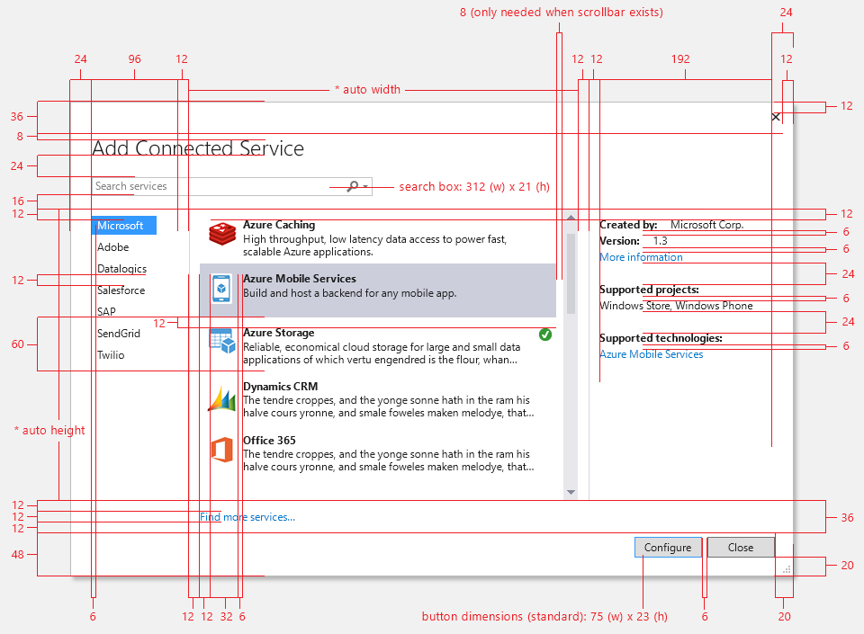
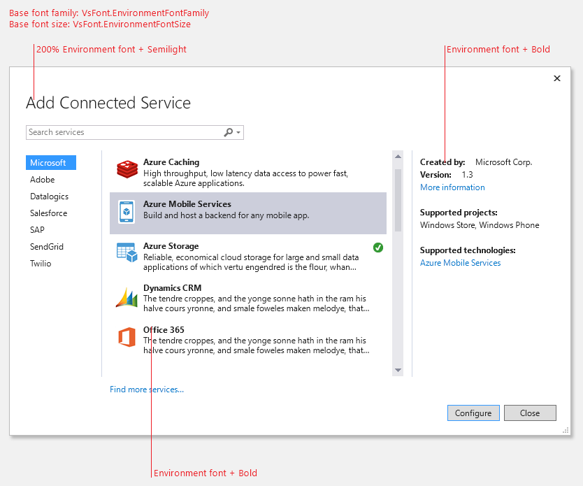

# Layout f&#252;r Visual Studio
[!INCLUDE[vs2017banner](../../code-quality/includes/vs2017banner.md)]

Die meisten Visual Studio\-Dialogfelder sind [Layout des Dialogfelds Utility](../../extensibility/ux-guidelines/layout-for-visual-studio.md#BKMK_UtilityDialogLayout), sind die Unthemed dieses Standards folgen dialogs [Windows\-Desktop Dialogfeld Layout Prinzipien](https://msdn.microsoft.com/en-us/library/windows/desktop/dn742499\(v=vs.85\).aspx). Visual Studio bewegt wird, um die Benutzeroberfläche zu aktualisieren, haben einige der übergeordneten Dialogfelder ein neues Design, das sie als Produkt definieren Erfahrungen herstellt. Diese [Dialogfeldlayout mit angewendetem Design](../../extensibility/ux-guidelines/layout-for-visual-studio.md#BKMK_ThemedDialogLayout) versehene Darstellung aufweisen.  
  
##   Layout des Dialogfelds Utility  
  
-   Alle Steuerelemente in einem Dialogfeld Dienstprogramm am linken oder oberen starten und nach unten fließen.  
  
-   Nie Zentrieren von Steuerelementen auf ein Dialogfeld, um einen großen Bereich zu füllen.  
  
-   Verwenden Sie die Umgebungsschriftart für den gesamten Dialogfeldtext. Beim Schreiben einer Spezifikation visual Geben Sie die Umgebungsschriftart anstelle einer bestimmten Schriftart und Größe. Siehe [Die Umgebungsschriftart](../../extensibility/ux-guidelines/fonts-and-formatting-for-visual-studio.md#BKMK_TheEnvironmentFont).  
  
-   Verwenden Sie einheitlich Abstand und die Platzierung, um das Ziel für die Qualität im handwerkliches können zu unterstützen.  
  
-   Dialoge können aus einer größeren Anzahl von Steuerelementen, eine eindeutige Juxtaposition Steuerelemente oder beides komplexer geworden. Können Sie für diese komplexen Situationen ausreichend Speicherplatz zwischen Steuerelement Gruppierungen, Benutzern einen logischen Ablauf zu analysieren.  
  
### Hilfsprogramm Dialogfeld Layout\-Beispiele  
 Alle Dimensionen werden in Pixeln ausgedrückt.  
  
   
  
 **Abbildung 08.01\-a: Abstand Richtlinien für das Hilfsprogramm Dialogfelder mit Beschriftungen über Steuerelementen**  
  
   
  
 **Abbildung 08.01\-b: Abstand Richtlinien für das Hilfsprogramm Dialoge mit Bezeichnungen auf der linken Seite von Steuerelementen**  
  
### Layout\-details  
  
#### Ränder  
  
-   Alle Dialoge sollte es sich um einen 12\-Pixel\-Rahmen um alle Kanten verfügen.  
  
-   Seitenränder in einem Frame Gruppe sollte 9 Pixel von der Kante des Frames.  
  
-   Ränder in einem Registerkarten\-Steuerelement sollte 6 Pixel von der Kante des Registerkarten\-Steuerelements.  
  
#### Befehlsschaltflächen  
  
-   Befehlsschaltflächen im Dialogfeld Frame, nicht auf den Inhalt arbeiten. Sie sollten unten rechts platziert werden und sollte genügend Speicherplatz weiter oben, um die Schaltflächen klar getrennt festgelegt haben.  
  
-   Treten horizontale Schaltflächen, die im Dialogfeld ausgeführt werden, ist die Befehl alternative schaltflächenkonfiguration einen vertikalen Stapel oben rechts. Siehe [Innere Befehlsschaltflächen](../../extensibility/ux-guidelines/layout-for-visual-studio.md#BKMK_InteriorCommandButtons) unten.  
  
-   Der Speicherplatz auf der linken Seite der Befehlsschaltflächen \(unten links\/Mitte des Dialogfelds\) ist Teil der "Band" der Vorgang Dialogfeldsteuerelemente berücksichtigt. Das einzige, das diesen Speicherplatz nicht Eindringen sollte ist ein Hilfe\-Link, der für die gesamte Aufgabe oder Dialogfeld relevant sind.  
  
-   Befehlsschaltflächen sollte 75 x 23 Pixel.  
  
-   Befehlsschaltflächen sollte 6 Pixel auseinander.  
  
   
  
 **Abbildung 08.01\-c: Grundlegende Ausrichtung**  
  
#### Bezeichnungen  
  
-   Linksbündig alle Bezeichnungen.  
  
-   Für Bezeichnungen, die sich über einem Steuerelement befinden, sollte sie sollten links ausgerichtet genau mit dem Steuerelement darunter und am Ende der Bezeichnung 5 Pixel oberhalb des Bereichs die Steuerelemente \(z. B. ein Kombinationsfeld\).  
  
-   Für Bezeichnungen, die sich auf der linken Seite der Steuerelemente befinden, ist die minimale Breite zwischen der Bezeichnung und das Eingabesteuerelement 10 Pixel. Eine implizite zweite Spalte sollte festgelegt werden, für die Textfelder, Kombinationsfelder oder anderen Steuerelementen ausrichten.  
  
-   Satz groß werden und werden gefolgt von einem Doppelpunkt. Siehe [Textstil](../../extensibility/ux-guidelines/fonts-and-formatting-for-visual-studio.md#BKMK_TextStyle).  
  
#### Abstand zwischen Steuerelementen  
 Stack\-Steuerelemente ausreichend. Es gibt keine absolute Richtlinie für den Abstand zwischen Steuerelementen gestapelt. Die Dichtigkeit zwischen den Steuerelementen kann leicht zwischen Dialoge variieren. Der empfohlene Abstand ist 20 Pixel für vertikale Versionskontrolllabel Paare und 9 Pixel für die horizontale Steuerelement bezeichnungs\-Paaren. Der minimale Steuerelement Abstand für horizontale\-Paare ist 6 Pixel.  
  
   
  
 **Abbildung 08.01\-d: Empfehlung für den Abstand zwischen Steuerelementen**  
  
#### Einzug des Steuerelements  
 Bei Steuerelemente geschachtelten innere Steuerelemente mit dem linken Rand des Steuerelements oben in der Regel die Bezeichnung horizontal ausgerichtet.  
  
   
  
 **Abbildung 08.01\-e: Geschachtelte Ausrichtung von Steuerelementen**  
  
#### Breite des Steuerelements  
 Die Breite eines Textfelds oder andere ähnliche Steuerelemente sollte nicht länger als die durchschnittliche Eingabe für das Feld sein. Die durchschnittliche englische Wort ist fünf Zeichen. Beispielsweise sollte ein Textfeld, das einen langen Pfadnamen erfordert, solange das horizontale Layout zulässt, während Sie eine Dropdownliste, for Plattformnamen nur eine Länge sein sollte, die für den längsten Eintrag ermöglicht.  
  
#### Hilfetext  
  
-   Ein Dialogfeld kann Hilfetext anzeigen, die Weitere Informationen über den Zweck des Dialogfelds enthält. Diese kann in der Regel befindet sich oben und 1 bis 2 Sätze.  
  
-   Die Länge sollte eine angenehme Breite für einen Benutzer zu analysieren und zu lesen. Ein mittlerer Dialogfeld sollte nicht mehr als 550 Pixel breit sein.  
  
####   Innere Befehlsschaltflächen  
 In komplexeren Dialogfeldern möglicherweise ein internes Steuerelement über eigene verwandten Schaltflächen, beeinflussen können, wo sich die Commit Schaltflächen befinden.  
  
-   Eine vertikale Ausrichtung \(Spalte\) des inneren Schaltflächen bei Verwendung **OK**\/**Abbrechen** werden in der unteren rechten Ecke horizontal ausgerichtet.  
  
-   Horizontale Ausrichtung \(Zeile\) innere Schaltflächen bei Verwendung **OK**\/**Abbrechen** werden in der oberen rechten Ecke, vertikal ausgerichtet. Diese Situation ist weniger häufig.  
  
-   Größe inneren Schaltfläche die Standardschaltfläche Größe von 75 x 23 Pixel, die Größe der übereinstimmenden Ziel soll **OK**\/**Abbrechen** Schaltflächen, wenn möglich. Wenn eine Schaltfläche Bezeichnung die Schaltfläche die Standardschaltfläche Größe überschreiten vornimmt, sollten die anderen Schaltflächen in dieser größeren Größe richtet.  
  
   
  
 **Abbildung 08.01\-f: Vertikale innere Schaltflächen mit horizontalen OK\/Abbrechen**  
  
   
  
 **Abbildung 08.01\-g: Horizontale inneren Schaltflächen mit vertikalen OK\/Abbrechen**  
  
#### \[Durchsuchen...\] Schaltfläche  
 **\[Durchsuchen...\]** Schaltflächen, die ein Textfeld folgen sollten ausgeschrieben "Durchsuchen..." vollständig einschließlich der mit den drei Punkten. Wenn ist, oder es mehrere sind **\[durchsuchen...\]** Schaltflächen auf der Seite die Schaltfläche können reduziert werden, um nur die Schaltfläche.  
  
##   Dialogfeldlayout mit angewendetem Design  
 Design Dialoge in Visual Studio hellere Darstellung aufweisen und bieten mehr Leerzeichen. Typografie bietet mehr Nachdruck und Zinsen, offener Zeilenabstand und eine Variante der Schriftgrade und Gewichtungen anbieten. Wo möglich, Chrome und Titelleisten reduziert oder entfernt wurden. Das Layout dieser Dialogfelder sollte dieses grundlegende Muster folgen:  
  
1.  Der Hintergrund des Dialogfelds ist weiß.  
  
2.  In einem mittleren Wert grau ist von einem Rahmen 1\-Pixel\-Regel.  
  
3.  Dialogfeldtitel nicht mehr in der Titelleiste befindet, bietet jedoch interessanter und Hervorhebung in einen größeren Schriftgrad. \(Finden Sie im Abschnitt Größe Schriftart [Textstil](../../extensibility/ux-guidelines/fonts-and-formatting-for-visual-studio.md#BKMK_TextStyle).\)  
  
4.  Bezeichnungen, die zusammen mit zusätzlichen Text, z. B. eine Beschreibung sollte **Umgebungsschriftart \+ Fettformatierung**.  
  
5.  Innere Spalten sind durch eine 1\-Pixel\-Regel hellgrau getrennt.  
  
6.  Standardlinks haben keine Unterstriche. Haben eine Farbe ändern und den Unterstrich, Hover\- und gedrückten Zustand.  
  
7.  Commit\-Schaltflächen \(z. B. **OK**\/**Abbrechen**\) befinden sich in der unteren rechten Ecke.  
  
### Dialogfeld Design Layout\-Beispiele  
   
  
 **Abbildung 08.01\-h: Design\-Dialogfeld**  
  
   
  
 **Abbildung 08.01\-i: Versehene Dialogfeld – Dimensionen**  
  
   
  
 **Abbildung 08.01\-j: Versehene Dialogfeld – Schriftarten**  
  
   
  
 **Abbildung 08.01\-k: Versehene Dialogfeld – Farben**  
  
## Siehe auch  
 [Anwendungsmuster für Visual Studio](../../extensibility/ux-guidelines/application-patterns-for-visual-studio.md)   
 [Steuerelemente \(Windows\)](https://msdn.microsoft.com/library/windows/desktop/dn742399.aspx)   
 [Dialogfelder \(Windows\)](https://msdn.microsoft.com/en-us/library/windows/desktop/dn742499\(v=vs.85\).aspx)