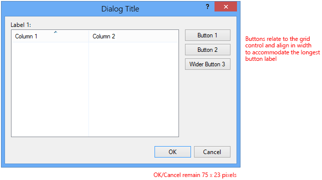
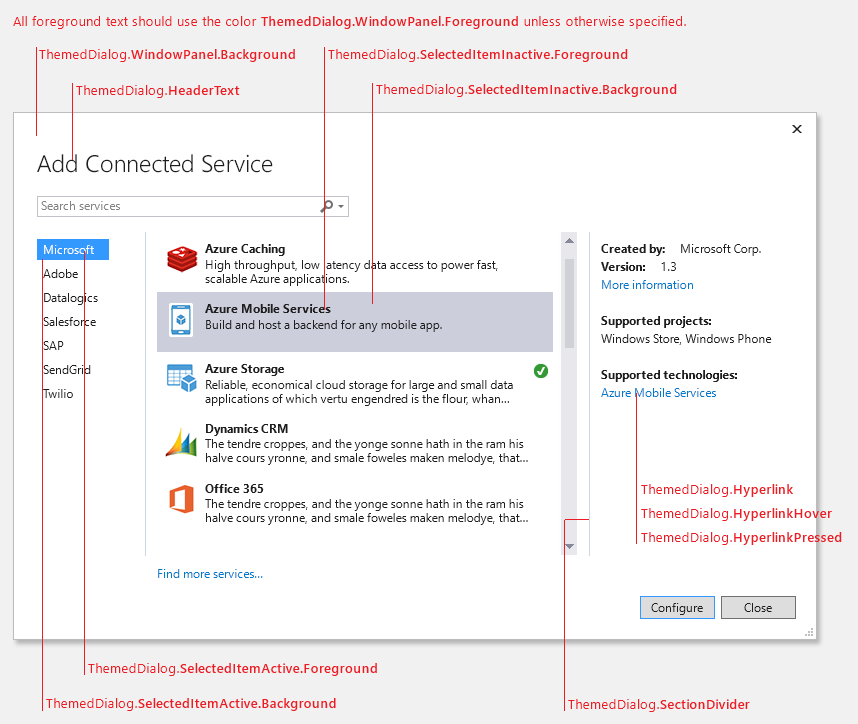

# Layout für Visual Studio
Sind die meisten der Visual Studio-Dialogfelder [Hilfsprogramm Layout des Dialogfelds](../../extensibility/ux-guidelines/layout-for-visual-studio.md#BKMK_UtilityDialogLayout), wobei es sich um die Unthemed dieses Standards folgen Dialoge [Windows Desktop Dialogfeld Layout Prinzipien](https://msdn.microsoft.com/en-us/library/windows/desktop/dn742499\(v=vs.85\).aspx). Visual Studio bewegen, um die Benutzeroberfläche zu aktualisieren, haben einige der wichtigeren Dialoge einen neuen Entwurf, der diese Oberflächen wie aus dem Produkt definieren herstellt. Diese [Dialogfeldlayout](../../extensibility/ux-guidelines/layout-for-visual-studio.md#BKMK_ThemedDialogLayout) Designs Darstellung aufweisen.  
  
##   Layout des Hilfsprogramm-Dialogfelds  
  
-   Alle Steuerelemente in einem Dialogfeld Hilfsprogramm sollte ausgehend von den oben/links und nach unten fließen.  
  
-   Nie Zentrieren von Steuerelementen auf ein Dialogfeld, um eine große Fläche auszufüllen.  
  
-   Verwenden Sie die Umgebungsschriftart, für den gesamten Dialogfeldtext. Beim Schreiben einer visual Spezifikation Geben Sie die Umgebungsschriftart anstelle einer bestimmten Schriftart und Größe. Finden Sie unter [der Umgebungsschriftart](../../extensibility/ux-guidelines/fonts-and-formatting-for-visual-studio.md#BKMK_TheEnvironmentFont).  
  
-   Verwenden Sie einheitliche Steuerung Abstand und die Platzierung, um das Ziel für die Qualität in handwerkliches können unterstützen.  
  
-   Dialoge können mehr komplex aus einer größeren Anzahl von Steuerelementen, eine eindeutige Juxtaposition Steuerelemente oder beides sein. Können Sie für solche komplexen Situationen zwischen Steuerelement Gruppierungen, Benutzern eine Logikfluss analysiert genügend Speicherplatz zur Verfügung.  
  
### Hilfsprogramm Dialogfeld Layout-Beispiele  
 Alle Dimensionen werden als Pixel ausgedrückt.  
  
   
  
 **Abbildung 08.01-a: Abstand Richtlinien für das Hilfsprogramm Dialoge mit Beschriftungen über Steuerelementen**  
  
   
  
 **Abbildung 08.01-b: Abstand Richtlinien für das Hilfsprogramm Dialoge mit Bezeichnungen auf der linken Seite von Steuerelementen**  
  
### Layoutdetails  
  
#### Seitenränder  
  
-   Alle Dialogfelder, müsste ein 12-Pixel-Rahmens um alle Seiten.  
  
-   Ränder innerhalb einer Gruppe sollte 9 Pixel vom Rand des Frames.  
  
-   Ränder in einem Registerkarten-Steuerelement sollte 6 Pixel vom Rand des Registerkarten-Steuerelements.  
  
#### Befehlsschaltflächen  
  
-   Befehlsschaltflächen wirken sich auf den Frame Dialogfeld nicht auf den Inhalt. Sie sollten unten rechts angeordnet werden und sollte genügend variablenspeicher oben, um die Schaltflächen klar getrennt festgelegt haben.  
  
-   Wenn sind horizontale Schaltflächen, die innerhalb des Dialogfelds ausgeführt werden, ist der Befehl alternative schaltflächenkonfiguration einen vertikalen Stapel oben rechts. Finden Sie unter [inneren Befehlsschaltflächen](../../extensibility/ux-guidelines/layout-for-visual-studio.md#BKMK_InteriorCommandButtons) unten.  
  
-   Der Speicherplatz auf der linken Seite der Befehlsschaltflächen (unten links/Mitte des Dialogfelds) wird als Teil der "Band" der Vorgang Dialogfeldsteuerelemente betrachtet. Das einzige, das diesen Speicherplatz Eindringen sollten ist einen Hilfelink klicken, der für die gesamte Aufgabe oder Dialogfeld relevant sind.  
  
-   Befehlsschaltflächen sollte 75 x 23 Pixel sein.  
  
-   Befehlsschaltflächen darf 6 Pixel auseinander.  
  
   
  
 **Abbildung 08.01-"c:" Grundlegende Ausrichtung**  
  
#### Bezeichnungen  
  
-   Linksbündig alle Bezeichnungen.  
  
-   Für Bezeichnungen, die über ein Steuerelement sit, sollte sie sollten linksbündig genau mit dem Steuerelement darunter und unteren Rand der Bezeichnung 5 Pixel oben auf die Steuerelemente (z. B. ein Kombinationsfeld).  
  
-   Für Bezeichnungen, die auf der linken Seite der Steuerelemente befindet, ist die minimale Breite zwischen der Bezeichnung und das Eingabesteuerelement 10 Pixel. Eine implizite zweite Spalte sollte festgelegt werden, für die Textfelder, Kombinationsfelder oder anderen Steuerelementen ausrichten.  
  
-   Bezeichnungen Satz zwischen Groß-und Kleinschreibung, gefolgt von einem Doppelpunkt. Finden Sie unter [Textart](../../extensibility/ux-guidelines/fonts-and-formatting-for-visual-studio.md#BKMK_TextStyle).  
  
#### Abstand zwischen Steuerelementen  
 Stack-Steuerelemente angemessen. Es ist keine absolute-Führungslinie für den Abstand zwischen Steuerelementen gestapelt. Die Dichtigkeit zwischen den Steuerelementen kann zwischen Dialoge geringfügig variieren. Der empfohlene Abstand ist 20 Pixel für vertikale Steuerelement bezeichnungs-Paaren und 9 Pixel für horizontale Steuerelement bezeichnungs-Paaren. Die minimale Steuerelement Abstand für horizontale Paare ist 6 Pixel.  
  
   
  
 **Abbildung 08.01-d: Empfehlungen für Abstand zwischen Steuerelementen**  
  
#### Einzug des Steuerelements  
 Bei Steuerelemente geschachtelten innere Steuerelemente mit dem linken Rand des Steuerelements oben in der Regel die Bezeichnung horizontal ausgerichtet.  
  
   
  
 **Abbildung 08.01-"e:" Nested Ausrichtung**  
  
#### Breite des Steuerelements  
 Die Breite des ein Textfeld oder andere Steuerelemente mit ähnlichen Funktionen sollten nicht länger als die durchschnittliche Eingabe für das Feld sein. Die durchschnittliche englischen wörtertrennung beträgt fünf Zeichen. Beispielsweise sollte ein Textfeld, das einen lange Pfadnamen erfordert so lange wie das horizontale Layout zulässt, werden dagegen eine Dropdown-Liste für Plattformnamen nur eine Länge sein sollte, die für den längsten Eintrag ermöglicht.  
  
#### Hilfetext  
  
-   Ein Dialog kann Hilfetext anzeigen, die Weitere Informationen über den Zweck des Dialogfelds bereitstellt. Das in der Regel befindet sich oben, das Sätze von 1 bis 2 sein.  
  
-   Die Zeilenlänge sollte eine komfortable Breite für einen Benutzer, zu analysieren und zu lesen. Eine mittlere Dialogfeld sollte nicht mehr als 550 Pixel breit sein.  
  
####   Innere Befehlsschaltflächen  
 In komplexeren Dialogfelder möglicherweise ein internes Steuerelement einen eigenen zugehörigen Schaltflächen auswirken können, wo sich die Dialogfelder Commit befinden.  
  
-   Eine vertikale Ausrichtung (Spalte) des inneren wann Schaltflächen verwenden **OK**/**"Abbrechen"** sind in der unteren rechten Ecke horizontal ausgerichtet.  
  
-   Horizontale Ausrichtung (Zeile) innere wann Schaltflächen verwenden **OK**/**"Abbrechen"** sind in der oberen rechten Ecke vertikal ausgerichtet. Diese Situation ist ungewöhnlich.  
  
-   Innere Schaltflächengröße sollte Zielgröße der Standardschaltfläche 75 x 23 Pixel, die Größe der übereinstimmenden **OK**/**"Abbrechen"** Schaltflächen, sofern möglich. Falls eine Schaltfläche Bezeichnung der Schaltfläche die Standardschaltfläche Größe überschreiten durchführt, sollten die anderen Schaltflächen in diesem Satz an größeren Größe orientieren.  
  
   
  
 **Abbildung 08.01-f: Vertikale innere Schaltflächen mit horizontalen OK / "Abbrechen"**  
  
   
  
 **Abbildung 08.01-g: Horizontale inneren Schaltflächen mit vertikalen OK / "Abbrechen"**  
  
#### [Durchsuchen...] Schaltfläche  
 **[Durchsuchen...]**  Schaltflächen, die ein Textfeld, das befolgen sollte "Durchsuchen…" vollständig, einschließlich der mit den Auslassungspunkten ausgeschrieben. Wenn ist, oder es mehrere sind **[durchsuchen...]**  Schaltflächen auf der Seite die Schaltfläche "" können auf nur mit den Auslassungspunkten reduziert werden.  
  
##   Dialogfeldlayout  
 Designs Dialogfelder in Visual Studio hat eine hellere Aussehen und bieten weitere Leerzeichen. Typografie bietet weitere Hervorhebung und Interesse sind, bieten mehr öffnen Zeilenabstand und eine Variante der Schriftgrade Ihren Bedürfnissen und Gewichtungen. Wenn möglich, haben Titel-und Chrome reduziert oder entfernt wurde. Das Layout dieser Dialogfelder sollte dieses grundlegende Muster folgen:  
  
1.  Der Hintergrund des Dialogs ist weiß.  
  
2.  In einer mittleren Wert grau ist von einem Rahmen Regel 1 Pixel.  
  
3.  Der Dialogfeldtitel nicht mehr in der Titelleiste befindet, bietet jedoch visuellem Reiz und Hervorhebung in einem größeren Punkt. (Siehe Abschnitt Größe Schriftart in [Textart](../../extensibility/ux-guidelines/fonts-and-formatting-for-visual-studio.md#BKMK_TextStyle).)  
  
4.  Bezeichnungen, die zusammen mit zusätzlichen Text ein, z. B. eine Beschreibung sollte **Umgebungsschriftart + Fettformatierung**.  
  
5.  Innere Spalten werden durch eine Regel 1 Pixel hellgrau getrennt.  
  
6.  Standardmäßig Links erhalten Sie keinen Unterstrich. Hover- und gedrückten Zustand haben eine Textfarbe ändern und den Unterstrich.  
  
7.  Commit-Schaltflächen (z. B. **OK**/**"Abbrechen"**) in der unteren rechten Ecke befindet.  
  
### Designs Dialogfeld Layout-Beispiele  
   
  
 **Abbildung 08.01-h-Designs-Dialogfeld**  
  
   
  
 **Abbildung 08.01-i: Designs Dialogfeld - Dimensionen**  
  
   
  
 **Abbildung 08.01-j: Designs Dialogfeld - Schriftarten**  
  
   
  
 **Abbildung 08.01-k: Designs Dialogfeld - Farben**  
  
## Siehe auch  
 [Anwendungsmuster für Visual Studio](../../extensibility/ux-guidelines/application-patterns-for-visual-studio.md)   
 [Steuerelemente (Windows)](https://msdn.microsoft.com/library/windows/desktop/dn742399.aspx)   
 [Dialogfelder (Windows)](https://msdn.microsoft.com/en-us/library/windows/desktop/dn742499\(v=vs.85\).aspx)