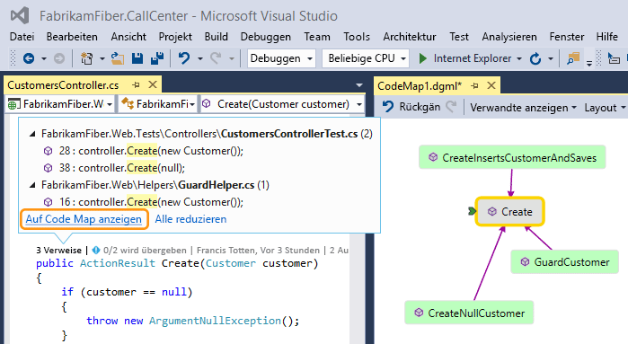
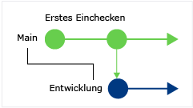
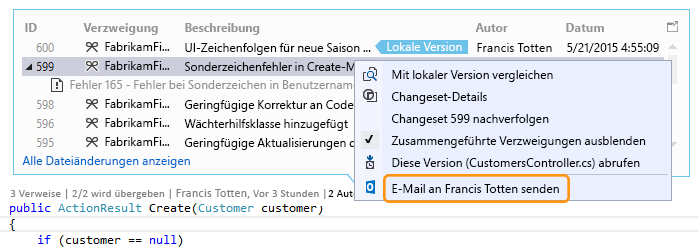
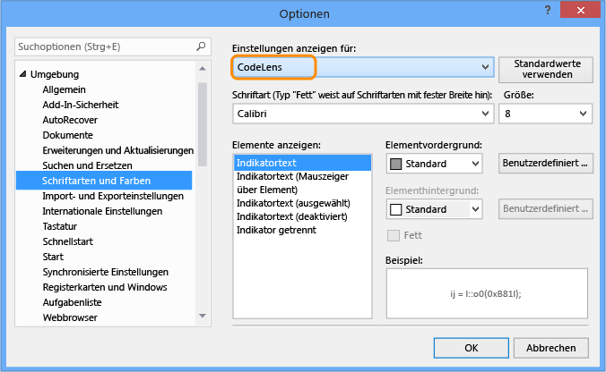
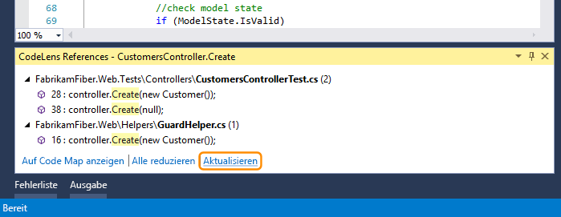

# Ermitteln von Änderungen am Code und andere Verläufe mit CodeLens

Mit CodeLens können Sie sich auf Ihre Arbeit konzentrieren, während Sie ermitteln, was mit Ihrem Code geschehen ist. Dazu müssen Sie nicht einmal den Editor schließen. Suchen Sie Verweise auf Codeabschnitte und -änderungen, verknüpfte Fehler, Arbeitselemente, Code Reviews und Komponententests.

> [!NOTE]
> CodeLens steht nur in Visual Studio Enterprise- und Visual Studio Professional-Versionen zur Verfügung. Es ist nicht in Visual Studio Community verfügbar.

Sehen Sie, wo und wie die einzelnen Codeausschnitte in der Projektmappe verwendet werden:

Diskutieren Sie die Codeänderungen mit Ihrem Team, ohne den Editor verlassen zu müssen:

Um die Indikatoren auswählen, die Sie anzeigen möchten, oder CodeLens zu aktivieren bzw. deaktivieren, navigieren Sie zu **Extras** > **Optionen** > **Text-Editor** > **Alle Sprachen** > **CodeLens**.

## Referenzen zu Ihrem Code finden

Sie können Verweise in C#- oder Visual Basic-Code suchen.

1. Klicken Sie auf den Indikator **Verweise**, oder drücken Sie **ALT**+**2**.

   

   > [!NOTE]
   > Wenn der Indikator **0 Verweise** anzeigt, bedeutet dies lediglich, dass Sie über keine Verweise aus C#- oder Visual Basic-Code verfügen. Allerdings können Verweise immer noch in anderen Elementen vorhanden sein, z.B. in *XAML-* und *ASPX-Dateien*.

2. Zeigen Sie mit dem Mauszeiger auf den Verweis in der Liste, um den verweisenden Code anzuzeigen.

   

3. Führen Sie einen Doppelklick auf den Verweis aus, um die Datei zu öffnen, die den Verweis enthält.

### Codezuordnungen

[Erstellen Sie eine Code Map](../modeling/map-dependencies-across-your-solutions.md), um die Beziehungen zwischen dem Code und seinen Verweisen anzuzeigen. Wählen Sie im Code Map-Kontextmenü **Alle Verweise anzeigen** aus.

## <a name="find-code-history"/>Suchen nach Änderungen im Code

Überprüfen Sie den Codeverlauf, um zu ermitteln, was mit Ihrem Code geschehen ist. Sie können die Änderungen auch überprüfen, bevor sie mit Ihrem Code zusammengeführt werden. Auf diese Weise können Sie besser beurteilen, wie sich Änderungen in anderen Verzweigungen möglicherweise auf Ihren Code auswirken.

Sie benötigen Folgendes:

- Visual Studio Professional und Visual Studio Enterprise

- Team Foundation Server 2013 oder höher, Azure DevOps Services oder Git

- [Skype for Business](/skypeforbusiness/) für das Kontaktieren Ihres Teams über den Code-Editor

Detaillierte Informationen zu CodeLens für C#- oder Visual Basic-Code, der mit der Team Foundation-Versionskontrolle (TFVC) oder Git gespeichert ist, finden Sie auf den Klassen- und Methodenebenen (*Codeindikatoren auf Elementebene*). Wenn Ihr Git-Repository in TfGit gehostet ist, finden Sie auch Links zu TFS-Arbeitselementen.

Bei anderen Dateitypen als *CS* oder *VB* erhalten Sie detaillierte Informationen zu CodeLens für die gesamte Datei am unteren Rand des Fensters (*Indikatoren auf Dateiebene*).

### Codeindikatoren auf Elementebene

Codeindikatoren auf Elementebene zeigen Ihnen an, wer welche Änderungen an Ihrem Code vorgenommen hat. Codeindikatoren auf Elementebene sind für C#- und Visual Basic-Code verfügbar.

Wenn Sie die Team Foundation-Versionskontrolle (TFVC) in Team Foundation Server oder Azure DevOps Services verwenden, wird die folgende Ansicht angezeigt:

Der Standardzeitraum umfasst die letzten 12 Monate. Wenn Ihr Code in Team Foundation Server gespeichert ist, können Sie den Zeitraum ändern, indem Sie den [TFSConfig-Befehl](/tfs/server/ref/command-line/tfsconfig-cmd) mit dem [CodeIndex-Befehl](../ide/codeindex-command.md) und dem Flag **/indexHistoryPeriod** ausführen.

Zum Anzeigen eines ausführlichen Verlaufs aller Änderungen, einschließlich der von vor über einem Jahr, wählen Sie **Alle Dateiänderungen anzeigen** aus:

Das Fenster **Versionsgeschichte** wird geöffnet:

Wenn Ihre Dateien sich in einem Git-Repository befinden und Sie den Codeindikator für Änderungen auf Elementebene auswählen, wird Folgendes angezeigt:

### Indikatoren auf Dateiebene

Suchen Sie in den Indikatoren auf Dateiebene am unteren Rand des Fensters nach Änderungen für eine gesamte Datei:

> [!NOTE]
> Indikatoren auf Dateiebene sind für C#- und Visual Basic-Dateien nicht verfügbar.

Um weitere Details zu einer Änderung zu erhalten, klicken Sie mit der rechten Maustaste auf dieses Element. Abhängig davon, ob Sie TFVC oder Git verwenden, stehen Ihnen mehrere Optionen zum Vergleichen der Dateiversionen, zum Anzeigen detaillierter Informationen und zum Nachverfolgen von Änderungen, zum Abrufen der ausgewählten Dateiversion und zum Senden einer E-Mail an den Autor einer Änderung zur Verfügung. Einige dieser detaillierten Informationen werden in **Team Explorer** angezeigt.

Sie können auch sehen, wer den Code in einem bestimmten Zeitraum geändert hat. Dadurch können Sie Muster bei den Änderungen Ihres Teams erkennen und ihre Auswirkung bewerten.

### Änderungen in der aktuellen Verzweigung finden

Möglicherweise verfügt Ihr Team über mehrere Branches, z.B. einen Hauptbranch und einen untergeordnete Entwicklungsbranch, um das Risiko von Schäden an stabilem Code zu verringern.

Sie können herausfinden, wie viele Personen Ihren Code geändert haben und wie viele Änderungen am Hauptbranch vorgenommen wurden, indem Sie **ALT**+**6** drücken:

### Sehen, wann Ihr Code verzweigt wurde

Navigieren Sie im untergeordneten Branch zu Ihrem Code, um herauszufinden, wann Ihr Code gebrancht wurde. Klicken Sie dann auf den Indikator **Änderungen**, oder drücken Sie **ALT**+**6**:

### Eingehende Änderungen aus anderen Verzweigungen sehen

Sie können eingehende Änderungen anzeigen. Im folgenden Screenshot wurde ein Fehler im Branch „Dev“ behoben:

Sie können die Änderung überprüfen, ohne den aktuelle Branch zu verlassen (Hauptbranch):

### Herausfinden, wann Änderungen zusammengeführt wurden

Sie können sehen, wann die Änderungen zusammengeführt wurden, sodass Sie ermitteln können, welche Änderungen in Ihrem Branch enthalten sind:

Zum Beispiel enthält der Code im Hauptbranch jetzt die Fehlerkorrektur des Branches „Dev“:

### Vergleichen einer eingehenden Änderung mit der lokalen Version

Vergleichen Sie eine eingehende Änderung mit Ihrer lokalen Version, in dem Sie **UMSCHALT**+**F10** drücken oder einen Doppelklick auf das Changeset ausführen.

### Symbole für Branches

Das Symbol in der Spalte **Branch** gibt die Beziehung des Branches zu dem Branch an, in dem Sie arbeiten.

|**Symbol**|**Ursprung der Änderung:**|
|--------------| - |
||Die aktuelle Verzweigung|
||Die übergeordnete Verzweigung|
||Eine untergeordnete Verzweigung|
||Eine Peerverzweigung|
||Eine Verzweigung, die sich weiter entfernt befindet als über- oder untergeordnet und Peer|
||Eine Zusammenführung von der übergeordneten zu einer untergeordneten Verzweigung|
||Eine Zusammenführung von der untergeordneten zu einer übergeordneten Verzweigung|
||Eine Zusammenführung von einer nicht verwandten Verzweigung (Zusammenführung ohne Basis)|

## Verknüpfte Arbeitsaufgaben

Suchen Sie verknüpfte Arbeitselemente, indem Sie auf den Indikator **Arbeitselemente** klicken oder **ALT**+**8** drücken.

## Verknüpfte Code Reviews

Suchen Sie verknüpfte Code Reviews, indem Sie auf den Indikator **Reviews** klicken. Halten Sie die **ALT**-Taste gedrückt, und drücken Sie dann die **NACH-LINKS-TASTE** oder die **NACH-RECHTS-TASTE**, um die Indikatoroptionen mit der Tastatur zu navigieren.

## Verknüpfte Fehler

Suchen Sie verknüpfte Fehler, indem Sie auf den Indikator **Fehler** klicken oder **ALT**+**7** drücken.

## Den Besitzer eines Elements kontaktieren

Suchen Sie den Autor eines Elements, indem Sie auf den Indikator **Autoren** klicken oder **ALT**+**5** drücken.

Öffnen Sie das Kontextmenü für ein Element, um die Kontaktoptionen anzuzeigen. Wenn Sie Lync oder Skype for Business installiert haben, werden folgende Optionen angezeigt:

## Zugehörige Komponententests

Sie können weitere Komponententests für Ihren C#- oder Visual Basic-Code ermitteln, ohne den **Test-Explorer** öffnen zu müssen.

1. Navigieren Sie zum Anwendungscode, der über zugehörigen [Komponententestcode](../test/unit-test-your-code.md) verfügt.

2. Falls Sie Ihre Anwendung noch nicht erstellt haben, holen Sie dies nach, um die CodeLens-Testindikatoren zu laden. Stellen Sie dabei sicher, dass die [Ermittlung durch erstellte Assemblys](../test/test-explorer-faq.md#assembly-based-discovery) aktiviert ist.

3. Überprüfen Sie die Tests für den Code, indem Sie **ALT**+**3** drücken.

     

4. Wenn das Warnsymbol angezeigt wird, wurden die Tests noch nicht ausgeführt. Führen Sie sie also aus.

     

5. Zum Überprüfen der Definition eines Tests doppelklicken Sie im CodeLens-Indikatorfenster auf das Testelement, um die Codedatei im Editor zu öffnen.

     

6. Klicken Sie auf den Teststatusindikator ( oder ), oder drücken Sie **ALT**+**1**, um die Ergebnisse des Tests zu überprüfen.

     

7. Zum Überprüfen, wie viele Personen diesen Test geändert haben, wer ihn geändert hat oder wie viele Änderungen an diesem Test durchgeführt wurden, [ermitteln Sie den Codeverlauf](#find-code-history) und verknüpfte Elemente.

## Tastenkombinationen

Drücken und halten Sie zum Auswählen von Indikatoren über die Tastatur die **ALT**-Taste, um die zugehörigen Nummerntasten anzuzeigen, und drücken Sie dann die Nummer, die dem Indikator entspricht, den Sie auswählen möchten.

> [!NOTE]
> Halten Sie die **ALT**-Taste gedrückt, und verwenden Sie die Pfeiltasten zum Navigieren, um den Indikator **Reviews** auszuwählen.

## Fragen und Antworten

### Frage: Wie aktiviere oder deaktiviere ich CodeLens, bzw. wie wähle ich die anzuzeigenden Indikatoren aus?

**Antwort:**  Sie können die Indikatoren aktivieren und deaktivieren, mit Ausnahme des Verweisindikators. Navigieren Sie zu **Extras** > **Optionen** > **Text-Editor** > **Alle Sprachen** > **CodeLens**.

Wenn die Indikatoren aktiviert wurden, können Sie die CodeLens-Optionen auch über die Indikatoren öffnen.

Aktivieren bzw. deaktivieren Sie CodeLens-Indikatoren auf Dateiebene mithilfe der Chevron-Symbole unten im Editor-Fenster.

### Frage: Wo befindet sich CodeLens?

**Antwort:** CodeLens wird in C#- und Visual Basic-Code auf der Methoden-, Klassen-, Indexer- und Eigenschaftsebene angezeigt. CodeLens wird auf Dateiebene für alle anderen Dateitypen angezeigt.

- Stellen Sie sicher, dass CodeLens aktiviert ist. Navigieren Sie zu **Extras** > **Optionen** > **Text-Editor** > **Alle Sprachen** > **CodeLens**.

- Wenn Ihr Code in TFS gespeichert ist, stellen Sie sicher, dass die Codeindizierung aktiviert ist. Verwenden Sie hierzu den [CodeIndex-Befehl](../ide/codeindex-command.md) mit dem [TFSConfig-Befehl](/tfs/server/ref/command-line/tfsconfig-cmd).

- DevOps-bezogene Indikatoren werden nur angezeigt, wenn Arbeitselemente mit dem Code verknüpft sind und Sie über Berechtigungen zum Öffnen verknüpfter Arbeitselemente verfügen. Stellen Sie sicher, dass Sie über [Teammitgliedsberechtigungen](/azure/devops/organizations/security/view-permissions?view=vsts) verfügen.

- Komponententestindikatoren werden nicht angezeigt, wenn der Anwendungscode nicht über Komponententests verfügt. Teststatusindikatoren werden automatisch in Testprojekten angezeigt. Wenn Sie wissen, dass der Anwendungscode über Komponententests verfügt, die Testindikatoren jedoch nicht angezeigt werden, versuchen Sie, die Projektmappe zu erstellen (**STRG**+**UMSCHALT**+**B**).

### Frage: Warum sehe ich keine Arbeitsaufgabendetails für einen Commit?

**Antwort:** Dies kann passieren, wenn CodeLens die Arbeitselemente in Azure Boards oder TFS nicht finden kann. Stellen Sie sicher, dass Sie mit dem Projekt verbunden sind, das diese Arbeitselemente enthält, und dass Sie über die erforderlichen Berechtigungen verfügen, diese Arbeitselemente anzuzeigen. Arbeitselementdetails werden möglicherweise ebenfalls nicht angezeigt, wenn die Commitbeschreibung falsche Informationen zu den Arbeitselement-IDs in Azure Boards oder TFS enthält.

### Frage: Warum sehe ich keine Skype-Indikatoren?

**Antwort:** Skype-Indikatoren werden nicht angezeigt, wenn Sie nicht bei Skype for Business angemeldet sind, es nicht installiert haben oder über keine unterstützte Konfiguration verfügen. Allerdings können Sie weiterhin E-Mails senden:

**Welche Skype- und Lync-Konfigurationen werden unterstützt?**

- Skype for Business(32-Bit- oder 64-Bit)

- Lync 2010 oder höher allein (32-Bit- oder 64-Bit), aber nicht Lync Basic 2013 mit Windows 8.1

CodeLens unterstützt nicht die Installation verschiedener Versionen von Lync oder Skype. Sie sind möglicherweise nicht für alle lokalisierten Versionen von Visual Studio lokalisiert.

### Frage: Wie ändere ich Schriftart und Farbe für CodeLens?

**Antwort:** Navigieren Sie zu **Extras** > **Optionen** > **Umgebung** > **Schriftarten und Farben**.

So verwenden Sie die Tastatur:

1. Drücken Sie **ALT**+**T**+**O**, um das Dialogfeld **Optionen** zu öffnen.

2. Drücken Sie die **NACH-OBEN-TASTE** oder die **NACH-UNTEN-TASTE** , um zum Knoten **Umgebung** zu wechseln, und dann die **NACH-LINKS-TASTE** , um den Knoten zu erweitern.

3. Drücken Sie die **NACH-UNTEN-TASTE** , um zu **Schriftarten und Farben**zu wechseln.

4. Drücken Sie die **TAB-TASTE**, um zur Liste **Einstellungen anzeigen für** zu wechseln, und drücken Sie dann die **NACH-UNTEN-TASTE**, um **CodeLens**auszuwählen.

### Frage: Kann ich das CodeLens-Heads-up-Display verschieben?

**Antwort:** Ja, klicken Sie auf , um CodeLens als Fenster anzudocken.

### Frage: Wie aktualisiere ich die Indikatoren?

**Antwort:** Dies hängt vom Indikator ab:

- **Verweise**: Dieser Indikator wird bei einer Änderung des Codes automatisch aktualisiert. Wenn der Indikator **Verweise** als separates Fenster angedockt ist, aktualisieren Sie den Indikator, indem Sie auf **Aktualisieren** klicken:

     

- **Team**: Aktualisieren Sie diese Indikatoren, indem Sie im Kontextmenü auf **CodeLens-Teamindikatoren aktualisieren** klicken:

     

- **Test**: [Suchen von Komponententests für Ihren Code](#associated-unit-tests) zum Aktualisieren des **Testindikators**.

### Frage: Was bedeutet "Lokale Version"?

**Antwort:** Der Pfeil **Lokale Version** zeigt auf das neueste Changeset in der lokalen Version einer Datei. Wenn der Server über neuere Changesets verfügt, werden sie je nach Reihenfolge, in der sie sortiert sind, über oder unter dem Pfeil **Lokale Version** angezeigt.

### Frage: Kann ich verwalten, wie CodeLens den Code verarbeitet, um den Verlauf und verknüpfte Elemente anzuzeigen?

**Antwort:** Ja. Wenn sich der Code in TFS befindet, können Sie hierzu den [CodeIndex-Befehl](../ide/codeindex-command.md) mit dem [TFSConfig-Befehl](/tfs/server/ref/command-line/tfsconfig-cmd) verwenden.

### Frage: Meine CodeLens-Testindikatoren werden beim ersten Öffnen der Projektmappe nicht mehr in meiner Datei angezeigt. Wie kann ich sie laden?

**Antwort:** Erstellen Sie Ihr Projekt erneut, damit die CodeLens-Testindikatoren in Ihre Datei geladen werden. Stellen Sie dabei sicher, dass die [Ermittlung durch erstellte Assemblys](../test/test-explorer-faq.md#assembly-based-discovery
) aktiviert ist. Zur Verbesserung der Leistung ruft Visual Studio beim Laden von Codedateien keine Quellinformationen mehr für Testindikatoren ab. Testindikatoren werden geladen, nachdem ein Build geladen wurde, oder wenn Sie zu einem Test navigieren, indem Sie im **Test-Explorer** darauf doppelklicken.

## Siehe auch

- [Features des Code-Editors](../ide/writing-code-in-the-code-and-text-editor.md)
