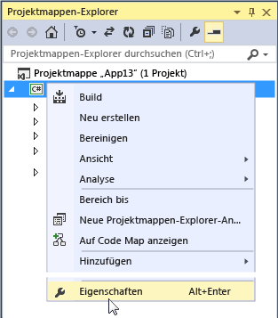

# Vorgehensweise: .NET Framework-Version als Ziel

In diesem Dokument wird beschrieben, wie Sie ein Projekt für eine bestimmte .NET Framework-Version erstellen und wie diese Zielversion in vorhandenen Visual Basic-, C#- oder Visual F#-Projekten geändert werden kann.

> [!IMPORTANT]
> Informationen darüber, wie Sie die Zielversion für C++-Projekte ändern können, finden Sie unter [How to: Modify the target framework and platform toolset (Vorgehensweise: Ändern des Zielframeworks und des Plattformtoolsets)](/cpp/build/how-to-modify-the-target-framework-and-platform-toolset).

## So richten Sie ein Projekt bei der Erstellung auf eine Zielversion aus

Welche .NET Framework-Versionen verfügbar sind, wenn Sie ein Projekt erstellen, hängt davon ab, welche Versionen installiert sind, und von der im Dialogfeld **Neues Projekt** ausgewählten Vorlage.

1. Klicken Sie in der Menüleiste auf **Datei** > **Neu** > **Projekt**.

1. Wählen Sie in der Liste der installierten Vorlagen den Projekttyp aus, den Sie erstellen möchten, und geben Sie einen Namen für das Projekt ein.

1. Wählen Sie in der Dropdownliste **Framework** unten im Dialogfeld **Neues Projekt** die gewünschte .NET Framework-Version für Ihr Projekt aus.

    Die Liste der Frameworks zeigt nur die Versionen an, die auf die von Ihnen ausgewählte Vorlage anwendbar sind. Einige Projekttypen, z.B. .NET Core, erfordern kein .NET Framework. In solchen Fällen ist die **Framework**-Dropdownliste ausgeblendet.

    

1. Klicken Sie auf die Schaltfläche **OK** .

## So ändern Sie die Zielversion

Die folgenden Schritte zeigen, wie eine .NET Framework-Zielversion in einem vorhandenen Visual Basic-, C#- oder Visual F#-Projekt geändert wird.

Informationen darüber, wie Sie die Zielversion für C++-Projekte ändern können, finden Sie unter [How to: Modify the target framework and platform toolset (Vorgehensweise: Ändern des Zielframeworks und des Plattformtoolsets)](/cpp/build/how-to-modify-the-target-framework-and-platform-toolset).

1. Öffnen Sie im **Projektmappen-Explorer** das Kontextmenü für das zu ändernde Projekt, und wählen Sie **Eigenschaften** aus.

    

1. Klicken Sie in der linken Spalte des Fensters **Eigenschaften** auf die Registerkarte **Anwendung**.

    

    > [!NOTE]
    > Nachdem Sie eine UWP-App erstellt haben, können Sie weder die Windows-Zielversion noch die .NET Framework-Zielversion ändern.

1. Wählen Sie in der Liste **Zielframework** die gewünschte Zielversion aus.

1. Wählen Sie im daraufhin angezeigten Überprüfungsdialogfeld die Schaltfläche **Ja** aus.

    Das Projekt wird entladen. Wenn es erneut geladen wird, verwendet es die .NET Framework-Zielversion, die Sie soeben ausgewählt haben.

    > [!NOTE]
    > Sollte der Code Verweise auf eine .NET Framework-Version enthalten, die nicht die Zielversion ist, werden möglicherweise Fehlermeldungen angezeigt, wenn Sie den Code kompilieren oder ausführen. Um diese Fehler zu beheben, müssen Sie die Verweise ändern. Weitere Informationen finden Sie unter [Problembehandlung bei .NET Framework-Zielversionsfehlern](../msbuild/troubleshooting-dotnet-framework-targeting-errors.md).

## Siehe auch

- [Übersicht über die Ausrichtung auf mehrere Zielversionen in Visual Studio](../ide/visual-studio-multi-targeting-overview.md)
- [Problembehandlung bei .NET Framework-Zielversionsfehlern](../msbuild/troubleshooting-dotnet-framework-targeting-errors.md)
- [Seite „Anwendung“, Projekt-Designer (C#)](../ide/reference/application-page-project-designer-csharp.md)
- [Seite „Anwendung“, Projekt-Designer (Visual Basic)](../ide/reference/application-page-project-designer-visual-basic.md)
- [Vorgehensweise: How to: Modify the target framework and platform toolset (Vorgehensweise: Ändern des Zielframeworks und des Plattformtoolsets)](/cpp/build/how-to-modify-the-target-framework-and-platform-toolset)