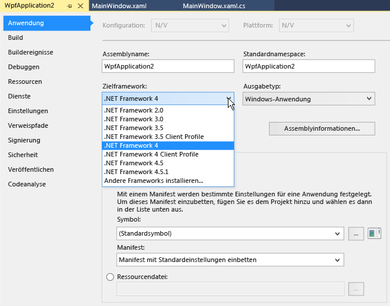

# Gewusst wie: .NET Framework-Version als Ziel

In diesem Dokument wird beschrieben, wie Sie ein Projekt für eine bestimmte .NET Framework-Version erstellen und wie diese Zielversion in vorhandenen Visual Basic-, Visual C#- oder Visual F#-Projekten geändert werden kann.

> [!IMPORTANT]
> Weitere Informationen zum Ändern der Zielversion für C++-Projekte finden Sie unter [Vorgehensweise: Ändern des Zielframeworks und Plattformtoolset](/cpp/build/how-to-modify-the-target-framework-and-platform-toolset).

## Projekt für eine Zielversion erstellen

Wenn Sie ein Projekt erstellen, bestimmt die Version von .NET Framework, auf die Sie abzielen, die Vorlagen, die Sie verwenden können.

### So richten Sie ein Projekt bei der Erstellung auf eine Zielversion aus

1.  Wählen Sie in der Menüleiste **Datei**, **Neu**, **Projekt**aus.

2.  Wählen Sie in der Liste oben im Dialogfeld **Neues Projekt** die gewünschte .NET Framework-Version für Ihr Projekt aus.

3.  In der Liste der installierten Vorlagen wählen Sie den Typ des Projekts aus, das Sie erstellen möchten, benennen das Projekt und wählen dann die Schaltfläche **OK**.

    In der Liste der Vorlagen werden nur die Projekte angezeigt, die von der ausgewählten .NET Framework-Version unterstützt werden.

## Ändern der Zielversion

Die folgenden Schritte zeigen, wie eine .NET Framework-Zielversion in einem vorhandenen Visual Basic-, Visual C#- oder Visual F#-Projekt geändert wird.

Weitere Informationen zum Ändern der Zielversion für C++-Projekte finden Sie unter [Vorgehensweise: Ändern des Zielframeworks und Plattformtoolset](/cpp/build/how-to-modify-the-target-framework-and-platform-toolset).

### So ändern Sie die Zielversion

1.  Öffnen Sie im **Projektmappen-Explorer** das Kontextmenü für das zu ändernde Projekt, und wählen Sie **Eigenschaften** aus.

    

2. Im linken Bereich des Fensters Eigenschaften wählen Sie die Registerkarte **Anwendung** aus.

    

    > [!NOTE]
    > Nachdem Sie eine UWP-App erstellt haben, können Sie weder die Windows-Zielversion noch die .NET Framework-Zielversion ändern.

3.  Wählen Sie in der Liste **Zielframework** die gewünschte Zielversion aus.

4.  Wählen Sie im daraufhin angezeigten Überprüfungsdialogfeld die Schaltfläche **Ja** aus.

    Das Projekt wird entladen. Wenn es erneut geladen wird, verwendet es die .NET Framework-Zielversion, die Sie soeben ausgewählt haben.

    > [!NOTE]
    > Sollte der Code Verweise auf eine .NET Framework-Version enthalten, die nicht die Zielversion ist, werden möglicherweise Fehlermeldungen angezeigt, wenn Sie den Code kompilieren oder ausführen. Um diese Fehler zu beheben, müssen Sie die Verweise ändern. Weitere Informationen finden Sie unter [Problembehandlung bei .NET Framework-Zielversionsfehlern](../msbuild/troubleshooting-dotnet-framework-targeting-errors.md).

## Siehe auch

[Übersicht über die Ausrichtung auf mehrere Zielversionen in Visual Studio](../ide/visual-studio-multi-targeting-overview.md)  
[Problembehandlung bei .NET Framework-Zielversionsfehlern](../msbuild/troubleshooting-dotnet-framework-targeting-errors.md)  
[Seite „Anwendung“, Projekt-Designer (C#)](../ide/reference/application-page-project-designer-csharp.md)  
[Seite „Anwendung“, Projekt-Designer (Visual Basic)](../ide/reference/application-page-project-designer-visual-basic.md)  
[Vorgehensweise: Ändern des Zielframeworks und des Plattformtoolsets (C++)](/cpp/build/how-to-modify-the-target-framework-and-platform-toolset)