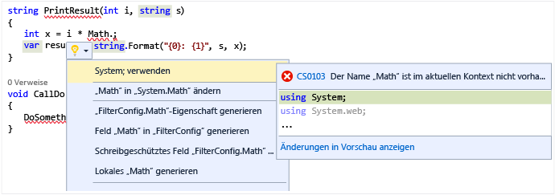

# Schnelle Aktionen

Mit schnellen Aktionen können Sie ganz leicht Code mit einer einzelnen Aktion umgestalten, generieren oder anderweitig ändern. Schnelle Aktionen sind für C#-, [C++](/cpp/ide/writing-and-refactoring-code-cpp)- und Visual Basic-Codedateien verfügbar. Einige der Aktionen sind für eine Sprache spezifisch, während andere für alle Sprachen gelten.

Schnelle Aktionen können für Folgendes verwendet werden:

- Anwenden einer Codefehlerbehebung für die Verletzung einer [Code-Analyzer-Regel](../code-quality/roslyn-analyzers-overview.md)
- [Unterdrücken](../code-quality/use-roslyn-analyzers.md) der Verletzung einer Code-Analyzer-Regel
- Anwenden eines Refactorings (z.B. [Inlinesetzen einer temporären Variable](../ide/reference/inline-temporary-variable.md))
- Generieren von Code (z.B. [Einführen einer lokalen Variable](../ide/reference/introduce-local-variable.md))

Schnellaktionen können mithilfe des Glühbirnensymbols  oder durch Drücken von **STRG**+ **angewendet werden,** wenn Ihr Cursor sich auf einer Codezeile befindet, für die eine Aktion verfügbar ist. Sie sehen eine Glühbirne, wenn eine rote Wellenlinie vorhanden ist und Visual Studio über eine Empfehlung verfügt, um das Problem zu beheben. Wenn beispielsweise ein Fehler durch eine rote Wellenlinie gekennzeichnet ist, wird eine Glühbirne angezeigt, wenn Behebungsmaßnahmen für diesen Fehler verfügbar sind.

Für jede Sprache können Drittanbieter benutzerdefinierte Diagnosen und Empfehlungen bereitstellen, beispielsweise als Bestandteil eines SDKs. Anhand dieser Regeln leuchten die Visual Studio-Glühbirnen dann auf.

## So zeigen Sie eine Glühbirne an

1. In vielen Fällen werden die Glühbirnen spontan angezeigt, wenn Sie mit dem Mauszeiger auf die Position eines Fehlers zeigen, oder am linken Rand des Editors, wenn Sie die Einfügemarke in eine Zeile verschieben, die einen Fehler enthält. Wenn eine rote Wellenlinie angezeigt wird, können Sie den Mauszeiger darüber bewegen, um die Glühbirne anzuzeigen. Sie können auch veranlassen, dass eine Glühbirne angezeigt wird, wenn Sie die Maus oder Tastatur verwenden, um zu einem beliebigen Punkt in der Zeile zu wechseln, wo das Problem auftritt.

1. Drücken Sie an einer beliebigen Stelle in einer Zeile **STRG**+**.**, um die Glühbirne aufzurufen und direkt zur Liste mit den potenziellen Fehlerbehebungen zu wechseln.

   

## So zeigen Sie potenzielle Fehlerbehebungen an

Klicken Sie entweder auf den Pfeil nach unten oder auf den Link **Mögliche Korrekturen anzeigen**, um eine Liste von schnellen Aktionen anzuzeigen, die die Glühbirne für Sie vornehmen kann.

## Siehe auch

- [Codegenerierung in Visual Studio](../ide/code-generation-in-visual-studio.md)
- [Häufige schnelle Aktionen](../ide/common-quick-actions.md)
- [Codeformate und Schnellaktionen](../ide/code-styles-and-quick-actions.md)
- [Schreiben und Refactoring von Code (C++)](/cpp/ide/writing-and-refactoring-code-cpp)