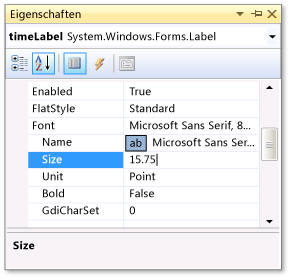
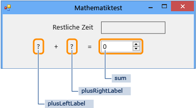
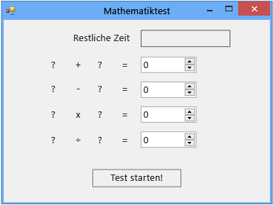

# Schritt 1: Erstellen eines Projekts und Hinzufügen von Bezeichnungen zum Formular
Wie in den ersten Schritten zur Entwicklung dieses Quiz erstellen Sie das Projekt und fügen einem Formular Bezeichnungen, eine Schaltfläche und weitere Steuerelemente hinzu. Außerdem legen Sie Eigenschaften für jedes Steuerelement fest, das Sie hinzufügen. Das Projekt enthält das Formular, die Steuerelemente und (später im Lernprogramm) den Code. Das Quiz wird mit der Schaltfläche gestartet, die Bezeichnungen stellen die Quizaufgaben dar und die anderen Steuerelemente zeigen die Quizantworten und die Zeit an, die bis zum Abschluss des Quiz verbleibt.  

> [!NOTE]
>  Dieses Thema ist Teil einer Reihe von Lernprogrammen zu grundlegenden Konzepte der Codierung. Eine Übersicht des Tutorials finden Sie unter [Tutorial 2: Erstellen eines Mathequiz mit Zeitmessung](../ide/tutorial-2-create-a-timed-math-quiz.md).  
  
## So erstellen Sie ein Projekt und legen Eigenschaften für ein Formular fest  
  
1.  Klicken Sie in der Menüleiste auf **Datei** > **Neu** > **Projekt**.  
  
2.  Wählen Sie in der Liste **Installierte Vorlagen** entweder **C#** oder **Visual Basic** aus.  

3.  Wählen Sie in der Liste der Vorlagen die Vorlage **Windows Forms-Anwendung** aus, benennen Sie sie mit **Mathequiz**, und wählen Sie anschließend die Schaltfläche **OK** aus.  
  
     Je nach der gewählten Programmiersprache wird ein Formular mit dem Namen *Form1.cs* oder *Form1.vb* angezeigt.  
  
4.  Wählen Sie das Formular aus, und ändern Sie dann die Eigenschaft **Text** in **Mathequiz**.  

     Das Fenster **Eigenschaften** enthält Eigenschaften für das Formular.  

5.  Ändern Sie die Größe des Formulars in eine Breite von 500 Pixeln und eine Höhe von 400 Pixeln.  

     Sie können die Größe des Formulars ändern, indem Sie die Ränder ziehen, bis die richtige Größe in der unteren linken Ecke der integrierten Entwicklungsumgebung (IDE) angezeigt wird. Alternativ können Sie die Werte der Eigenschaft **Größe** ändern.  

6.  Ändern Sie den Wert der Eigenschaft **FormBorderStyle** in **Fixed3D**, und legen Sie die Eigenschaft **MaximizeBox** auf **False** fest.  

     Mit diesen Werte wird verhindert, dass Quizteilnehmer die Größe des Formulars ändern.  
  
## So erstellen Sie das Feld „Verbleibende Zeit“  
  
1.  Fügen Sie ein <xref:System.Windows.Forms.Label>-Steuerelement aus der **Toolbox** hinzu, und legen Sie dann den Wert der Eigenschaft **(Name)** auf **timeLabel** fest.  
  
     Diese Bezeichnung wird zu einem Feld in der rechten oberen Ecke, in dem die Anzahl von Sekunden angezeigt, die im Quiz verbleiben.  

2.  Ändern Sie die **AutoSize**-Eigenschaft in **False**, damit Sie die Größe des Felds selbst anpassen können.  

3.  Ändern Sie die **BorderStyle**-Eigenschaft in **FixedSingle**, um eine Linie um das Feld zu zeichnen.  

4.  Legen Sie die Eigenschaft **Größe** auf **200, 30** fest.  

5.  Verschieben Sie die Bezeichnung in die rechte obere Ecke des Formulars, wo die blauen Abstandshalterlinien erscheinen.  

     Anhand dieser Zeilen können Sie die Steuerelemente im Formular ausrichten.  
  
6.  Wählen Sie im Fenster **Eigenschaften** die Eigenschaft **Text** aus, und löschen Sie den Wert mit der **RÜCKTASTE**.  
  
7.  Wählen Sie das Pluszeichen (**+**) neben der Eigenschaft **Schriftart** aus, und ändern Sie dann den Wert der Eigenschaft **Größe** in **15,75**.  
  
     Sie können einige Schriftarteigenschaften ändern, wie im folgenden Bild gezeigt.  

       
Fenster **Eigenschaften** mit Schriftgrad  
  
8.  Fügen Sie ein weiteres Label-Steuerelement aus der **Toolbox** hinzu, und legen Sie dessen Schriftgrad auf **15,75** fest.  
  
9. Legen Sie die **Text**-Eigenschaft auf **Time Left** fest.  

10. Verschieben Sie die Bezeichnung, sodass sie direkt links von der Bezeichnung **timeLabel** angeordnet ist.  

### So fügen Sie Steuerelemente für die Additionsaufgabe hinzu  
  
1.  Fügen Sie ein Label-Steuerelement aus der **Toolbox** hinzu, und legen Sie dessen Eigenschaft **Text** auf **?** fest. (Fragezeichen).  
  
2.  Legen Sie die **AutoSize**-Eigenschaft auf **False** fest.  

3.  Legen Sie die Eigenschaft **Größe** auf **60, 50** fest.  

4.  Legen Sie den Schriftgrad auf **18** fest.  

5.  Legen Sie die Eigenschaft **TextAlign** auf **MiddleCenter** fest.  

6.  Legen Sie die **Location**-Eigenschaft auf **50, 75** fest, um das Steuerelement auf dem Formular zu positionieren.  

7.  Legen Sie die Eigenschaft **(Name)** auf **plusLeftLabel** fest.  
  
8.  Wählen Sie die Bezeichnung **plusLeftLabel** aus, und verwenden Sie entweder die Tasten **STRG**+**C** oder den Befehl **Kopieren** im Menü **Bearbeiten**.  
  
9. Fügen Sie die Bezeichnung dreimal ein, indem Sie entweder die Tasten **STRG**+**V** oder den Befehl **Einfügen** im Menü **Bearbeiten** verwenden.  
  
10. Ordnen Sie die drei neuen Bezeichnungen so an, dass sie in einer Zeile auf der rechten Seite der Bezeichnung **plusLeftLabel** stehen.  

     Mithilfe der Abstandshalterlinie können Sie die Steuerelemente verteilen und ausrichten.  

11. Legen Sie den Wert der **Text**-Eigenschaft der zweiten Bezeichnung auf **+** (Pluszeichen) fest.  

12. Legen Sie den Wert der **(Name)**-Eigenschaft der dritten Bezeichnung auf **plusRightLabel** fest.  

13. Legen Sie den Wert der **Text**-Eigenschaft der vierten Bezeichnung auf **=** (Gleichheitszeichen) fest.  
  
14. Fügen Sie ein <xref:System.Windows.Forms.NumericUpDown>-Steuerelement aus der **Toolbox** hinzu, legen Sie den Schriftgrad auf **18** fest, und legen Sie die Breite auf **100** fest.  
  
     Später erfahren Sie mehr über diese Art Steuerelement.  
  
15. Richten Sie das Steuerelement „NumericUpDown“ an den Label-Steuerelementen für die Additionsaufgabe aus.  
  
16. Ändern Sie den Wert der Eigenschaft **(Name)** für das Steuerelement „NumericUpDown“ in **Summe**.  
  
     Sie haben die erste Zeile erstellt, wie im folgenden Bild dargestellt.  

       
Erste Zeile des Mathequiz  

## So fügen Sie weitere Steuerelemente für die Subtraktion-, Multiplikations- und Divisionsaufgaben hinzu  
  
1.  Kopieren Sie alle fünf Steuerelemente für die Additionsaufgabe (die vier Label-Steuerelemente und das NumericUpDown-Steuerelement), und fügen Sie sie ein.  
  
     Das Formular enthält fünf neue Steuerelemente, die immer noch ausgewählt sind.  

2.  Verschieben Sie alle Steuerelemente an die vorgesehene Position, sodass sie unter den Steuerelementen für die Addition ausgerichtet sind.  

     Mithilfe der Abstandshalterlinien können Sie ausreichend Platz zwischen den beiden Zeilen lassen.  

3.  Ändern Sie den Wert der Eigenschaft **Text** für die zweite Bezeichnung in **-** (Minuszeichen).  

4.  Benennen Sie die erste Bezeichnung mit dem Fragezeichen **minusLeftLabel**.  

5.  Benennen Sie die zweite Bezeichnung mit dem Fragezeichen **minusRightLabel**.  
  
6.  Benennen Sie das „NumericUpDown“-Steuerelement **Differenz**.  
  
7.  Fügen Sie die fünf Steuerelemente zwei weitere Male ein.  

8.  Führen Sie für die dritte Zeile folgende Schritte aus: Benennen Sie die erste Bezeichnung **timesLeftLabel**, ändern Sie die **Text**-Eigenschaft der zweiten Bezeichnung in **×** (Multiplikationszeichen), benennen Sie die dritte Bezeichnung **timesRightLabel**, und benennen Sie das NumericUpDown-Steuerelement **Produkt**.  

9. Führen Sie für die vierte Zeile folgende Schritte aus: Nennen Sie die erste Bezeichnung **dividedLeftLabel**, ändern Sie die **Text**-Eigenschaft der zweiten Eigenschaft in **÷** (Divisionszeichen), nennen Sie die dritte Bezeichnung **dividedRightLabel**, und nennen Sie das NumericUpDown-Steuerelement **Quotient**.  

    > [!NOTE]
    >  Sie können das Multiplikationszeichen × und das Divisionszeichen ÷ aus diesem Lernprogramm kopieren und in das Formular einfügen.  

## So fügen Sie einen Startknopf hinzu und legen die Aktivierreihenfolge fest  
  
1.  Fügen Sie ein <xref:System.Windows.Forms.Button>-Steuerelement aus der **Toolbox** hinzu, und legen Sie dessen Eigenschaft **(Name)** auf **startButton** fest.  
  
2.  Legen Sie die **Text**-Eigenschaft auf **Quiz starten** fest.  

3.  Legen Sie den Schriftgrad auf **14** fest.  

4.  Legen Sie die Eigenschaft **AutoSize** auf **True** fest. Dies bewirkt, dass die Größe der Schaltfläche automatisch an die Textlänge angepasst wird.  

5.  Zentrieren Sie die Schaltfläche am unteren Rand des Formulars.  

6.  Legen Sie den Wert der **TabIndex**-Eigenschaft für das **startButton**-Steuerelement auf **1** fest.  

    > [!NOTE]
    >  Mit der Eigenschaft **TabIndex** wird die Reihenfolge der Steuerelemente festgelegt, wenn der Quizteilnehmer die **TAB-TASTE** drückt. Um zu sehen, wie dies funktioniert, öffnen Sie ein beliebiges Dialogfeld (wählen Sie z.B. in der Menüleiste **Datei** > **Öffnen** aus), und drücken Sie dann mehrmals die **TAB-TASTE**. Der Cursor springt jedes Mal, wenn Sie die **TAB-TASTE** drücken, von Steuerelement zu Steuerelement. Ein Programmierer hat diese Reihenfolge beim Erstellen des Formulars festgelegt.  
  
7.  Legen Sie den Wert der Eigenschaft **TabIndex** für das NumericUpDown-Steuerelement „Summe“ auf **2**, für das Differenzsteuerelement auf **3**, für das Produktsteuerelement auf **4** und für das Quotientsteuerelement auf **5** fest.  

     Das fertige Formular sollte der folgenden Abbildung ähneln.  

       
Anfängliches Mathequizformular  
  
8.  Um sicherzustellen, dass die Eigenschaft **TabIndex** wie erwartet funktioniert, speichern Sie das Programm, und führen Sie es durch Drücken der **F5-TASTE** oder durch Klicken auf **Debuggen** > **Debuggen starten** in der Menüleiste aus. Drücken Sie anschließend einige Male die **TAB-TASTE**.  
  
## So fahren Sie fort oder überprüfen die Angaben  
  
-   Um mit dem nächsten Tutorialschritt fortzufahren, klicken Sie auf [Schritt 2: Erstellen einer zufälligen Additionsaufgabe](../ide/step-2-create-a-random-addition-problem.md).  
  
-   Um zum Übersichtsthema zurückzukehren, klicken Sie auf [Tutorial 2: Erstellen eines Mathequiz mit Zeitmessung](../ide/tutorial-2-create-a-timed-math-quiz.md).
