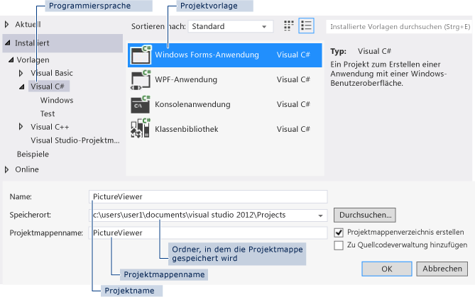

# Schritt 1: Erstellen eines Windows Forms-Anwendungsprojekts

Beim Erstellen einer Bildanzeige erstellen Sie im ersten Schritt ein Windows Forms-Anwendungsprojekt.

  Videos zu diesem Thema finden Sie unter [Tutorial 1: Create a picture viewer in Visual Basic – Video 1 (Tutorial 1: Erstellen eines Bildanzeigeprogramms in Visual Basic – Video 1)](http://go.microsoft.com/fwlink/?LinkId=205209) und [Tutorial 1: Create a picture viewer in C# – Video 1 (Tutorial 1: Erstellen eines Bildanzeigeprogramms in C# – Video 1)](http://go.microsoft.com/fwlink/?LinkId=205199). Diese Videos verwenden eine frühere Version von Visual Studio, sodass Menübefehle und andere Benutzeroberflächenelemente geringfügig abweichen können. Allerdings funktionieren die Konzepte und Prozeduren in der aktuellen Version von Visual Studio auf ähnliche Weise.

## So erstellen Sie ein Windows Forms-Anwendungsprojekt

1. Klicken Sie in der Menüleiste auf **Datei** > **Neu** > **Projekt**. Das Dialogfeld sollte wie folgt aussehen.

      
*Dialogfeld **Neues Projekt***

2. Wählen Sie im Dialogfenster **Neues Projekt** im linken Bereich **Visual C#** oder **Visual Basic** aus.

3. Wählen Sie in der Vorlagenliste **Windows Forms-App (.NET Framework)** aus. Geben Sie dem neuen Formular den Namen **PictureViewer**, und wählen Sie dann die Schaltfläche **OK** aus.

    >[!NOTE]
    >Wenn Ihnen die Vorlage **Windows Forms-App (.NET Framework)** nicht angezeigt wird, verwenden Sie den Visual Studio-Installer, um die Workload **.NET Desktop-Entwicklung** zu installieren.     Weitere Informationen finden Sie im Artikel [Installieren von Visual Studio 2017](../install/install-visual-studio.md).

     Visual Studio erstellt eine Projektmappe für das Programm. Eine Projektmappe fungiert als Container für alle Projekte und Dateien, die vom Programm benötigt werden. Diese Begriffe werden später ausführlicher in diesem Tutorials erläutert.

4. Die Entwicklungsumgebung enthält drei Fenster: ein Hauptfenster, den **Projektmappen-Explorer** und das Fenster **Eigenschaften**.

     Wenn eines der Fenster fehlt, stellen Sie das Standardfensterlayout wieder her. Wählen Sie dazu in der Menüleiste die Optionen **Fenster** > **Fensterlayout zurücksetzen** aus. Sie können Fenster auch mit den Menübefehlen anzeigen. Klicken Sie in der Menüleiste auf **Anzeigen** > **Eigenschaftenfenster** oder auf **Projektmappen-Explorer**. Wenn andere Fenster geöffnet sind, schließen Sie diese mit der Schaltfläche **Schließen** (x), die sich jeweils in der rechten oberen Ecke befindet.

    ::: moniker range="vs-2017"

    - **Hauptfenster** In diesem Fenster führen Sie die meisten Schritte aus, z. B. Arbeiten mit Formularen oder Bearbeiten von Code. Im Fenster wird ein Formular im **Formular-Editor** angezeigt. Oben im Fenster werden die Registerkarte **Startseite** und die Registerkarte **Form1.cs [Entwurf]** angezeigt. (In Visual Basic endet der Registerkartenname mit *.vb* und nicht mit *.cs*.)

    ::: moniker-end

    ::: moniker range=">=vs-2019"

    - **Hauptfenster** In diesem Fenster führen Sie die meisten Schritte aus, z. B. Arbeiten mit Formularen oder Bearbeiten von Code. Im Fenster wird ein Formular im **Formular-Editor** angezeigt.

    ::: moniker-end

    - Fenster **Projektmappen-Explorer**: In diesem Fenster können Sie alle Elemente in der Projektmappe anzeigen und dorthin navigieren. Wenn Sie eine Datei auswählen, ändert sich der Inhalt im Fenster **Eigenschaften**. Wenn Sie eine Codedatei (die in Visual C# mit *.cs* und in Visual Basic mit *.vb* endet) öffnen, wird die Codedatei oder ein Designer für die Codedatei angezeigt. Ein Designer ist eine visuelle Oberfläche, der Sie Steuerelemente wie Schaltflächen und Listen hinzufügen können. Für Visual Studio-Formulare wird der Designer als **Windows Forms-Designer** bezeichnet.

    - **Eigenschaftenfenster:** In diesem Fenster können Sie die Eigenschaften von Elementen ändern, die Sie in den anderen Fenstern auswählen. Wenn Sie z. B. Form1 auswählen, können Sie den Titel ändern, indem Sie die Eigenschaft **Text** festlegen, und die Hintergrundfarbe ändern, indem Sie die Eigenschaft **Hintergrundfarbe** festlegen.

    > [!NOTE]
    > In der obersten Zeile im **Projektmappen-Explorer** wird **Projektmappe ‚PictureViewer‘ (1 Projekt)** angezeigt, was bedeutet, dass Visual Studio eine Projektmappe für Sie erstellt hat. Eine Projektmappe kann mehr als ein Projekt enthalten. Vorerst arbeiten Sie jedoch mit Projektmappen, die nur ein Projekt enthalten.

6. Klicken Sie in der Menüleiste auf **Datei** > **Alle speichern**.

     Wählen Sie alternativ die Schaltfläche **Alle speichern** auf der Symbolleiste aus, die in der folgenden Abbildung dargestellt ist.

     Schaltfläche  in der Symbolleiste 
*Symbolleistenschaltfläche **Alle speichern***

     Visual Studio fügt automatisch den Ordnernamen und den Projektnamen ein und speichert das Projekt dann im Projektordner.

## So fahren Sie fort oder überprüfen die Angaben

- Den nächsten Schritt des Tutorials finden Sie unter [Schritt 2: Ausführen des Programms](../ide/step-2-run-your-program.md).

- Um zum Übersichtsthema zurückzukehren, beachten Sie [Tutorial 1: Create a picture viewer (Tutorial 1: Erstellen eines Bildanzeigeprogramms)](../ide/tutorial-1-create-a-picture-viewer.md).

## Siehe auch

- [Creating a new Windows Form (Erstellen eines neuen Windows-Formulars)](/dotnet/framework/winforms/creating-a-new-windows-form/)