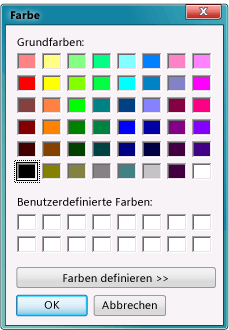

# Schritt 11: Führen Sie das Programms aus und probieren Sie weitere Funktionen aus
Das Programm ist fertig und bereit zur Ausführung. Sie können das Programm ausführen und die Hintergrundfarbe von PictureBox festlegen. Um den Lerneffekt zu erhöhen, können Sie das Programm verbessern, indem Sie die Farbe des Formulars ändern, die Schaltflächen und das Kontrollkästchen anpassen und die Eigenschaften des Formulars ändern.  
  
 Informationen zum Herunterladen einer vollständige Version des Beispiels finden Sie unter [Tutorialbeispiel für vollständiges Bildanzeigeprogramm](http://code.msdn.microsoft.com/Complete-Picture-Viewer-7d91d3a8).  
  
 Eine Videoversion dieses Themas finden Sie im Video 5 zum [Tutorial 1: Erstellen eines Bildanzeigeprogramms in Visual Basic](http://go.microsoft.com/fwlink/?LinkId=205216) oder im Video 5 zum [Tutorial 1: Erstellen eines Bildanzeigeprogramms in C#](http://go.microsoft.com/fwlink/?LinkId=205206). Diese Videos verwenden eine frühere Version von Visual Studio, sodass Menübefehle und andere Benutzeroberflächenelemente geringfügig abweichen können. Allerdings funktionieren die Konzepte und Prozeduren in der aktuellen Version von Visual Studio auf ähnliche Weise.  
  
### So können Sie das Programm ausführen und die Hintergrundfarbe festlegen  
  
1.  Wählen Sie F5 oder in der Menüleiste **Debuggen**, **Debuggen starten** aus.  
  
2.  Bevor Sie ein Bild öffnen, wählen Sie die Schaltfläche **Hintergrundfarbe festlegen** aus. Das Dialogfeld **Farbe** wird geöffnet.  
  
       
Dialogfeld "Farbe"  
  
3.  Wählen Sie eine Farbe aus, um die PictureBox-Hintergrundfarbe festzulegen. Schauen Sie sich die `backgroundButton_Click()`-Methode genau an, um zu verstehen, wie sie funktioniert.  
  
    > [!NOTE]
    >  Sie können aus dem Internet ein Bild laden, indem Sie die URL des Bilds in das Dialogfeld **Datei öffnen** einfügen. Versuchen Sie, ein Bild mit einem transparenten Hintergrund zu finden, damit die Hintergrundfarbe angezeigt wird.  
  
4.  Wählen Sie die Schaltfläche **Bild löschen** aus, um sicherzustellen, das es gelöscht wird. Beenden Sie dann das Programm, indem Sie die Schaltfläche **Schließen** auswählen.  
  
### So probieren Sie weitere Funktionen aus  
  
-   Ändern Sie die Farbe des Formulars und der Schaltflächen mit der **BackColor**-Eigenschaft.  
  
-   Passen Sie die Schaltflächen und das Kontrollkästchen mit den Eigenschaften **Font** und **ForeColor** an.  
  
-   Ändern Sie die Eigenschaften **FormBorderStyle** und **ControlBox** des Formulars.  
  
-   Verwenden Sie die Eigenschaften **AcceptButton** und **CancelButton** des Formulars, damit Schaltflächen automatisch ausgewählt werden, wenn der Benutzer die EINGABETASTE oder ESC-TASTE auswählt. Veranlassen Sie, dass das Programm das Dialogfeld **Datei öffnen** öffnet, wenn der Benutzer die EINGABETASTE auswählt, und das Dialogfeld schließt, wenn der Benutzer ESC auswählt.  
  
### So fahren Sie fort oder überprüfen die Angaben  
  
-   Weitere Informationen zum Programmieren in Visual Studio finden Sie unter [Programmierkonzepte](http://msdn.microsoft.com/Library/65c12cca-af4f-4017-886e-2dbc00a189d6).  
  
-   Weitere Informationen zu Visual Basic finden Sie unter [Entwickeln von Anwendungen mit Visual Basic](/dotnet/visual-basic/developing-apps/index).  
  
-   Weitere Informationen zu Visual C# finden Sie in der [Einführung in die Programmiersprache C# und in .NET Framework](/dotnet/csharp/getting-started/introduction-to-the-csharp-language-and-the-net-framework).  
  
-   Um zum nächsten Tutorial zu wechseln, klicken Sie auf [Tutorial 2: Erstellen eines Mathequiz mit Zeitmessung](../ide/tutorial-2-create-a-timed-math-quiz.md).  
  
-   Um zum vorhergehenden Tutorialschritt zurückzukehren, klicken Sie auf [Schritt 10: Schreiben von Code für zusätzliche Schaltflächen und ein Kontrollkästchen](../ide/step-10-write-code-for-additional-buttons-and-a-check-box.md).
