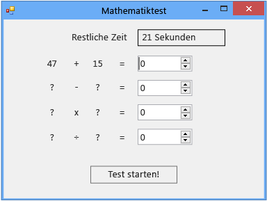

# <a name="step-3-add-a-countdown-timer"></a>Schritt 3: Hinzufügen eines Countdowntimers
Im dritten Teil dieses Tutorials fügen Sie einen Countdowntimer hinzu, mit dem die Anzahl von Sekunden verfolgt wird, die verbleiben, bis der Quizteilnehmer das Quiz beendet.  
  
> [!NOTE]
>  Dieses Thema ist Teil einer Reihe von Lernprogrammen zu grundlegenden Konzepte der Codierung. Eine Übersicht des Tutorials finden Sie unter [Tutorial 2: Erstellen eines Mathequiz mit Zeitmessung](../ide/tutorial-2-create-a-timed-math-quiz.md).  
  
### <a name="to-add-a-countdown-timer"></a>So fügen Sie einen Countdowntimer hinzu  
  
1.  Fügen Sie wie in der vorherigen Prozedur eine Ganzzahlvariable mit dem Namen **timeLeft** hinzu. Der Code sollte wie folgt aussehen.  
  
     [!code-vb[VbExpressTutorial3Step3#5](../ide/codesnippet/VisualBasic/step-3-add-a-countdown-timer_1.vb)]
     [!code-csharp[VbExpressTutorial3Step3#5](../ide/codesnippet/CSharp/step-3-add-a-countdown-timer_1.cs)]  
  
     Jetzt benötigen Sie eine Methode, die die Sekunden zählt, z. B. einen Timer, der nach Ablauf der angegebenen Zeit ein Ereignis auslöst.  
  
2.  Verschieben Sie im Entwurfsfenster ein `Timer`-Steuerelement von der Kategorie **Komponenten** der Toolbox auf das Formular.  
  
     Das Steuerelement wird im grauen Bereich unten im Entwurfsfenster angezeigt.  
  
3.  Wählen Sie auf dem Formular das Symbol **Timer1** aus, das Sie gerade hinzugefügt haben, und legen Sie die Eigenschaft **Interval** auf **1000** fest.  
  
     Da der Intervallwert in Millisekunden angegeben wird, verursacht der Wert 1000, dass das Tick-Ereignis jede Sekunde ausgelöst wird.  
  
4.  Klicken Sie im Formular doppelt auf das Timer-Steuerelement, oder wählen Sie es aus, und wählen Sie dann die EINGABETASTE aus.  
  
     Der Code-Editor wird mit der Methode für den Tick-Ereignishandler angezeigt, den Sie gerade hinzugefügt haben.  
  
5.  Fügen Sie der neuen Ereignishandlermethode die folgenden Anweisungen hinzu.  
  
     [!code-vb[VbExpressTutorial3Step3#6](../ide/codesnippet/VisualBasic/step-3-add-a-countdown-timer_2.vb)]
     [!code-csharp[VbExpressTutorial3Step3#6](../ide/codesnippet/CSharp/step-3-add-a-countdown-timer_2.cs)]  
  
     Basierend auf den hinzugefügten Anweisungen ermittelt der Timer jede Sekunde, ob die Zeit abgelaufen ist. Dazu wird geprüft, ob die Ganzzahlvariable **timeLeft** größer als „0“ ist. Ist dies der Fall, verbleibt noch Zeit. Zuerst subtrahiert der Timer den Wert 1 von timeLeft und aktualisiert dann die **Text**-Eigenschaft des `timeLabel`-Steuerelements, damit für den Quizteilnehmer die Anzahl von verbleibenden Sekunden angezeigt wird.  
  
     Wenn keine Zeit mehr übrig ist, wird der Timer angehalten und der Text des `timeLabel`-Steuerelements geändert, sodass **Time's up!** angezeigt wird. Ein Meldungsfeld gibt an, dass das Quiz beendet ist, und die Antwort wird angezeigt. In diesem Fall hat sie die Werte "addend1" und "addend2". Die **Enabled**-Eigenschaft des `startButton`-Steuerelements wird auf `true` festgelegt, sodass der Quizteilnehmer ein anderes Quiz beginnen kann.  
  
     Sie haben gerade eine `if else`-Anweisung hinzugefügt, mit der Sie Programme zum Treffen von Entscheidungen auffordern können. Eine `if else`-Anweisung sieht wie folgt aus.  
  
    > [!NOTE]
    >  Das folgende Beispiel dient nur der Veranschaulichung. Fügen Sie es nicht dem Projekt hinzu.  
  
    ```vb  
    If (something that your program will check) Then  
        ' One or more statements that will run  
        ' if what the program checked is true.   
    Else  
        ' One or more statements that will run  
        ' if what the program checked is false.  
    End If  
    ```  
  
    ```csharp  
    if (something that your program will check)  
    {  
        // One or more statements that will run  
        // if what the program checked is true.   
    }  
    else  
    {  
        // One or more statements that will run  
        // if what the program checked is false.  
    }  
    ```  
  
     Sehen Sie sich die Anweisung zum Anzeigen der Antwort auf die Additionsaufgabe, die Sie dem `else`-Block hinzugefügt haben, genauer an.  
  
     [!code-vb[VbExpressTutorial3Step3#24](../ide/codesnippet/VisualBasic/step-3-add-a-countdown-timer_3.vb)]
     [!code-csharp[VbExpressTutorial3Step3#24](../ide/codesnippet/CSharp/step-3-add-a-countdown-timer_3.cs)]  
  
     Die Anweisung `addend1 + addend2` fügt die Werte in den beiden Variablen zusammen hinzu. Im ersten Teil (`sum.Value`) wird die **Value**-Eigenschaft des `NumericUpDown`-Steuerelements "sum" verwendet, um die richtige Antwort anzuzeigen. Später verwenden Sie die gleiche Eigenschaft, um die Antworten für das Quiz zu überprüfen.  
  
     Über das `NumericUpDown`-Steuerelement können die Quizteilnehmer Zahlen leichter eingeben. Daher sollten Sie dieses Steuerelement für die Antworten auf die mathematischen Aufgaben verwenden. Alle möglichen Antworten sind ganze Zahlen von 0 bis 100. Wenn Sie die Standardwerte der Eigenschaften **Minimum**, **Maximum** und **DecimalPlaces** unverändert lassen, stellen Sie sicher, dass die Quizteilnehmer keine Dezimalwerte, negative Zahlen oder Zahlen eingeben können, die zu hoch sind. (Wenn Sie den Quizteilnehmern die Eingabe einer Zahl mit drei Dezimalstellen (z. B. 3,141) erlauben möchten, aber nicht die Eingabe einer Zahl mit vier Dezimalstellen (z. B. 3,1415), können Sie die **DecimalPlaces**-Eigenschaft auf 3 festlegen.)  
  
6.  Fügen Sie dem Ende der `StartTheQuiz()`-Methode drei Zeilen hinzu, damit der Code wie folgt aussieht.  
  
     [!code-vb[VbExpressTutorial3Step3#7](../ide/codesnippet/VisualBasic/step-3-add-a-countdown-timer_4.vb)]
     [!code-csharp[VbExpressTutorial3Step3#7](../ide/codesnippet/CSharp/step-3-add-a-countdown-timer_4.cs)]  
  
     Wenn Sie das Quiz jetzt starten, wird die Variable **timeLeft** auf 30 und die **Text**-Eigenschaft des `timeLabel`-Steuerelements auf 30 Sekunden festgelegt. Dann wird der Countdown mit der `Start()`-Methode des `Timer`-Steuerelements gestartet. (Die Antwort wird noch nicht im Quiz geprüft – dies ist der nächste Schritt.)  
  
7.  Speichern Sie das Programm, führen Sie es aus, und wählen Sie dann die Schaltfläche **Start** auf dem Formular aus.  
  
     Der Timer beginnt den Countdown. Wenn die Zeit abläuft, wird das Quiz beendet, und die Antwort wird angezeigt. In der folgenden Abbildung ist das laufende Quiz dargestellt.  
  
       
Mathetest wird durchgeführt  
  
### <a name="to-continue-or-review"></a>So fahren Sie fort oder überprüfen die Angaben  
  
-   Um zum nächsten Schritt des Tutorials zu wechseln, klicken Sie auf [Schritt 4: Hinzufügen der CheckTheAnswer()-Methode](../ide/step-4-add-the-checktheanswer-parens-method.md).  
  
-   Um zum vorherigen Tutorialschritt zurückzukehren, klicken Sie auf [Schritt2: Erstellen einer zufälligen Additionsaufgabe](../ide/step-2-create-a-random-addition-problem.md).