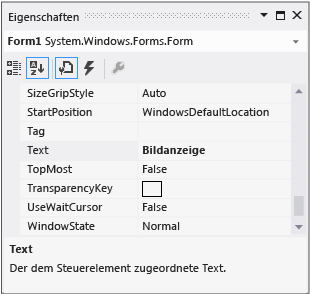

# Schritt 3: Festlegen der Formulareigenschaften
Als Nächstes verwenden Sie das **Eigenschaftenfenster**, um das Aussehen des Formulars zu ändern.  
  
  Eine Videoversion dieses Artikels finden Sie im Video 1 zum [Tutorial 1: Erstellen eines Bildanzeigeprogramms in Visual Basic](http://go.microsoft.com/fwlink/?LinkId=205209) oder im Video 1 zum [Tutorial 1: Erstellen eines Bildanzeigeprogramms in C#](http://go.microsoft.com/fwlink/?LinkId=205199). Diese Videos verwenden eine frühere Version von Visual Studio, sodass Menübefehle und andere Benutzeroberflächenelemente geringfügig abweichen können. Allerdings funktionieren die Konzepte und Prozeduren in der aktuellen Version von Visual Studio auf ähnliche Weise.  
  
## So legen Sie die Formulareigenschaften fest  
  
1.  Stellen Sie sicher, dass Sie **Windows Forms-Designer** anzeigen. Wählen Sie in der integrierten Entwicklungsumgebung (IDE) von Visual Studio die Registerkarte **Form1.cs [Design]** (oder die Registerkarte **Form1.vb [Design]** in Visual Basic) aus.  
  
2.  Wählen Sie im Formular **Form1** eine beliebige Stelle, um es auszuwählen. Betrachten Sie das **Eigenschaftenfenster**, das jetzt die Eigenschaften für das Formular enthalten sollte. Formulare verfügen über verschiedene Eigenschaften. Sie können z. B. die Vordergrund- und Hintergrundfarbe, den Titeltext, der oben im Formular erscheint, die Größe des Formulars und andere Eigenschaften festlegen.  

    > [!NOTE]
    >  Wenn das **Eigenschaftenfenster** nicht angezeigt wird, beenden Sie das Programm, indem Sie auf der Symbolleiste die quadratische Schaltfläche **Debuggen beenden** auswählen, oder schließen Sie das Fenster einfach. Wenn das Programm beendet wird und das **Eigenschaftenfenster** immer noch nicht angezeigt wird, wählen Sie in der Menüleiste **Ansicht** > **Eigenschaftenfenster** aus.  
  
3.  Suchen Sie nach dem Auswählen des Formulars die Eigenschaft **Text** im Fenster **Eigenschaften**. Je nachdem, wie die Liste sortiert wird, müssen Sie möglicherweise einen Bildlauf nach unten durchführen. Wählen Sie **Text** aus, geben Sie **Picture Viewer** ein, und drücken Sie dann die **EINGABETASTE**.  In der Titelleiste des Formulars sollte jetzt der Text **Picture Viewer** angezeigt werden, und das **Eigenschaftenfenster** sollte wie im folgenden Bild aussehen.  
  
       
**Eigenschaftenfenster**  
  
    > [!NOTE]
    >  Eigenschaften können in einer **kategorisierten** oder **alphabetischen** Ansicht angeordnet sein. Sie können mit den Schaltflächen im **Eigenschaftenfenster** zwischen diesen beiden Ansichten umschalten. In diesem Tutorial ist es einfacher, in der **alphabetischen** Ansicht nach Eigenschaften zu suchen.  
  
4.  Kehren Sie zum **Windows Forms-Designer** zurück. Wählen Sie unten rechts den Ziehpunkt des Formulars aus. Dies ist ein kleines, weißes Quadrat, das wie folgt aussieht.  
  
       
Ziehpunkt  

     Ziehen Sie am Ziehpunkt, um die Größe des Formulars so zu ändern, dass es breiter und ein bisschen größer ist.  
  
5.  Im **Eigenschaftenfenster** können Sie feststellen, dass sich der Wert der Eigenschaft **Size** geändert hat. Die Eigenschaft **Size** ändert sich jedes Mal, wenn Sie die Größe des Formulars ändern. Versuchen Sie, die Formulargröße durch Ziehen am Ziehpunkt in eine Größe von ca. **550, 350** zu ändern (muss nicht exakt sein). Diese Größe eignet sich gut für dieses Projekt. Alternativ können Sie die Werte direkt in der Eigenschaft **Size** eingeben und dann die **EINGABETASTE** drücken.  
  
6.  Führen Sie das Programm erneut aus. Denken Sie daran, dass Sie eine der folgenden Methoden verwenden können, um das Programm auszuführen.  

    -   Drücken Sie die Taste **F5**.  
  
    -   Klicken Sie in der Menüleiste auf **Debuggen** > **Debuggen starten**.  
  
    -   Wählen Sie auf der Symbolleiste die Schaltfläche **Debuggen starten** aus, die wie folgt aussieht.  

           
Schaltfläche **Debuggen starten** in der Symbolleiste  
  
     Wie bereits zuvor geschehen, erstellt die IDE das Programm und führt es aus, und ein Fenster wird angezeigt.  

7.  Bevor Sie mit dem nächsten Schritt fortfahren, beenden Sie das Programm, da die IDE Änderungen an einem ausgeführten Programm nicht zulässt. Denken Sie daran, dass Sie eine der folgenden Methoden verwenden können, um das Programm zu beenden.  

    -   Wählen Sie auf der Symbolleiste die Schaltfläche **Debuggen beenden** aus.  
  
    -   Klicken Sie in der Menüleiste auf **Debuggen** > **Debuggen beenden** aus.  
  
    -   Schließen Sie das **Form1**-Fenster, indem Sie auf die Schaltfläche mit dem **X** in der oberen rechten Ecke des Fensters klicken.  
  
## So fahren Sie fort oder überprüfen die Angaben  
  
-   Den nächsten Schritt des Tutorials finden Sie unter [Schritt 4: Erstellen des Layouts für das Formular mit einem TableLayoutPanel-Steuerelement](../ide/step-4-lay-out-your-form-with-a-tablelayoutpanel-control.md).  
  
-   Den vorherigen Schritt des Tutorials finden Sie unter [Schritt 2: Ausführen des Programms](../ide/step-2-run-your-program.md).
