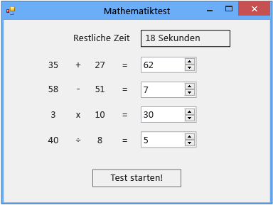

# Schritt&#160;7: Hinzuf&#252;gen von Multiplikations- und Divisionsaufgaben
[!INCLUDE[vs2017banner](../code-quality/includes/vs2017banner.md)]

Im siebenten Teil dieses Lernprogramms fügen Sie Multiplikations\- und Divisionsaufgaben hinzu. Zunächst müssen Sie aber überlegen, wie diese Änderung vorgenommen wird.  Überlegen Sie sich den ersten Schritt, der das Speichern von Werten einschließt.  
  
### So fügen Sie Multiplikations\- und Divisionsaufgaben hinzu  
  
1.  Fügen Sie dem Formular vier Ganzzahlvariablen hinzu.  
  
     [!code-vb[VbExpressTutorial3Step7#15](../ide/codesnippet/VisualBasic/step-7-add-multiplication-and-division-problems_1.vb)]
     [!code-cs[VbExpressTutorial3Step7#15](../ide/codesnippet/CSharp/step-7-add-multiplication-and-division-problems_1.cs)]  
  
2.  Ändern Sie wie zuvor die `StartTheQuiz()`\-Methode, damit die Multiplikations\- und Divisionsaufgaben mit Zufallszahlen ausgefüllt werden.  
  
     [!code-vb[VbExpressTutorial3Step7#16](../ide/codesnippet/VisualBasic/step-7-add-multiplication-and-division-problems_2.vb)]
     [!code-cs[VbExpressTutorial3Step7#16](../ide/codesnippet/CSharp/step-7-add-multiplication-and-division-problems_2.cs)]  
  
3.  Ändern Sie die `CheckTheAnswer()`\-Methode, damit auch die Multiplikations\- und Divisionsaufgaben überprüft werden.  
  
     [!code-vb[VbExpressTutorial3Step7#17](../ide/codesnippet/VisualBasic/step-7-add-multiplication-and-division-problems_3.vb)]
     [!code-cs[VbExpressTutorial3Step7#17](../ide/codesnippet/CSharp/step-7-add-multiplication-and-division-problems_3.cs)]  
  
     Da es keine einfache Möglichkeit gibt, das Multiplikationszeichen \(×\) und das Divisionszeichen \(÷\) mit der Tastatur einzugeben, wird in Visual C\# und Visual Basic ein Sternchen \(\*\) für Multiplikation und ein Schrägstrich \(\/\) für Division akzeptiert.  
  
4.  Ändern Sie den letzten Teil des Tick\-Ereignishandlers des Zeitgebers, damit die richtige Antwort ausgegeben wird, wenn die Zeit abgelaufen ist.  
  
     [!code-vb[VbExpressTutorial3Step7#23](../ide/codesnippet/VisualBasic/step-7-add-multiplication-and-division-problems_4.vb)]
     [!code-cs[VbExpressTutorial3Step7#23](../ide/codesnippet/CSharp/step-7-add-multiplication-and-division-problems_4.cs)]  
  
5.  Speichern Sie das Programm, und führen Sie es aus.  
  
     Die Quizteilnehmer müssen vier Aufgaben beantworten, um das Quiz abzuschließen. Dies ist in der folgenden Abbildung veranschaulicht.  
  
       
Mathequiz mit vier Aufgaben  
  
### So fahren Sie fort oder überprüfen die Angaben  
  
-   Um zum nächsten Schritt des Lernprogramms zu wechseln, klicken Sie auf [Schritt 8: Anpassen des Quiz](../ide/step-8-customize-the-quiz.md).  
  
-   Um zum vorherigen Schritt des Lernprogramms zurückzukehren, klicken Sie auf [Schritt 6: Hinzufügen einer Subtraktionsaufgabe](../ide/step-6-add-a-subtraction-problem.md).