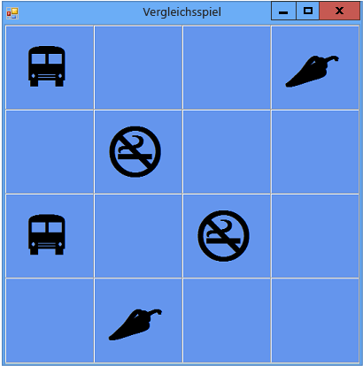

# Lernprogramm 3: Erstellen eines Vergleichsspiels
In diesem Lernprogramm erstellen Sie ein Vergleichsspiel, bei dem Spieler ausgeblendete Symbolpaare finden müssen. Sie lernen Folgendes:  
  
-   Speichern von Objekten (beispielsweise Symbole) in einem `List`-Objekt  
  
-   Verwenden einer `foreach`-Schleife in Visual C# und einer `For Each`-Schleife in Visual Basic, um die Elemente einer Liste zu durchlaufen  
  
-   Speichern des Formularzustands mithilfe von Verweisvariablen  
  
-   Erstellen eines Ereignishandlers für mehrere Objekte zum Reagieren auf Ereignisse  
  
-   Erstellen eines Zeitgebers, der nach dem Start und Ablauf einer bestimmten Zeit genau ein Ereignis auslöst  
  
 Am Ende dieses Lernprogramms sieht Ihr Code so aus wie in der folgenden Abbildung.  
  
   
Spiel, das Sie in diesem Lernprogramm erstellen  
  
 Ein vollständige Version des Beispiels können Sie unter [Complete Matching Game tutorial sample (Durchführen des Abgleichspiels)](http://code.msdn.microsoft.com/Complete-Matching-Game-4cffddba) herunterladen.  
  
> [!NOTE]
>  In diesem Lernprogramm wird sowohl Visual C# als auch Visual Basic behandelt. Achten Sie also auf die entsprechenden Informationen zu der Programmiersprache, die Sie verwenden.  
  
 Wenn Sie sich festfahren oder Probleme mit der Programmierung haben, versuchen Sie, Ihre Fragen in einem der MSDN-Foren zu stellen. Weitere Informationen finden Sie im Forum zu [Visual Basic](http://social.msdn.microsoft.com/Forums/home?forum=vbgeneral) und [Visual C#-Forum](http://social.msdn.microsoft.com/Forums/home?forum=csharpgeneral). Es stehen auch umfangreiche kostenlose Videoschulungen zur Verfügung. Weitere Informationen zum Programmieren in Visual Basic finden Sie unter [Visual Basic-Grundlagen: Entwicklung für Anfänger](http://channel9.msdn.com/Series/Visual-Basic-Development-for-Absolute-Beginners). Weitere Informationen zum Programmieren in Visual Basic C# finden Sie unter [C#-Grundlagen: Entwicklung für Anfänger](http://channel9.msdn.com/Series/C-Sharp-Fundamentals-Development-for-Absolute-Beginners).  
  
## Verwandte Themen  
  
|Titel|Beschreibung|  
|-----------|-----------------|  
|[Schritt 1: Erstellen eines Projekts und Hinzufügen einer Tabelle zum Formular](../ide/step-1-create-a-project-and-add-a-table-to-your-form.md)|Erstellen Sie zuerst das Projekt, und fügen Sie ein `TableLayoutPanel`-Steuerelement hinzu, um die Steuerelemente richtig auszurichten.|  
|[Schritt 2: Hinzufügen eines zufällig ausgewählten Objekts und einer Liste von Symbolen](../ide/step-2-add-a-random-object-and-a-list-of-icons.md)|Fügen Sie ein `Random`-Objekt und ein `List`-Objekt hinzu, um eine Liste mit Symbolen zu erstellen.|  
|[Schritt 3: Zuweisen eines zufällig ausgewählten Symbols zu jeder Bezeichnung](../ide/step-3-assign-a-random-icon-to-each-label.md)|Weisen Sie die Symbole willkürlich den `Label`-Steuerelementen zu, sodass sie in jedem Spiel anders angeordnet sind.|  
|[Schritt 4: Hinzufügen eines Click-Ereignishandlers zu jeder Bezeichnung](../ide/step-4-add-a-click-event-handler-to-each-label.md)|Fügen Sie einen Click-Ereignishandler hinzu, der die Farbe der Bezeichnung ändert, auf die geklickt wird.|  
|[Schritt 5: Hinzufügen von Bezeichnungsverweisen](../ide/step-5-add-label-references.md)|Fügen Sie Verweisvariablen hinzu, um nachzuverfolgen, auf welche Bezeichnungen geklickt wird.|  
|[Schritt 6: Hinzufügen eines Timers](../ide/step-6-add-a-timer.md)|Fügen Sie dem Formular einen Timer hinzu, um die Zeit zu speichern, die im Spiel bisher vergangen ist.|  
|[Schritt 7: Beibehalten der Sichtbarkeit von Paaren](../ide/step-7-keep-pairs-visible.md)|Behalten Sie die Sichtbarkeit von Symbolpaaren bei, falls ein übereinstimmendes Paar ausgewählt wird.|  
|[Schritt 8: Hinzufügen einer Methode zum Überprüfen, ob der Spieler gewonnen hat](../ide/step-8-add-a-method-to-verify-whether-the-player-won.md)|Fügen Sie eine `CheckForWinner()`-Methode hinzu, um zu überprüfen, ob ein Spieler gewonnen hat.|  
|[Schritt 9: Ausprobieren weiterer Funktionen](../ide/step-9-try-other-features.md)|Probieren Sie andere Funktionen aus, z. B. das Ändern von Symbolen und Farben, das Hinzufügen eines Rasters und das Hinzufügen von Sounds. Versuchen Sie, die Spielfläche zu vergrößern und den Zeitgeber anzupassen.|